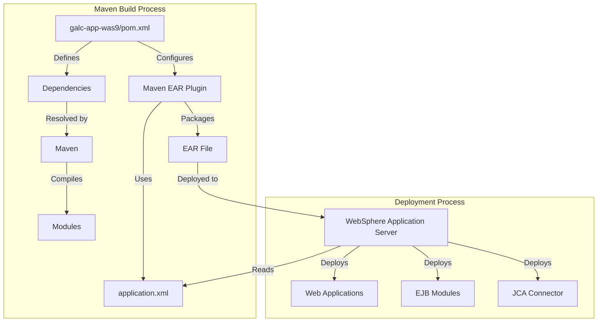
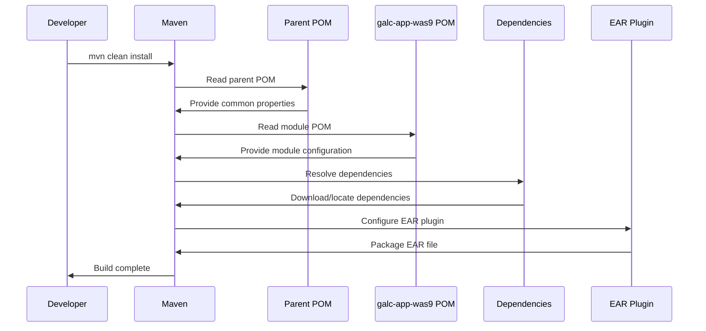
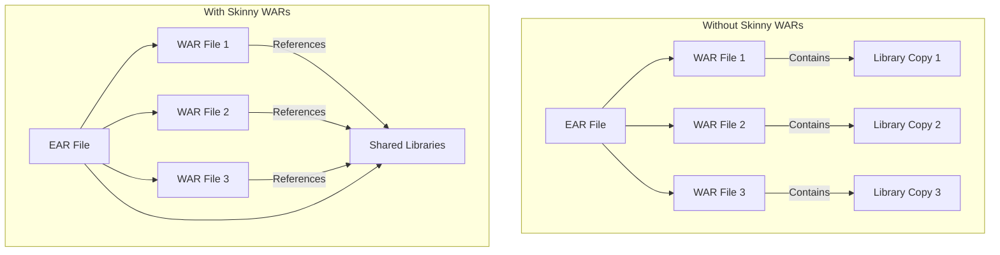
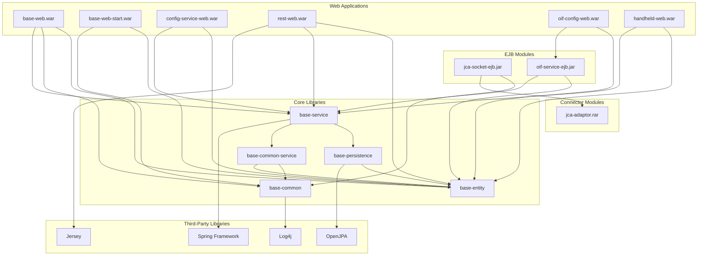

# GALC Application POM.XML Documentation

## 1. Purpose and Overview

The `pom.xml` file in the `galc-app-was9` module serves as the Maven build configuration for creating the Enterprise Application Archive (EAR) that will be deployed to WebSphere Application Server 9. This critical configuration file defines the structure, dependencies, and packaging instructions for the GALC application.

### Key Functions:

- **Dependency Management**: Specifies all libraries and modules required by the application
- **Module Configuration**: Defines how individual modules are packaged within the EAR
- **Security Role Definition**: Establishes security roles for the application
- **Build Configuration**: Controls how Maven assembles the final EAR file
- **Deployment Structure**: Determines the layout of the deployed application

## 2. File Structure and Components

The `pom.xml` file follows the standard Maven Project Object Model format and contains the following major sections:

### 2.1 Project Identification

```xml
<modelVersion>4.0.0</modelVersion>
<artifactId>galc-app-was9</artifactId>
<packaging>ear</packaging>

<parent>
    <groupId>com.honda.galc</groupId>
    <artifactId>aggregator</artifactId>
    <version>4.31-SNAPSHOT</version>
</parent>
```

This section establishes:

- Maven model version (4.0.0)
- Artifact ID (`galc-app-was9`)
- Packaging type (EAR)
- Parent POM reference (aggregator)

### 2.2 Dependencies

The file defines numerous dependencies that fall into several categories:

#### 2.2.1 Third-Party Libraries

```xml
<dependency>
    <groupId>org.apache.openjpa</groupId>
    <artifactId>openjpa</artifactId>
</dependency>

<dependency>
    <groupId>org.springframework</groupId>
    <artifactId>spring-core</artifactId>
</dependency>
```

Key third-party dependencies include:

- **OpenJPA**: Java Persistence API implementation
- **Spring Framework**: Core application framework components
- **Logging Libraries**: Log4j and SLF4J
- **XML Processing**: JAXB, XStream, and Batik
- **Utility Libraries**: Commons Lang, Collections, and Net
- **JSON Processing**: Google Gson
- **Caching**: EHCache
- **Barcode Generation**: Barcode4J
- **Scripting**: Groovy
- **REST Support**: Jersey

#### 2.2.2 GALC Core Modules

```xml
<dependency>
    <groupId>com.honda.galc</groupId>
    <artifactId>base-entity</artifactId>
    <version>${galc.build.version}</version>
</dependency>

<dependency>
    <groupId>com.honda.galc</groupId>
    <artifactId>base-persistence</artifactId>
    <version>${galc.build.version}</version>
</dependency>
```

Core GALC modules include:

- **base-entity**: Data model classes
- **base-persistence**: Database access layer
- **base-common**: Common utilities
- **base-common-service**: Shared service implementations
- **base-service**: Business logic services

#### 2.2.3 Web Applications

```xml
<dependency>
    <groupId>com.honda.galc</groupId>
    <artifactId>base-web</artifactId>
    <version>${galc.build.version}</version>
    <type>war</type>
</dependency>
```

Web application modules include:

- **base-web**: Core web functionality
- **base-web-start**: Java Web Start deployment
- **config-service-web**: Configuration services
- **rest-web**: REST API endpoints
- **oif-config-web**: OIF configuration interface
- **handheld-web**: Mobile/handheld interface

#### 2.2.4 EJB and Connector Modules

```xml
<dependency>
    <groupId>com.honda.galc</groupId>
    <artifactId>jca-adaptor</artifactId>
    <version>${galc.build.version}</version>
    <type>rar</type>
</dependency>

<dependency>
    <groupId>com.honda.galc</groupId>
    <artifactId>jca-socket-ejb</artifactId>
    <version>${galc.build.version}</version>
    <type>ejb</type>
</dependency>
```

Enterprise modules include:

- **jca-adaptor**: JCA connector for external system integration
- **jca-socket-ejb**: Socket communication EJB
- **oif-service-ejb**: OIF service implementation

### 2.3 Build Configuration

The build section configures how Maven assembles the EAR file:

```xml
<build>
    <finalName>${galc.build.prefix}_${galc.build.version}_app</finalName>
    <plugins>
        <plugin>
            <groupId>org.apache.maven.plugins</groupId>
            <artifactId>maven-ear-plugin</artifactId>
            <configuration>
                <generateApplicationXml>false</generateApplicationXml>
                <packagingExcludes>ibmconfig/**</packagingExcludes>
                <defaultLibBundleDir>lib/</defaultLibBundleDir>
                <outputFileNameMapping>@{artifactId}@-@{version}@@{dashClassifier?}@.@{extension}@</outputFileNameMapping>
                <skinnyWars>true</skinnyWars>
                <displayName>GALC New Application</displayName>
                <!-- Module configurations -->
                <!-- Security role definitions -->
            </configuration>
        </plugin>
    </plugins>
</build>
```

Key build configuration elements:

- **finalName**: Sets the output filename pattern
- **generateApplicationXml**: Set to false to use the existing application.xml
- **packagingExcludes**: Excludes IBM-specific configuration from the EAR
- **defaultLibBundleDir**: Places shared libraries in the "lib/" directory
- **skinnyWars**: Prevents duplicate libraries in WAR files
- **modules**: Configures how each module is packaged in the EAR
- **security**: Defines security roles for the application

## 3. Module Configuration

The POM defines how each module is packaged within the EAR:

### 3.1 Web Module Configuration

```xml
<webModule id="WebModule_1279797210744">
    <groupId>com.honda.galc</groupId>
    <artifactId>base-web</artifactId>
    <contextRoot>BaseWeb</contextRoot>
    <bundleFileName>base-web.war</bundleFileName>
</webModule>
```

Each web module configuration includes:

- **id**: Unique identifier matching the application.xml
- **groupId/artifactId**: Maven coordinates
- **contextRoot**: URL path for the web application
- **bundleFileName**: Name of the WAR file in the EAR

### 3.2 EJB Module Configuration

```xml
<ejbModule id="EjbModule_1378840475332">
    <groupId>com.honda.galc</groupId>
    <artifactId>jca-socket-ejb</artifactId>
    <bundleFileName>jca-socket-ejb.jar</bundleFileName>
</ejbModule>
```

Each EJB module configuration includes:

- **id**: Unique identifier matching the application.xml
- **groupId/artifactId**: Maven coordinates
- **bundleFileName**: Name of the JAR file in the EAR

### 3.3 Connector Module Configuration

```xml
<rarModule id="ConnectorModule_1378840475363">
    <groupId>com.honda.galc</groupId>
    <artifactId>jca-adaptor</artifactId>
    <bundleFileName>jca-adaptor.rar</bundleFileName>
</rarModule>
```

The connector module configuration includes:

- **id**: Unique identifier matching the application.xml
- **groupId/artifactId**: Maven coordinates
- **bundleFileName**: Name of the RAR file in the EAR

## 4. Security Role Configuration

The POM defines security roles that match those in application.xml:

```xml
<security-role id="SecurityRole_AllUsers">
    <description>All authenticated Users</description>
    <role-name>AllUsers</role-name>
</security-role>
```

Each security role definition includes:

- **id**: Unique identifier matching the application.xml
- **description**: Human-readable description of the role
- **role-name**: Name of the role used in security constraints

## 5. Build and Deployment Workflow

The POM is used during the build and deployment process as follows:



### 5.1 Maven Build Flow



## 6. Integration with Other Files

The POM integrates with several other configuration files:

### 6.1 Parent POM (aggregator/pom.xml)

The parent POM provides:

- Common properties like `galc.build.prefix` and `galc.build.version`
- Plugin version management
- Dependency version management
- Build profiles

### 6.2 Application.xml

The application.xml file is referenced in the EAR plugin configuration:

- The POM sets `generateApplicationXml` to false to use the existing file
- Module IDs in the POM match those in application.xml
- Security roles in the POM match those in application.xml

### 6.3 IBM WebSphere Binding Files

The POM interacts with WebSphere-specific binding files:

- The `packagingExcludes` setting excludes IBM-specific configuration from the EAR
- The security roles defined in the POM are mapped to WebSphere users and groups in ibm-application-bnd.xmi

## 7. Dependency Management and "Skinny WARs"

A key feature of the POM is the "skinny WARs" configuration:

```xml
<skinnyWars>true</skinnyWars>
```

This setting addresses a common issue in Java EE applications:



Benefits of this approach:

- Reduces the overall size of the EAR file
- Prevents class loading issues due to duplicate libraries
- Ensures consistent library versions across all modules
- Improves deployment and startup time

## 8. Properties and Version Management

The POM uses several properties inherited from the parent POM:

```xml
<finalName>${galc.build.prefix}_${galc.build.version}_app</finalName>
```

Key properties include:

- **galc.build.prefix**: Prefix for build artifacts (e.g., "release_j8build")
- **galc.build.version**: Version number from the project (e.g., "4.31-SNAPSHOT")
- **galc.build.comment**: Combined build identifier
- **galc.build.timestamp**: Build timestamp

These properties ensure consistent naming and versioning across all GALC artifacts.

## 9. Database Interactions

While the POM itself doesn't directly interact with the database, it includes dependencies that enable database access:

### 9.1 JPA Configuration

The OpenJPA dependency provides Java Persistence API support:

```xml
<dependency>
    <groupId>org.apache.openjpa</groupId>
    <artifactId>openjpa</artifactId>
</dependency>
```

This enables entity classes to interact with the database:

```java
// Example: Entity class for database interaction
@Entity
@Table(name = "PROCESS_POINT")
public class ProcessPoint implements Serializable {
    @Id
    @Column(name = "PROCESS_POINT_ID")
    private String id;
    
    @Column(name = "DESCRIPTION")
    private String description;
    
    // Getters and setters
}
```

### 9.2 Spring ORM Integration

The Spring ORM dependency enables integration between Spring and JPA:

```xml
<dependency>
    <groupId>org.springframework</groupId>
    <artifactId>spring-orm</artifactId>
</dependency>
```

This allows for Spring-managed database operations:

```java
// Example: Spring DAO implementation
@Repository
public class ProcessPointDaoImpl implements ProcessPointDao {
    @PersistenceContext
    private EntityManager entityManager;
    
    @Override
    public ProcessPoint findById(String id) {
        return entityManager.find(ProcessPoint.class, id);
    }
    
    @Override
    @Transactional
    public void save(ProcessPoint processPoint) {
        entityManager.merge(processPoint);
    }
}
```

## 10. Troubleshooting and Debugging

### 10.1 Common Build Issues

#### Missing Dependencies

**Symptom**: Build fails with "Could not resolve dependencies" error.

**Debugging Steps**:

1. Check the Maven error message for the specific missing dependency
2. Verify the dependency is correctly defined in the POM
3. Check if the dependency is available in the configured repositories
4. Use Maven's dependency tree to identify conflicts

```bash
# Example: View dependency tree
mvn dependency:tree -Dverbose
```

#### Module Not Found

**Symptom**: Build fails with "Module not found" error.

**Debugging Steps**:

1. Verify the module exists in the specified location
2. Check that the module is included in the active profile
3. Ensure the module's POM is correctly configured

```bash
# Example: List all modules in the project
find .. -name pom.xml | grep -v target
```

#### Version Conflicts

**Symptom**: Build succeeds but application fails at runtime with ClassNotFoundException or NoSuchMethodError.

**Debugging Steps**:

1. Use Maven's dependency:tree to identify conflicting versions
2. Add explicit exclusions for conflicting dependencies
3. Check for transitive dependencies that might be causing conflicts

```bash
# Example: Find conflicting versions
mvn dependency:tree -Dverbose | grep -i conflicting
```

### 10.2 EAR Packaging Issues

#### Duplicate Libraries

**Symptom**: EAR file is unusually large or contains duplicate libraries.

**Debugging Steps**:

1. Verify the `skinnyWars` setting is enabled
2. Check for dependencies with incorrect scope
3. Examine the generated EAR file structure

```bash
# Example: Examine EAR contents
jar -tf target/release_j8build_4.31-SNAPSHOT_app.ear
```

#### Missing Modules

**Symptom**: Some modules are missing from the generated EAR.

**Debugging Steps**:

1. Verify the module is correctly defined in the POM
2. Check that the module is included in the active profile
3. Ensure the module's artifact is being built correctly

```bash
# Example: Check if module artifact exists
ls -la ../module-name/target/*.jar
```

### 10.3 Deployment Issues

#### Context Root Conflicts

**Symptom**: Web applications not accessible at expected URLs.

**Debugging Steps**:

1. Verify context root settings in the POM
2. Check for duplicate context roots
3. Examine the application.xml file in the EAR

```bash
# Example: Extract and check application.xml
mkdir -p temp
cd temp
jar -xf ../target/release_j8build_4.31-SNAPSHOT_app.ear META-INF/application.xml
cat META-INF/application.xml
```

#### Class Loading Issues

**Symptom**: ClassNotFoundException or NoClassDefFoundError at runtime.

**Debugging Steps**:

1. Verify all required dependencies are included in the POM
2. Check WebSphere class loading configuration
3. Examine the EAR structure to ensure libraries are in the correct location

```bash
# Example: Check WebSphere class loader settings
wsadmin.sh -c "print AdminApp.view('GALC_Application', '[-MappingModule [+ WebModule_1279797210744 base-web.war,WEB-INF/web.xml WebModule_1279797210744 + ] ]')"
```

## 11. Visual Representation of Module Dependencies



## 12. EAR Structure

The following diagram shows the structure of the generated EAR file:

```
release_j8build_4.31-SNAPSHOT_app.ear
│
├── META-INF/
│   ├── application.xml             # J2EE application descriptor
│   ├── ibm-application-bnd.xmi     # WebSphere binding configuration
│   └── MANIFEST.MF                 # Manifest file
│
├── lib/                            # Shared libraries
│   ├── base-entity-4.31-SNAPSHOT.jar
│   ├── base-persistence-4.31-SNAPSHOT.jar
│   ├── base-common-4.31-SNAPSHOT.jar
│   ├── base-common-service-4.31-SNAPSHOT.jar
│   ├── base-service-4.31-SNAPSHOT.jar
│   ├── openjpa-2.4.3.jar
│   ├── spring-core-4.3.18.RELEASE.jar
│   └── ... (other libraries)
│
├── jca-adaptor.rar                 # JCA resource adapter
│
├── jca-socket-ejb.jar              # EJB module for socket communication
│
├── oif-service-ejb.jar             # EJB module for OIF services
│
├── base-web.war                    # Core web application
│
├── base-web-start.war              # Java Web Start application
│
├── config-service-web.war          # Configuration service web application
│
├── rest-web.war                    # REST API web application
│
├── oif-config-web.war              # OIF configuration web application
│
└── handheld-web.war                # Mobile/handheld web application
```

## 13. Maintenance and Updates

### 13.1 Adding a New Dependency

To add a new dependency to the application:

1. Add the dependency to the POM:

   ```xml
   <dependency>
       <groupId>org.example</groupId>
       <artifactId>new-library</artifactId>
       <version>1.0.0</version>
   </dependency>
   ```

2. If the dependency version is managed in the parent POM, add it there:

   ```xml
   <dependencyManagement>
       <dependencies>
           <dependency>
               <groupId>org.example</groupId>
               <artifactId>new-library</artifactId>
               <version>1.0.0</version>
           </dependency>
       </dependencies>
   </dependencyManagement>
   ```

3. Rebuild the application:

   ```bash
   mvn clean install
   ```

### 13.2 Adding a New Module

To add a new module to the application:

1. Create the new module with its own POM

2. Add the module to the parent POM's profile:

   ```xml
   <profile>
       <id>galc-app</id>
       <modules>
           <!-- Existing modules -->
           <module>../new-module</module>
       </modules>
   </profile>
   ```

3. Add the module as a dependency in galc-app-was9/pom.xml:

   ```xml
   <dependency>
       <groupId>com.honda.galc</groupId>
       <artifactId>new-module</artifactId>
       <version>${galc.build.version}</version>
       <type>war</type> <!-- or jar, ejb, rar as appropriate -->
   </dependency>
   ```

4. Configure the module in the EAR plugin:

   ```xml
   <webModule id="WebModule_NewModule">
       <groupId>com.honda.galc</groupId>
       <artifactId>new-module</artifactId>
       <contextRoot>NewModule</contextRoot>
       <bundleFileName>new-module.war</bundleFileName>
   </webModule>
   ```

5. Update application.xml to include the new module:

   ```xml
   <module id="WebModule_NewModule">
       <web>
           <web-uri>new-module.war</web-uri>
           <context-root>NewModule</context-root>
       </web>
   </module>
   ```

### 13.3 Updating Version Numbers

To update the version of the application:

1. Update the version in the parent POM:

   ```xml
   <version>4.32-SNAPSHOT</version>
   ```

2. Update the version in all module POMs (if not using ${parent.version}):

   ```xml
   <parent>
       <groupId>com.honda.galc</groupId>
       <artifactId>aggregator</artifactId>
       <version>4.32-SNAPSHOT</version>
   </parent>
   ```

3. Update any explicit version references:

   ```xml
   <dependency>
       <groupId>com.honda.galc</groupId>
       <artifactId>base-entity</artifactId>
       <version>${galc.build.version}</version>
   </dependency>
   ```

## 14. Conclusion

The `pom.xml` file in the `galc-app-was9` module is a critical configuration component that defines how the GALC application is built and packaged for deployment to WebSphere Application Server. It manages dependencies, configures modules, and establishes the structure of the EAR file.

Key points to remember:

- The file inherits common properties and configurations from the parent POM
- It uses "skinny WARs" to optimize the EAR structure and prevent duplicate libraries
- It configures modules to match the structure defined in application.xml
- It defines security roles that are mapped to WebSphere users and groups
- It manages a complex set of dependencies including third-party libraries and GALC modules

By understanding this file, developers and administrators can effectively build, deploy, and maintain the GALC application in a WebSphere environment.