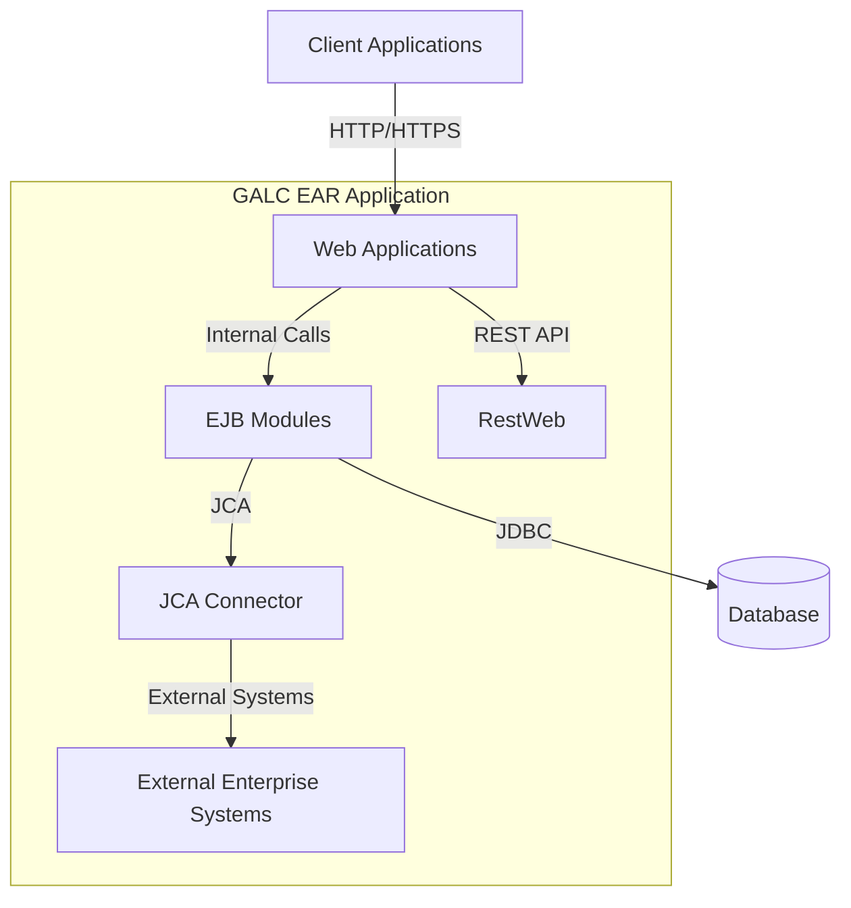
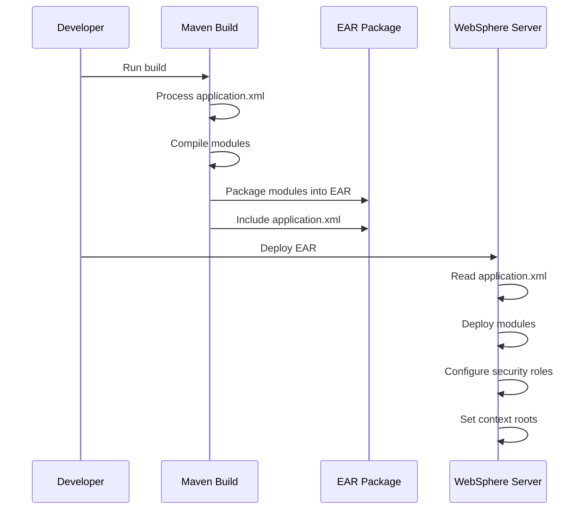
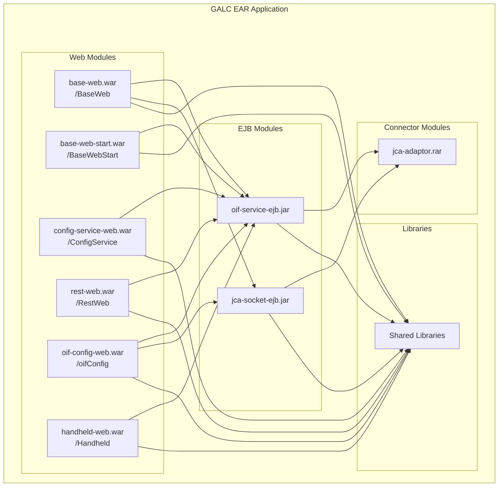
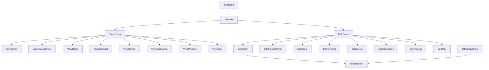

# GALC Application.xml Documentation

## 1. Purpose and Overview

The `application.xml` file in the GALC system serves as the Java EE deployment descriptor for the Enterprise Application Archive (EAR). This critical configuration file defines the structure, components, and security roles of the GALC application when deployed to WebSphere Application Server.

### Key Functions:

- **Application Structure Definition**: Specifies all modules that make up the GALC application
- **Module Type Declaration**: Identifies each component as a web application, EJB module, or connector
- **Context Root Configuration**: Establishes URL paths for web applications
- **Security Role Definition**: Defines all security roles used throughout the application

## 2. File Structure and Components

The `application.xml` file follows the J2EE 1.4 specification and contains the following major sections:

### 2.1 Header and Application Identification

```xml
<?xml version="1.0" encoding="UTF-8"?>
<application id="Application_ID" version="1.4" xmlns="http://java.sun.com/xml/ns/j2ee" 
    xmlns:xsi="http://www.w3.org/2001/XMLSchema-instance" 
    xsi:schemaLocation="http://java.sun.com/xml/ns/j2ee http://java.sun.com/xml/ns/j2ee/application_1_4.xsd">
<display-name>GALC New Application</display-name>
```

This section establishes:

- XML version and encoding
- Application identifier (`Application_ID`)
- J2EE version compliance (1.4)
- Display name shown in administration consoles

### 2.2 Module Definitions

The file defines three types of modules:

#### 2.2.1 EJB Modules

```xml
<module id="EjbModule_1290866836243">
    <ejb>oif-service-ejb.jar</ejb>
</module>
<module id="EjbModule_1378840475332">
    <ejb>jca-socket-ejb.jar</ejb>
</module>
```

These modules contain Enterprise JavaBeans that implement business logic:

- **oif-service-ejb.jar**: OIF (Oracle Integration Framework) service implementations
- **jca-socket-ejb.jar**: Socket communication services for JCA connectivity

#### 2.2.2 Connector Module

```xml
<module id="ConnectorModule_1378840475363">
    <connector>jca-adaptor.rar</connector>
</module>
```

This Resource Adapter Archive (RAR) provides connectivity to enterprise information systems:

- **jca-adaptor.rar**: JCA adapter for integration with external systems

#### 2.2.3 Web Modules

```xml
<module id="WebModule_1279797210744">
    <web>
        <web-uri>base-web.war</web-uri>
        <context-root>BaseWeb</context-root>
    </web>
</module>
```

The application includes six web applications:

- **base-web.war**: Core web functionality (context: `/BaseWeb`)
- **base-web-start.war**: Java Web Start deployment (context: `/BaseWebStart`)
- **config-service-web.war**: Configuration services (context: `/ConfigService`)
- **rest-web.war**: REST API endpoints (context: `/RestWeb`)
- **oif-config-web.war**: OIF configuration interface (context: `/oifConfig`)
- **handheld-web.war**: Mobile/handheld interface (context: `/Handheld`)

### 2.3 Security Role Definitions

The file defines 17 security roles that control access to different parts of the application:

```xml
<security-role id="SecurityRole_AllUsers">
    <description>All authenticated Users</description>
    <role-name>AllUsers</role-name>
</security-role>
```

Key security roles include:

- **AllUsers**: Base role for authenticated users
- **Administrator**: Full system administration rights
- **EditAdmin/ViewAdmin**: Administration configuration access
- **EditProcessPoint/ViewProcessPoint**: Process point data access
- **EditUsers/ViewUsers**: User management access
- **EditTerminal/ViewTerminal**: Terminal configuration access
- **EditDevice/ViewDevice**: Device management access
- **EditApplication/ViewApplication**: Application settings access
- **EditProcess/ViewProcess**: Process configuration access
- **EditACL/ViewACL**: Access Control List management
- **Everyone**: All users (authenticated and unauthenticated)
- **OifAdministrator**: OIF-specific administration

## 3. Integration with WebSphere Application Server

The application.xml file works in conjunction with WebSphere-specific configuration files:

### 3.1 IBM Application Binding (ibm-application-bnd.xmi)

This file maps the security roles defined in application.xml to actual users and groups in the WebSphere security realm:

```xml
<authorizations xmi:id="RoleAssignment_1171550254720">
  <role href="META-INF/application.xml#SecurityRole_EditProcessPoint"/>
  <groups xmi:id="Group_1308856007871" name="GALC_CONFIG_ADMIN"/>
  <groups xmi:id="Group_1308856007873" name="GALC_CONFIG_UPDATE"/>
</authorizations>
```

Key security groups include:

- **GALC_CONFIG_ADMIN**: Primary administrator group with full configuration access
- **GALC_CONFIG_UPDATE**: Configuration update permissions
- **GALC_USER_ADMIN**: User administration permissions
- **GALC_TERMINAL_ADMIN**: Terminal configuration permissions

## 4. Application Architecture and Data Flow

The application.xml defines a multi-tier architecture with the following components:



### 4.1 Component Interactions

#### Web Applications to EJB Modules

Web applications call EJB modules for business logic processing:

```java
// Example: Web application calling an EJB service
@EJB
private ProcessPointService processPointService;

public void processData(String processPointId, ProductData data) {
    processPointService.updateProductData(processPointId, data);
}
```

#### EJB Modules to Database

EJB modules interact with the database through JPA entities:

```java
// Example: EJB service performing database operations
@Stateless
public class ProcessPointServiceImpl implements ProcessPointService {
    @PersistenceContext
    private EntityManager em;
    
    public void updateProductData(String processPointId, ProductData data) {
        ProcessPoint pp = em.find(ProcessPoint.class, processPointId);
        pp.updateData(data);
        em.merge(pp);
    }
}
```

#### JCA Connector to External Systems

The JCA connector facilitates communication with external enterprise systems:

```java
// Example: Using JCA connector to send data to external system
@Resource(name="eis/PLCConnection")
private ConnectionFactory connectionFactory;

public void sendToPLC(PLCCommand command) {
    Connection conn = connectionFactory.getConnection();
    try {
        PLCInteraction interaction = conn.createInteraction();
        Record record = interaction.execute(command);
        // Process response
    } finally {
        conn.close();
    }
}
```

## 5. Database Interactions

The modules defined in application.xml interact with numerous database tables through JPA entities:

### 5.1 Common Database Queries

#### Process Point Data Retrieval

```sql
-- Example: Query to retrieve process point configuration
SELECT pp.PROCESS_POINT_ID, pp.DESCRIPTION, pp.ACTIVE_FLAG, pp.PROCESS_POINT_TYPE
FROM GAL107TBX pp
WHERE pp.PROCESS_POINT_ID = ?
```

#### Product Tracking

```sql
-- Example: Query to track a product through process points
SELECT ps.PRODUCT_ID, ps.PROCESS_POINT_ID, ps.TIMESTAMP, ps.STATUS_CODE
FROM PRODUCT_SEQUENCE ps
WHERE ps.PRODUCT_ID = ?
ORDER BY ps.TIMESTAMP DESC
```

#### Quality Control Data

```sql
-- Example: Query to retrieve defect information
SELECT dr.DEFECT_ID, dr.PRODUCT_ID, dr.DEFECT_CODE, dr.TIMESTAMP, dr.REPAIR_STATUS
FROM QI_DEFECT_RESULT dr
WHERE dr.PRODUCT_ID = ?
```

## 6. Deployment and Configuration Workflow

The application.xml file is used during the build and deployment process:



### 6.1 Build Configuration

The Maven EAR plugin is configured to use the existing application.xml rather than generating one:

```xml
<plugin>
    <groupId>org.apache.maven.plugins</groupId>
    <artifactId>maven-ear-plugin</artifactId>
    <configuration>
        <generateApplicationXml>false</generateApplicationXml>
        <defaultLibBundleDir>lib/</defaultLibBundleDir>
        <skinnyWars>true</skinnyWars>
        <!-- Module configurations -->
    </configuration>
</plugin>
```

Key configuration points:

- `generateApplicationXml`: Set to false to use the existing file
- `skinnyWars`: Set to true to avoid duplicate libraries in WAR files
- Module configurations match the IDs in application.xml

## 7. Security Implementation

The security roles defined in application.xml are implemented through several mechanisms:

### 7.1 Web Application Security

Web applications use security constraints in their web.xml files:

```xml
<!-- Example web.xml security constraint -->
<security-constraint>
    <web-resource-collection>
        <web-resource-name>Admin Pages</web-resource-name>
        <url-pattern>/admin/*</url-pattern>
    </web-resource-collection>
    <auth-constraint>
        <role-name>EditAdmin</role-name>
    </auth-constraint>
</security-constraint>
```

### 7.2 EJB Security

EJB methods are secured using annotations:

```java
// Example: Securing EJB methods
@Stateless
public class ConfigurationServiceImpl implements ConfigurationService {
    @RolesAllowed({"EditAdmin", "EditApplication"})
    public void updateConfiguration(String key, String value) {
        // Implementation
    }
    
    @RolesAllowed({"ViewAdmin", "ViewApplication", "AllUsers"})
    public String getConfiguration(String key) {
        // Implementation
    }
}
```

### 7.3 WebSphere Role Mapping

The ibm-application-bnd.xmi file maps roles to WebSphere users and groups:

```xml
<authorizations>
  <role href="META-INF/application.xml#SecurityRole_Administrator"/>
  <groups name="GALC_CONFIG_ADMIN"/>
</authorizations>
```

## 8. Troubleshooting and Debugging

### 8.1 Common Deployment Issues

#### Module Not Found

**Symptom**: Error during deployment indicating a module specified in application.xml cannot be found.

**Debugging Steps**:

1. Verify the module file exists in the EAR
2. Check that the file name in application.xml matches the actual file name
3. Examine the Maven build logs for packaging errors

```bash
# Example: List contents of EAR file to verify modules
jar -tf release_j8build_4.31-SNAPSHOT_app.ear
```

#### Security Role Mapping Issues

**Symptom**: Users cannot access functionality despite having appropriate group membership.

**Debugging Steps**:

1. Verify role definitions in application.xml
2. Check role mappings in ibm-application-bnd.xmi
3. Confirm user group membership in WebSphere
4. Check WebSphere security logs

```bash
# Example: Query WebSphere for user group membership
wsadmin.sh -c "AdminTask.listGroupsForUser('[-userid user1]')"
```

#### Context Root Conflicts

**Symptom**: URL paths not working as expected or conflicts between applications.

**Debugging Steps**:

1. Verify context-root settings in application.xml
2. Check for duplicate context roots
3. Examine WebSphere server logs for routing errors

### 8.2 Runtime Debugging

#### Database Connection Issues

**Symptom**: Application fails to connect to database or database operations fail.

**Debugging Steps**:

1. Verify JNDI data source configuration in WebSphere
2. Check database credentials and connection parameters
3. Test connection from WebSphere console
4. Examine SQL logs for query errors

```sql
-- Example: Query to check database connectivity
SELECT 1 FROM DUAL
```

#### JCA Connection Issues

**Symptom**: Application fails to connect to external systems.

**Debugging Steps**:

1. Verify JCA resource adapter configuration
2. Check connection factory settings
3. Test connection from WebSphere console
4. Examine resource adapter logs

```bash
# Example: Check JCA connection factory status
wsadmin.sh -c "print AdminControl.queryNames('type=ConnectionFactory,*')"
```

## 9. Maintenance and Updates

### 9.1 Adding a New Module

To add a new module to the GALC application:

1. Add the module definition to application.xml:

   ```xml
   <module id="WebModule_NewModule">
       <web>
           <web-uri>new-module.war</web-uri>
           <context-root>NewModule</context-root>
       </web>
   </module>
   ```

2. Update the Maven EAR plugin configuration:

   ```xml
   <webModule id="WebModule_NewModule">
       <groupId>com.honda.galc</groupId>
       <artifactId>new-module</artifactId>
       <contextRoot>NewModule</contextRoot>
       <bundleFileName>new-module.war</bundleFileName>
   </webModule>
   ```

3. Add the module dependency to pom.xml:

   ```xml
   <dependency>
       <groupId>com.honda.galc</groupId>
       <artifactId>new-module</artifactId>
       <version>${galc.build.version}</version>
       <type>war</type>
   </dependency>
   ```

### 9.2 Adding a New Security Role

To add a new security role:

1. Add the role definition to application.xml:

   ```xml
   <security-role id="SecurityRole_NewRole">
       <description>New role description</description>
       <role-name>NewRole</role-name>
   </security-role>
   ```

2. Map the role in ibm-application-bnd.xmi:

   ```xml
   <authorizations xmi:id="RoleAssignment_NewRole">
       <role href="META-INF/application.xml#SecurityRole_NewRole"/>
       <groups xmi:id="Group_NewRoleGroup" name="GALC_NEW_ROLE_GROUP"/>
   </authorizations>
   ```

3. Create the corresponding group in WebSphere security realm

## 10. Visual Representation of Application Structure



## 11. Security Role Hierarchy




## 12. Conclusion

The application.xml file is a critical configuration component of the GALC system that defines the structure, modules, and security roles of the application. It works in conjunction with WebSphere-specific configuration files to provide a complete deployment descriptor for the application.

Understanding this file is essential for:

- Deploying the GALC application correctly
- Adding new modules or functionality
- Managing security roles and access control
- Troubleshooting deployment and runtime issues

By following the documentation and examples provided, administrators and developers can effectively manage and maintain the GALC application in a WebSphere environment.