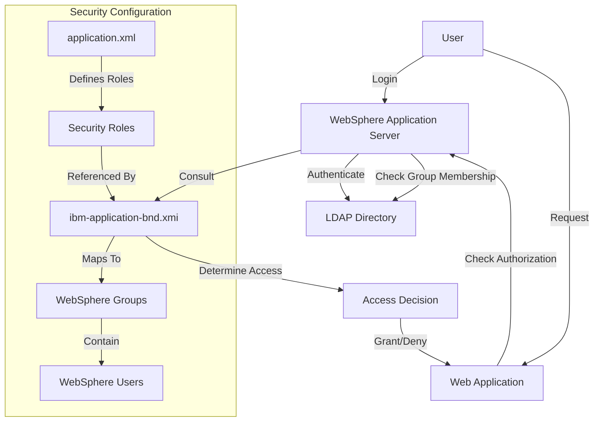
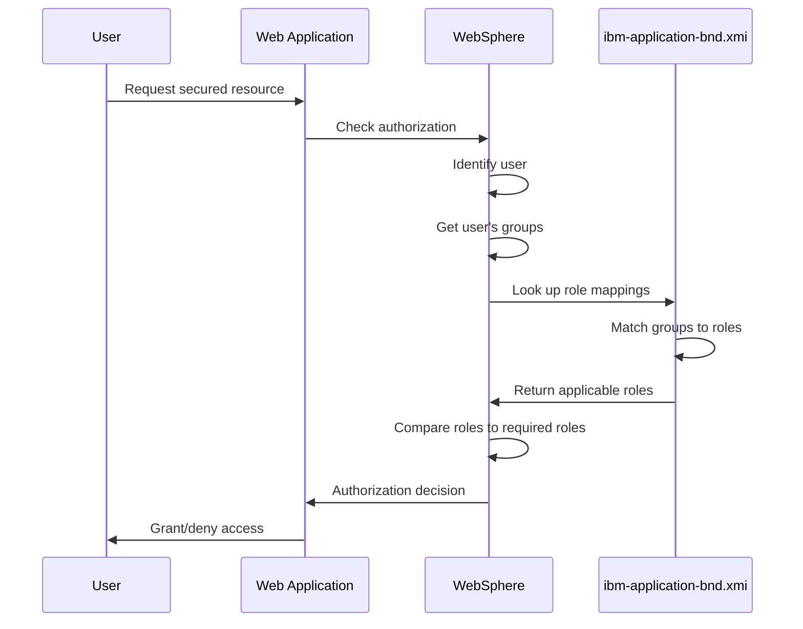
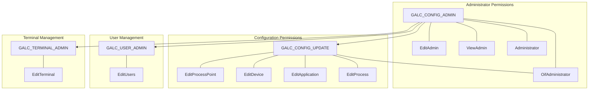
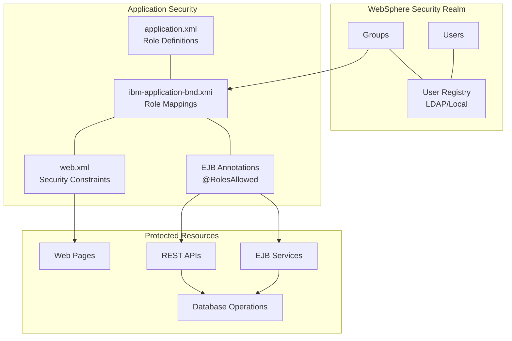

# IBM Application Binding (ibm-application-bnd.xmi) Documentation

## 1. Purpose and Overview

The `ibm-application-bnd.xmi` file is a WebSphere Application Server-specific configuration file that maps Java EE security roles defined in the `application.xml` file to actual users and groups in the WebSphere security realm. This critical file serves as the bridge between abstract security roles and concrete security identities.

### Key Functions:

- **Role-to-Identity Mapping**: Maps Java EE security roles to WebSphere users and groups
- **Special Subject Handling**: Defines special subjects like "AllAuthenticatedUsers" and "Everyone"
- **Authorization Configuration**: Establishes who can access which parts of the application
- **Security Integration**: Connects the application's security model with the WebSphere security infrastructure

## 2. File Structure and Components

The `ibm-application-bnd.xmi` file is an XML Metadata Interchange (XMI) document that follows WebSphere's proprietary schema. It contains the following major sections:

### 2.1 Header and Application Binding

```xml
<?xml version="1.0" encoding="UTF-8"?>
<applicationbnd:ApplicationBinding xmi:version="2.0" 
    xmlns:xmi="http://www.omg.org/XMI" 
    xmlns:applicationbnd="applicationbnd.xmi" 
    xmi:id="ApplicationBinding_1171547934046">
```

This section establishes:

- XML version and encoding
- XMI version (2.0)
- Namespace definitions for XMI and application binding
- Unique identifier for the application binding

### 2.2 Authorization Table

The authorization table contains all role-to-identity mappings:

```xml
<authorizationTable xmi:id="AuthorizationTable_1171547934046">
  <!-- Authorization entries go here -->
</authorizationTable>
```

### 2.3 Authorization Entries

Each authorization entry maps a security role to one or more identities:

```xml
<authorizations xmi:id="RoleAssignment_1171547934046">
  <specialSubjects xmi:type="applicationbnd:AllAuthenticatedUsers" 
                  xmi:id="AllAuthenticatedUsers_1171551557343" 
                  name="AllAuthenticatedUsers"/>
  <role href="META-INF/application.xml#SecurityRole_AllUsers"/>
</authorizations>
```

Each entry contains:

- A unique identifier for the role assignment
- References to users, groups, or special subjects
- A reference to the security role in the application.xml file

### 2.4 Application Reference

The file ends with a reference to the application defined in application.xml:

```xml
<application href="META-INF/application.xml#Application_ID"/>
```

## 3. Role Mapping Types

The ibm-application-bnd.xmi file supports three types of role mappings:

### 3.1 Special Subject Mappings

Special subjects are predefined user categories in WebSphere:

```xml
<authorizations xmi:id="RoleAssignment_1172703807250">
  <specialSubjects xmi:type="applicationbnd:Everyone" 
                  xmi:id="Everyone_1172703807250" 
                  name="Everyone"/>
  <role href="META-INF/application.xml#SecurityRole_Everyone"/>
</authorizations>
```

Key special subjects used in GALC:

- **AllAuthenticatedUsers**: Any authenticated user
- **Everyone**: All users, including unauthenticated ones

### 3.2 Group Mappings

Group mappings assign roles to WebSphere security groups:

```xml
<authorizations xmi:id="RoleAssignment_1171550254718">
  <role href="META-INF/application.xml#SecurityRole_EditAdmin"/>
  <groups xmi:id="Group_1308856007871" name="GALC_CONFIG_ADMIN"/>
</authorizations>
```

Key security groups in GALC:

- **GALC_CONFIG_ADMIN**: Primary administrator group
- **GALC_CONFIG_UPDATE**: Configuration update permissions
- **GALC_USER_ADMIN**: User administration permissions
- **GALC_TERMINAL_ADMIN**: Terminal configuration permissions

### 3.3 Multiple Group Mappings

Some roles are mapped to multiple groups:

```xml
<authorizations xmi:id="RoleAssignment_1171550316984">
  <role href="META-INF/application.xml#SecurityRole_EditUsers"/>
  <groups xmi:id="Group_1308856007871" name="GALC_CONFIG_ADMIN"/>
  <groups xmi:id="Group_1308856007873" name="GALC_CONFIG_UPDATE"/>
  <groups xmi:id="Group_1308856007874" name="GALC_USER_ADMIN"/>
</authorizations>
```

This allows for flexible permission assignment where multiple groups can perform the same function.

## 4. Integration with Java EE Security

The ibm-application-bnd.xmi file integrates with Java EE security in several ways:

### 4.1 Application.xml Integration

The file references security roles defined in application.xml:

```xml
<role href="META-INF/application.xml#SecurityRole_EditAdmin"/>
```

This creates a direct link between the J2EE standard security roles and WebSphere's implementation.

### 4.2 Web Application Security

Web applications use security constraints in their web.xml files that reference roles defined in application.xml and mapped in ibm-application-bnd.xmi:

```xml
<!-- Example from config-service-web/web.xml -->
<security-constraint>
  <web-resource-collection>
    <web-resource-name>AllPages</web-resource-name>
    <url-pattern>*.do</url-pattern>
    <url-pattern>*.jsp</url-pattern>
  </web-resource-collection>
  <auth-constraint>
    <role-name>AllUsers</role-name>
  </auth-constraint>
</security-constraint>
```

### 4.3 EJB Security

EJB methods use annotations that reference roles:

```java
// Example from REST web services
@Path("partserialnumber")
public class PartSnResource extends BaseRestResource {
    @GET
    @Path("/filterByProductIdAndPartName")
    @RolesAllowed("RestUser")
    @Produces(MediaType.APPLICATION_JSON)
    public PartSerialNumber filterByProductIdAndPartName(...) {
        // Method implementation
    }
}
```

## 5. Security Architecture and Data Flow

The ibm-application-bnd.xmi file is a key component in the GALC security architecture:



### 5.1 Authentication Flow

When a user attempts to access a secured resource:

1. The user presents credentials to WebSphere
2. WebSphere authenticates the user against the configured user registry (LDAP)
3. WebSphere determines the user's group memberships
4. The application server checks ibm-application-bnd.xmi to map groups to roles
5. The application server grants or denies access based on the role mappings

### 5.2 Authorization Decision Process



## 6. Role Mapping Table

The following table summarizes the role mappings defined in ibm-application-bnd.xmi:

| Security Role | Special Subjects | Groups | |---------------|------------------|--------| | AllUsers | AllAuthenticatedUsers | - | | ViewProcessPoint | AllAuthenticatedUsers | - | | EditAdmin | - | GALC_CONFIG_ADMIN | | ViewAdmin | - | GALC_CONFIG_ADMIN | | EditProcessPoint | - | GALC_CONFIG_ADMIN, GALC_CONFIG_UPDATE | | ViewUsers | AllAuthenticatedUsers | - | | EditUsers | - | GALC_CONFIG_ADMIN, GALC_CONFIG_UPDATE, GALC_USER_ADMIN | | ViewTerminal | AllAuthenticatedUsers | - | | EditTerminal | - | GALC_CONFIG_ADMIN, GALC_CONFIG_UPDATE, GALC_TERMINAL_ADMIN | | EditDevice | - | GALC_CONFIG_ADMIN, GALC_CONFIG_UPDATE | | ViewDevice | AllAuthenticatedUsers | - | | EditApplication | - | GALC_CONFIG_ADMIN, GALC_CONFIG_UPDATE | | ViewApplication | AllAuthenticatedUsers | - | | EditProcess | - | GALC_CONFIG_ADMIN, GALC_CONFIG_UPDATE | | ViewProcess | AllAuthenticatedUsers | - | | ViewACL | AllAuthenticatedUsers | - | | OifAdministrator | - | GALC_CONFIG_ADMIN, GALC_CONFIG_UPDATE | | Everyone | Everyone | - | | Administrator | - | GALC_CONFIG_ADMIN |

## 7. Group Permission Hierarchy

The GALC application implements a hierarchical permission model through its group structure:



## 8. Database Interactions

While the ibm-application-bnd.xmi file itself doesn't directly interact with the database, the security roles it defines control access to database operations performed by the application.

### 8.1 Role-Based Database Access Control

Different roles have different levels of database access:

#### Administrator Access (GALC_CONFIG_ADMIN)

```sql
-- Example: Administrator can modify configuration settings
UPDATE GALC_CONFIGURATION 
SET CONFIG_VALUE = 'new_value' 
WHERE CONFIG_KEY = 'system.setting';

-- Example: Administrator can create new users
INSERT INTO GALC_USERS 
(USER_ID, USER_NAME, EMAIL, ACTIVE_FLAG) 
VALUES ('user123', 'New User', 'user@example.com', 1);
```

#### Configuration Update Access (GALC_CONFIG_UPDATE)

```sql
-- Example: Update process point configuration
UPDATE GAL107TBX 
SET DESCRIPTION = 'Updated Process Point', 
    ACTIVE_FLAG = 1 
WHERE PROCESS_POINT_ID = 'PP001';

-- Example: Update device configuration
UPDATE DEVICE_CONFIG 
SET IP_ADDRESS = '192.168.1.100', 
    PORT = 8080 
WHERE DEVICE_ID = 'DEV001';
```

#### User Admin Access (GALC_USER_ADMIN)

```sql
-- Example: Update user information
UPDATE GALC_USERS 
SET EMAIL = 'updated@example.com', 
    ACTIVE_FLAG = 1 
WHERE USER_ID = 'user123';

-- Example: Assign user to group
INSERT INTO USER_GROUP_MAPPING 
(USER_ID, GROUP_ID) 
VALUES ('user123', 'GALC_TERMINAL_ADMIN');
```

## 9. Troubleshooting and Debugging

### 9.1 Common Security Issues

#### Role Mapping Issues

**Symptom**: User cannot access functionality despite having appropriate group membership.

**Debugging Steps**:

1. Verify the user's group membership in WebSphere
2. Check role mappings in ibm-application-bnd.xmi
3. Examine WebSphere security logs
4. Test with a user in GALC_CONFIG_ADMIN group (which has all permissions)

```bash
# Example: Check user's group membership in WebSphere
wsadmin.sh -c "AdminTask.listGroupsForUser('[-userid user1]')"

# Example: Check security settings in WebSphere
wsadmin.sh -c "AdminTask.listAuditAuthorizationOutcome('[-outcome denied]')"
```

#### Missing Group Definitions

**Symptom**: Role mappings exist but users still cannot access functionality.

**Debugging Steps**:

1. Verify the groups exist in WebSphere's user registry
2. Check that group names match exactly (case-sensitive)
3. Ensure the groups are properly created in LDAP or local repository

```bash
# Example: List all groups in WebSphere
wsadmin.sh -c "AdminTask.listGroups()"

# Example: Create missing group
wsadmin.sh -c "AdminTask.createGroup('[-groupName GALC_CONFIG_ADMIN]')"
```

#### Special Subject Issues

**Symptom**: All authenticated users cannot access resources they should be able to.

**Debugging Steps**:

1. Check the special subject mappings in ibm-application-bnd.xmi
2. Verify WebSphere's authentication configuration
3. Test with a specific user account to isolate the issue

### 9.2 Security Trace and Logging

To enable detailed security tracing in WebSphere:

```bash
# Enable security trace
wsadmin.sh -c "AdminTask.setTraceSpecification('[-traceString com.ibm.ws.security.*=all]')"

# View trace logs
tail -f /opt/IBM/WebSphere/AppServer/profiles/AppSrv01/logs/trace.log
```

### 9.3 Verifying Role Mappings

To verify role mappings are correctly applied:

```bash
# List all role mappings for the application
wsadmin.sh -c "AdminApp.listSecurityRoles('GALC_Application')"

# View users/groups mapped to a specific role
wsadmin.sh -c "AdminApp.listUsersInRole('GALC_Application', 'EditAdmin')"
```

## 10. Maintenance and Updates

### 10.1 Adding a New Role Mapping

To add a new role mapping to ibm-application-bnd.xmi:

1. First, add the role to application.xml:

   ```xml
   <security-role id="SecurityRole_NewRole">
       <description>New role description</description>
       <role-name>NewRole</role-name>
   </security-role>
   ```

2. Then, add the mapping to ibm-application-bnd.xmi:

   ```xml
   <authorizations xmi:id="RoleAssignment_NewRole">
       <role href="META-INF/application.xml#SecurityRole_NewRole"/>
       <groups xmi:id="Group_NewGroup" name="GALC_NEW_GROUP"/>
   </authorizations>
   ```

3. Create the corresponding group in WebSphere:

   ```bash
   wsadmin.sh -c "AdminTask.createGroup('[-groupName GALC_NEW_GROUP]')"
   ```

### 10.2 Modifying Existing Role Mappings

To modify an existing role mapping:

1. Locate the authorization entry in ibm-application-bnd.xmi
2. Add or remove group references as needed
3. Rebuild and redeploy the application

Example of adding a group to an existing role:

```xml
<!-- Before -->
<authorizations xmi:id="RoleAssignment_1171550254718">
  <role href="META-INF/application.xml#SecurityRole_EditAdmin"/>
  <groups xmi:id="Group_1308856007871" name="GALC_CONFIG_ADMIN"/>
</authorizations>

<!-- After -->
<authorizations xmi:id="RoleAssignment_1171550254718">
  <role href="META-INF/application.xml#SecurityRole_EditAdmin"/>
  <groups xmi:id="Group_1308856007871" name="GALC_CONFIG_ADMIN"/>
  <groups xmi:id="Group_NewAdminGroup" name="GALC_NEW_ADMIN_GROUP"/>
</authorizations>
```

### 10.3 Updating After WebSphere Migration

When migrating to a newer version of WebSphere:

1. Export the security configuration from the old server
2. Import the security configuration to the new server
3. Verify role mappings are correctly transferred
4. Test access with users from each security group

```bash
# Export security configuration
wsadmin.sh -c "AdminTask.exportSecurity('[-fileName security_export.zip]')"

# Import security configuration
wsadmin.sh -c "AdminTask.importSecurity('[-fileName security_export.zip]')"
```

## 11. Visual Representation of Security Model



## 12. Role-Based Access Control Matrix

The following matrix shows which operations are permitted for each security role:

| Operation | AllUsers | ViewAdmin | EditAdmin | ViewProcess | EditProcess | ViewUsers | EditUsers | |-----------|----------|-----------|-----------|-------------|-------------|-----------|-----------| | View Dashboard | ✓ | ✓ | ✓ | ✓ | ✓ | ✓ | ✓ | | View Process Points | ✓ | ✓ | ✓ | ✓ | ✓ | ✓ | ✓ | | Edit Process Points | ✗ | ✗ | ✓ | ✗ | ✓ | ✗ | ✗ | | View Admin Settings | ✗ | ✓ | ✓ | ✗ | ✗ | ✗ | ✗ | | Edit Admin Settings | ✗ | ✗ | ✓ | ✗ | ✗ | ✗ | ✗ | | View User List | ✗ | ✓ | ✓ | ✗ | ✗ | ✓ | ✓ | | Edit Users | ✗ | ✗ | ✓ | ✗ | ✗ | ✗ | ✓ | | View Process Tree | ✗ | ✓ | ✓ | ✓ | ✓ | ✗ | ✗ | | Edit Process Tree | ✗ | ✗ | ✓ | ✗ | ✓ | ✗ | ✗ | | Access REST API | ✗ | ✗ | ✓ | ✗ | ✗ | ✗ | ✗ |

## 13. Conclusion

The ibm-application-bnd.xmi file is a critical component of the GALC application's security architecture. It bridges the gap between Java EE's abstract security roles and WebSphere's concrete security identities, enabling fine-grained access control throughout the application.

Key points to remember:

- The file maps security roles defined in application.xml to WebSphere users and groups
- It supports special subjects like "AllAuthenticatedUsers" and "Everyone"
- The GALC application uses a hierarchical group structure with GALC_CONFIG_ADMIN at the top
- Role mappings control access to web resources, EJB methods, and database operations
- Troubleshooting security issues often involves examining this file and WebSphere's security configuration

By understanding the ibm-application-bnd.xmi file and its role in the security architecture, administrators can effectively manage access control in the GALC application, ensuring that users have appropriate permissions while maintaining the system's security.