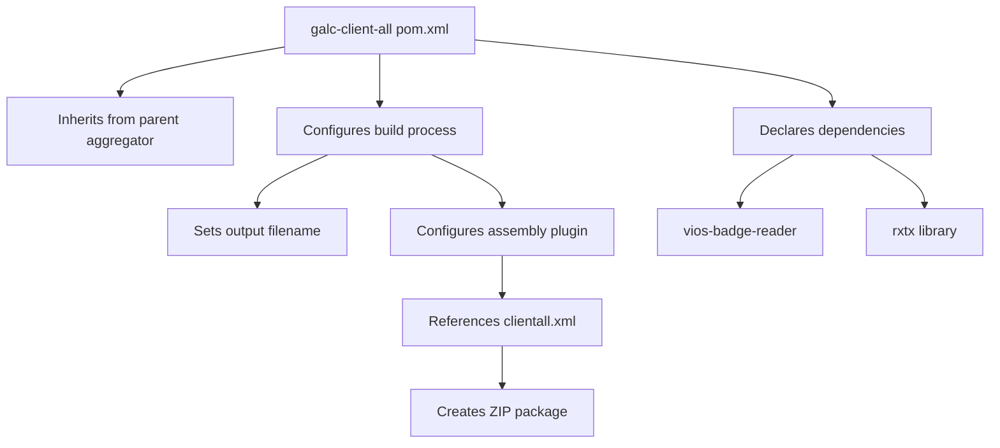
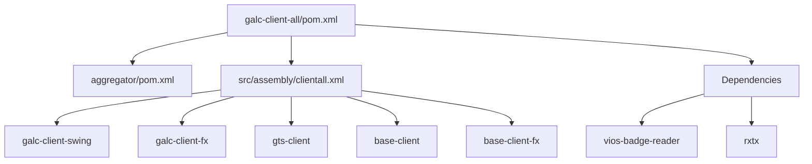
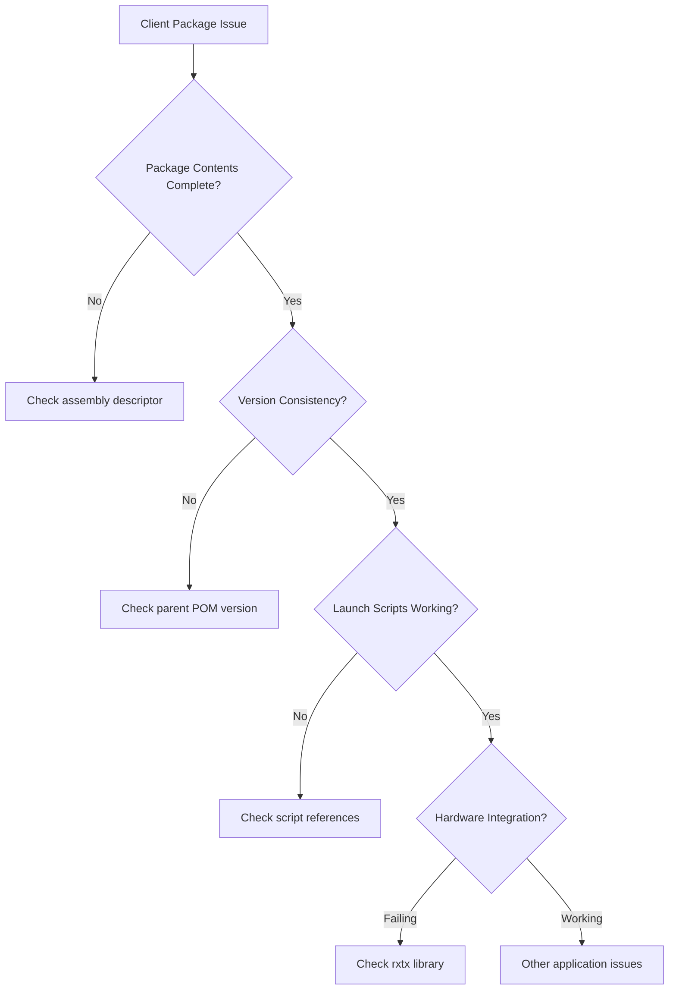
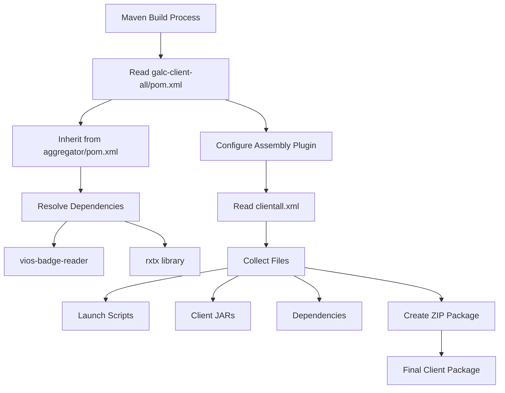

# Comprehensive Documentation: galc-client-all/pom.xml

## Purpose

The `pom.xml` file in the `galc-client-all` directory serves as a Maven Project Object Model configuration file that defines how to package and distribute the client-side components of the GALC (Global Assembly Line Control) application. This file is specifically designed to:

1. Create a consolidated distribution package that combines multiple client applications (Swing and JavaFX versions)
2. Include necessary dependencies for client-side functionality
3. Define the build process for creating a deployable client package

Think of this file as a recipe that tells Maven how to gather all the necessary client components and package them together in a way that makes deployment and installation straightforward for end users.

## How It Works

The `galc-client-all` module operates as an aggregator that doesn't contain code itself but instead collects and packages components from other modules. Here's how it works:

1. **Parent Relationship**: The module inherits configuration from the parent `aggregator` module, ensuring consistent versioning and build settings across the project.
2. **Dependency Management**: It declares specific dependencies needed for client functionality:
   - `vios-badge-reader`: A component for reading employee badges
   - `rxtx`: A library for serial port communication (likely used for hardware integration)
3. **Build Configuration**:
   - Sets a standardized naming convention for the output file using properties defined in the parent POM
   - Configures the Maven Assembly Plugin to create a distributable package
4. **Assembly Process**:
   - Uses a custom assembly descriptor (`clientall.xml`) to define exactly what goes into the package
   - Creates a ZIP file containing all necessary components for client deployment




## Key Components

### Parent Definition

```xml
<parent>
    <groupId>com.honda.galc</groupId>
    <artifactId>aggregator</artifactId>
    <version>4.31-SNAPSHOT</version>
</parent>
```

This section establishes the relationship with the parent POM, inheriting version information, dependency management, and build configurations.

### Dependencies

```xml
<dependencies>
    <dependency>
        <groupId>com.honda.galc</groupId>
        <artifactId>vios-badge-reader</artifactId>
    </dependency>
    <dependency>
        <groupId>org.rxtx</groupId>
        <artifactId>rxtx</artifactId>
    </dependency>
</dependencies>
```

These dependencies are specifically required for client functionality:

- `vios-badge-reader`: Handles employee badge scanning functionality
- `rxtx`: Enables communication with hardware devices through serial ports

### Build Configuration

```xml
<build>
    <finalName>${galc.build.prefix}_${galc.build.version}_client</finalName>
    <plugins>
        <plugin>
            <groupId>org.apache.maven.plugins</groupId>
            <artifactId>maven-assembly-plugin</artifactId>
            <version>3.1.0</version>
            <configuration>
                <descriptors>
                    <descriptor>src/assembly/clientall.xml</descriptor>
                </descriptors>
            </configuration>
        </plugin>
    </plugins>
</build>
```

This section:

- Defines the final name of the built artifact using properties from the parent POM
- Configures the Maven Assembly Plugin to use a custom assembly descriptor

## Interactions

The `galc-client-all` POM interacts with several other components in the project:

1. **Parent POM (`aggregator/pom.xml`)**:
   - Inherits version information (`4.31-SNAPSHOT`)
   - Uses property values defined in the parent (like `${galc.build.prefix}` and `${galc.build.version}`)
   - Relies on dependency management from the parent
2. **Assembly Descriptor (`src/assembly/clientall.xml`)**:
   - References this file to determine what files to include in the package
   - The descriptor includes:
     - Launch scripts for both Swing and JavaFX clients
     - JAR files for both client implementations
     - Additional dependencies
3. **Client Modules**:
   - `galc-client-swing`: Traditional Java Swing UI client
   - `galc-client-fx`: Modern JavaFX UI client
   - `gts-client`: Likely a related client component



## Assembly Descriptor Details

The assembly descriptor (`clientall.xml`) is a crucial component that defines exactly what goes into the final package:

1. **Output Format**: Creates a ZIP file
2. **Files Included:**
   - Launch scripts for both Swing and JavaFX clients
   - JAR files for both client implementations
   - GTS client JAR file
3. **Dependencies**: Includes the explicitly declared dependencies (vios-badge-reader and rxtx)

## Examples

### Example 1: Building the Client Package

To build the client package using this POM, you would run:

```bash
mvn clean package assembly:single
```

This would produce a ZIP file named something like `release_j8build_4.31-SNAPSHOT_client.zip` containing all the necessary files for client deployment.

### Example 2: Customizing the Build

If you needed to customize the build for a specific environment, you could override properties:

```bash
mvn clean package assembly:single -Dgalc.build.prefix=custom_build
```

This would produce a file named `custom_build_4.31-SNAPSHOT_client.zip`.

## Debugging Production Issues

When troubleshooting issues with the client package in production:

1. **Verify Package Contents**:
   - Extract the ZIP file and ensure all expected files are present
   - Check that both launch scripts (launch-swing.bat and launch-fx.bat) are included
   - Verify all required JAR files are present
2. **Check Version Consistency**:
   - Ensure the version in the filename matches the expected version
   - Verify that all included JAR files have matching versions
3. **Launch Script Issues**:
   - Examine the launch scripts to ensure they reference the correct JAR files
   - Check for environment-specific settings that might need adjustment
4. **Dependency Problems**:
   - If hardware integration issues occur, check that the rxtx library is properly included
   - For badge reader problems, verify the vios-badge-reader component is present



## Visual Representation of the Build Process



## Conclusion

The `pom.xml` file in the `galc-client-all` directory is a critical configuration file that orchestrates the packaging of GALC client applications. It doesn't contain application code itself but serves as a blueprint for creating a deployable client package that includes both Swing and JavaFX implementations along with necessary dependencies.

This file demonstrates the modular approach taken in the GALC project, where different client implementations (Swing and JavaFX) are developed separately but packaged together for deployment flexibility. The use of Maven's assembly plugin with a custom descriptor provides fine-grained control over what goes into the final package, ensuring that users receive a complete and consistent installation.