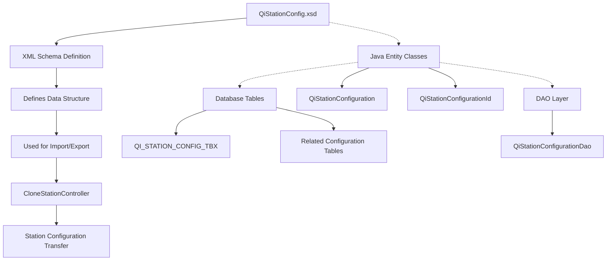
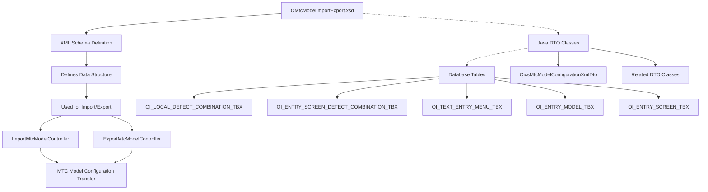
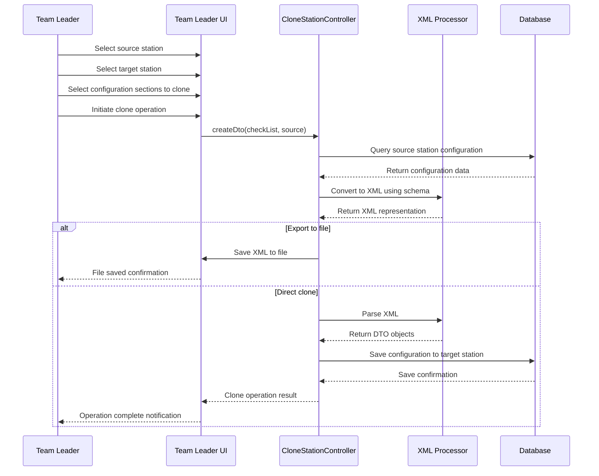
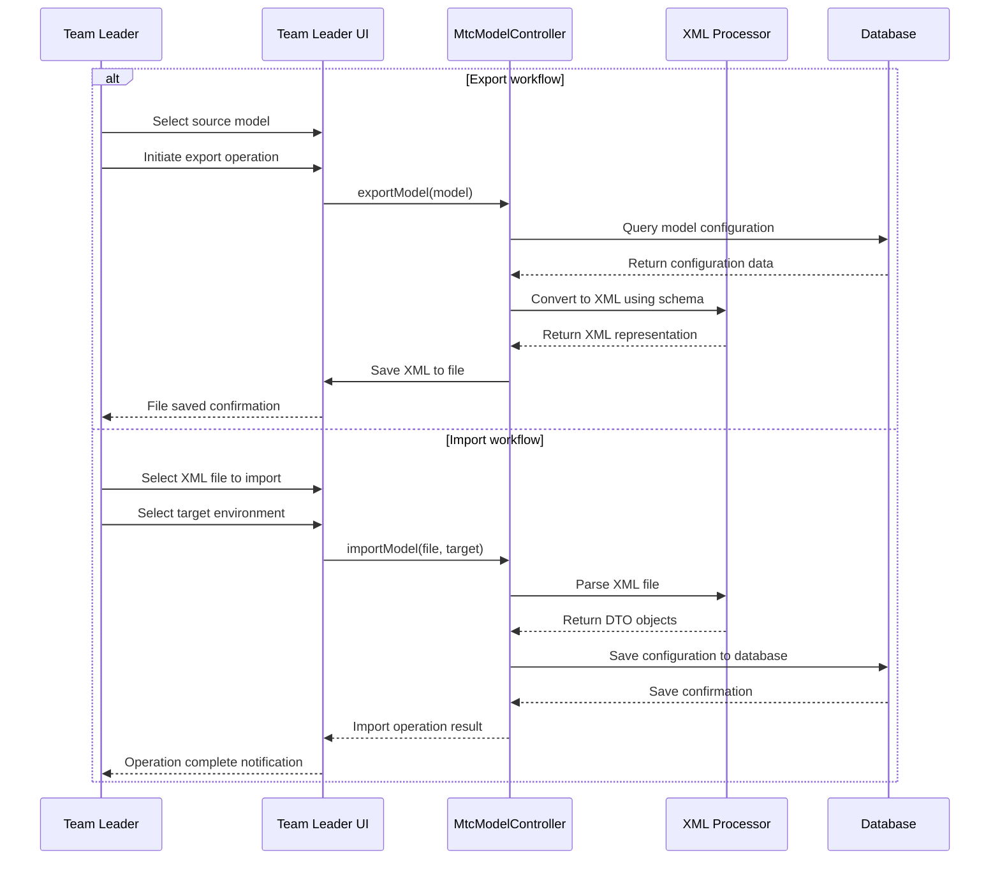
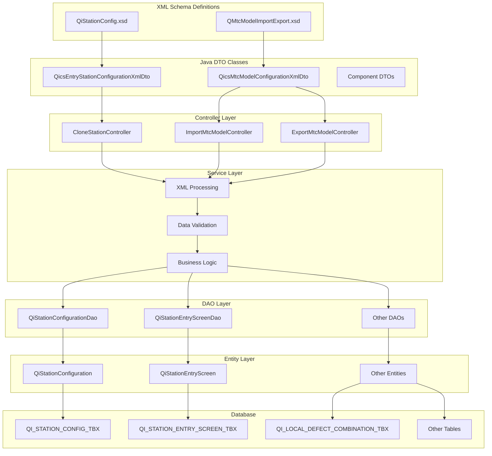

# QiStationConfig.xsd and QMtcModelImportExport.xsd Documentation

## 1. QiStationConfig.xsd

### Purpose

QiStationConfig.xsd is an XML Schema Definition file that defines the structure for station configuration data in the GALC (Global Assembly Line Control) system. It provides a standardized format for importing and exporting quality inspection station configurations between different environments or plants. This schema enables consistent data transfer and validation for station configuration settings.

### How It Works

The schema defines a hierarchical structure of data types that represent various aspects of a quality inspection station's configuration. It serves as a contract for XML data exchange, ensuring that configuration data follows a consistent format when being transferred between systems or when being backed up.

### Key Components

1. **QiStationConfigurationXmlDto**
   - Represents key-value pairs for station configuration settings
   - Contains processPointId, propertyKey, value, and active status
2. **QiStationEntryDepartmentXmlDto**
   - Defines department associations for a station
   - Maps process points to divisions with default status indicators
3. **QiStationEntryScreenXmlDto**
   - Defines entry screen parameters for quality inspection
   - Includes screen orientation, scanning capabilities, and sequence information
4. **QiStationPreviousDefectXmlDto**
   - Manages previous defect status configurations
   - Links process points with entry divisions and defect statuses
5. **QiStationResponsibilityXmlDto**
   - Defines responsibility levels for process points
   - Maps stations to responsibility hierarchies
6. **QiStationWriteUpDepartmentXmlDto**
   - Configures write-up department settings
   - Includes color coding and plant/site information
7. **QiStationUpcPartXmlDto**
   - Maps stations to main part numbers
   - Manages UPC (Universal Product Code) part associations
8. **QicsEntryStationConfigurationXmlDto**
   - Root element that contains all configuration components
   - Includes site, plant, division, and process point identifiers
   - Contains collections of all other configuration elements

### Database Interactions

The schema maps to several database tables, primarily:

1. **QI_STATION_CONFIG_TBX**
   - Primary table for station configuration settings
   - Columns:
     - PROCESS_POINT_ID (Primary Key)
     - PROPERTY_KEY (Primary Key)
     - PROPERTY_VALUE
     - ACTIVE
     - Audit fields (CREATE_TIMESTAMP, UPDATE_TIMESTAMP, CREATE_USER, UPDATE_USER)
2. Related tables:
   - QI_STATION_ENTRY_SCREEN_TBX
   - QI_STATION_ENTRY_DEPARTMENT_TBX
   - QI_STATION_PREVIOUS_DEFECT_TBX
   - QI_STATION_RESPONSIBILITY_TBX
   - QI_STATION_WRITE_UP_DEPARTMENT_TBX
   - QI_STATION_UPC_PART_TBX

### Integration Within the Project

The schema is used by the `CloneStationController` class to facilitate the import and export of station configurations. The controller uses XStream for XML serialization and deserialization. The schema supports the team leader functionality for cloning station configurations between different process points or plants.



## 2. QMtcModelImportExport.xsd

### Purpose

QMtcModelImportExport.xsd defines the structure for importing and exporting MTC (Manufacturing Technical Center) model configurations in the GALC system. It provides a standardized format for transferring model-specific defect combinations, entry screens, and related configuration data between different environments or plants.

### How It Works

The schema defines a hierarchical structure of data types that represent various aspects of MTC model configurations. It serves as a contract for XML data exchange, ensuring that model configuration data follows a consistent format when being transferred between systems.

### Key Components

1. **QiMtcModelImportExportTableSummaryXmlDto**
   - Provides summary information about tables included in the import/export
   - Contains table name and record count
2. **QiLocalDefectCombinationTbxXmlDto**
   - Defines local defect combinations
   - Maps regional defect combinations to local settings
   - Includes repair methods, estimated repair times, and responsibility levels
3. **QiEntryScreenDefectCombinationTbxXmlDto**
   - Maps entry screens to defect combinations
   - Links entry models with regional defect combinations
4. **QiTextEntryMenuTbxXmlDto**
   - Defines text entry menus for defect entry
   - Associates menus with entry screens and models
5. **QiEntryModelTbxXmlDto**
   - Defines entry models with descriptions
   - Includes product type and active status
6. **QiEntryScreenTbxXmlDto**
   - Defines entry screens with descriptions
   - Includes image settings and product type associations
7. **QicsMtcModelConfigurationXmlDto**
   - Root element that contains all model configuration components
   - Includes site, plant, and entry model identifiers
   - Contains collections of all other configuration elements

### Database Interactions

The schema maps to several database tables, primarily:

1. **QI_LOCAL_DEFECT_COMBINATION_TBX**
   - Maps local defect combinations to regional ones
   - Contains repair methods and responsibility information
2. **QI_ENTRY_SCREEN_DEFECT_COMBINATION_TBX**
   - Maps entry screens to defect combinations
3. **QI_TEXT_ENTRY_MENU_TBX**
   - Stores text entry menu configurations
4. **QI_ENTRY_MODEL_TBX**
   - Stores entry model definitions
5. **QI_ENTRY_SCREEN_TBX**
   - Stores entry screen definitions

### Integration Within the Project

The schema is used by the `ImportMtcModelController` and `ExportMtcModelController` classes to facilitate the import and export of MTC model configurations. These controllers use XStream for XML serialization and deserialization.




## Data Flow and Workflow

### QiStationConfig.xsd Workflow



### QMtcModelImportExport.xsd Workflow



## Debugging Steps for Production Issues

### QiStationConfig.xsd Related Issues

1. **XML Validation Errors**
   - Check if the XML file conforms to the QiStationConfig.xsd schema
   - Use XML validation tools to identify schema violations
   - Common issues: missing required elements, incorrect data types
2. **Import/Export Failures**
   - Check database connectivity and permissions
   - Verify that the source and target environments have compatible schema versions
   - Examine logs for specific error messages
3. **Configuration Not Applied**
   - Verify that the configuration was properly saved to the database
   - Check if the active flag is set correctly (1 for active)
   - Ensure that the process point ID and property key combinations are unique

### QMtcModelImportExport.xsd Related Issues

1. **Model Import Failures**
   - Verify that the entry model exists in the target environment
   - Check for conflicts with existing defect combinations
   - Examine logs for specific error messages
2. **Missing Components After Import**
   - Verify that all related tables were included in the import
   - Check the table summary counts in the XML file
   - Ensure that all dependencies (screens, menus, etc.) were properly imported
3. **Performance Issues**
   - Large model configurations may cause performance problems
   - Consider importing in smaller batches
   - Monitor database performance during import operations

## Example Queries

### QiStationConfig.xsd Related Queries

```sql
-- Find all configuration settings for a specific process point
SELECT * FROM GALADM.QI_STATION_CONFIG_TBX 
WHERE PROCESS_POINT_ID = 'PROCESS_POINT_ID'
ORDER BY PROPERTY_KEY;

-- Find active configuration settings
SELECT * FROM GALADM.QI_STATION_CONFIG_TBX 
WHERE ACTIVE = 1
ORDER BY PROCESS_POINT_ID, PROPERTY_KEY;

-- Find entry screens for a process point and division
SELECT * FROM GALADM.QI_STATION_ENTRY_SCREEN_TBX
WHERE PROCESS_POINT_ID = 'PROCESS_POINT_ID'
AND DIVISION_ID = 'DIVISION_ID'
ORDER BY SEQ;
```

### QMtcModelImportExport.xsd Related Queries

```sql
-- Find all local defect combinations for a specific entry model
SELECT * FROM GALADM.QI_LOCAL_DEFECT_COMBINATION_TBX
WHERE ENTRY_MODEL = 'ENTRY_MODEL'
AND IS_USED = 1
ORDER BY LOCAL_DEFECT_COMBINATION_ID;

-- Find entry screens for a specific entry model
SELECT * FROM GALADM.QI_ENTRY_SCREEN_TBX
WHERE ENTRY_MODEL = 'ENTRY_MODEL'
AND IS_USED = 1
ORDER BY ENTRY_SCREEN;

-- Find text entry menus for a specific entry screen
SELECT * FROM GALADM.QI_TEXT_ENTRY_MENU_TBX
WHERE ENTRY_SCREEN = 'ENTRY_SCREEN'
AND IS_USED = 1
ORDER BY TEXT_ENTRY_MENU;
```

## Static Application Properties

### QiStationConfig.xsd Related Properties

Common configuration properties stored in QI_STATION_CONFIG_TBX:

- **Highlight**: Controls whether defects are highlighted (Yes/No)
- **Defects**: Controls whether defects are shown (Yes/No)
- **Range**: Defines the range value for defect visibility (numeric)
- **Repair**: Controls whether repair information is shown (Yes/No)
- **Repair Comment**: Controls whether repair comments are shown (Yes/No)
- **Default Qty**: Default quantity value for parts
- **Most frequently used list size**: Number of items in frequently used lists
- **In Repair Entry Prompt for "Is this caused during Repair"**: Controls repair prompts (0/1)
- **Multi-Select Repairs**: Controls multi-select capability for repairs (Yes/No)

## Visual Representation of System Architecture



## Conclusion

The QiStationConfig.xsd and QMtcModelImportExport.xsd schemas play a crucial role in the GALC system by providing standardized formats for transferring configuration data between different environments. They enable consistent data exchange and validation, ensuring that quality inspection stations and MTC models are configured correctly across the system.

These schemas support important business processes such as:

- Cloning station configurations to new stations
- Transferring model configurations between plants
- Backing up and restoring configurations
- Standardizing configuration across multiple environments

By understanding these schemas and their related components, developers and administrators can effectively manage the configuration data in the GALC system, troubleshoot issues, and ensure consistent quality inspection processes across the organization.