# ManualDunnageEntryDialog.fxml Documentation

## Purpose

The ManualDunnageEntryDialog.fxml file defines the user interface for a dialog that allows users to manually search for and select dunnage containers within the GALC (Global Assembly Line Control) system. This dialog serves as a critical interface for manufacturing operations, enabling users to:

1. Search for dunnage containers using different search criteria
2. View dunnage container details and their associated products
3. Select a specific dunnage container for further operations

## How It Works

The ManualDunnageEntryDialog is a JavaFX-based dialog that provides a user-friendly interface for searching and selecting dunnage containers. The dialog is structured with two main sections:

1. **Search Panel (Left Side)**: Contains search options and input field
2. **Results Panel (Right Side)**: Displays search results in a table view

### Workflow

1. **Dialog Initialization**:
   - The dialog is created and displayed when a user needs to manually select a dunnage container
   - The controller loads the FXML layout and initializes all UI components
   - Search options are set with "Dunnage" as the default selection
2. **Search Process**:
   - User selects a search option (Dunnage ID, Product ID, or MTOC/Product Spec Code)
   - User enters search text in the input field
   - User clicks the search button or presses Enter
   - System validates the input based on minimum length requirements
   - System queries the database for matching dunnage containers
   - Results are displayed in the table view
3. **Selection Process**:
   - User reviews the search results in the table
   - User selects a dunnage container by clicking on it
   - User clicks the "Select" button or double-clicks the row
   - The selected dunnage ID is stored and returned to the calling component
   - Dialog closes

## Key Components

### UI Elements

1. **Search Options Panel**:
   - Radio buttons for search criteria selection:
     - Dunnage: Search by dunnage container ID
     - Product ID: Search by product identifier
     - MTOC: Search by product specification code
   - Text input field for search terms
   - Search button to execute the search
2. **Results Table**:
   - Columns:
     - \#: Row number
     - Dunnage: Dunnage container ID
     - Product Spec Code: Associated product specification code
     - Quantity: Expected quantity of products in the dunnage
   - Select button to confirm selection

### Controller Class

The `ManualDunnageEntryDialog.java` class controls the dialog's behavior:

- Handles user interactions (button clicks, text input)
- Performs validation on user input
- Executes search queries against the database
- Manages the display of search results
- Returns the selected dunnage ID to the calling component

### Model Class

The `SearchByDunnageModel.java` class handles data operations:

- Connects to the database to retrieve dunnage information
- Provides methods to search by different criteria:
  - `findByDunnage()`: Searches by dunnage ID
  - `findAllByProductId()`: Searches by product ID
  - `findByProductSpecCode()`: Searches by product specification code
- Retrieves product information associated with dunnage containers

## Database Interactions

The dialog interacts with several database tables to retrieve and display dunnage information:

### Primary Tables

1. **DUNNAGE_TBX**:

   - Stores basic dunnage container information

   - Schema:

     ```
     DUNNAGE_ID VARCHAR(20) NOT NULL (Primary Key)
     EXPECTED_QTY SMALLINT
     PRODUCT_SPEC_CODE VARCHAR(30)
     DUNNAGE_STATUS SMALLINT
     CREATE_TIMESTAMP TIMESTAMP
     UPDATE_TIMESTAMP TIMESTAMP
     ```

2. **DUNNAGE_CONTENT_TBX**:

   - Maps products to dunnage containers

   - Schema:

     ```
     DUNNAGE_ID VARCHAR(20) NOT NULL
     PRODUCT_ID VARCHAR(17) NOT NULL
     DUNNAGE_ROW VARCHAR(8)
     DUNNAGE_COLUMN VARCHAR(8)
     DUNNAGE_LAYER VARCHAR(8)
     CREATE_TIMESTAMP TIMESTAMP
     UPDATE_TIMESTAMP TIMESTAMP
     Primary Key: (DUNNAGE_ID, PRODUCT_ID)
     ```

3. **Product-specific tables** (e.g., BLOCK_TBX, HEAD_TBX, etc.):

   - Each contains a DUNNAGE column that references the dunnage container

### Example Queries

1. **Search by Dunnage ID**:

   ```sql
   SELECT d FROM Dunnage d 
   WHERE trim(d.dunnageId) LIKE :dunnage 
   ORDER BY d.dunnageId
   ```

2. **Search by Product ID**:

   ```sql
   SELECT d.* FROM galadm.dunnage_tbx d 
   JOIN galadm.dunnage_content_tbx c ON d.dunnage_Id = c.dunnage_Id 
   WHERE trim(c.product_Id) LIKE ?1 
   ORDER BY d.dunnage_Id
   ```

3. **Search by Product Spec Code**:

   ```sql
   SELECT d FROM Dunnage d 
   WHERE trim(d.productSpecCode) LIKE :productSpecCode 
   ORDER BY d.dunnageId
   ```

4. **Get Products in Dunnage**:

   ```sql
   SELECT productId FROM DunnageContent 
   WHERE dunnageId = :dunnageId
   ```

## Integration with Other Components

The ManualDunnageEntryDialog is integrated with several other components in the GALC system:

1. **SearchByDunnageController/GenericSearchByDunnageController**:
   - Creates and displays the dialog
   - Receives the selected dunnage ID
   - Updates the UI with the selected dunnage
   - Optionally triggers automatic entry of the selected dunnage
2. **DunnageMaintController**:
   - Uses the dialog for dunnage maintenance operations
   - Manages the assignment of products to dunnage containers
   - Handles shipping and removal of products from dunnage
3. **DunnageAssignmentView**:
   - Provides a view for assigning products to dunnage containers
   - May use the dialog for selecting dunnage containers

## Configuration Properties

The dialog's behavior is influenced by several configuration properties from the `DunnagePropertyBean` and `ProductPropertyBean`:

1. **Dunnage-specific properties**:
   - `dunnageNumberLength`: Controls the expected length of dunnage IDs
   - `isInsertDunnageContent`: Determines if dunnage content tracking is enabled
   - `isDunnageGroupedByModelType`: Controls if dunnage containers are grouped by model type
   - `isCheckDunnageId`: Determines if dunnage ID validation is performed
2. **Product-specific properties**:
   - `productSearchMinLength`: Minimum length for product search terms
   - `isAutoEnteredManualProductInput`: Controls if selected dunnage is automatically entered
   - `isManualProductEntryEnabled`: Enables/disables manual dunnage entry
   - `isKeyboardButtonVisible`: Controls visibility of the on-screen keyboard button

## Debugging Steps for Production Issues

### Common Issues and Solutions

1. **No Search Results**:
   - Check if the search term meets minimum length requirements
   - Verify the search term is correctly formatted
   - Confirm the database contains matching records
   - Check database connectivity
2. **Invalid Dunnage ID Format**:
   - Dunnage IDs typically follow a specific format (e.g., 3-letter machine ID + 6-digit date + 3-digit serial)
   - Verify the dunnage ID matches the expected pattern
   - Check the `dunnageNumberLength` property value
3. **Unable to Select Dunnage**:
   - Ensure the table contains search results
   - Verify a row is selected in the table
   - Check for any error messages in the application logs

### Debugging Process

1. **Check Application Logs**:
   - Look for error messages related to dunnage operations
   - Verify database connection status
   - Check for validation errors
2. **Verify Database Records**:
   - Query the DUNNAGE_TBX table to confirm dunnage records exist
   - Check DUNNAGE_CONTENT_TBX for product-to-dunnage mappings
   - Verify product tables have correct dunnage references
3. **Test Search Functionality**:
   - Try different search criteria (Dunnage ID, Product ID, MTOC)
   - Use known valid values to confirm search works
   - Check minimum length validation
4. **Inspect UI State**:
   - Verify radio button selection
   - Check input field contents
   - Confirm table view is properly initialized

## Example Use Cases

### Case 1: Finding a Dunnage Container by ID

1. User opens the ManualDunnageEntryDialog
2. "Dunnage" search option is selected by default
3. User enters a partial or complete dunnage ID (e.g., "ABC230401")
4. User clicks the search button
5. System displays matching dunnage containers
6. User selects the desired dunnage and clicks "Select"
7. The selected dunnage ID is returned to the calling component

### Case 2: Finding Products in a Dunnage Container

1. User opens the ManualDunnageEntryDialog
2. User selects the "Product ID" search option
3. User enters a product ID (e.g., "LG93291019T")
4. User clicks the search button
5. System displays dunnage containers containing the product
6. User selects the appropriate dunnage and clicks "Select"
7. The selected dunnage ID is returned to the calling component

### Case 3: Finding Dunnage by Product Specification

1. User opens the ManualDunnageEntryDialog
2. User selects the "MTOC" search option
3. User enters a product specification code (e.g., "RV0")
4. User clicks the search button
5. System displays dunnage containers with matching product specifications
6. User selects the desired dunnage and clicks "Select"
7. The selected dunnage ID is returned to the calling component

## Conclusion

The ManualDunnageEntryDialog.fxml file and its associated controller provide a critical interface for managing dunnage containers in the GALC system. The dialog enables users to efficiently search for and select dunnage containers using various criteria, supporting manufacturing operations that require dunnage tracking and management.

The dialog's integration with the database and other system components ensures accurate and consistent dunnage information throughout the manufacturing process, contributing to overall production efficiency and quality control.


# ManualDunnageEntryDialog.fxml Documentation

## Purpose

The ManualDunnageEntryDialog.fxml file defines the user interface for a dialog that allows users to manually search for and select dunnage containers within the GALC (Global Assembly Line Control) system. This dialog is essential for manufacturing operations, enabling users to:

1. Search for dunnage containers using different criteria
2. View dunnage container details and their associated products
3. Select a specific dunnage container for further operations

## How It Works

The ManualDunnageEntryDialog is a JavaFX-based dialog with two main sections:

- A search panel with options and input field
- A results panel displaying search results in a table view

### Workflow Diagram

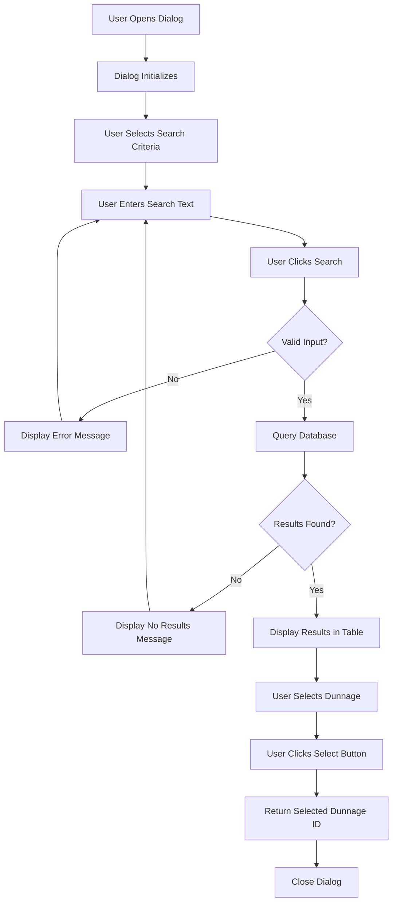

## Key Components

### UI Structure


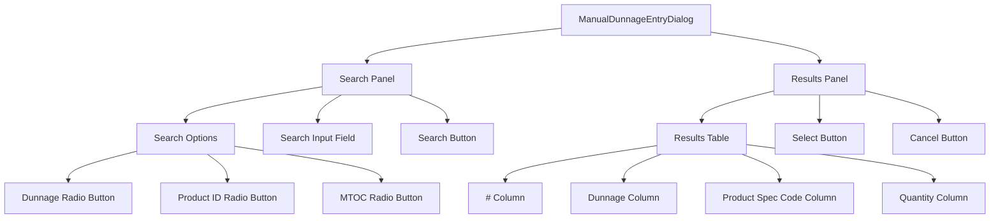

### Component Interactions

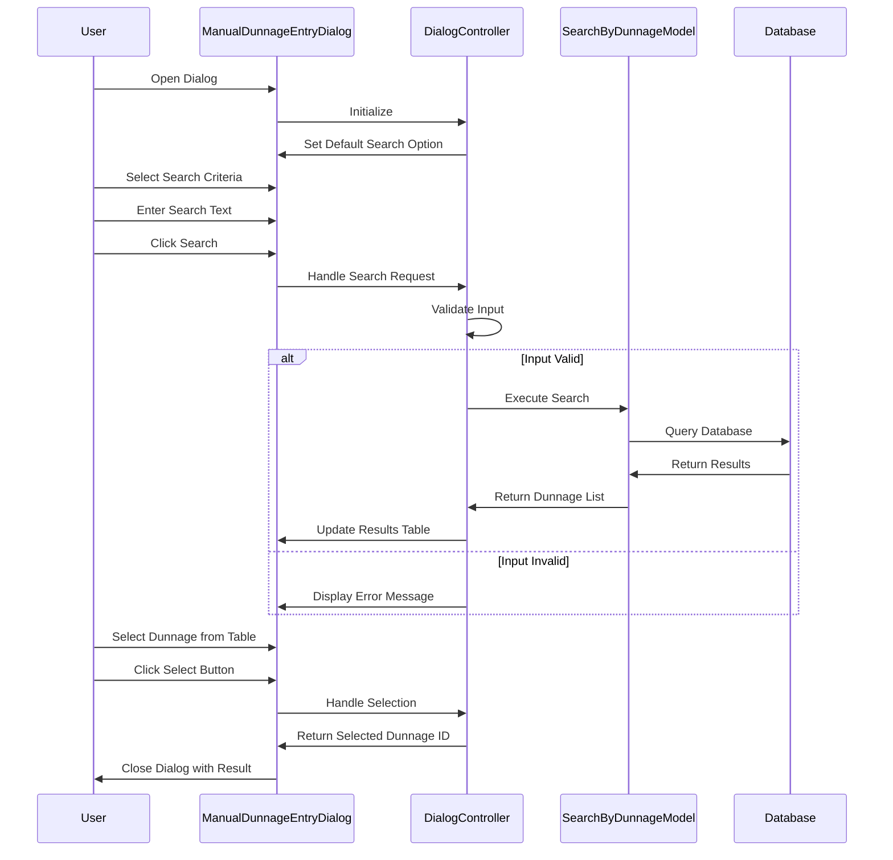

## Database Structure

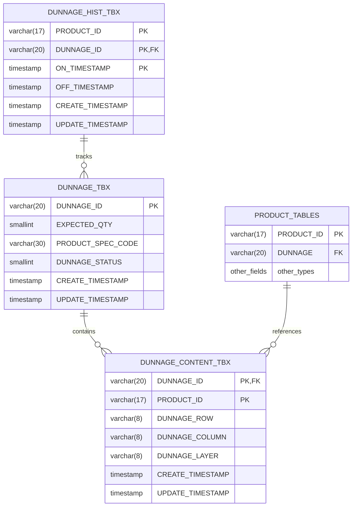

## Search Process Flow


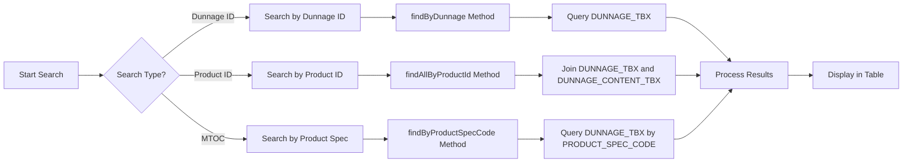

## Integration with Other Components

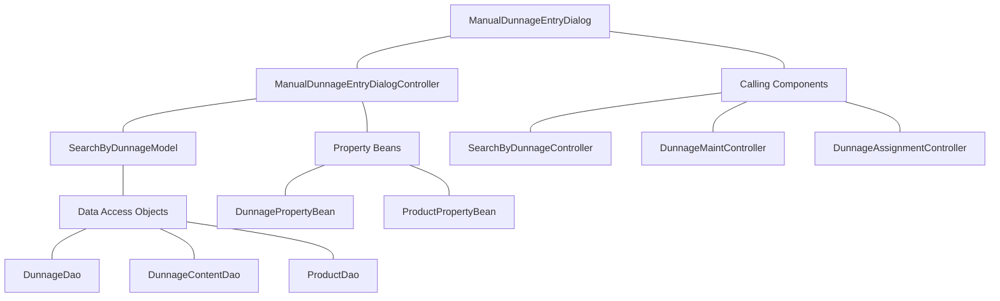

## Configuration Properties Impact

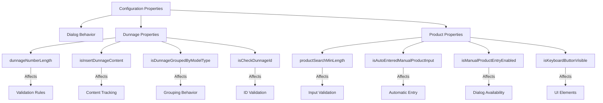

## Example Use Cases

### Case 1: Finding a Dunnage Container by ID

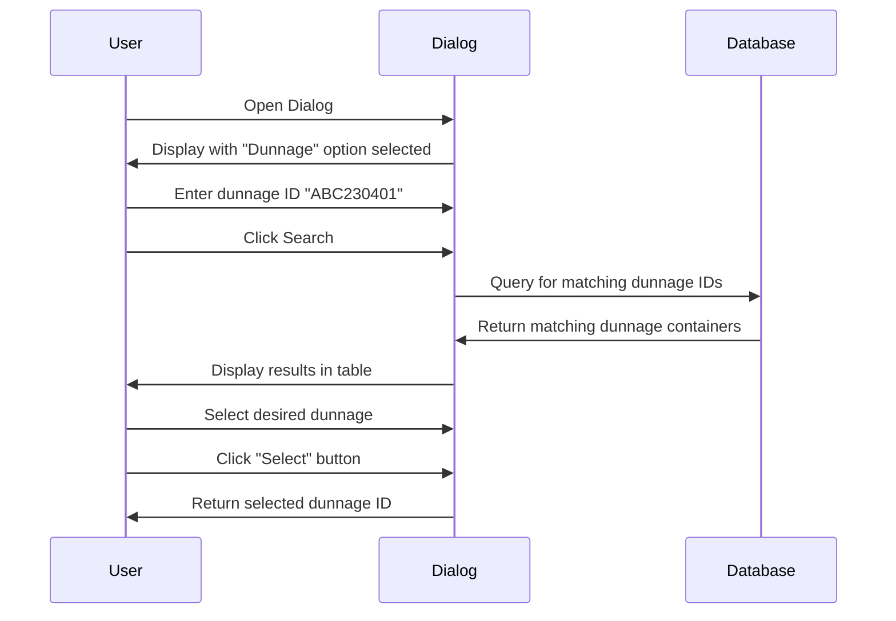

### Case 2: Finding Products in a Dunnage Container

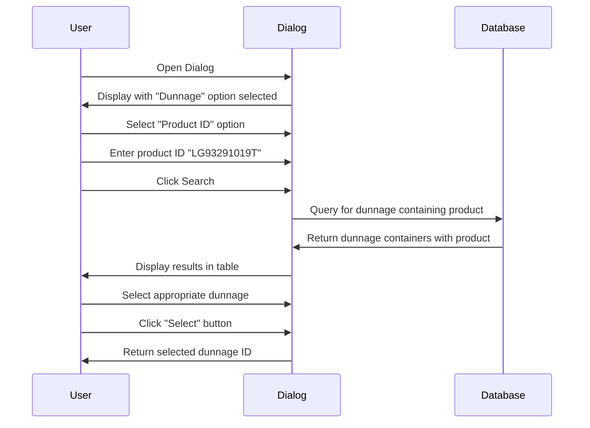

### Case 3: Finding Dunnage by Product Specification


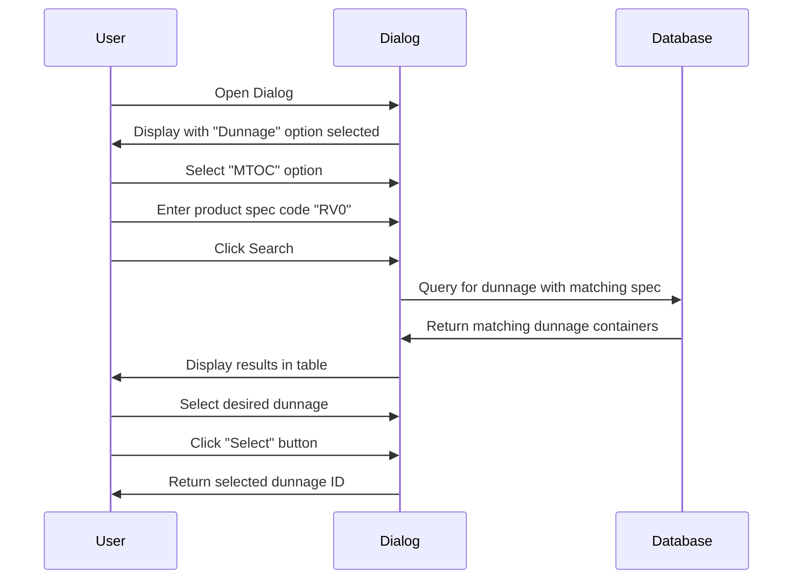

## Troubleshooting Guide


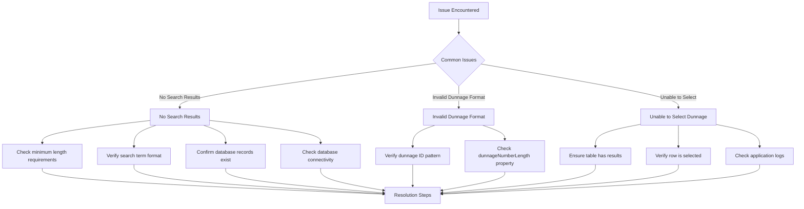

## Conclusion

The ManualDunnageEntryDialog.fxml file and its associated controller provide a critical interface for managing dunnage containers in the GALC system. The dialog enables users to efficiently search for and select dunnage containers using various criteria, supporting manufacturing operations that require dunnage tracking and management.

The dialog's integration with the database and other system components ensures accurate and consistent dunnage information throughout the manufacturing process, contributing to overall production efficiency and quality control.