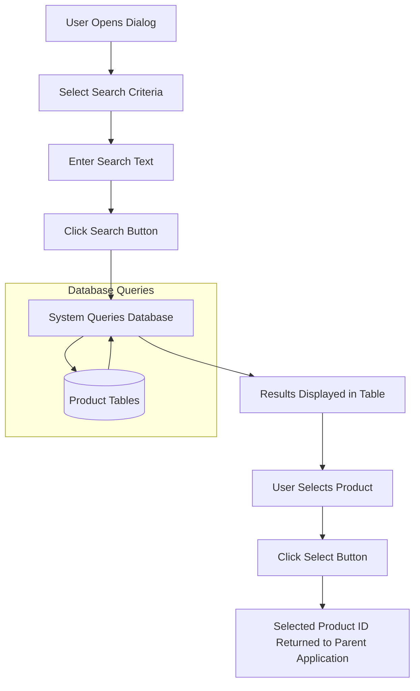
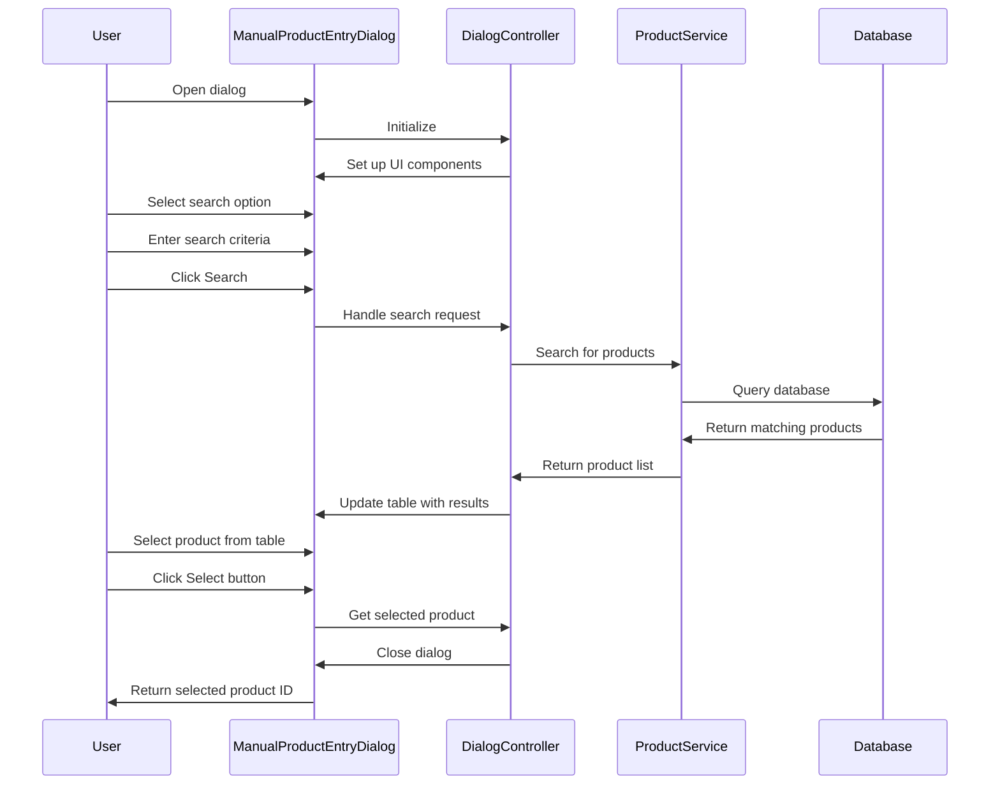
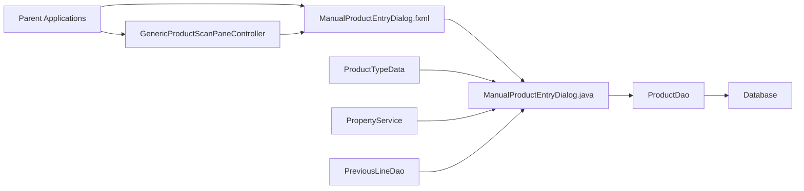
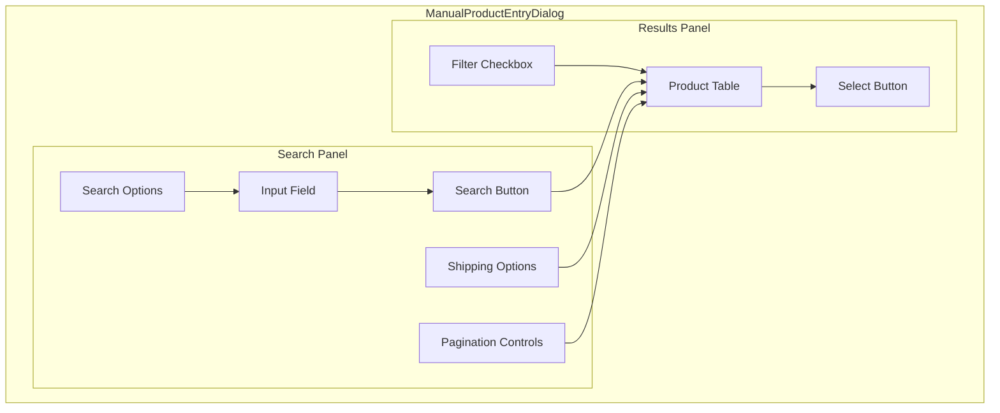

# ManualProductEntryDialog.fxml Documentation

## Purpose

The ManualProductEntryDialog.fxml file defines the user interface for a dialog that allows users to manually search for and select products in the GALC (Global Assembly Line Control) system. This dialog serves as a critical component for various operations where users need to locate specific products by different search criteria such as Product ID, Short VIN, Sequence Number, Production Lot, or Tracking Status.

## How It Works

The dialog is structured as a JavaFX FXML file that creates a split-pane interface with:

1. **Left Panel**: Contains search options and filters that allow users to specify how they want to search for products
2. **Right Panel**: Displays search results in a table view, allowing users to select a product from the results

When a user selects a search option, enters search criteria, and clicks the search button, the system queries the database for matching products and displays them in the table. The user can then select a product from the results to use in the parent application.

## Key Components

### Search Panel (Left Side)

- Search Option Radio Buttons

  : Allow users to select the search method:

  - Product ID
  - Short VIN
  - SEQ Number
  - Production Lot
  - SEQ Range
  - Tracking Status

- **Input Text Field**: For entering search criteria

- **Status Dropdown**: For selecting tracking status when that search option is selected

- **Pagination Controls**: For navigating through multiple pages of results

- **Shipping Option Radio Buttons**: Filter products by shipping status (Shipped/Not Shipped)

### Results Panel (Right Side)

- Product Table

  : Displays search results with columns for:

  - Sequence number
  - AF on Sequence
  - Product ID
  - Machine/Die Cast Serial Numbers (for die cast products)
  - Product Specification Code
  - Production Date
  - Production Lot

- **Filter Checkbox**: Option to show/hide filtered results

- **Select Button**: Confirms selection of a product

## Data Flow



## Workflow



## Database Interactions

The dialog interacts with several database tables through the ProductDao interface:

### Main Tables

- **GALADM.GAL143TBX**: Frame products table
- **GALADM.GAL131TBX**: Engine products table
- **GALADM.MBPN_PRODUCT_TBX**: MBPN products table
- **GALADM.GTS_PRODUCT_TBX**: GTS products table

### Related Tables

- **GALADM.PRODUCT_STATUS_TBX**: Stores product status information
- **GALADM.GAL195TBX**: Line information (for tracking status)
- **GALADM.GAL217TBX**: Production lot information

### Example Queries

When searching by Product ID:

```sql
SELECT p.* FROM GALADM.GAL143TBX p 
WHERE p.PRODUCT_ID LIKE ? 
ORDER BY p.PRODUCT_ID
```

When searching by Tracking Status:

```sql
SELECT p.* FROM GALADM.GAL143TBX p 
WHERE p.TRACKING_STATUS = ? 
ORDER BY p.PRODUCT_ID
```

When searching by Production Lot:

```sql
SELECT p.* FROM GALADM.GAL143TBX p 
WHERE p.PRODUCTION_LOT = ? 
ORDER BY p.PRODUCT_ID
```

## Integration with Other Components



The dialog is used by various components in the system:

1. **GenericProductScanPaneController**: Uses the dialog for manual product entry
2. **MbpnProductChangeController**: Uses the dialog for product selection in MBPN changes
3. **ScanProductPanel**: Uses the dialog for product selection in Hold By Scan functionality

## Configuration Properties

The dialog behavior is controlled by several system properties:

```properties
# Minimum length for search text
product.search.min.length=3

# Number of results per page
product.search.page.size=100

# Whether to filter products by tracking status
product.search.filter.enabled=true

# Background color for filtered products
product.search.filter.background.color=#FFCCCC

# Line IDs that are considered "shipped"
system.product.search.shipped.line.ids=SHIP1,SHIP2
```

## Debugging Steps for Production Issues

### Issue: No Results Found

1. Verify the search criteria is correct and meets minimum length requirements
2. Check if the "Show filtered results" option needs to be enabled
3. Verify the database connection is working
4. Check if the product exists in the database using direct SQL queries
5. Verify the user has appropriate permissions to view the product

### Issue: Incorrect Products Displayed

1. Check if the correct search option is selected
2. Verify if shipping filter is affecting results
3. Check if the product tracking status is being filtered
4. Examine the database directly to confirm product data

### Issue: Performance Problems

1. Check the number of products in the database
2. Verify indexes on search columns
3. Monitor database performance during searches
4. Consider increasing page size or implementing more specific search criteria

## Visual Representation of the Dialog



## Conclusion

The ManualProductEntryDialog.fxml file defines a critical user interface component that allows users to search for and select products in the GALC system. It provides a flexible search interface with multiple search options and filters, making it easier for users to find specific products in a potentially large database. The dialog is integrated with various parts of the application and is configured through system properties to adapt to different environments and requirements.