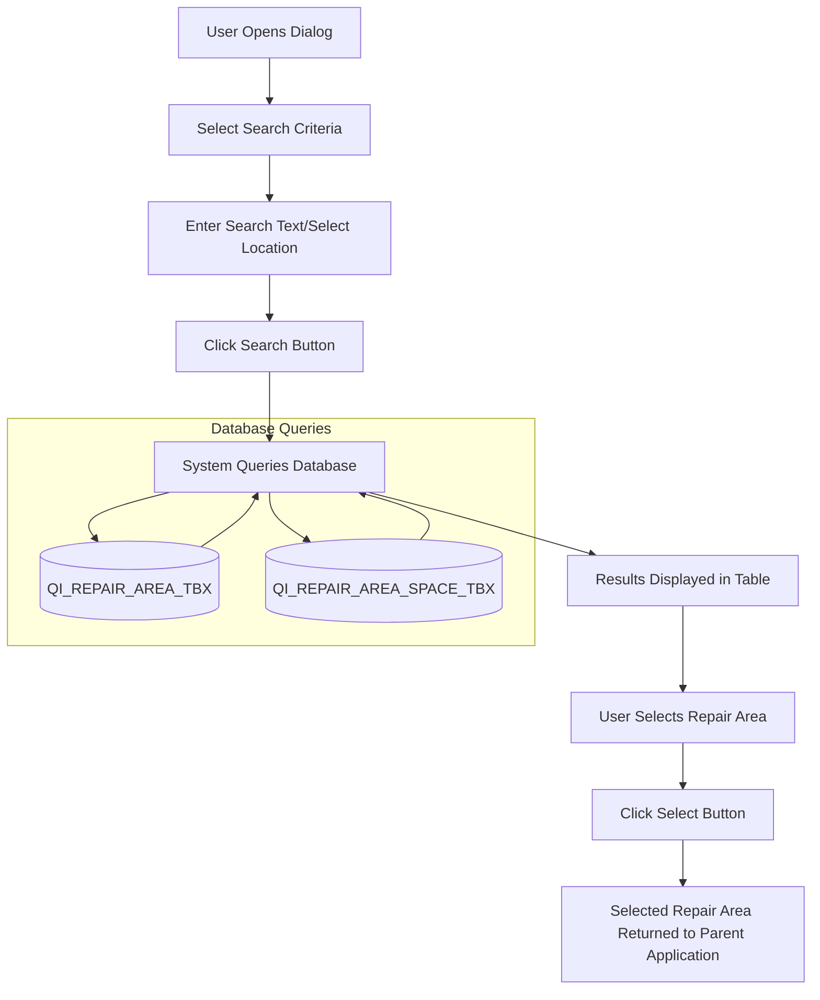
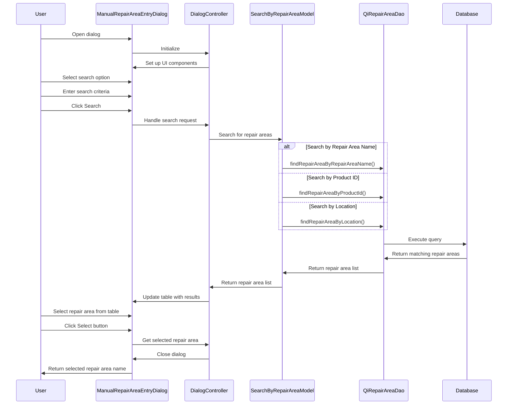
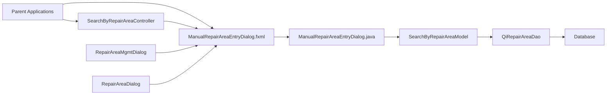
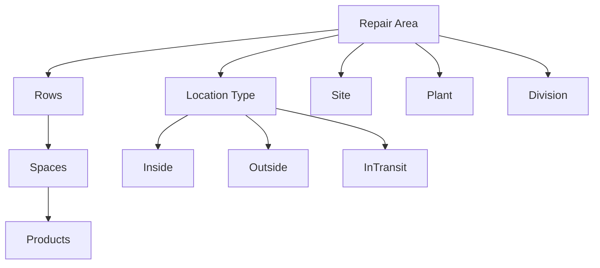
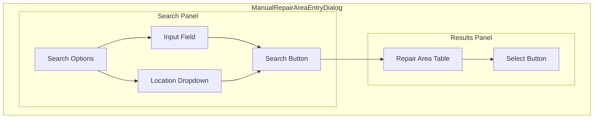

# ManualRepairAreaEntryDialog.fxml Documentation

## Purpose

The ManualRepairAreaEntryDialog.fxml file defines a user interface for a dialog that allows users to search for and select repair areas in the GALC (Global Assembly Line Control) system. This dialog is a critical component for quality inspection and repair workflows, enabling users to locate repair areas by different search criteria such as repair area name, product ID, or location.

## How It Works

The dialog is structured as a JavaFX FXML file that creates a two-panel interface:

1. **Left Panel**: Contains search options and filters that allow users to specify how they want to search for repair areas
2. **Right Panel**: Displays search results in a table view, allowing users to select a repair area from the results

When a user selects a search option, enters search criteria, and clicks the search button, the system queries the database for matching repair areas and displays them in the table. The user can then select a repair area from the results to use in the parent application.

## Key Components

### Search Panel (Left Side)

- Search Option Radio Buttons

  : Allow users to select the search method:

  - Repair Area: Search by repair area name
  - Product ID: Search by product ID that is currently in a repair area
  - Location: Search by location type (Inside, Outside, InTransit)

- **Input Text Field**: For entering search criteria when searching by repair area name or product ID

- **Location Dropdown**: For selecting location type when searching by location

- **Search Button**: Initiates the search based on selected criteria

### Results Panel (Right Side)

- Repair Area Table

  : Displays search results with columns for:

  - Sequence number
  - Repair Area Name
  - Repair Area Description
  - Location (Inside, Outside, InTransit)

- **Select Button**: Confirms selection of a repair area

## Database Interactions

The dialog interacts with several database tables through the QiRepairAreaDao and QiRepairAreaSpaceDao interfaces:

### Main Tables

- GALADM.QI_REPAIR_AREA_TBX

  : Stores repair area information

  - Primary key: REPAIR_AREA_NAME
  - Contains: site name, plant name, repair area description, location, priority, row fill sequence

- GALADM.QI_REPAIR_AREA_ROW_TBX

  : Stores row information for repair areas

  - Primary key: REPAIR_AREA_NAME, REPAIR_AREA_ROW
  - Contains: space fill sequence information

- GALADM.QI_REPAIR_AREA_SPACE_TBX

  : Stores space information within rows of repair areas

  - Primary key: REPAIR_AREA_NAME, REPAIR_AREA_ROW, REPAIR_AREA_SPACE
  - Contains: product ID, defect result ID, active status

### Example Queries

When searching by repair area name:

```sql
SELECT r FROM QiRepairArea r 
WHERE r.siteName = :site 
  AND r.plantName = :plant 
  AND r.divName = :div 
  AND r.repairAreaName LIKE '%searchText%' 
ORDER BY r.repairAreaName
```

When searching by product ID:

```sql
SELECT r.* FROM GALADM.QI_REPAIR_AREA_TBX r 
INNER JOIN GALADM.QI_REPAIR_AREA_SPACE_TBX rs 
  ON r.REPAIR_AREA_NAME = rs.REPAIR_AREA_NAME 
WHERE r.SITE_NAME = ? 
  AND r.PLANT_NAME = ? 
  AND r.DIVISION_NAME = ? 
  AND TRIM(rs.PRODUCT_ID) LIKE ? 
ORDER BY r.REPAIR_AREA_NAME
```

When searching by location:

```sql
SELECT r FROM QiRepairArea r 
WHERE r.siteName = :site 
  AND r.plantName = :plant 
  AND r.divName = :div 
  AND r.location = 'I' 
ORDER BY r.repairAreaName
```

When retrieving products in a repair area:

```sql
SELECT PRODUCT_ID FROM GALADM.QI_REPAIR_AREA_SPACE_TBX 
WHERE REPAIR_AREA_NAME = ? 
  AND ACTIVE = 1 
  AND PRODUCT_ID IS NOT NULL
```

## Data Flow




## Workflow



## Integration with Other Components




The dialog is used by various components in the system:

1. **SearchByRepairAreaController**: Uses the dialog for manual repair area entry in product search workflows
2. **RepairAreaMgmtDialog**: Uses the dialog for repair area management
3. **RepairAreaDialog**: Uses the dialog for repair area configuration

## Configuration Properties

The dialog behavior is controlled by several system properties:

```properties
# Minimum length for search text when searching by repair area name
product.search.min.length=2

# Minimum length for search text when searching by product ID
product.search.min.length=3

# Location types
location.inside=I
location.outside=O
location.intransit=T
```

## Static Properties

The ManualRepairAreaEntryDialog class defines several static properties:

```java
private static final String RESULT_TYPE_NAME = "RepairArea";
private static final String LOCATION_INSIDE = "I - Inside";
private static final String LOCATION_OUTSIDE = "O - Outside";
private static final String LOCATION_INTRANSIT = "T - InTransit";
```

## Repair Area Structure




## Debugging Steps for Production Issues

### Issue: No Results Found

1. Verify the search criteria is correct and meets minimum length requirements
2. Check if the process point ID is valid and has associated site, plant, and division information
3. Verify the database connection is working
4. Check if repair areas exist in the database using direct SQL queries
5. Verify the user has appropriate permissions to view the repair areas

### Issue: Incorrect Repair Areas Displayed

1. Check if the correct search option is selected
2. Verify the process point configuration in the database
3. Check if the repair area location type is being filtered correctly
4. Examine the database directly to confirm repair area data

### Issue: Location Dropdown Not Working

1. Verify the location dropdown is properly populated with the three location types
2. Check if the location selection event handler is properly registered
3. Verify the query for finding repair areas by location is correct
4. Check if repair areas with the selected location exist in the database

## Visual Representation of the Dialog




## Example Usage Scenario

1. A quality inspector needs to find a repair area to assign a defective product
2. The inspector opens the ManualRepairAreaEntryDialog
3. The inspector selects "Repair Area" as the search option
4. The inspector enters "PAINT" in the search field
5. The inspector clicks the Search button
6. The dialog displays all repair areas with "PAINT" in their name
7. The inspector selects "PAINT_BOOTH_1" from the results
8. The inspector clicks the Select button
9. The dialog closes and returns "PAINT_BOOTH_1" to the parent application
10. The parent application uses this repair area to assign the defective product

## Conclusion

The ManualRepairAreaEntryDialog.fxml file defines a critical user interface component that allows users to search for and select repair areas in the GALC system. It provides a flexible search interface with multiple search options, making it easier for users to find specific repair areas in a potentially large database. The dialog is integrated with various parts of the application and is configured through system properties to adapt to different environments and requirements.