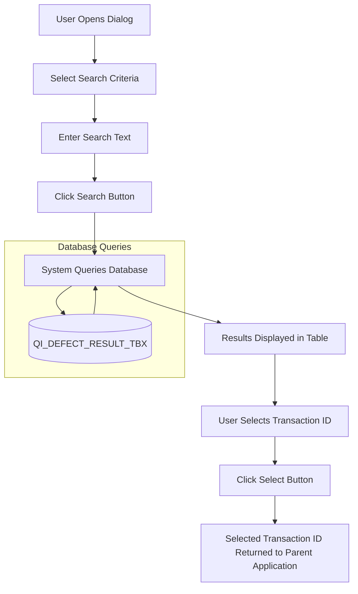
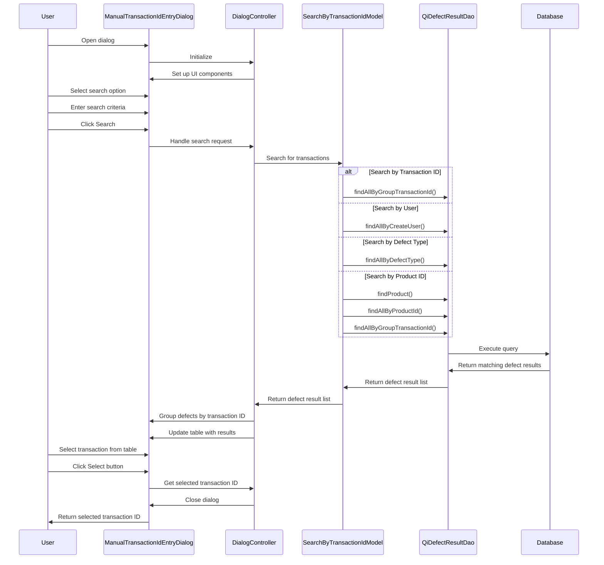
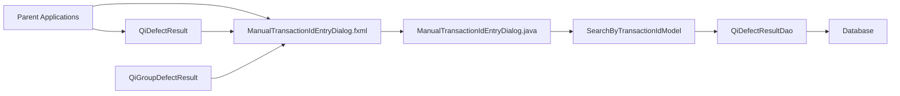
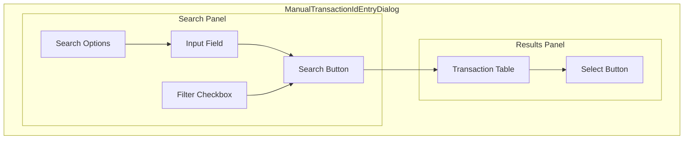
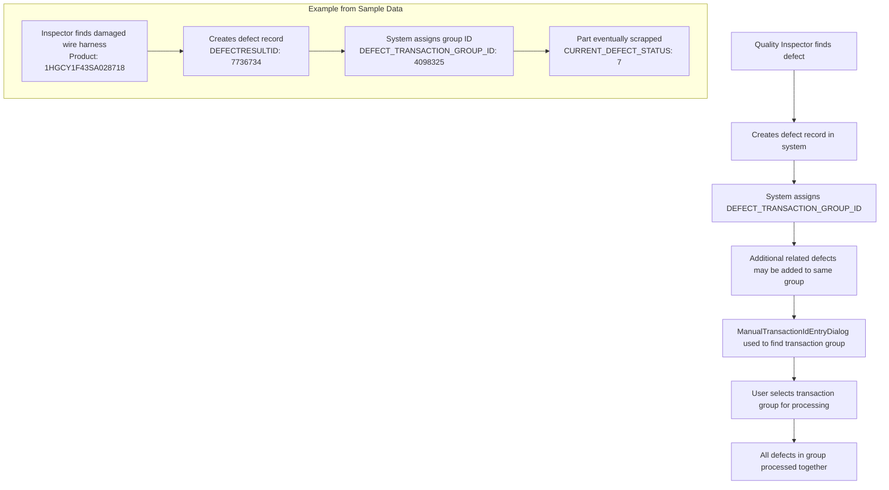

# ManualTransactionIdEntryDialog.fxml Documentation

## Purpose

The ManualTransactionIdEntryDialog.fxml file defines a user interface for a dialog that allows users to search for and select transaction IDs (also called defect transaction group IDs) in the GALC (Global Assembly Line Control) system. This dialog is a critical component for quality inspection and defect management workflows, enabling users to locate groups of related defects by different search criteria such as transaction ID, user, defect type, or product ID.

## How It Works

The dialog is structured as a JavaFX FXML file that creates a two-panel interface:

1. **Left Panel**: Contains search options and filters that allow users to specify how they want to search for transaction IDs
2. **Right Panel**: Displays search results in a table view, allowing users to select a transaction ID from the results

When a user selects a search option, enters search criteria, and clicks the search button, the system queries the database for matching transaction groups and displays them in the table. The user can then select a transaction ID from the results to use in the parent application.

## Key Components

### Search Panel (Left Side)

- Search Option Radio Buttons: Allow users to select the search method:
  - User: Search by the user who created the defect transaction
  - Defect Type: Search by defect type name
  - Trans Id: Search by transaction ID number
  - Product Id: Search by product ID that has defects in a transaction group
- **Input Text Field**: For entering search criteria
- **Filter Checkbox**: Option to "Show Only NOT FIXED Transactions" to filter out completed transactions
- **Search Button**: Initiates the search based on selected criteria

### Results Panel (Right Side)

- Transaction Table: Displays search results with columns for:
  - Sequence number
  - Group Id (transaction ID)
  - Total (count of defects in the group)
  - NPF (No Problem Found count)
  - Fixed (count of fixed defects)
  - Outstanding (count of outstanding defects)
  - Scrapped (count of scrapped parts)
  - Not Fixed Scrapped (count of not fixed but scrapped parts)
  - Defect Type Name
  - Created User
- **Select Button**: Confirms selection of a transaction ID

## Database Interactions

The dialog interacts with several database tables through the QiDefectResultDao interface:

### Main Tables

- GALADM.QI_DEFECT_RESULT_TBX: Stores defect result information
  - Primary key: DEFECTRESULTID
  - Contains: product ID, defect information, responsible departments, defect status, transaction group ID

### Example Queries

When searching by transaction ID:

```sql
SELECT * FROM GALADM.QI_DEFECT_RESULT_TBX 
WHERE DEFECT_TRANSACTION_GROUP_ID = ?
```

When searching by user:

```sql
SELECT * FROM GALADM.QI_DEFECT_RESULT_TBX 
WHERE CREATE_USER = ?
```

When searching by defect type:

```sql
SELECT * FROM GALADM.QI_DEFECT_RESULT_TBX 
WHERE DEFECT_TYPE_NAME = ?
```

When searching by product ID:

```sql
-- First find the product
SELECT * FROM [PRODUCT_TABLE] 
WHERE PRODUCT_ID = ?

-- Then find all defects for that product
SELECT * FROM GALADM.QI_DEFECT_RESULT_TBX 
WHERE PRODUCT_ID = ?

-- Then find all transactions containing those defects
SELECT * FROM GALADM.QI_DEFECT_RESULT_TBX 
WHERE DEFECT_TRANSACTION_GROUP_ID IN 
  (SELECT DEFECT_TRANSACTION_GROUP_ID FROM GALADM.QI_DEFECT_RESULT_TBX 
   WHERE PRODUCT_ID = ?)
```

## Data Flow



## Workflow



## Integration with Other Components



The dialog is used by various components in the system:

1. **Defect Management Screens**: Uses the dialog to select transaction groups for bulk operations
2. **Quality Reports**: Uses the dialog to select transaction groups for reporting
3. **Repair Workflows**: Uses the dialog to select transaction groups for repair operations

## Configuration Properties

The dialog behavior is controlled by several system properties:

```properties
# Minimum length for search text when searching by user, defect type, or product ID
product.search.min.length=3
```

## Static Properties

The ManualTransactionIdEntryDialog class defines several static properties:

```java
private static final String RESULT_TYPE_NAME = "Transcation Id";
```

## QiDefectResult Structure

The QiDefectResult entity represents a defect in the system and contains the following key fields:

- **defectResultId**: Unique identifier for the defect
- **productId**: ID of the product with the defect
- **inspectionPartName**: Name of the part with the defect
- **defectTypeName**: Type of defect
- **currentDefectStatus**: Current status of the defect (0=Outstanding, 1=Fixed, etc.)
- **defectTransactionGroupId**: Group ID that links related defects together
- **createUser**: User who created the defect record

## QiGroupDefectResult Structure

The QiGroupDefectResult class is used to group and count defects by transaction ID:

- **defectTransactionGroupId**: The transaction group ID
- **createUser**: User who created the transaction
- **defectTypeName**: Type of defect
- **totalCount**: Total number of defects in the group
- **outstandingCount**: Number of outstanding defects
- **fixedCount**: Number of fixed defects
- **npfCount**: Number of "No Problem Found" defects
- **scrapCount**: Number of scrapped parts
- **notFixedScrapCount**: Number of not fixed but scrapped parts

## Debugging Steps for Production Issues

### Issue: No Results Found

1. Verify the search criteria is correct and meets minimum length requirements
2. Check if the user has appropriate permissions to view the defect data
3. Verify the database connection is working
4. Check if defects exist in the database using direct SQL queries
5. Verify the filter checkbox is not excluding all results

### Issue: Incorrect Transactions Displayed

1. Check if the correct search option is selected
2. Verify the input text is correctly formatted (especially for transaction ID which must be numeric)
3. Check if the filter checkbox is correctly applied
4. Examine the database directly to confirm transaction data

### Issue: Filter Not Working Correctly

1. Verify the filter checkbox is properly connected to the event handler
2. Check the filtering logic in the createQiGroupDefectResult method
3. Verify the defect status values are correctly interpreted
4. Check if the transaction counts are correctly calculated

## Visual Representation of the Dialog



## Example Usage Scenario

1. A quality inspector needs to find all defects created by a specific user
2. The inspector opens the ManualTransactionIdEntryDialog
3. The inspector selects "User" as the search option
4. The inspector enters "SMITH" in the search field
5. The inspector checks the "Show Only NOT FIXED Transactions" checkbox
6. The inspector clicks the Search button
7. The dialog displays all transaction groups created by SMITH that have outstanding defects
8. The inspector selects transaction ID 12345 from the results
9. The inspector clicks the Select button
10. The dialog closes and returns 12345 to the parent application
11. The parent application uses this transaction ID to retrieve and display all defects in that group

Here's the information formatted in a tabular form:

## Database Schema Details

### QI_DEFECT_RESULT_TBX Table Structure

| Column Name                 | Data Type   | Description                                   |
| --------------------------- | ----------- | --------------------------------------------- |
| DEFECTRESULTID              | BIGINT      | Primary key, unique identifier for the defect |
| PRODUCT_ID                  | VARCHAR(17) | ID of the product with the defect             |
| INSPECTION_PART_NAME        | VARCHAR(32) | Name of the part with the defect              |
| DEFECT_TYPE_NAME            | VARCHAR(45) | Primary defect type                           |
| DEFECT_TYPE_NAME2           | VARCHAR(45) | Secondary defect type                         |
| CURRENT_DEFECT_STATUS       | SMALLINT    | Current status of the defect                  |
| CREATE_USER                 | CHAR(11)    | User who created the defect record            |
| DEFECT_TRANSACTION_GROUP_ID | BIGINT      | Group ID that links related defects           |

### Defect Status Values

| Status ID | Description             |
| --------- | ----------------------- |
| 0         | Outstanding (Not Fixed) |
| 1         | Fixed                   |
| 2         | Scrapped                |
| 3         | NPF (No Problem Found)  |
| 7         | Not Fixed Scrapped      |

## Transaction Group Concept

In the GALC system, defects are often grouped together in "transactions" or "defect transaction groups." This grouping allows for:

1. **Bulk Operations**: Multiple defects can be processed together
2. **Related Defects**: Defects that are related to each other can be linked
3. **Reporting**: Defect statistics can be aggregated by transaction group

The ManualTransactionIdEntryDialog provides a way to search for and select these transaction groups based on various criteria.

## Conclusion

The ManualTransactionIdEntryDialog.fxml file defines a critical user interface component that allows users to search for and select transaction IDs in the GALC system. It provides a flexible search interface with multiple search options, making it easier for users to find specific transaction groups in a potentially large database. The dialog is integrated with various parts of the application and is configured through system properties to adapt to different environments and requirements.


# Analysis of Sample Defect Records

The provided records illustrate actual defect entries from the QI_DEFECT_RESULT_TBX table, which is the primary table queried by the ManualTransactionIdEntryDialog. Let's examine these records to better understand the data structure and relationships.

## Record 1 Analysis:

Copy

Paste

```
DEFECTRESULTID: 7736734
PRODUCT_ID: 1HGCY1F43SA028718 (Honda Accord VIN)
INSPECTION_PART_NAME: WIRE HARN CABIN L
INSPECTION_PART_LOCATION_NAME: 5P
INSPECTION_PART_LOCATION2_NAME: WHITE
INSPECTION_PART2_NAME: FLOOR HARNESS COUPLER
DEFECT_TYPE_NAME: DAMAGED
CURRENT_DEFECT_STATUS: 7 (Not Fixed Scrapped)
CREATE_USER: VC045608
DEFECT_TRANSACTION_GROUP_ID: 4098325
```

## Record 2 Analysis:

Copy

Paste

```
DEFECTRESULTID: 7736735
PRODUCT_ID: 1HGCY1F26SA028601 (Honda Accord VIN)
INSPECTION_PART_NAME: BUMPER FR
INSPECTION_PART_LOCATION_NAME: L UPR
DEFECT_TYPE_NAME: GAP
CURRENT_DEFECT_STATUS: 7 (Not Fixed Scrapped)
CREATE_USER: VC035740
UPDATE_USER: VC026870
DEFECT_TRANSACTION_GROUP_ID: 4098324
```

## Enhanced Understanding of Transaction Groups

Based on these records, we can see that the DEFECT_TRANSACTION_GROUP_ID field is used to group related defects. In the ManualTransactionIdEntryDialog, when a user searches for transaction IDs, they're actually looking for these group IDs.

Let's update our documentation with this real-world context:

## Real-World Example of Transaction Group Search

When using the ManualTransactionIdEntryDialog to search for transaction groups, here's how the process would work with the sample data:

### Scenario 1: Search by Transaction ID

1. User selects "Trans Id" radio button
2. User enters "4098325" in the search field
3. System executes: `SELECT * FROM GALADM.QI_DEFECT_RESULT_TBX WHERE DEFECT_TRANSACTION_GROUP_ID = 4098325`
4. System returns the defect with DEFECTRESULTID 7736734 (and any other defects with the same transaction group ID)
5. The dialog displays a single row in the results table showing:
   - Group Id: 4098325
   - Total: 1 (assuming only one defect in this group)
   - Outstanding: 0
   - Fixed: 0
   - Scrapped: 0
   - Not Fixed Scrapped: 1
   - Defect Type Name: DAMAGED
   - Created User: VC045608

### Scenario 2: Search by User

1. User selects "User" radio button
2. User enters "VC035740" in the search field
3. System executes: `SELECT * FROM GALADM.QI_DEFECT_RESULT_TBX WHERE CREATE_USER = 'VC035740'`
4. System returns the defect with DEFECTRESULTID 7736735
5. The system then groups this result by DEFECT_TRANSACTION_GROUP_ID (4098324)
6. The dialog displays a single row in the results table showing:
   - Group Id: 4098324
   - Total: 1 (assuming only one defect in this group)
   - Outstanding: 0
   - Fixed: 0
   - Scrapped: 0
   - Not Fixed Scrapped: 1
   - Defect Type Name: GAP
   - Created User: VC035740

## Enhanced Database Schema Details

Based on the sample records, we can provide more detailed information about the QI_DEFECT_RESULT_TBX table:

Here's the enhanced table structure formatted in tabular form:

### QI_DEFECT_RESULT_TBX Table Structure (Enhanced)

| Column Name                    | Example Value         | Description                                   |
| ------------------------------ | --------------------- | --------------------------------------------- |
| DEFECTRESULTID                 | 7736734               | Primary key, unique identifier for the defect |
| PRODUCT_ID                     | 1HGCY1F43SA028718     | Vehicle Identification Number (VIN)           |
| INSPECTION_PART_NAME           | WIRE HARN CABIN L     | Name of the part with the defect              |
| INSPECTION_PART_LOCATION_NAME  | 5P                    | Primary location of the defect                |
| INSPECTION_PART_LOCATION2_NAME | WHITE                 | Secondary location detail                     |
| INSPECTION_PART2_NAME          | FLOOR HARNESS COUPLER | Related part information                      |
| DEFECT_TYPE_NAME               | DAMAGED               | Primary defect type                           |
| DEFECT_TYPE_NAME2              | (null)                | Secondary defect type                         |
| APPLICATION_ID                 | AAF1OF1PQ0111         | Process point identifier                      |
| RESPONSIBLE_DEPT               | AF                    | Department responsible for the defect         |
| ENTRY_DEPT                     | AAF1                  | Department that entered the defect            |
| ACTUAL_TIMESTAMP               | 2025-04-08 07:44:19   | When the defect was recorded                  |
| CURRENT_DEFECT_STATUS          | 7                     | Not Fixed Scrapped status                     |
| CREATE_USER                    | VC045608              | User ID who created the record                |
| DEFECT_TRANSACTION_GROUP_ID    | 4098325               | Group ID linking related defects              |

## Defect Status Values (Confirmed from Sample Data)

| Status ID | Description        | Example                                                      |
| --------- | ------------------ | ------------------------------------------------------------ |
| 7         | Not Fixed Scrapped | Both sample records show parts that were scrapped without being fixed |

## Transaction Group Workflow with Real Data




## Practical Application in Manufacturing

In a real manufacturing environment like Honda's assembly line, the ManualTransactionIdEntryDialog would be used in scenarios such as:

1. **Shift Handover**: A team leader at shift change needs to find all outstanding defects created by a specific inspector to follow up on them.
2. **Quality Audit**: A quality auditor needs to review all defects of a specific type (e.g., "GAP") to identify potential systemic issues in the manufacturing process.
3. **Repair Planning**: A repair area supervisor needs to find all transaction groups with outstanding defects to allocate resources for repair work.
4. **Production Analysis**: A production analyst needs to track defect trends by searching for transaction groups created within a specific timeframe.

## Debugging Real-World Issues

Based on the sample data, here are some specific debugging steps for common issues:

### Issue: Defects Not Showing in Search Results

1. Check if the defect's CURRENT_DEFECT_STATUS is 7 (Not Fixed Scrapped) and the "Show Only NOT FIXED Transactions" filter is applied
2. Verify the CREATE_USER value matches exactly what was entered in the search field (e.g., "VC045608")
3. Check if the DEFECT_TRANSACTION_GROUP_ID exists in the database
4. Verify the user has permissions to view defects from the specific ENTRY_DEPT (e.g., "AAF1")

### Issue: Incorrect Defect Counts in Results

1. Verify the logic in QiGroupDefectResult.updateCounts() correctly handles status 7 (Not Fixed Scrapped)
2. Check if multiple defects with the same DEFECT_TRANSACTION_GROUP_ID have different statuses
3. Verify the filtering logic in ManualTransactionIdEntryDialog.handle() correctly processes the defect counts

This real-world data provides valuable context for understanding how the ManualTransactionIdEntryDialog functions in Honda's manufacturing environment and how it helps manage quality control processes on the assembly line.