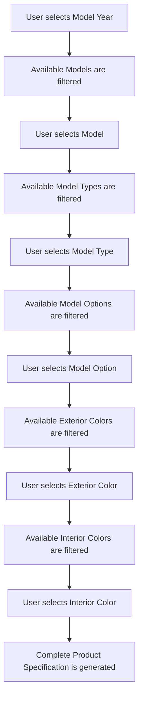
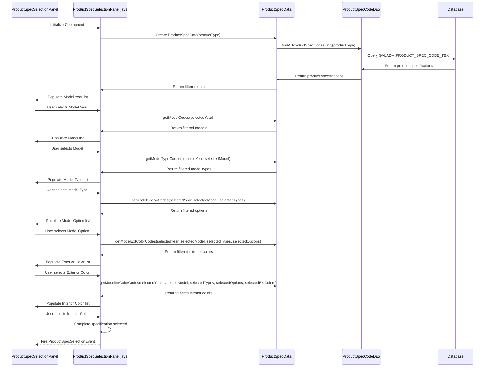
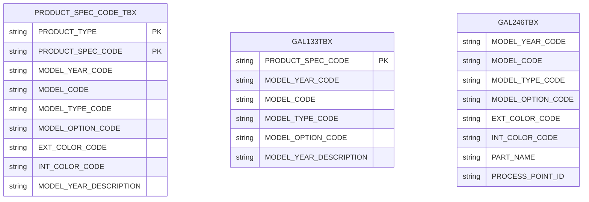
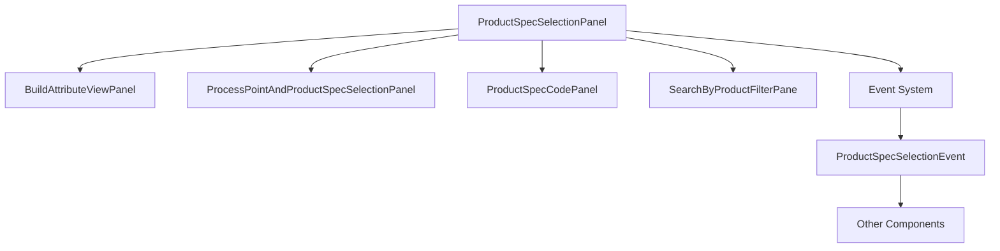
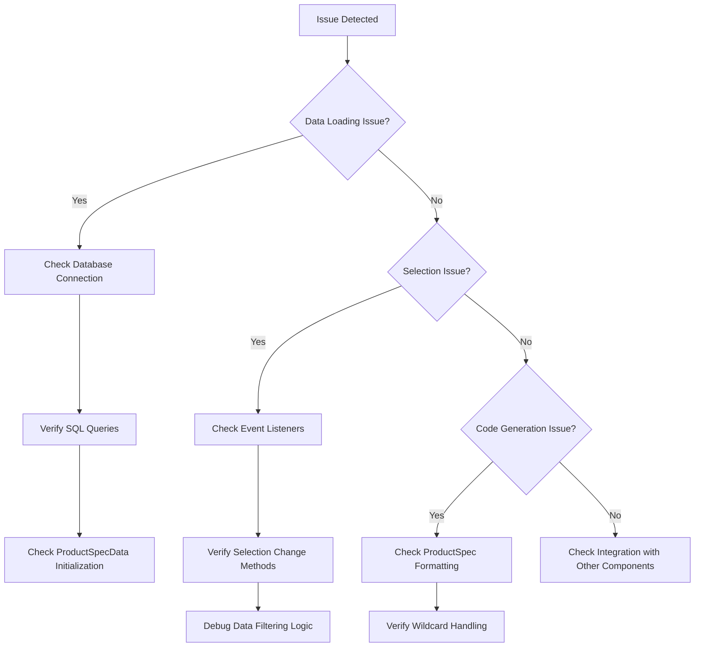
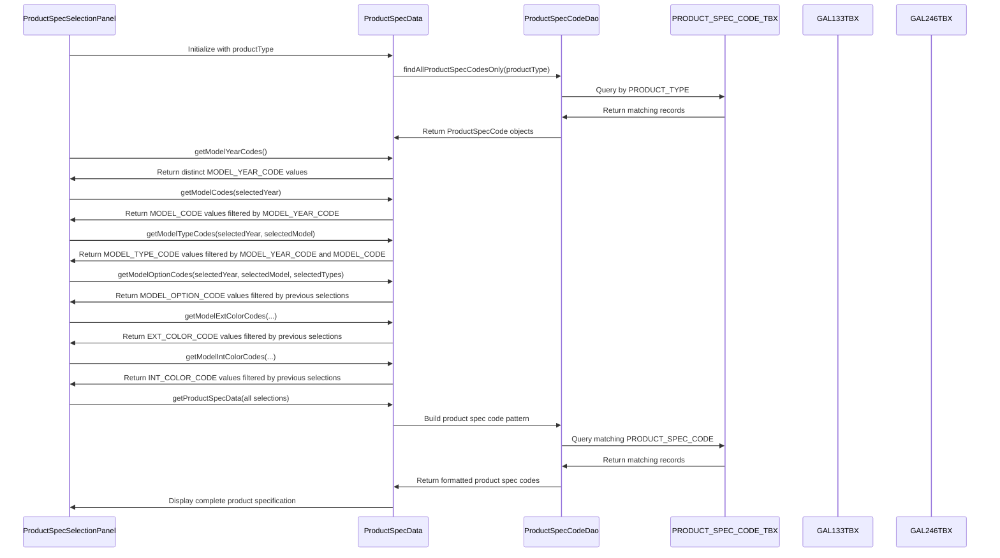
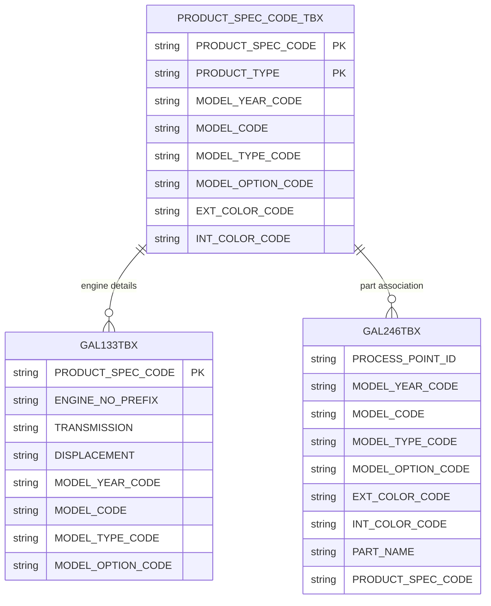

# ProductSpecSelectionPanel.fxml Documentation

## Purpose

The ProductSpecSelectionPanel.fxml is a JavaFX user interface component that provides a hierarchical selection interface for product specifications in the GALC (Global Assembly Line Control) system. It allows users to filter and select vehicle specifications by navigating through a series of cascading selection lists including:

1. Model Year
2. Model Code
3. Model Type
4. Model Option
5. Exterior Color
6. Interior Color

This component is critical for operations that require identifying specific vehicle configurations, such as quality control, part association, build attribute management, and production tracking.

## How It Works

The ProductSpecSelectionPanel operates on a cascading filter pattern where each selection narrows down the available options in subsequent lists. The component is designed to work with the Honda vehicle specification system, which uses a hierarchical structure to define vehicle configurations.




### Data Flow




## Key Components

### FXML Structure

The ProductSpecSelectionPanel.fxml file defines a GridPane layout with 6 columns and 4 rows. The main components are:

1. **ListView Controls**: Six ListView components for selecting different aspects of the product specification:
   - `modelYearCodeList`: For selecting the model year
   - `modelCodeList`: For selecting the model
   - `modelTypeCodeList`: For selecting the model type
   - `modelOptionCodeList`: For selecting model options
   - `modelExtColorCodeList`: For selecting exterior color
   - `modelIntColorCodeList`: For selecting interior color
2. **Label Controls**: Six LoggedLabel components that provide headers for each ListView:
   - `modelYearCodeLabel`: "Year"
   - `modelCodeLabel`: "Model"
   - `modelTypeCodeLabel`: "Model Type"
   - `modelOptionCodeLabel`: "Model Option"
   - `modelExtColorCodeLabel`: "Ext Color"
   - `modelIntColorCodeLabel`: "Int Color"

### Controller Class

The ProductSpecSelectionPanel.java controller class manages the interaction between the UI and the data. Key methods include:

1. **Initialization Methods**:
   - `initComponent()`: Loads the FXML file and initializes the UI
   - `addSelectionListeners()`: Adds change listeners to all ListViews
2. **Selection Change Handlers**:
   - `modelYearCodeChanged()`: Updates model codes when year selection changes
   - `modelCodeChanged()`: Updates model types when model selection changes
   - `modelTypeCodeChanged()`: Updates model options when type selection changes
   - `modelOptionCodeChanged()`: Updates exterior colors when option selection changes
   - `modelExtColorCodeChanged()`: Updates interior colors when exterior color selection changes
   - `modelIntColorCodeChanged()`: Handles interior color selection
3. **Data Retrieval Methods**:
   - `getSelectedModelYearCode()`, `getSelectedModelCode()`, etc.: Retrieve selected values
   - `buildSelectedProductSpecCodes()`: Builds a complete product specification code based on selections

## Database Interactions

The component interacts with the database through the ProductSpecData class, which uses the ProductSpecCodeDao to query the GALADM.PRODUCT_SPEC_CODE_TBX table.

### Database Tables



### Example Queries

1. **Retrieving all product specifications for a product type**:

```sql
SELECT * FROM GALADM.PRODUCT_SPEC_CODE_TBX WHERE PRODUCT_TYPE = ?
```

1. **Retrieving model codes for a specific year**:

```sql
SELECT DISTINCT MODEL_CODE FROM GALADM.PRODUCT_SPEC_CODE_TBX 
WHERE PRODUCT_TYPE = ? AND MODEL_YEAR_CODE = ?
```

1. **Updating a product specification code**:

```sql
UPDATE GALADM.PRODUCT_SPEC_CODE_TBX 
SET PRODUCT_SPEC_CODE = ? 
WHERE (PRODUCT_TYPE = ? AND PRODUCT_SPEC_CODE = ?)
```

## Integration with Other Components

The ProductSpecSelectionPanel integrates with several other components in the GALC system:



### Event Communication

The panel communicates with other components through the EventBus system, publishing ProductSpecSelectionEvent events when selections change. Other components can subscribe to these events to react to product specification changes.

Events include:

- `SelectionEvent.SELECTING`: When a selection is in progress
- `SelectionEvent.POPULATED`: When data is populated
- `SelectionEvent.SELECTED`: When a complete selection is made

## Application Properties

The component uses application properties for configuration:

```properties
# Example application properties
SITE_NAME=MAL
BUILD_ATTRIBUTE_RESULTSET_MAX_SIZE=1000
```

These properties can be accessed through:

```java
ApplicationPropertyBean propertyBean = PropertyService.getPropertyBean(ApplicationPropertyBean.class, applicationId);
```

## Debugging Steps for Production Issues

### Common Issues and Solutions

1. **No data appears in selection lists**
   - Check if the ProductSpecData is properly initialized with the correct product type
   - Verify database connectivity and that the PRODUCT_SPEC_CODE_TBX table contains data
   - Check for errors in the console log
2. **Selection cascading not working properly**
   - Verify that selection change listeners are properly registered
   - Check if the data filtering logic in ProductSpecData is working correctly
   - Inspect the data returned from the database queries
3. **Incorrect product specification codes generated**
   - Check the padding and formatting logic in the ProductSpec class
   - Verify that wildcard handling is working correctly
   - Ensure that the buildSelectedProductSpecCodes method is using the correct parameters

### Debugging Flow



## Practical Examples

### Example 1: Selecting a Specific Vehicle Configuration

1. Select model year "2" (2022)
2. Select model "CRV" (CR-V)
3. Select model type "EXL" (EX-L Trim)
4. Select model option "2WD" (Two-Wheel Drive)
5. Select exterior color "NH830M" (Crystal Black Pearl)
6. Select interior color "BK" (Black)

The system will generate a product specification code like: `2CRV EXL2WD NH830M BK`

### Example 2: Using Wildcards for Broader Searches

1. Select model year "2" (2022)
2. Select model "CRV" (CR-V)
3. Select model type "*" (Any Trim)
4. Select model option "*" (Any Drive Type)
5. Select exterior color "*" (Any Exterior Color)
6. Select interior color "*" (Any Interior Color)

The system will generate a product specification code pattern like: `2CRV%` which can be used to match all 2022 CR-V vehicles regardless of trim, drive type, or color.

## Conclusion

The ProductSpecSelectionPanel is a critical component in the GALC system that enables users to precisely select vehicle specifications through a hierarchical selection interface. It integrates with the database to provide real-time filtering of available options and generates standardized product specification codes that are used throughout the system for vehicle identification and tracking.


# Enhanced ProductSpecSelectionPanel Documentation

## Database Structure

The ProductSpecSelectionPanel interacts with several key database tables that store product specification information:

Here's the information formatted in tabular form:

### 1. PRODUCT_SPEC_CODE_TBX

This is the primary table that stores product specification codes and their component parts:

| Column Name            | Description                                  | Example             |
| ---------------------- | -------------------------------------------- | ------------------- |
| PRODUCT_SPEC_CODE      | The complete product specification code      | 8R44AA100           |
| PRODUCT_TYPE           | The type of product (e.g., ENGINE, FRAME)    | ENGINE              |
| MODEL_YEAR_CODE        | Code representing the model year             | 8                   |
| MODEL_CODE             | Code representing the model                  | R44                 |
| MODEL_TYPE_CODE        | Code representing the model type/trim        | AA1                 |
| MODEL_OPTION_CODE      | Code representing model options              | 00                  |
| EXT_COLOR_CODE         | Code representing exterior color             | NH883P              |
| INT_COLOR_CODE         | Code representing interior color             | A                   |
| MODEL_YEAR_DESCRIPTION | Human-readable description of the model year | 2008                |
| CREATE_TIMESTAMP       | When the record was created                  | 2016-06-10 10:53:32 |
| UPDATE_TIMESTAMP       | When the record was last updated             | 2025-04-19 02:51:35 |

### 2. GAL133TBX

This table contains detailed engine specifications:

| Column Name              | Description                                  | Example            |
| ------------------------ | -------------------------------------------- | ------------------ |
| PRODUCT_SPEC_CODE        | The complete product specification code      | 8R44AA100          |
| ENGINE_NO_PREFIX         | Engine number prefix                         | K24Z2              |
| TRANSMISSION             | Transmission type code                       | MT                 |
| TRANSMISSION_DESCRIPTION | Human-readable transmission description      | MANUAL             |
| GEAR_SHIFT               | Number of gears                              | 5                  |
| GEAR_SHIFT_DESCRIPTION   | Description of gear configuration            | (5AT/5MT/CVT/ECVT) |
| DISPLACEMENT             | Engine displacement in cc                    | 02400              |
| DISPLACEMENT_COMMENT     | Additional engine information                | DOHC VTEC          |
| ENGINE_PROTOTYPE_CODE    | Engine prototype code                        | A                  |
| PLANT_CODE               | Manufacturing plant code                     | MAP                |
| MODEL_YEAR_CODE          | Code representing the model year             | 8                  |
| MODEL_CODE               | Code representing the model                  | R44                |
| MODEL_TYPE_CODE          | Code representing the model type/trim        | AA1                |
| MODEL_OPTION_CODE        | Code representing model options              | 00                 |
| MODEL_YEAR_DESCRIPTION   | Human-readable description of the model year | 2008               |

### 3. GAL246TBX

This table maps product specifications to parts and process points:

| Column Name             | Description                                | Example             |
| ----------------------- | ------------------------------------------ | ------------------- |
| PROCESS_POINT_ID        | Identifier for a specific process point    | AAF1EX6P00301       |
| MODEL_YEAR_CODE         | Code representing the model year           | K                   |
| MODEL_CODE              | Code representing the model                | TPD                 |
| MODEL_TYPE_CODE         | Code representing the model type/trim      | AA5                 |
| MODEL_OPTION_CODE       | Code representing model options            | *                   |
| INT_COLOR_CODE          | Code representing interior color           | A                   |
| EXT_COLOR_CODE          | Code representing exterior color           | NH883P              |
| PART_NAME               | Name of the part                           | 00X30 OWNERS MANUAL |
| SEQUENCE_NUMBER         | Order sequence for installation            | 3                   |
| VERIFICATION_FLAG       | Whether verification is required           | 1                   |
| SERIAL_NUMBER_SCAN_FLAG | Whether serial number scanning is required | 1                   |
| PRODUCT_SPEC_CODE       | The complete product specification code    | KTPDAA5 NH883P A    |

## Data Flow with Database Tables

The ProductSpecSelectionPanel interacts with these tables through the following process:




## Example Data Scenarios

### Example 1: Engine Specification Selection

When selecting an engine specification:

1. User selects model year "8" (2008)
2. The system queries PRODUCT_SPEC_CODE_TBX and finds models like "R44"
3. User selects model "R44"
4. The system queries for model types and finds "AA1" and "AA6"
5. User selects model type "AA1"
6. The system queries for model options and finds "00"
7. User selects model option "00"

The resulting product specification code is "8R44AA100", which corresponds to:

- A 2008 model year vehicle
- With a K24Z2 engine
- Manual transmission (MT)
- 5-speed
- 2400cc DOHC VTEC engine

### Example 2: Part Association with Product Specifications

The GAL246TBX table shows how parts are associated with product specifications:

For the product specification "KTPDAA5 NH883P A":

- Process point: AAF1EX6P00301
- Part: 00X30 OWNERS MANUAL
- The part requires verification (VERIFICATION_FLAG = 1)
- The part requires serial number scanning (SERIAL_NUMBER_SCAN_FLAG = 1)

This means that at process point AAF1EX6P00301, vehicles matching the specification KTPDAA5 NH883P A should have the owner's manual installed and verified.

## Wildcard Usage in Database Queries

The system supports wildcards in product specification selection:

1. The asterisk (*) in the MODEL_OPTION_CODE column of GAL246TBX indicates that the rule applies to all option codes for that model/type combination.

2. When users select "*" in the UI, the system generates SQL queries with wildcards:

   ```sql
   -- Example query when user selects model year "8" and model "R44" but uses wildcards for the rest
   SELECT * FROM PRODUCT_SPEC_CODE_TBX 
   WHERE PRODUCT_TYPE = 'ENGINE' 
   AND MODEL_YEAR_CODE = '8' 
   AND MODEL_CODE = 'R44'
   ```

3. The ProductSpecData class handles these wildcards by building appropriate SQL patterns:

   ```java
   // When a wildcard is selected for MODEL_TYPE_CODE
   String specCode = modelYearCode + ProductSpec.padModelCode(modelCode);
   specCodes.add(specCode + "%");
   ```

## Database Relationships



## Practical Applications

### Production Line Configuration

The ProductSpecSelectionPanel is used to configure production line processes by:

1. Selecting the specific vehicle configuration
2. Identifying which parts should be installed (from GAL246TBX)
3. Determining verification requirements for each part
4. Setting up scanning requirements for serial numbers

### Quality Control

Quality inspectors use the panel to:

1. Select the vehicle being inspected
2. Retrieve the correct specifications from GAL133TBX
3. Verify that the installed components match the expected configuration
4. Document any deviations from the specification

### Inventory Management

Inventory managers use the panel to:

1. Forecast part requirements by analyzing the distribution of product specifications
2. Ensure adequate stock of parts for upcoming production runs
3. Track part usage against specific vehicle configurations

## Troubleshooting Database-Related Issues

### Issue: Missing Options in Selection Lists

**Possible Causes:**

- Data missing from PRODUCT_SPEC_CODE_TBX
- Incorrect PRODUCT_TYPE parameter
- Filtering logic error in ProductSpecData

**Verification Steps:**

1. Check if the data exists in the database:

   ```sql
   SELECT COUNT(*) FROM PRODUCT_SPEC_CODE_TBX WHERE PRODUCT_TYPE = 'ENGINE';
   ```

2. Verify the product type being passed to ProductSpecData

3. Check the filtering logic in methods like getModelCodes()

### Issue: Incorrect Product Specification Code Generation

**Possible Causes:**

- Padding functions in ProductSpec class not working correctly
- Wildcard handling issues
- Data format inconsistencies in the database

**Verification Steps:**

1. Check the padding functions:

   ```java
   // Example padding function
   public static String padModelCode(String modelCode) {
       // Should pad to correct length
   }
   ```

2. Verify wildcard handling in getProductSpecData method

3. Check for inconsistent data formats in PRODUCT_SPEC_CODE_TBX

## Conclusion

The ProductSpecSelectionPanel is a sophisticated component that provides a user-friendly interface for navigating the complex product specification system at Honda. By leveraging the structured data in PRODUCT_SPEC_CODE_TBX, GAL133TBX, and GAL246TBX, it enables precise selection of vehicle configurations and facilitates numerous downstream processes in manufacturing, quality control, and inventory management.

The component's design reflects Honda's hierarchical approach to vehicle specification, where each level of selection (year, model, type, option, colors) progressively narrows the scope until a unique or targeted set of specifications is identified. This approach aligns perfectly with the database structure, where each column in PRODUCT_SPEC_CODE_TBX represents one level in the selection hierarchy.