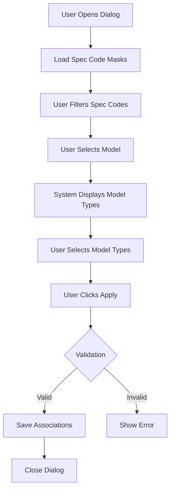
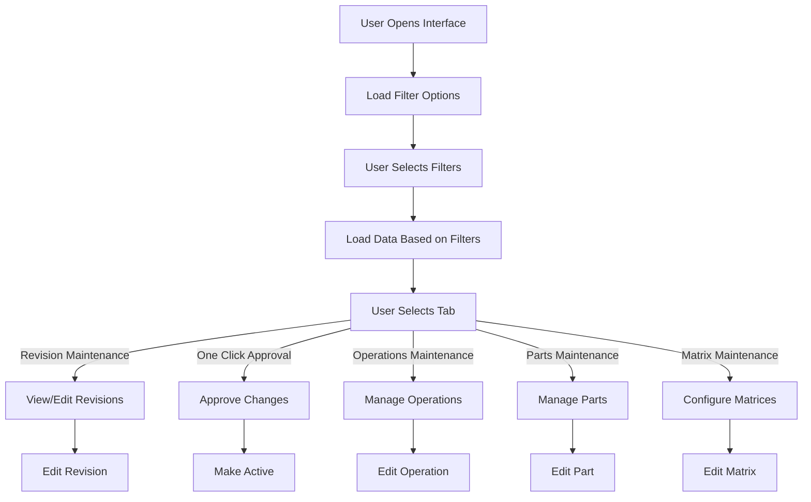
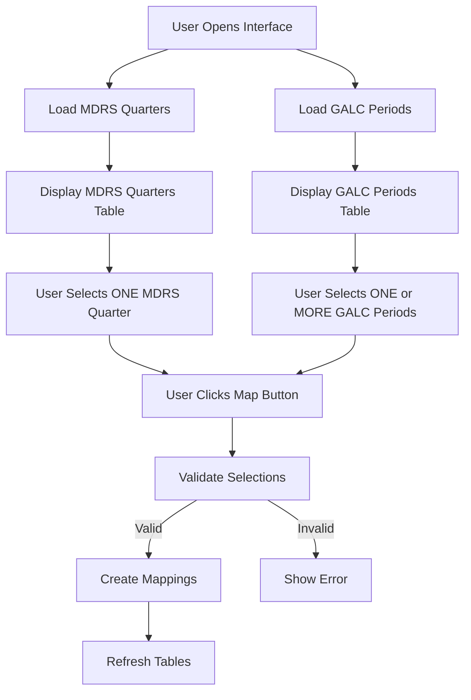

# GALC Client Interface Documentation

## 1. AddEditSpecCodeMask.fxml

### Purpose

The AddEditSpecCodeMask.fxml file defines a dialog interface used for adding or editing product specification code masks in the GALC system. This interface allows users to map product specification codes to operations and parts, which is essential for manufacturing control and tracking.

### How It Works

This dialog provides a way to select and filter specification code masks and associate them with specific models and model types. The workflow follows these steps:

1. Users can search for existing spec code masks using the text field
2. Users select a model from the dropdown list
3. The system displays available model types for the selected model in a grid layout
4. Users can select one or more model types to associate with the spec code mask
5. Upon applying, the system saves the associations to the database

### Key Components

Here's a structured table for the additional components, their types, and purposes:

## Additional Interface Components

| Component               | Type       | Purpose                                                  |
| ----------------------- | ---------- | -------------------------------------------------------- |
| `specCodeMasksListView` | ListView   | Displays available specification code masks              |
| `specCodeTextField`     | TextField  | Allows filtering of spec code masks                      |
| `modelsComboBox`        | ChoiceBox  | Dropdown for selecting a model                           |
| `gridScrollPane`        | ScrollPane | Container for the dynamically generated model types grid |
| `applyButton`           | Button     | Saves the selected associations                          |
| `selectAll`             | Button     | Selects all model types                                  |
| `deselectAll`           | Button     | Deselects all model types                                |

### Interactions

The AddEditSpecCodeMask dialog interacts with several components:

- **Database Tables**: Accesses product specification codes and operation matrices
- **Controller Class**: `AddEditSpecCodeMask.java` handles all the logic
- **Related Components**: Works with `PddaPlatformMatrixMaintTable` for matrix maintenance

### Database Interactions

- Reads from:
  - `PreProductionLotDao` to fetch distinct spec codes by plan code
- Writes to:
  - `MCOperationMatrixDao` to save operation matrix associations
  - `MCOperationPartMatrixDao` to save part matrix associations

### Visual Representation

### Example Usage

A team leader might use this dialog when:

1. Setting up a new manufacturing process
2. Modifying existing spec code associations
3. Creating mappings for new model types

### Debugging Steps

1. Check if spec code masks are loading properly in the list view
2. Verify model selection is populating the model types grid
3. Ensure the filter functionality is working correctly
4. Confirm database connections are active
5. Verify permissions for database write operations

## 2. MfgMaintFXMLPane.fxml

### Purpose

The MfgMaintFXMLPane.fxml file defines the main manufacturing maintenance interface in the GALC system. This comprehensive screen allows team leaders to manage revisions, change forms, operations, parts, and matrix configurations for manufacturing processes.

### How It Works

This interface serves as a central hub for manufacturing control maintenance with multiple tabs for different aspects of the manufacturing process. Users can:

1. Select plant, department, model year, production rate, line number, and VMC
2. View and manage revisions and change forms
3. Approve changes through a one-click approval process
4. Maintain operations, parts, and their associated matrices
5. Configure spec code masks and their relationships to manufacturing processes

### Key Components

Here's a structured table for the additional components, their types, and purposes:

## Maintenance Interface Components

| Component              | Type                 | Purpose                                                    |
| ---------------------- | -------------------- | ---------------------------------------------------------- |
| Filter Section         | HBox with ComboBoxes | Allows selection of plant, department, model year, etc.    |
| `mainTabPane`          | TabPane              | Contains multiple tabs for different maintenance functions |
| `revisionsTblView`     | TableView            | Displays revision information                              |
| `chngFormsTblView`     | TableView            | Shows change forms                                         |
| `newchngFormsTblView`  | TableView            | Displays new change forms                                  |
| `opRevTblView`         | TableView            | Lists operation revisions                                  |
| `opPartTblView`        | TableView            | Shows operation parts                                      |
| `opMatrixTblView`      | TableView            | Displays operation matrices                                |
| `partMaintTblView`     | TableView            | Lists parts for maintenance                                |
| `partMatrixTblView`    | TableView            | Shows part matrices                                        |
| `measurementsTblView`  | TableView            | Displays measurements                                      |
| `specCodeUnitsTblView` | TableView            | Shows spec code units                                      |
| `platformMMTblView`    | TableView            | Lists platform information                                 |

### Interactions

The MfgMaintFXMLPane interacts with numerous components:

- **Controller Class**: `MfgMaintFXMLPane.java` handles the complex logic
- **Related Tables**: Works with multiple table handlers like `MCRevisionsTable`, `PartsMaintenanceTable`, etc.
- **Dialog Components**: Opens dialogs like `AddEditSpecCodeMask` and `MeasurementWizard`

### Database Interactions

This interface interacts with numerous database tables:

- Reads from:
  - `MCRevisionDao` for revision data
  - `ChangeFormDao` for change forms
  - `MCOperationRevisionDao` for operations
  - `MCOperationPartRevisionDao` for parts
  - `MCMeasurementDao` for measurements
  - `MCPddaPlatformDao` for platform data
- Writes to:
  - `MCRevisionDao` for updating revisions
  - `ComponentStatusDao` for status changes
  - Multiple other DAOs for their respective entities

### Visual Representation

### Example Usage

A manufacturing team leader might use this interface to:

1. Review and approve pending changes to manufacturing processes
2. Update operation specifications based on engineering changes
3. Modify part requirements for specific models
4. Configure measurement parameters for quality control
5. Map spec codes to operations for new product lines

### Debugging Steps

1. Check filter selections are properly loading related data
2. Verify tab navigation is working correctly
3. Confirm table data is refreshing when filters change
4. Check database connections for each table
5. Verify permissions for approval actions
6. Monitor performance with large datasets
7. Check for proper error handling when operations fail

## 3. MdrsQuarterMappingPane.fxml

### Purpose

The MdrsQuarterMappingPane.fxml file defines an interface for mapping MDRS (Manufacturing Data Reporting System) quarters to GALC (Global Assembly Line Control) periods. This mapping is crucial for aligning production scheduling between these two systems.

### How It Works

This interface presents two side-by-side tables showing MDRS quarters and GALC periods. Users can:

1. View available MDRS quarters with their associated line, department, shift, and quarter information
2. View available GALC periods with their line, department, shift, period, and label information
3. Select one MDRS quarter and one or more GALC periods
4. Create mappings between the selected items using the Map button

### Key Components

Here's a structured table for the components, their types, and purposes:

## Interface Components

| Component           | Type       | Purpose                                                 |
| ------------------- | ---------- | ------------------------------------------------------- |
| `mdrsQuartersTable` | TableView  | Displays MDRS quarters with selection capability        |
| `galcPeriodsTable`  | TableView  | Shows GALC periods with selection capability            |
| `mapButton`         | Button     | Creates mappings between selected items                 |
| `scrollPane`        | ScrollPane | Contains the entire interface with scrolling capability |

### Interactions

The MdrsQuarterMappingPane interacts with:

- **Controller Class**: `MdrsQuarterMappingPane.java` handles the mapping logic
- **Related Services**: Works with MDRS and GALC period services
- **Parent Component**: Managed by `MdrsQuarterMappingMaintenance`

### Database Interactions

- Reads from:
  - `MCMdrsPeriodDao` to fetch MDRS quarter data
  - `DailyDepartmentScheduleDao` to fetch GALC period data
- Writes to:
  - `MCMdrsManpowerAssignmentDao` to save mappings between quarters and periods

### Visual Representation

### Example Usage

A production scheduler might use this interface to:

1. Align MDRS quarterly production plans with GALC daily/period schedules
2. Update mappings when production schedules change
3. Ensure proper resource allocation between planning systems
4. Synchronize reporting periods between systems

### Debugging Steps

1. Verify both tables are loading data correctly
2. Check selection functionality in both tables
3. Confirm the Map button is properly enabled/disabled based on selections
4. Verify mapping creation in the database
5. Check for proper error handling when mappings already exist
6. Monitor performance with large datasets

## Integration Within the Project

These three interfaces are part of the team leader functionality in the GALC system, which is responsible for manufacturing control and production management. They work together to provide a comprehensive solution:

1. **MfgMaintFXMLPane** serves as the main hub for manufacturing maintenance
2. **AddEditSpecCodeMask** provides specialized functionality for spec code mapping
3. **MdrsQuarterMappingPane** handles integration with the MDRS system

Together, these interfaces allow team leaders to:

- Configure and maintain manufacturing processes
- Map product specifications to operations and parts
- Align production scheduling between different systems
- Approve and implement changes to manufacturing processes

The overall workflow typically involves:

1. Setting up basic manufacturing configurations in MfgMaintFXMLPane
2. Configuring detailed spec code mappings using AddEditSpecCodeMask
3. Aligning production schedules using MdrsQuarterMappingPane

This integrated approach ensures consistent manufacturing control across the production environment.

## Static Properties and Application Configuration

The interfaces rely on several static properties and configuration settings:

1. **Database Connection Properties**:
   - JDBC connection strings for accessing the GALC database
   - Connection pool settings for optimal performance
2. **Application Properties**:
   - `PropertyService.getPartMaskWildcardFormat()` - Defines the format for part mask wildcards
   - Logging configuration for tracking user actions
   - UI theme and appearance settings
3. **Business Logic Properties**:
   - Revision status codes (e.g., `RevisionStatus.ACTIVE`, `RevisionStatus.PENDING`)
   - Process point configurations
   - Plant and department codes

## Common Production Issues and Solutions

Here's a structured table for the issues, possible causes, and solutions:

## Troubleshooting Guide

| Issue                                 | Possible Cause                       | Solution                                                     |
| ------------------------------------- | ------------------------------------ | ------------------------------------------------------------ |
| Spec code masks not appearing         | Database connection issue            | Check database connectivity and permissions                  |
| Model types not displaying            | Missing model-model type mappings    | Verify data in the model-model type tables                   |
| Mapping button disabled               | Invalid selection state              | Ensure exactly one MDRS quarter and at least one GALC period are selected |
| Changes not saving                    | Transaction failure                  | Check database logs for transaction errors                   |
| Slow table loading                    | Large dataset or inefficient queries | Optimize queries or implement pagination                     |
| Approval process hanging              | Job running state issues             | Check the approval job status in the database                |
| Filter combinations returning no data | Invalid filter combination           | Verify the selected combination exists in the database       |

By understanding these interfaces and their interactions, users can effectively manage manufacturing processes in the GALC system, troubleshoot issues, and ensure smooth production operations.