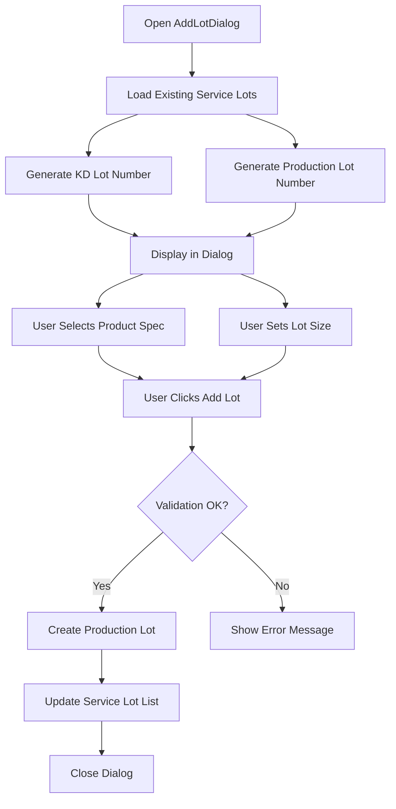
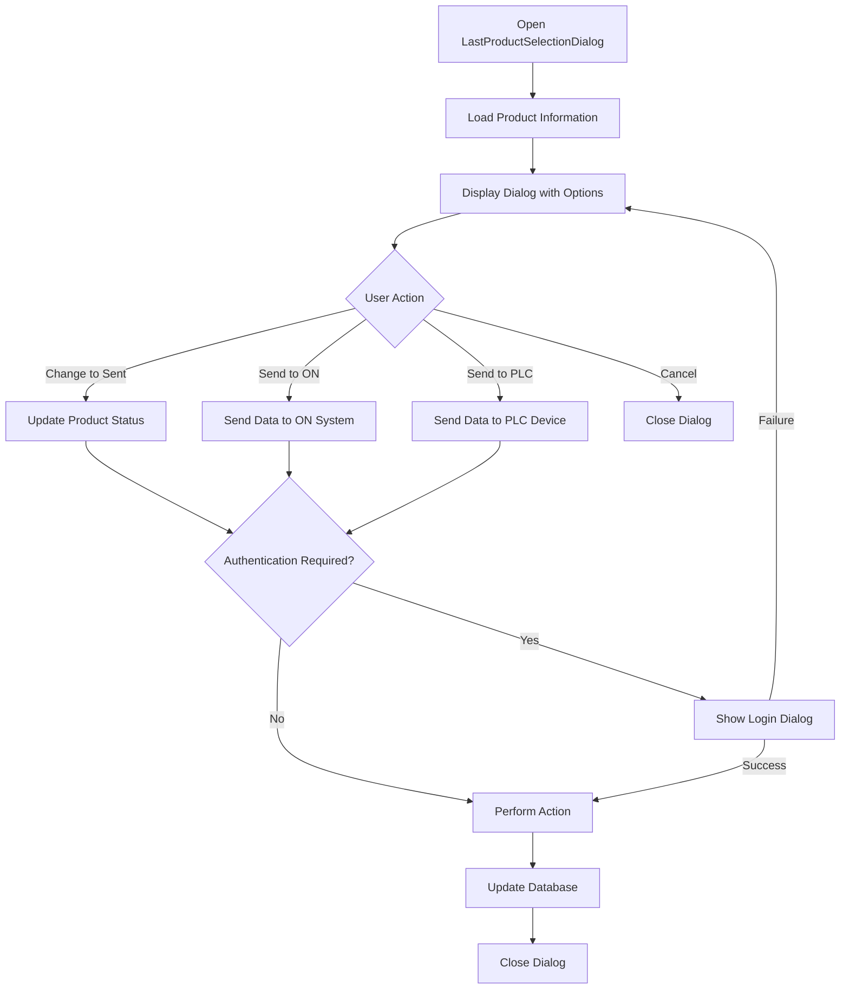
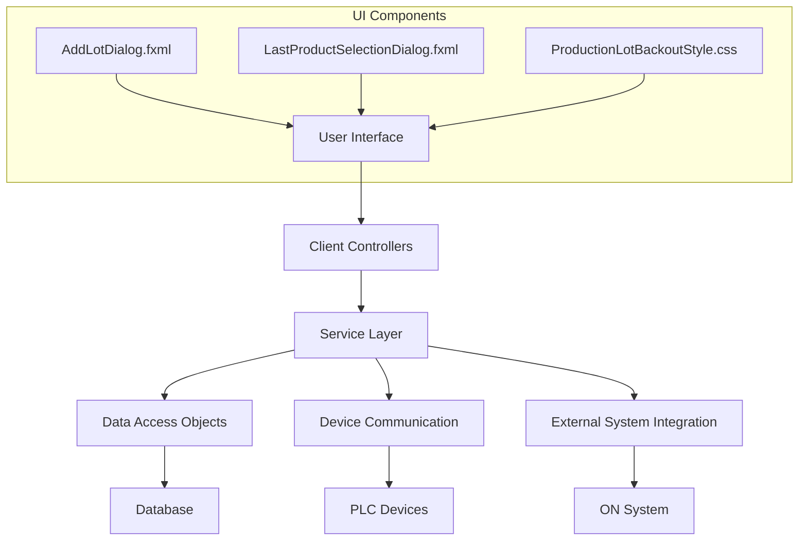
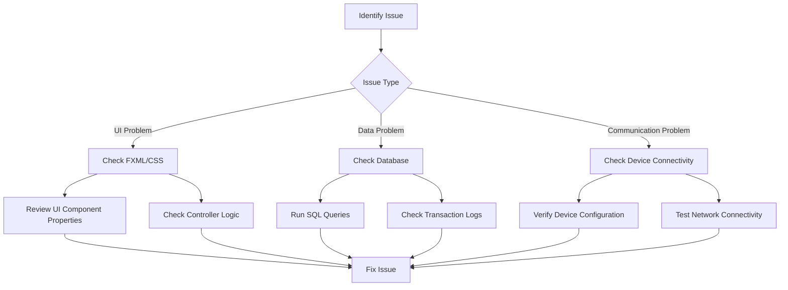

# Comprehensive Analysis of GALC Client Schedule Files

## 1. AddLotDialog.fxml

### Purpose

The `AddLotDialog.fxml` file defines the user interface for adding new production lots to the GALC (Global Assembly Line Control) system. This dialog allows users to create service lots with specific KD (Knocked Down) lot numbers, production lot numbers, and lot sizes.

### How It Works

The dialog is structured as a split pane with two main sections:

1. **Lot Input Panel** - The upper section where users input lot details
2. **Service Lot Panel** - The lower section that displays existing service lots

When opened, the dialog:

1. Loads existing service lot data
2. Calculates the next available KD lot and production lot numbers
3. Allows users to select product specifications
4. Provides controls to set lot size
5. Enables creation of new service lots

### Key Components

| Component | Type | Purpose | |-----------|------|---------| | `scheduleMainSplitPane` | SplitPane | Divides the dialog into two sections | | `inputLotPane` | TitledPane | Contains lot input controls | | `serviceLotPane` | TitledPane | Displays existing service lots | | `kdLotTxtField` | TextField | Displays the next KD lot number | | `prodLotTxtField` | TextField | Displays the next production lot number | | `lotSizeSlider` | Slider | Allows selection of lot size (1-30) | | `currentKdLotCheckbox` | CheckBox | Option to use current KD lot | | `addLotButton` | Button | Triggers lot creation |

### Interactions

- **Controller**: `AddLotDialog.java` in the `com.honda.galc.client.schedule` package
- Data Flow:
  1. Dialog loads existing service lots from the database
  2. User selects product specifications and lot size
  3. System generates KD lot and production lot numbers
  4. On submission, creates new production lot records

### Database Interactions

- Tables:
  - `PRODUCTION_LOT` - Stores lot information
  - `PRODUCT` - Stores product information related to lots
- Operations:
  - READ: Retrieves existing service lots
  - CREATE: Inserts new production lot records

### Static Properties

- `STANDARD_KD_LOT_SIZE = 30` - Maximum standard lot size
- `SERVICE_LOT_PREFIX = "INT 01"` - Prefix for service lot numbers

### Example Usage

```
// Example of creating a new service lot
1. Open AddLotDialog
2. Select product specification "KNUCKLE-A123"
3. Set lot size to 10 using slider
4. Click "Add Lot" button
5. System creates new lot with auto-generated KD and production lot numbers
```

### Visual Representation



## 2. LastProductSelectionDialog.fxml

### Purpose

The `LastProductSelectionDialog.fxml` file defines the user interface for managing the last products in a production lot. It allows users to change product status, send products to the ON (Online) system, and send product information to PLC (Programmable Logic Controller) devices.

### How It Works

This dialog presents a grid-based layout with action buttons for managing product status. It's primarily used at the end of production processes to:

1. Change product status to "Sent"
2. Send product information to the ON system
3. Send product information to PLC devices
4. Cancel operations

### Key Components

Here's a structured table for the components, their types, and purposes:

## Components Overview

| Component          | Type     | Purpose                                |
| ------------------ | -------- | -------------------------------------- |
| `mainGridPane`     | GridPane | Main container for all dialog elements |
| `upperButtonPanel` | HBox     | Contains status change buttons         |
| `lowerButtonPanel` | HBox     | Contains send and cancel buttons       |
| `changeSentButton` | Button   | Changes product status to "Sent"       |
| `sendOnButton`     | Button   | Sends product information to ON system |
| `sendPlcButton`    | Button   | Sends product information to PLC       |
| `cancelButton`     | Button   | Closes dialog without action           |

### Interactions

- **Controller**: `LastProductSelectionDialog.java` in the `com.honda.galc.client.schedule` package
- Data Flow:
  1. Dialog loads with selected product information
  2. User selects an action (change status, send to ON, send to PLC)
  3. System performs the selected action
  4. Updates product status in database

### Database Interactions

- Tables:
  - `PRODUCT_HISTORY` - Records product status changes
  - `PRODUCT_STAMPING_SEQUENCE` - Manages product stamping information
- Operations:
  - READ: Retrieves product information
  - UPDATE: Updates product status
  - CREATE: Creates new history records

### Static Properties

- Authentication requirements for actions are controlled by application properties:
  - `requireAuthForChangeToSent` - Controls authentication for status changes
  - `requireAuthForSendToOn` - Controls authentication for ON system operations
  - `showSendToPlcButton` - Controls visibility of PLC button

### Example Usage

```
// Example of sending product to ON system
1. Select product from production schedule
2. Open LastProductSelectionDialog
3. Click "Send to ON" button
4. Authenticate if required
5. System updates product status and sends data to ON system
```

### Visual Representation



## 3. ProductionLotBackoutStyle.css

### Purpose

The `ProductionLotBackoutStyle.css` file defines the visual styling for the Production Lot Backout functionality in the GALC system. It controls the appearance of tables used to display production lots that can be backed out (removed) from the system.

### How It Works

This CSS file applies styling to JavaFX TableView components and their child elements. It sets:

1. Background colors
2. Font sizes
3. Cell alignment
4. Border styling

The styling creates a clean, readable interface for viewing production lot information in the backout panel.

### Key Components

Here's a structured table for the CSS selectors, their properties, and purposes:

## CSS Selectors Overview

| Selector                            | Properties                  | Purpose                    |
| ----------------------------------- | --------------------------- | -------------------------- |
| `.table-view`                       | Background, font, borders   | Base styling for the table |
| `.table-view .column-header`        | Background color            | Styling for column headers |
| `.table-view .column-header .label` | Alignment, background, font | Styling for header labels  |
| `.table-view .table-row-cell`       | Alignment, background       | Styling for table rows     |

### Interactions

- **Used by**: `ProductionLotBackoutPanel.java` in the `com.honda.galc.client.teamleader.schedule.backout` package
- **Applied to**: TableView components displaying production lot information for backout operations

### Visual Properties

- **Color Scheme**: Light gray background (`rgb(244,244,244)`)
- **Typography**: 16px font size
- **Layout**: Left-aligned content
- **Borders**: Transparent cell borders for a cleaner look

### Example Usage

```java
// Example of applying the CSS to a TableView
TableView<ProductionLotBackoutDTO> table = new TableView<>();
table.getStylesheets().add(this.getClass().getResource(
    "/resource/com/honda/galc/client/schedule/backout/ProductionLotBackoutStyle.css"
).toExternalForm());
```

### Visual Representation

```
┌─────────────────────────────────────────────┐
│ Column Header 1 │ Column Header 2 │ Header 3│
├─────────────────┼─────────────────┼─────────┤
│ Data Cell       │ Data Cell       │ Data    │
├─────────────────┼─────────────────┼─────────┤
│ Data Cell       │ Data Cell       │ Data    │
├─────────────────┼─────────────────┼─────────┤
│ Data Cell       │ Data Cell       │ Data    │
└─────────────────┴─────────────────┴─────────┘
```

## Integration Within the GALC Project

### System Architecture

The GALC (Global Assembly Line Control) system uses a client-server architecture with:

1. **Client Components**:
   - JavaFX UI (analyzed files are part of this)
   - Swing UI (legacy components)
   - Client controllers
2. **Server Components**:
   - Data services
   - Device communication services
   - Business logic
3. **External Systems**:
   - ON system (online production system)
   - PLC devices (factory floor equipment)
   - Database (stores all production data)

### Data Flow Diagram



## Debugging Production Issues

### Common Issues and Solutions

#### 1. Service Lot Creation Failure

**Symptoms**:

- Error message: "Could not create service lot"
- No new lot appears in the system

**Debugging Steps**:

1. Check product specification selection (must include interior color code)
2. Verify PART_NUMBER build attribute exists for the selected product spec
3. Check database connection and permissions
4. Review application logs for SQL errors

**Solution Example**:

```
// Check build attributes for product spec
SELECT * FROM BUILD_ATTRIBUTE 
WHERE PRODUCT_SPEC_CODE = '[selected_code]' 
AND ATTRIBUTE_NAME = 'PART_NUMBER';
```

#### 2. PLC Communication Failure

**Symptoms**:

- "Failed to send to PLC" error
- PLC device doesn't receive product information

**Debugging Steps**:

1. Verify PLC device ID in application properties
2. Check network connectivity to PLC device
3. Ensure device manager service is running
4. Review communication logs

**Solution Example**:

```
// Check device configuration
SELECT * FROM DEVICE_CONFIG 
WHERE DEVICE_ID = '[configured_device_id]';
```

#### 3. Product Status Update Issues

**Symptoms**:

- Product status doesn't change after "Change to Sent" action
- Database error messages

**Debugging Steps**:

1. Check user permissions
2. Verify product exists in correct state
3. Review database transaction logs
4. Check for database locks or conflicts

**Solution Example**:

```
// Check current product status
SELECT * FROM PRODUCT_HISTORY 
WHERE PRODUCT_ID = '[product_id]' 
ORDER BY HISTORY_DATE DESC;
```

### Visual Debugging Flow




## Conclusion

The analyzed files are critical components of the GALC client application's scheduling functionality. They provide interfaces for:

1. **Adding new production lots** (`AddLotDialog.fxml`)
2. **Managing product status and communication** (`LastProductSelectionDialog.fxml`)
3. **Styling the production lot backout interface** (`ProductionLotBackoutStyle.css`)

These components work together to enable efficient production scheduling, tracking, and management in the manufacturing environment. The UI is designed to be clean and functional, with clear separation between different operations and intuitive controls for users.

Understanding these files and their interactions is essential for maintaining and extending the GALC system, as well as for troubleshooting production issues that may arise during operation.