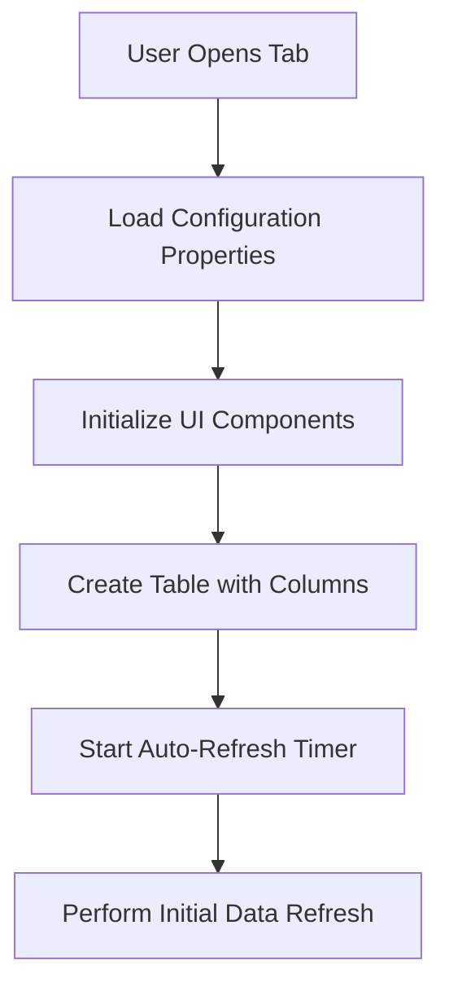
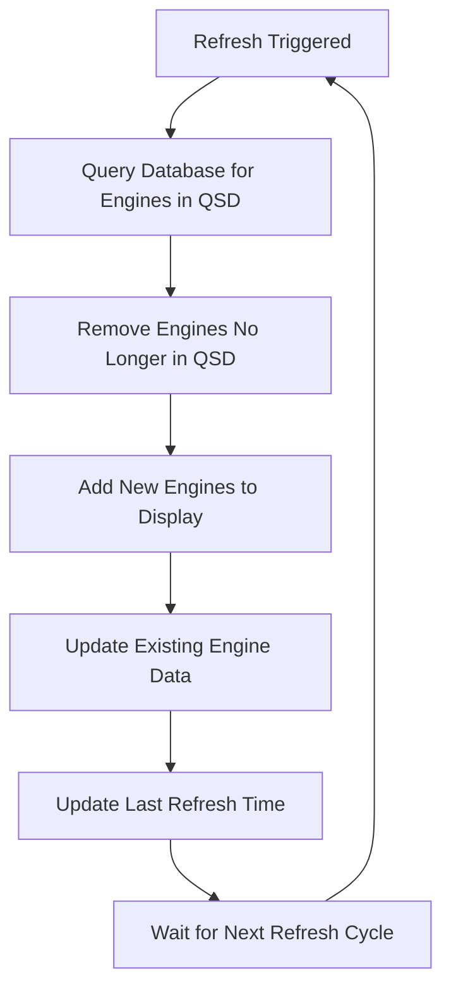
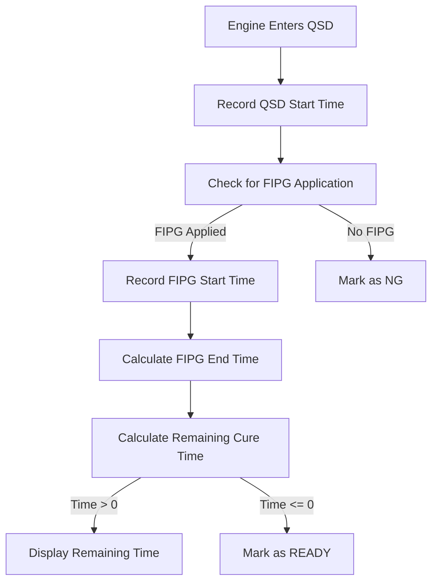
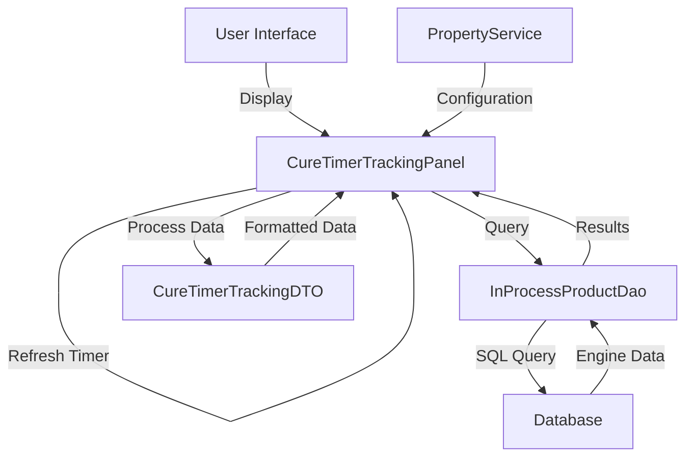
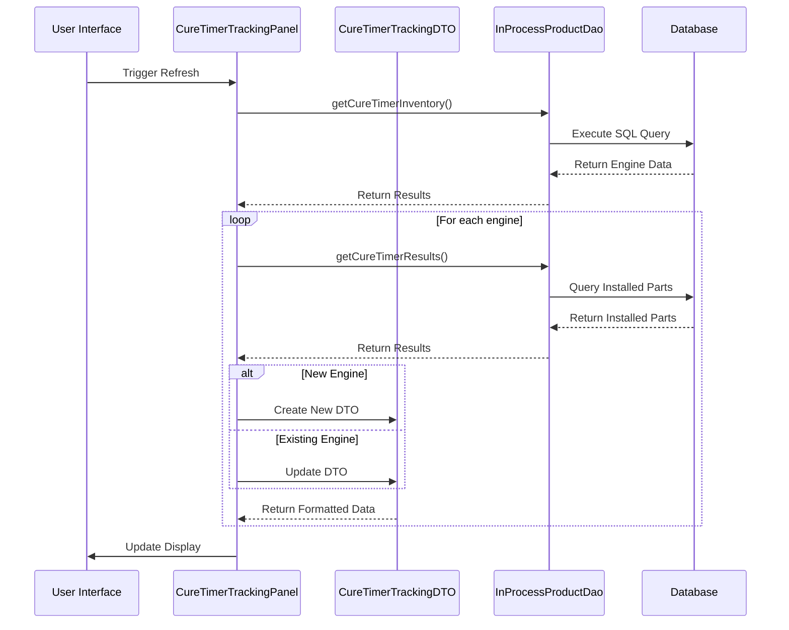

# CureTimerTracking System Documentation

## 1. Purpose and Overview

The CureTimerTracking system is a specialized component within the GALC (Global Assembly Line Control) application designed to monitor and track the curing process for engine components in a manufacturing environment. This system provides real-time visibility into the curing status of various engine parts, helping team leaders and production staff ensure that parts have properly cured before proceeding to the next manufacturing step.

The system specifically tracks:

- Engines currently in the QSD (Quality Staging Department) area
- The time each engine has spent in QSD
- The remaining cure time for FIPG (Formed In Place Gasket) components
- The status of each engine's curing process (Ready, In Progress, or NG - No Good)

## 2. System Components

### 2.1 Files and Their Roles

Here’s your table formatted in Markdown:

```markdown
| File                               | Type        | Purpose                                                                 |
|------------------------------------|-------------|-------------------------------------------------------------------------|
| `CureTimerTrackingPanel.java`      | Java Class  | Main UI controller that manages the display and logic for the cure timer tracking interface |
| `CureTimerTrackingDTO.java`        | Java Class  | Data Transfer Object that holds and formats the cure timer data for each engine |
| `CureTimerTrackingStyle.css`       | CSS         | Stylesheet that defines font sizes for the UI components                |
| `InProcessProductDaoImpl.java`     | Java Class  | Data Access Object implementation that retrieves cure timer data from the database |
```

### 2.2 Key Classes and Their Responsibilities

#### CureTimerTrackingPanel

- Extends `TabbedPanel` to integrate with the GALC UI framework
- Initializes and configures the UI components
- Manages the auto-refresh timer for real-time updates
- Retrieves data from the database and populates the UI
- Handles user interactions like manual refresh

#### CureTimerTrackingDTO

- Stores data for each engine being tracked
- Calculates and formats time values (check-in time, time in QSD, cure time remaining)
- Determines the status of each engine (Ready, In Progress, NG)
- Provides JavaFX property bindings for UI updates

## 3. Data Flow and Logic

### 3.1 Initialization Process



1. When the tab is selected, the system loads configuration properties from the application's property service
2. UI components are initialized including the table, refresh button, and status labels
3. The auto-refresh timer is started based on the configured refresh interval
4. An initial data refresh is performed to populate the table

### 3.2 Data Refresh Process



1. The refresh process is triggered either by the auto-refresh timer or a manual refresh
2. The system queries the database for engines currently in QSD using the `getCureTimerInventory` method
3. Engines that are no longer in QSD are removed from the display
4. New engines detected in QSD are added to the display
5. Existing engine data is updated with the latest information
6. The last refresh time is updated
7. The system waits for the next refresh cycle

### 3.3 Cure Time Calculation Logic



1. When an engine enters QSD, its entry time is recorded
2. The system checks if FIPG has been applied by querying the installed parts
3. If FIPG has been applied, the FIPG start time is recorded
4. The FIPG end time is calculated by adding the required cure time to the start time
5. The remaining cure time is calculated by subtracting the current time from the FIPG end time
6. If the remaining time is greater than 0, it's displayed in hours and minutes
7. If the remaining time is 0 or less, the engine is marked as "READY"
8. If FIPG has not been properly applied, the engine is marked as "NG"

## 4. Database Interactions

### 4.1 Tables Used

Here’s your table formatted in Markdown:

```markdown
| Table       | Description                       | Usage                                           |
|-------------|-----------------------------------|-------------------------------------------------|
| `GAL176TBX` | In-Process Product table          | Stores information about engines currently in production |
| `GAL185TBX` | Installed Parts table             | Records parts that have been installed on each engine |
| `GAL214TBX` | Process Point Line table          | Maps process points to production lines         |
| `GAL215TBX` | Process Results table             | Records results of processes performed on engines |
```

### 4.2 Key Queries

#### getCureTimerInventory Query

This query retrieves engines that:

1. Are on specified trigger lines
2. Have had FIPG parts installed
3. Have not yet reached the trigger-off process points

```sql
SELECT DISTINCT inventory.PRODUCT_ID, 
       MAX(parts.ACTUAL_TIMESTAMP) AS ACTUAL_TIMESTAMP, 
       inventory.PRODUCT_SPEC_CODE 
FROM GALADM.GAL176TBX inventory
JOIN GALADM.GAL185TBX parts ON inventory.PRODUCT_ID = parts.PRODUCT_ID
JOIN GALADM.GAL214TBX ppid ON ppid.LINE_ID = inventory.LINE_ID
JOIN GALADM.GAL215TBX results ON results.PRODUCT_ID = inventory.PRODUCT_ID
WHERE inventory.LINE_ID IN (@LINES@)
AND (@LIKE@)
@EXISTS@
AND NOT EXISTS (
    SELECT 1 
    FROM GALADM.GAL215TBX resultsB 
    WHERE resultsB.PRODUCT_ID = inventory.PRODUCT_ID 
    AND resultsB.PROCESS_POINT_ID IN (@PPIDS@)
)
AND results.PROCESS_POINT_ID = ppid.PROCESS_POINT_ID
GROUP BY inventory.PRODUCT_ID, inventory.PRODUCT_SPEC_CODE
```

#### findAllByProductIdAndPartNames Query

This query retrieves installed parts for a specific engine:

```java
List<InstalledPart> cureTimerResults = getInstalledPartDao().findAllByProductIdAndPartNames(engineNumber, partNames);
```

#### findAllByProcessPointAndProdSpec Query

This query retrieves required parts for a specific product specification:

```java
List<RequiredPart> requiredParts = getRequiredPartDao().findAllByProcessPointAndProdSpec(PROCESS_POINT_ID, productSpec);
```

## 5. Configuration Properties

The CureTimerTracking system is highly configurable through application properties. These properties control various aspects of the system's behavior and appearance.

### 5.1 Core Properties

## Core System Properties

### Display Configuration
| Property      | Default Value      | Description                           | Constraints                          |
| ------------- | ------------------ | ------------------------------------- | ------------------------------------ |
| `DATE_FORMAT` | "MM/dd/yyyy HH:mm" | Format for displaying dates and times | Must follow Java date format pattern |
| `MAX_ROWS`    | 14                 | Maximum number of engines to display  | Integer value                        |
| `ROW_HEIGHT`  | 35                 | Height of each table row              | In pixels                            |
| `FONT_SIZE`   | 18                 | Text size in table                    | Range: 8-72 pixels                   |

### Refresh Settings
| Property                 | Default Value | Description                      | Notes         |
| ------------------------ | ------------- | -------------------------------- | ------------- |
| `DISPLAY_MANUAL_REFRESH` | false         | Manual refresh button visibility | Boolean value |
| `AUTO_REFRESH_TIMER`     | 60            | Automatic refresh interval       | In seconds    |

### Process Parameters
| Property             | Default Value | Description        | Units      |
| -------------------- | ------------- | ------------------ | ---------- |
| `REQUIRED_CURE_TIME` | 180           | Required cure time | In minutes |

### 5.2 Trigger Properties

```markdown
| Property Pattern                          | Description                                         |
|-------------------------------------------|-----------------------------------------------------|
| TRIGGER_LINE_ID{n}                       | Line IDs that trigger tracking (required)           |
| TRIGGER_ON_PART{n}                       | Part names that trigger tracking (required)         |
| TRIGGER_OFF_PROCESS_POINT_ID{n}          | Process points that end tracking (required)         |
```

### 5.3 Column Configuration Properties

## Column Configuration Properties

### Exclusion Properties
| Property                       | Description                                        |
| ------------------------------ | -------------------------------------------------- |
| `EXCLUDE_COLUMN_CHECK_IN_TIME` | Set to "TRUE" to hide the check-in time column     |
| `EXCLUDE_COLUMN_TIME_IN_QSD`   | Set to "TRUE" to hide the time in QSD column       |
| `EXCLUDE_COLUMN_LAST_FIPG`     | Set to "TRUE" to hide the last FIPG process column |

### Column Header Customization
| Property                          | Description                                    |
| --------------------------------- | ---------------------------------------------- |
| `COLUMN_HEADER_CHECK_IN_TIME`     | Custom header for the check-in time column     |
| `COLUMN_HEADER_TIME_IN_QSD`       | Custom header for the time in QSD column       |
| `COLUMN_HEADER_ENGINE_NUMBER`     | Custom header for the engine number column     |
| `COLUMN_HEADER_TIME_REMAINING`    | Custom header for the time remaining column    |
| `COLUMN_HEADER_LAST_FIPG_PROCESS` | Custom header for the last FIPG process column |

## 6. UI Components and Layout

The CureTimerTracking UI consists of several key components:

```
+---------------------------------------------------------------+
|                                                               |
| [Manual Refresh]                  Last Refresh: 10/15/2023 14:30 |
|                                                               |
| +-----------------------------------------------------------+ |
| | Check In Time | Time in QSD | Engine # | Time Remaining  | |
| |---------------|-------------|----------|----------------| |
| | 10/15 13:45   | 0h 45m      | E123456  | 2h 15m         | |
| | 10/15 13:30   | 1h 0m       | E123457  | 1h 45m         | |
| | 10/15 13:15   | 1h 15m      | E123458  | 1h 30m         | |
| | 10/15 13:00   | 1h 30m      | E123459  | 1h 15m         | |
| | 10/15 12:45   | 1h 45m      | E123460  | 1h 0m          | |
| | 10/15 12:30   | 2h 0m       | E123461  | 0h 45m         | |
| | 10/15 12:15   | 2h 15m      | E123462  | 0h 30m         | |
| | 10/15 12:00   | 2h 30m      | E123463  | 0h 15m         | |
| | 10/15 11:45   | 2h 45m      | E123464  | READY          | |
| | 10/15 11:30   | 3h 0m       | E123465  | NG             | |
| +-----------------------------------------------------------+ |
|                                                               |
+---------------------------------------------------------------+
```

1. **Top Section**:
   - Manual Refresh button (optional)
   - Last Refresh time indicator
2. **Table**:
   - Check In Time column (configurable)
   - Time in QSD column (configurable)
   - Engine Number column
   - Time Remaining column
   - Last FIPG Process column (configurable)
3. **Styling**:
   - Font sizes controlled by CSS
   - First row in bold to highlight the most recent engine
   - Color coding for status (implemented through CSS)

## 7. Integration with Other Systems

The CureTimerTracking system integrates with several other components of the GALC application:

1. **GALC UI Framework**: Extends the `TabbedPanel` class to integrate with the main application UI
2. **Property Service**: Uses the application's property service to load configuration settings
3. **Database Access Layer**: Uses DAOs to interact with the database
4. **Logging System**: Logs important events and errors for troubleshooting

## 8. Example Configurations

### 8.1 Basic Configuration

```properties
CURE_TRACKING.DATE_FORMAT=MM/dd/yyyy HH:mm
CURE_TRACKING.MAX_ROWS=14
CURE_TRACKING.ROW_HEIGHT=35
CURE_TRACKING.FONT_SIZE=18
CURE_TRACKING.DISPLAY_MANUAL_REFRESH=false
CURE_TRACKING.AUTO_REFRESH_TIMER=60
CURE_TRACKING.REQUIRED_CURE_TIME=180
CURE_TRACKING.TRIGGER_LINE_ID{1}=LINE1
CURE_TRACKING.TRIGGER_ON_PART{1}=FIPG_HEAD
CURE_TRACKING.TRIGGER_OFF_PROCESS_POINT_ID{1}=ASSEMBLY_COMPLETE
```

### 8.2 Advanced Configuration with Multiple Triggers

Properties

Copy

Paste

```properties
CURE_TRACKING.DATE_FORMAT=MM/dd/yyyy HH:mm
CURE_TRACKING.MAX_ROWS=20
CURE_TRACKING.ROW_HEIGHT=30
CURE_TRACKING.FONT_SIZE=16
CURE_TRACKING.DISPLAY_MANUAL_REFRESH=true
CURE_TRACKING.AUTO_REFRESH_TIMER=30
CURE_TRACKING.REQUIRED_CURE_TIME=240
CURE_TRACKING.TRIGGER_LINE_ID{1}=LINE1
CURE_TRACKING.TRIGGER_LINE_ID{2}=LINE2
CURE_TRACKING.TRIGGER_ON_PART{1}=FIPG_HEAD
CURE_TRACKING.TRIGGER_ON_PART{2}=FIPG_CASE
CURE_TRACKING.TRIGGER_OFF_PROCESS_POINT_ID{1}=ASSEMBLY_COMPLETE
CURE_TRACKING.TRIGGER_OFF_PROCESS_POINT_ID{2}=SHIPPING
CURE_TRACKING.EXCLUDE_COLUMN_LAST_FIPG=TRUE
CURE_TRACKING.COLUMN_HEADER_ENGINE_NUMBER=Serial #
CURE_TRACKING.COLUMN_HEADER_TIME_REMAINING=Cure Time Left
```

## 9. Debugging and Troubleshooting

### 9.1 Common Issues and Solutions

Here's a structured table for the issues, possible causes, and solutions:

## System Issues and Resolutions

| Issue                      | Possible Causes                                              | Solutions                                                    |
| -------------------------- | ------------------------------------------------------------ | ------------------------------------------------------------ |
| No engines displayed       | - No engines in QSD<br>- Incorrect trigger line IDs<br>- Incorrect trigger part names | - Verify engines are in QSD<br>- Check trigger line IDs in configuration<br>- Check trigger part names in configuration |
| Incorrect cure times       | - Incorrect REQUIRED_CURE_TIME setting<br>- System time issues | - Verify REQUIRED_CURE_TIME setting<br>- Check system time synchronization |
| Missing columns            | - EXCLUDE_COLUMN properties set to TRUE                      | - Check EXCLUDE_COLUMN properties                            |
| UI refresh issues          | - JavaScript errors<br>- Timer interruptions                 | - Check browser console for errors<br>- Restart application  |
| Database connection errors | - Database unavailable<br>- Connection pool issues           | - Verify database connectivity<br>- Check connection pool settings |

### 9.2 Logging

The system logs important events and errors to help with troubleshooting:

```java
getLogger().info("Window width binding successful.");
getLogger().error(e, "Window width binding failed.");
getLogger().info("Manual refresh requested");
```

### 9.3 Debugging Steps

1. **Check Configuration**:
   - Verify all required properties are set correctly
   - Ensure trigger line IDs, parts, and process points are valid
2. **Verify Database Queries**:
   - Run the getCureTimerInventory query directly against the database
   - Check that engines are properly recorded in GAL176TBX
   - Verify FIPG parts are recorded in GAL185TBX
3. **UI Troubleshooting**:
   - Check for JavaScript errors in the browser console
   - Verify CSS is properly loaded
   - Test manual refresh functionality
4. **Performance Monitoring**:
   - Monitor refresh time and database query performance
   - Adjust AUTO_REFRESH_TIMER if needed
   - Consider reducing MAX_ROWS if performance is an issue

## 10. Data Flow Diagram



## 11. Sequence Diagram for Refresh Process



## 12. Practical Examples

### 12.1 Tracking Engine Cure Status

A team leader needs to know which engines are ready to move to the next process:

1. The team leader opens the CureTimerTracking tab
2. The system displays all engines currently in QSD with their cure status
3. Engines marked as "READY" can be moved to the next process
4. Engines with remaining cure time need to wait
5. Engines marked as "NG" need inspection

### 12.2 Monitoring Production Flow

A production manager wants to ensure engines are moving through QSD efficiently:

1. The manager monitors the "Time in QSD" column
2. Engines that have been in QSD longer than expected can be investigated
3. The manager can identify bottlenecks in the production process
4. Production adjustments can be made based on the data

## 13. Conclusion

The CureTimerTracking system provides a critical function in the manufacturing process by ensuring that FIPG components have properly cured before proceeding to the next step. Its real-time tracking capabilities help prevent quality issues and improve production efficiency.

Key benefits include:

- Real-time visibility into cure status
- Automatic tracking of engines in QSD
- Configurable display and behavior
- Integration with the GALC database and UI framework

By properly configuring and utilizing this system, manufacturing teams can ensure proper curing times are observed, leading to higher quality products and more efficient production processes.