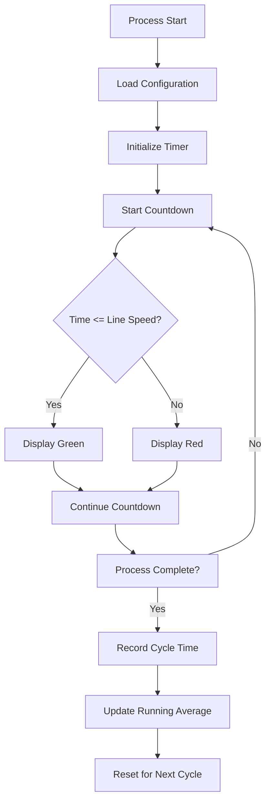

# ProcessCycleTimerWidget.fxml Documentation

## Purpose

The ProcessCycleTimerWidget is a JavaFX component that displays real-time cycle time information for manufacturing processes at Honda. It provides visual feedback on the current cycle time, line speed, and running average, helping operators monitor production efficiency and maintain optimal workflow.

## How It Works

The widget functions as a real-time monitoring tool that:

1. Displays the current cycle time countdown for the active process
2. Shows the configured line speed (target time) for the process
3. Calculates and displays a running average of recent cycle times
4. Provides visual feedback through color changes (green/red) based on performance

The widget is initialized when a product process starts, begins counting down from a configured start value, and changes colors to indicate whether the process is on track (green) or falling behind (red).

## Key Components

### Visual Structure

The widget is organized as a BorderPane with three main display panels arranged horizontally:

```
+-------------------------------------------------------+
|                                                       |
|  +----------+        +----------+      +----------+   |
|  | Current  |        |   Line   |      | Running  |   |
|  |  Cycle   |        |  Speed   |      |   Avg    |   |
|  |    0     |        |   0.00   |      |   0.00   |   |
|  +----------+        +----------+      +----------+   |
|                                                       |
+-------------------------------------------------------+
```

### UI Elements

1. **Current Cycle Panel**
   - Rectangle background (currentCycleRect) - changes color based on performance
   - Numeric display (currentCycleValue) - shows countdown timer value
   - "Current" label
2. **Line Speed Panel**
   - Rectangle background (lineSpeedRect)
   - Numeric display (lineSpeedValue) - shows target cycle time
   - "Line Speed" label
3. **Running Average Panel**
   - Rectangle background (runningAveRect) - changes color based on performance
   - Numeric display (runningAvgValue) - shows average of recent cycles
   - "Running Avg" label

## Workflow

1. **Initialization**:
   - The widget loads configuration from PDDAPropertyBean
   - Retrieves line speed settings for the current process point
   - Sets up the initial display values
2. **Process Start**:
   - When a product process starts, the timer begins counting down
   - The current cycle value starts from the configured count start value (default: 3)
   - Line speed value is displayed based on configuration
3. **During Process**:
   - Timer counts down each second
   - Current cycle panel changes color:
     - Green when within acceptable time
     - Red when exceeding target time
   - Running average is calculated based on recent cycles (sample size: 20)
4. **Process Completion**:
   - Current cycle time is recorded
   - Running average is updated
   - Timer resets for the next cycle

## Data Flow



## Integration with Other Components

### Controller Class

The widget is controlled by `ProcessCycleTimerWidget.java`, which:

- Extends AbstractWidget
- Implements the timer logic
- Handles product events (start, finish, cancel)
- Manages the visual state changes

### Property Configuration

The widget uses the following configuration from PDDAPropertyBean:

- `getLineSpeed()` - Retrieves the target cycle time for each line
- `getCountStartSecond()` - Gets the initial countdown value

### Event Handling

The widget responds to these events:

- Product started - Initializes and starts the timer
- Product finished - Stops the timer and resets
- Product cancelled - Resets the widget state

## Database Interactions

The widget does not directly interact with the database. Instead, it retrieves configuration data through the PropertyService:

```java
// Example of how line speed is retrieved
lineSpeedMap = PropertyService.getPropertyBean(PDDAPropertyBean.class, processPointId).getLineSpeed(Integer.class);
```

## Configuration Properties

### Line Speed Configuration

Line speeds are configured as key-value pairs in the application properties:

```properties
# Example line speed configuration
BLOCK_A=42
BLOCK_B=45
DEFAULT=40
```

Where:

- Keys represent line IDs
- Values represent target cycle times in seconds
- DEFAULT is used when a specific line ID is not found

### Count Start Second

The initial countdown value is configured as:

```properties
# Default is 3 seconds
COUNT_START_SECOND=3
```

## Debugging Guide

### Common Issues and Solutions

1. **Timer Not Starting**
   - Check if product events are being properly triggered
   - Verify that the EventBus is properly registered
   - Ensure the controller's `startClock()` method is being called
2. **Incorrect Line Speed**
   - Verify line ID configuration in the properties
   - Check that the correct process point ID is being used
   - Ensure the DEFAULT line speed is configured as a fallback
3. **Color Not Changing**
   - Check the logic in the timer's event handler
   - Verify that the reference line speed is being properly loaded
   - Inspect the JavaFX thread for errors

### Diagnostic Steps

1. Check the line speed configuration:

   ```java
   System.out.println("Line ID: " + processPoint.getLineId());
   System.out.println("Process Point ID: " + processPoint.getProcessPointId());
   System.out.println("Line Speed Map: " + lineSpeedMap);
   ```

2. Verify timer operation:

   ```java
   System.out.println("Current Cycle Time: " + currentCycleTime);
   System.out.println("Reference Line Speed: " + referenceLineSpeed);
   ```

3. Inspect running average calculation:

   ```java
   System.out.println("Cycle Times: " + Arrays.toString(cycleTime));
   System.out.println("Cycle Index: " + cycleIndex);
   ```

## Visual Representation of Widget States

### Normal Operation (On Time)

```
+-------------------------------------------------------+
|                                                       |
|  +----------+        +----------+      +----------+   |
|  | Current  |        |   Line   |      | Running  |   |
|  |  Cycle   |        |  Speed   |      |   Avg    |   |
|  |    42    |        |   45.00  |      |   43.50  |   |
|  +----------+        +----------+      +----------+   |
|  |  GREEN   |        |   BLUE   |      |  GREEN   |   |
|  +----------+        +----------+      +----------+   |
|                                                       |
+-------------------------------------------------------+
```

### Behind Schedule

```
+-------------------------------------------------------+
|                                                       |
|  +----------+        +----------+      +----------+   |
|  | Current  |        |   Line   |      | Running  |   |
|  |  Cycle   |        |  Speed   |      |   Avg    |   |
|  |    52    |        |   45.00  |      |   48.75  |   |
|  +----------+        +----------+      +----------+   |
|  |   RED    |        |   BLUE   |      |   RED    |   |
|  +----------+        +----------+      +----------+   |
|                                                       |
+-------------------------------------------------------+
```

## Example Implementation

To implement this widget in a new process point:

1. Add the widget to your layout:

```java
BorderPane layout = new BorderPane();
ProcessCycleTimerWidget cycleTimer = new ProcessCycleTimerWidget(productController);
layout.setTop(cycleTimer);
```

1. Configure line speeds in properties:

```properties
# For process point PP_ASSEMBLY_01
PP_ASSEMBLY_01.LINE_SPEED.LINE_A=42
PP_ASSEMBLY_01.LINE_SPEED.LINE_B=45
PP_ASSEMBLY_01.LINE_SPEED.DEFAULT=40
PP_ASSEMBLY_01.COUNT_START_SECOND=5
```

1. Ensure product events are properly triggered:

```java
// When product starts
productController.startProduct(productModel);

// When product finishes
productController.finishProduct(productModel);
```

## Related Components

The ProcessCycleTimerWidget is part of a family of timing widgets:

1. **AdvancedProcessCycleTimerWidget** - An enhanced version with additional metrics
2. **PushTimerPane** - Manages push timing for line operations
3. **UnitProgressTimerPane** - Tracks progress of individual units

These components work together to provide comprehensive timing and progress monitoring throughout the manufacturing process.