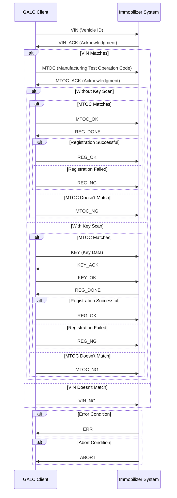
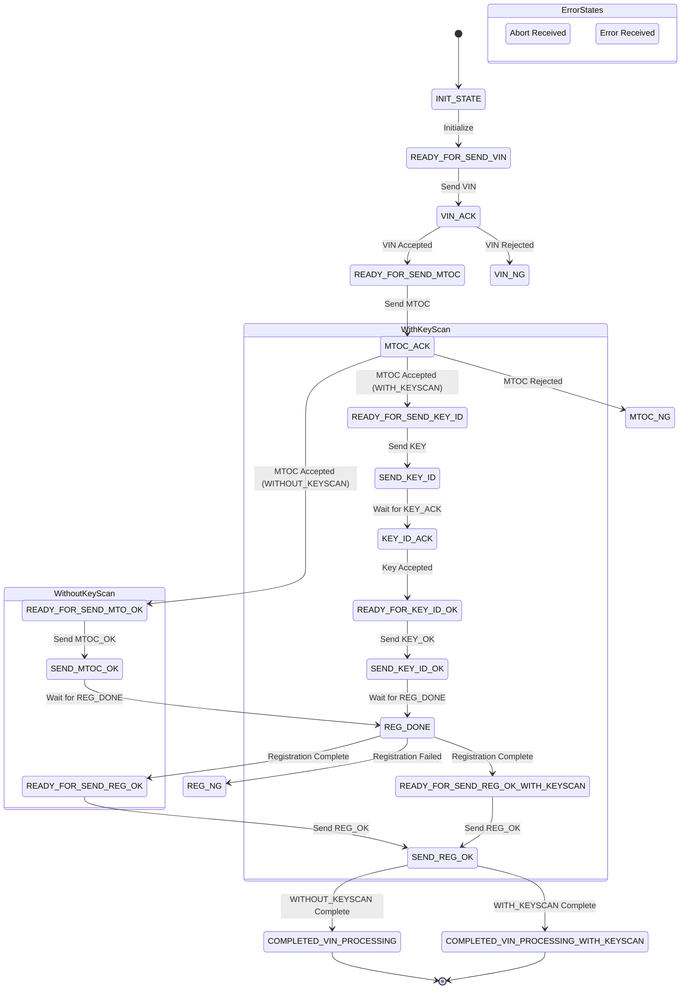
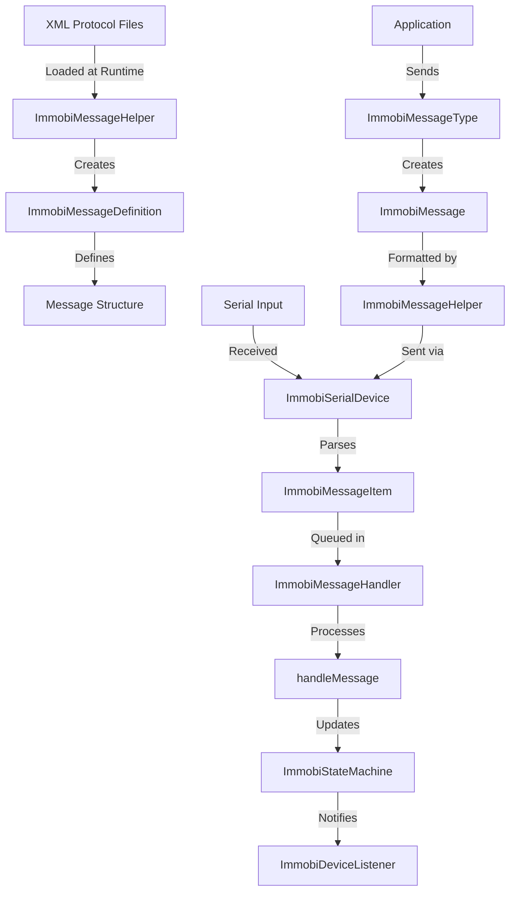

# Immobilizer Protocol Files Documentation

## Overview

The immobilizer protocol files in the GALC system define the communication protocol between the GALC client application and the vehicle immobilizer system. These XML files define the structure and format of messages exchanged during the immobilizer registration process, which is a critical security feature in Honda vehicles.

## Protocol Files Purpose and Structure

The protocol files are located in:

```
ahm_mfg_galc-release-4.41/aggregator/galc-client-fx/target/resource/com/honda/global/galc/client/immobiprotocol/
```

Each XML file represents a specific message type in the immobilizer communication protocol. The files follow a consistent naming convention and structure:

### File Structure

Each XML file contains an `ImmobiMessage` element with attributes and child `field` elements:

```xml
<ImmobiMessage id="[MESSAGE_ID]" version="1.0" severity="[SEVERITY]" description="[DESCRIPTION]" className="com.honda.galc.client.device.lotcontrol.immobi.ImmobiMessage">
    <field id="01" name="LENGTH" dataType="string" length="3" value="[VALUE]" />
    <field id="02" name="COMMAND_CODE" dataType="string" length="3" value="[VALUE]" />    
    <field id="03" name="SUB_COMMAND_CODE" dataType="string" length="3" value="[VALUE]" />    
    <!-- Additional fields as needed -->
</ImmobiMessage>
```

### Common Fields

1. **LENGTH**: The total length of the message
2. **COMMAND_CODE**: Identifies the primary command type
3. **SUB_COMMAND_CODE**: Identifies the sub-command type
4. **DATA_SEGMENT_LENGTH** (optional): Length of the data segment
5. **SEGMENT_DATA** (optional): The actual data payload

## Message Types and Their Purpose

The protocol includes the following message types:

| File         | Direction | Purpose                                                  |
| ------------ | --------- | -------------------------------------------------------- |
| ABORT.xml    | Received  | Indicates an abort condition from the immobilizer system |
| ERR.xml      | Received  | Indicates an error condition from the immobilizer system |
| KEY.xml      | Sent      | Sends key data to the immobilizer system                 |
| KEY_ACK.xml  | Received  | Acknowledgment of key data receipt                       |
| KEY_NG.xml   | Sent      | Negative response for key data                           |
| KEY_OK.xml   | Sent      | Positive response for key data                           |
| MTOC.xml     | Sent      | Sends MTOC (Manufacturing Test Operation Code) data      |
| MTOC_ACK.xml | Received  | Acknowledgment of MTOC data receipt                      |
| MTOC_NG.xml  | Sent      | Negative response for MTOC data                          |
| MTOC_OK.xml  | Sent      | Positive response for MTOC data                          |
| REG_DONE.xml | Received  | Indicates registration process completion                |
| REG_NG.xml   | Sent      | Negative response for registration                       |
| REG_OK.xml   | Sent      | Positive response for registration                       |
| VIN.xml      | Sent      | Sends Vehicle Identification Number                      |
| VIN_ACK.xml  | Received  | Acknowledgment of VIN receipt                            |
| VIN_NG.xml   | Sent      | Negative response for VIN                                |

## Communication Workflow



## State Machine

The immobilizer communication follows a state machine pattern with two possible paths:

1. **WITHOUT_KEYSCAN**: Simpler flow without key scanning
2. **WITH_KEYSCAN**: More complex flow that includes key scanning

### State Transitions



## Implementation Details

### Java Classes

The protocol is implemented through several Java classes:

1. **ImmobiMessage**: Represents a message in the immobilizer protocol
2. **ImmobiMessageType**: Enum defining all possible message types
3. **ImmobiMessageDefinition**: Defines the structure of a message
4. **ImmobiMessageFieldFormat**: Defines the format of a field in a message
5. **ImmobiMessageHelper**: Utility class for processing messages
6. **ImmobiSerialDevice**: Handles serial communication with the immobilizer
7. **ImmobiStateMachine**: Manages the state transitions during communication
8. **ImmobiStateMachineType**: Defines the two types of state machines (WITH_KEYSCAN and WITHOUT_KEYSCAN)

### Message Processing Flow



## Debugging and Troubleshooting

### Common Issues

1. **Communication Failures**:
   - Check serial port settings (baud rate, parity, etc.)
   - Verify the correct port is being used
   - Ensure the device is properly connected
2. **Protocol Errors**:
   - VIN mismatch: Ensure the VIN sent matches the expected VIN
   - MTOC mismatch: Verify the MTOC data is correct
   - Key data issues: Check the key scan data format
3. **State Machine Issues**:
   - Incorrect state transitions: Review the state machine logs
   - Timeout issues: Check the timeout settings in ImmobiSerialDevice

### Debugging Steps

1. **Enable Logging**:

   ```java
   Logger.getLogger().setLevel(Level.DEBUG);
   ```

2. **Monitor State Transitions**:

   - The state machine prints binary representations of states
   - Use `ImmobiStateMachine.printCurrentStateBinary()` to view current state

3. **Inspect Message Content**:

   ```java
   // To view a message's content
   Logger.getLogger().info(immobiMsg.toString());
   ```

4. **Test Communication**:

   ```java
   // Test sending a VIN message
   ImmobiMessage msg = ImmobiMessageType.vin.createMessage();
   msg.setSegmentData("YOUR_VIN_HERE");
   immobiSerialDevice.send(msg.toString());
   ```

## Integration with GALC System

The immobilizer protocol is integrated into the GALC system through:

1. **LotControlImmobiManager**: Manages the immobilizer registration process
2. **ImmobiRuleProcessor**: Processes business rules for immobilizer registration

The system supports two modes of operation:

- **WITHOUT_KEYSCAN**: Used when key scanning is not required
- **WITH_KEYSCAN**: Used when key scanning is required as part of the registration process

## Example Usage

```java
// Initialize the immobilizer device
ImmobiSerialDevice device = new ImmobiSerialDevice();
device.setPortName("COM1");
device.setBaudRate(9600);
device.setDataBits(SerialPort.DATABITS_7);
device.setParity(SerialPort.PARITY_EVEN);
device.setStopBits(SerialPort.STOPBITS_2);
device.setTimeOut(90000);

// Set the state machine type
device.setStateMachineType(ImmobiStateMachineType.WITHOUT_KEYSCAN);

// Activate the device
device.activate();

// Process a VIN
device.processVIN("1HGCM82633A123456", "MTOC123456", "SEQ001");
```

## Conclusion

The immobilizer protocol files define a robust communication protocol between the GALC client application and the vehicle immobilizer system. The protocol ensures secure registration of immobilizer components, which is critical for vehicle security and anti-theft measures.

The implementation uses a state machine approach to manage the complex sequence of messages required for successful registration, with support for both key-scan and non-key-scan workflows.