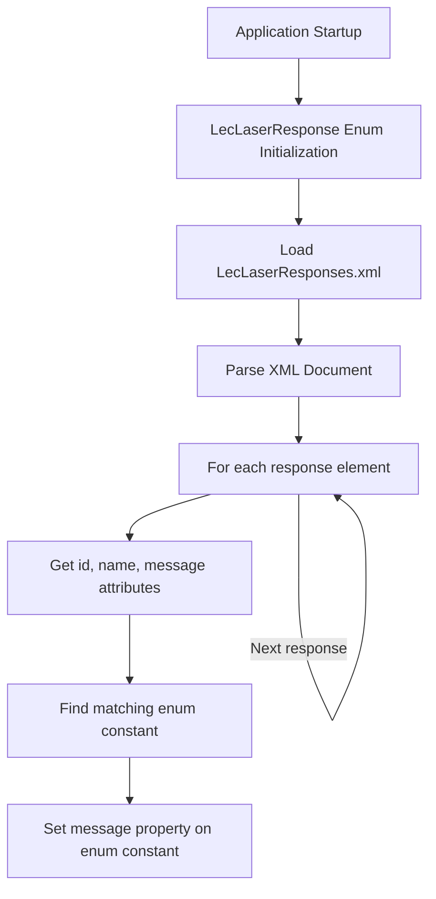
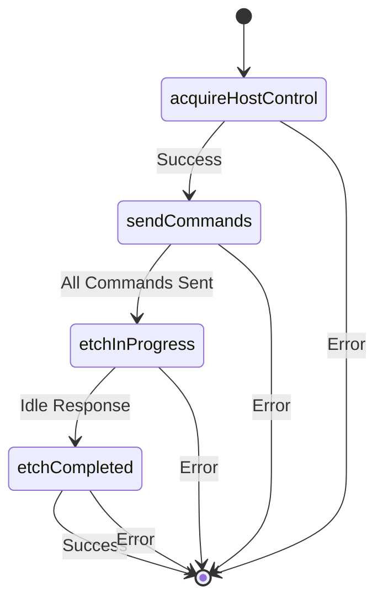
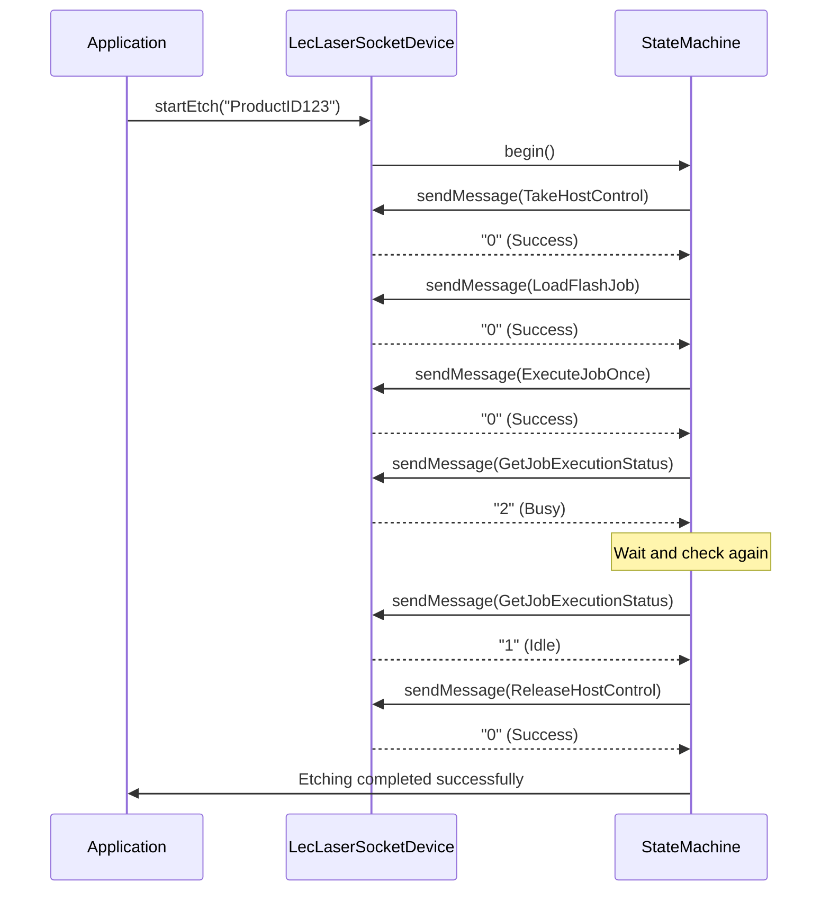
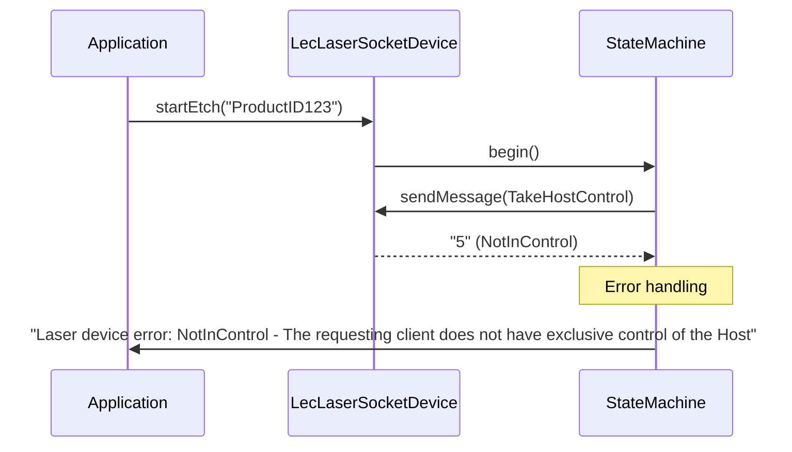
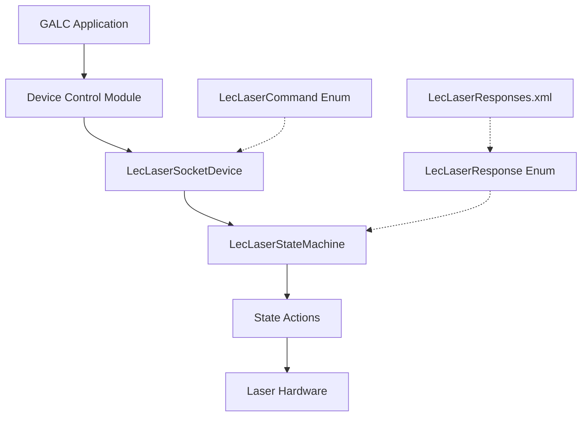
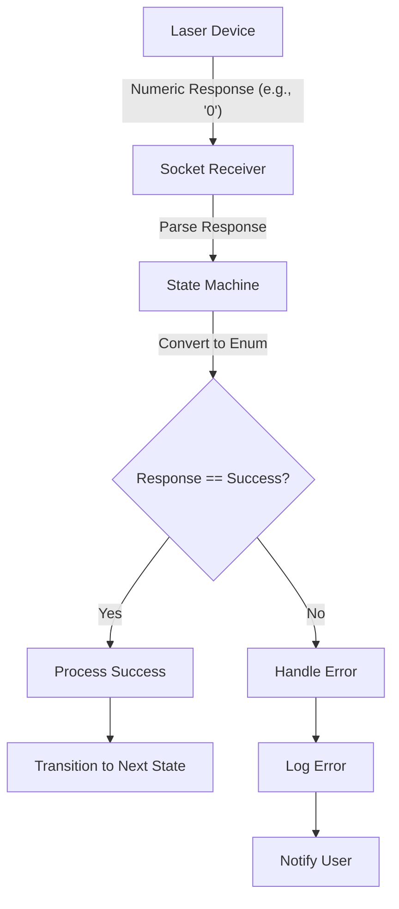

# LecLaserResponses.xml Documentation

## Purpose

The `LecLaserResponses.xml` file serves as a centralized repository of response codes and messages for the Laser Etching Controller (LEC) system. It maps numeric response codes to human-readable names and descriptive messages, enabling the application to interpret and handle responses from the laser etching hardware in a consistent manner.

This file is essential for:

- Translating numeric response codes from the laser device into meaningful messages
- Providing standardized error handling across the application
- Supporting debugging and troubleshooting of laser etching operations
- Maintaining a single source of truth for all possible device responses

## How It Works

The XML file contains a collection of `response` elements, each with three key attributes:

- `id`: A numeric identifier for the response code
- `name`: A short, descriptive name for the response
- `message`: A detailed explanation of what the response means

When the application starts, the `LecLaserResponse` Java enum loads this XML file and populates each enum constant with the corresponding message from the XML. This happens in the static initialization block of the enum class.

### Loading Process Flow



## Key Components

### XML Structure

The XML file follows a simple structure:

```xml
<?xml version="1.0" encoding="UTF-8"?>
<LecLaserResponses version="1.0">
    <response id="0" name="Success" message="The operation completed successfully" />
    <response id="1" name="Idle" message="The job engine is idle" />
    <!-- Additional response definitions -->
</LecLaserResponses>
```

### Java Integration

The file is primarily used by the `LecLaserResponse` enum, which defines constants for each possible response code. The enum's static initializer loads the XML file and populates each enum constant with its corresponding message.

```java
public enum LecLaserResponse {
    Success(0),
    Idle(1),
    // Additional enum constants
    
    private int responseCode;
    private String message;
    
    // Static initializer that loads messages from XML
    static {
        // Load XML file and populate messages
    }
    
    // Methods to access response code and message
}
```

## Workflow and Integration

### State Machine Integration

The application uses a state machine pattern to manage the laser etching process:



Each state processes responses differently:

1. **acquireHostControl**: Attempts to gain exclusive control of the laser device
2. **sendCommands**: Sends the etching commands to the device
3. **etchInProgress**: Monitors the etching process until completion
4. **etchCompleted**: Finalizes the process and releases control

## Response Categories

The responses in the XML file can be categorized as follows:

### Success Responses (0-1)

- Success (0): Operation completed successfully
- Idle (1): Job engine is idle

### Status Responses (2-5)

- Busy (2): Job engine is executing a job
- NoJob (3): Specified job not found
- InControl (4): Client has exclusive control
- NotInControl (5): Client does not have exclusive control

### License Errors (6-7)

- LicenseUnavailable (6): Valid license not found
- LicenseAccessDenied (7): License does not allow requested feature

### Command Errors (8-11)

- BadCommand (8): API command not recognized
- BadArg (9): Invalid argument
- ArgOutOfRange (10): Argument out of range
- UnknownTimeZone (11): Time zone not found

### System Errors (12-77)

- Various system-level errors including memory, device, and communication issues

### Job Errors (84-129)

- Errors related to job execution, file handling, and object manipulation

### Object Errors (200-233)

- Errors related to object properties, fonts, and rendering

## Practical Examples

### Example 1: Successful Etching Process



### Example 2: Error Handling



## Debugging and Troubleshooting

When issues occur with the laser etching process, the response codes and messages from this XML file are crucial for diagnosing problems:

1. **Check Response Code**: Identify the numeric response code returned by the device
2. **Look Up in XML**: Find the corresponding entry in LecLaserResponses.xml
3. **Read Message**: The message attribute provides a detailed explanation
4. **Check State**: Determine which state the system was in when the error occurred
5. **Review Command**: Identify which command triggered the error response

### Common Issues and Solutions

| Response             | Common Cause                             | Solution                                                  |
| -------------------- | ---------------------------------------- | --------------------------------------------------------- |
| NotInControl (5)     | Another client has control of the device | Wait for other client to release control or force release |
| BadCommand (8)       | Invalid command sent to device           | Check command syntax and parameters                       |
| DeviceNotFound (52)  | Network connectivity issue               | Verify network connection and device IP address           |
| FileNotFound (121)   | Job file missing                         | Ensure job file exists in the specified location          |
| MotionNotHomed (127) | Device not initialized properly          | Run homing sequence before operation                      |

## Database Interactions

The LecLaserResponses.xml file itself does not directly interact with any database. However, the response codes it defines may be stored in the following database tables when logging etching operations:

| Table Name    | Description                    | Related Columns                           |
| ------------- | ------------------------------ | ----------------------------------------- |
| ETCHING_LOG   | Records all etching operations | RESPONSE_CODE, RESPONSE_MESSAGE           |
| DEVICE_STATUS | Tracks device status changes   | LAST_RESPONSE_CODE, LAST_RESPONSE_MESSAGE |
| ERROR_LOG     | Logs all error conditions      | ERROR_CODE, ERROR_DESCRIPTION             |

## Static Properties

The `LecLaserResponse` enum defines several static properties related to the XML file:

```java
public static final String RESOURCE_FILE_NAME = "LecLaserResponses.xml";
public static final String RESOURCE_PATH = "/resource/com/honda/galc/leclaserprotocol/";
public static final String LEC_COMMAND_RESPONSE_FILE = RESOURCE_PATH + RESOURCE_FILE_NAME;
public static final String RESPONSE_TAG = "response";
public static final String ID_TAG = "id";
public static final String NAME_TAG = "name";
public static final String MESSAGE_TAG = "message";
```

These properties define the location and structure of the XML file, making it easy to update if the file path or format changes.

## Visual Representation of the System

### Overall System Architecture



### Response Processing Flow



## Conclusion

The LecLaserResponses.xml file is a critical component of the laser etching system, providing a standardized way to interpret and handle responses from the laser hardware. By centralizing all possible response codes and messages in a single XML file, the application can maintain consistent error handling and provide meaningful feedback to users.

Understanding this file and its integration with the Java code is essential for maintaining and troubleshooting the laser etching functionality of the GALC system.

