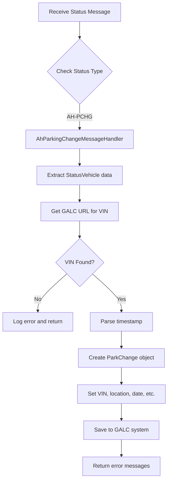

## Purpose

The `AhParkingChangeMessageHandler` is a specialized component in the Honda AHM LC Sales Interface Service that handles parking change status messages for vehicles. It processes "AH-PCHG" (Parking Change) status updates received from external systems, updating the vehicle's parking location information in the GALC (Global Automotive Logistics Control) system.

## How It Works

The handler follows a straightforward process flow:

1. Receives a status message containing parking change information for a vehicle
2. Validates the vehicle exists in the GALC system
3. Formats the timestamp data from the message
4. Creates a ParkChange record with the vehicle and parking information
5. Saves the record to the GALC external system
6. Returns any error messages that occurred during processing

## Key Components

### Class Definition and Dependencies

```java
@Component("AhParkingChangeMessageHandler")
public class AhParkingChangeMessageHandler implements IStatusMessageHandler {
    private final Logger logger = LoggerFactory.getLogger(getClass());
    
    @Autowired
    ParkChangeService parkChangeService;
    
    // Implementation methods...
}
```

- **@Component Annotation**: Registers this class as a Spring component with the name "AhParkingChangeMessageHandler"
- **IStatusMessageHandler Interface**: Implements the common interface for all status message handlers
- **Logger**: Used for logging information and errors during processing
- **ParkChangeService**: Autowired service that handles communication with the GALC system

### Main Processing Method

The `handle()` method is the core functionality:

```java
@Override
public List<String> handle(StatusMessage statusMessage, StatusEnum status) {
    List<String> errorMessages = new ArrayList<String>();
    StatusVehicle statusVehicle = (StatusVehicle) statusMessage.getVehicle();
    // Process the message and return any errors
    // ...
    return errorMessages;
}
```

### Helper Method

The `getParsedTimestamp()` method converts the timestamp string from the message into a Date object:

```java
private Date getParsedTimestamp(String timestamp) throws ParseException {
    SimpleDateFormat inputFormat = new SimpleDateFormat("yyyy-MM-dd't'HH:mm:ss");
    return inputFormat.parse(timestamp);
}
```

## Interactions

### Input

- Receives `StatusMessage` objects containing:
    - Transaction information (transaction code, plant ID, line ID)
    - Vehicle information (VIN, control number, parking bay, timestamp)

### Output

- Returns a list of error messages (empty if successful)
- Updates the GALC system with parking change information

### Integration Points

1. **StatusMessageHandlerFactory**: Invokes this handler when an "AH-PCHG" status message is received
2. **ParkChangeService**: Used to:
    - Get the GALC URL for the specific VIN and line ID
    - Save the ParkChange record to the GALC system
3. **GALC External System**: The ultimate destination for the parking change data

## Data Flow

```
┌─────────────────┐     ┌───────────────────────────┐     ┌─────────────────────┐     ┌──────────────┐
│ External System │────▶│ StatusMessageHandlerFactory│────▶│ AhParkingChangeMsg  │────▶│ GALC System  │
│ (YMS Interface) │     │                           │     │ Handler              │     │              │
└─────────────────┘     └───────────────────────────┘     └─────────────────────┘     └──────────────┘
                                                                    │
                                                                    ▼
                                                          ┌─────────────────────┐
                                                          │  ParkChangeService  │
                                                          └─────────────────────┘
```

## Database Interactions

The handler doesn't directly interact with databases. Instead, it uses the ParkChangeService, which extends BaseGalcService, to communicate with the GALC external system through REST API calls.

### Indirect Database Operations

1. **Query Operation**: `getGalcUrl()` method in ParkChangeService searches for the VIN record in the GALC system
2. **Insert/Update Operation**: `saveParkChange()` method in ParkChangeService saves the ParkChange record to the GALC system

### Underlying Database Tables

The GALC system likely has a table corresponding to the ParkChange entity, which would include fields for:

- VIN
- Park Control Number
- Parking Location
- Date
- Time
- Send Location
- Transaction Type

## Example Scenario

### Parking Change Message Flow

1. A vehicle is moved to a new parking location in the yard
2. The Yard Management System (YMS) generates an "AH-PCHG" status message
3. The message contains:
    
    ```json
    {
      "TRANSACTION": {
        "TRANSACTION_CODE": "AH-PCHG",
        "PLANT_ID": "HCM",
        "LINE_ID": "1"
      },
      "VEHICLE": {
        "VIN": "1HGCM82633A123456",
        "CONTROL_NUMBER": "PC12345",
        "PARKING_BAY": "A-123",
        "TIMESTAMP": "2023-06-15T14:30:45"
      }
    }
    ```
    
4. The StatusMessageHandlerFactory receives this message and routes it to the AhParkingChangeMessageHandler
5. The handler:
    - Extracts the VIN and looks up the GALC URL
    - Formats the timestamp into date and time values
    - Creates a ParkChange object with the data
    - Saves the record to the GALC system
6. The vehicle's parking location is now updated in the system

## Debugging Production Issues

### Common Issues and Solutions

1. **Missing VIN Record**
    
    - **Symptom**: Log shows "Unable to find the VIN record"
    - **Cause**: The VIN doesn't exist in the GALC system
    - **Solution**: Verify the VIN is correct and exists in the GALC system
2. **Timestamp Parsing Error**
    
    - **Symptom**: Log shows "Unable to parse timestamp"
    - **Cause**: The timestamp format in the message doesn't match the expected format
    - **Solution**: Check the format of the timestamp in the incoming message
3. **GALC Communication Error**
    
    - **Symptom**: Error in saving ParkChange record
    - **Cause**: Connection issues with the GALC system
    - **Solution**: Check network connectivity and GALC system availability

### Debugging Queries

To debug issues in production, you can use these SQL queries (assuming you have access to the GALC database):

1. **Check if a VIN exists in the system**:
    
    ```sql
    SELECT * FROM PARK_CHANGE WHERE VIN = 'YOUR_VIN_HERE';
    ```
    
2. **Check recent parking changes for a specific VIN**:
    
    ```sql
    SELECT * FROM PARK_CHANGE 
    WHERE VIN = 'YOUR_VIN_HERE' 
    ORDER BY DATE DESC, TIME DESC;
    ```
    
3. **Check for failed parking change updates**:
    
    ```sql
    -- Look for log entries related to parking change errors
    SELECT * FROM APPLICATION_LOGS 
    WHERE MESSAGE LIKE '%Unable to find the VIN record%' 
    OR MESSAGE LIKE '%Error while sending data to external system%'
    ORDER BY TIMESTAMP DESC;
    ```
    

### Debugging Steps

1. **Verify the incoming message**:
    
    - Check the logs for the exact message received
    - Ensure all required fields are present (VIN, control_number, parking_bay, timestamp)
2. **Check GALC connectivity**:
    
    - Verify the GALC URLs in the application properties
    - Test connectivity to the GALC system
3. **Trace the message flow**:
    
    - Follow the message from receipt to processing
    - Check logs at each step for errors
4. **Verify data transformation**:
    
    - Check if the timestamp is being correctly parsed
    - Ensure the ParkChange object is correctly populated
5. **Check GALC response**:
    
    - Look for any error responses from the GALC system
    - Verify the data was successfully saved

## Visual Workflow



This documentation provides a comprehensive overview of the AhParkingChangeMessageHandler.java file, explaining its purpose, functionality, and how it integrates with the rest of the system. The visual workflow and example scenario should help you understand how this component processes parking change messages in the Honda AHM LC Sales Interface Service.