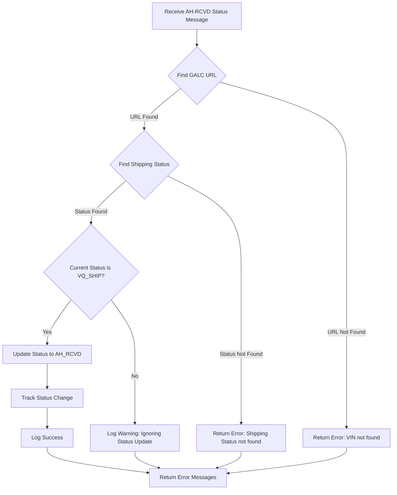
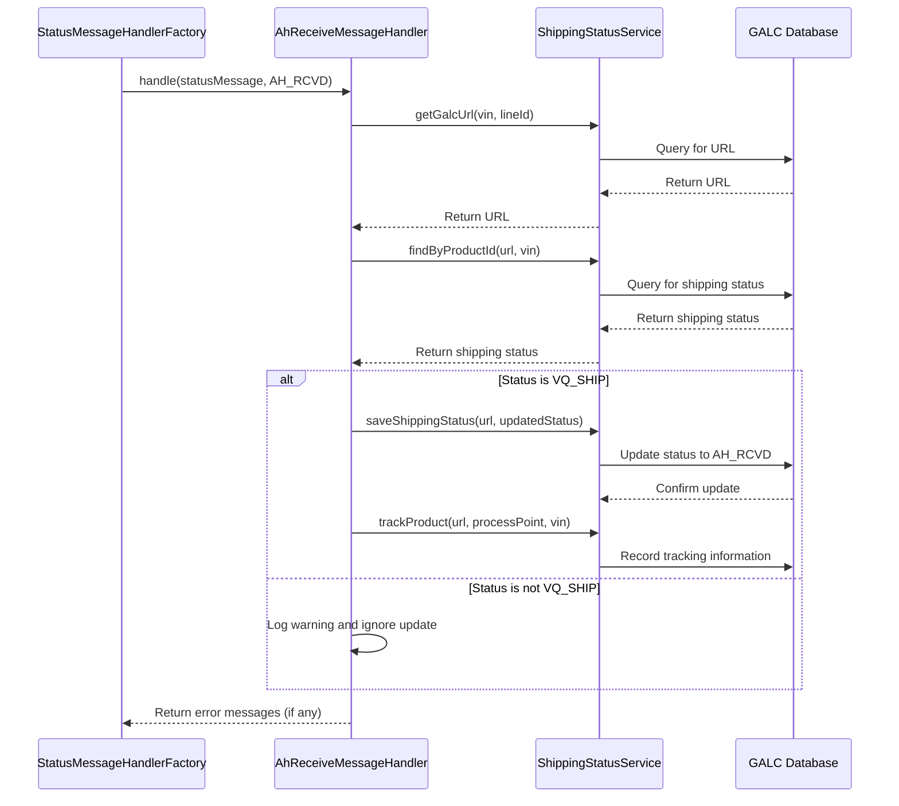

## Purpose

The `AhReceiveMessageHandler` is a specialized component in the AHM LC Sales Interface Service that handles "AH-RCVD" (AHM Receiving) status messages. Its primary purpose is to process notifications when vehicles have been received at the AHM (American Honda Motor) facility after being shipped from the VQ (Vehicle Quality) location.

## How It Works

The handler follows a specific workflow to process AH-RCVD status messages:

1. **Message Reception**: Receives a status message containing vehicle information (primarily the VIN - Vehicle Identification Number).
2. **GALC URL Retrieval**: Determines the appropriate GALC (Global Automotive Logistics Control) URL for the vehicle based on its VIN and line ID.
3. **Record Validation**: Verifies that the vehicle exists in the system and has the correct previous status (VQ_SHIP).
4. **Status Update**: If validation passes, updates the vehicle's status to AH_RCVD (AHM Received).
5. **Tracking**: Records the status change in the tracking system for audit and monitoring purposes.
6. **Error Handling**: Returns appropriate error messages if any step in the process fails.

## Visual Workflow




## Data Flow




## Key Components

### Class Definition


```java
@Component("AhReceiveMessageHandler")
public class AhReceiveMessageHandler implements IStatusMessageHandler {
```

- **@Component Annotation**: Registers this class as a Spring component with the name "AhReceiveMessageHandler"
- **IStatusMessageHandler Interface**: Implements the standard interface for all status message handlers

### Dependencies

```java
@Autowired
private ShippingStatusService shippingStatusService;

@Autowired
private PropertyUtil propertyUtil;
```

- **ShippingStatusService**: Handles database interactions for shipping status records
- **PropertyUtil**: Provides access to configuration properties

### Main Method

```java
@Override
public List<String> handle(StatusMessage statusMessage, StatusEnum status) {
    // Implementation details
}
```

- **Parameters**:
    - `statusMessage`: Contains vehicle and transaction information
    - `status`: The status enum (AH_RCVD in this case)
- **Return Value**: List of error messages (empty if successful)

## Interactions with Other Components

1. **StatusMessageHandlerFactory**: Routes incoming status messages to the appropriate handler based on the status type
2. **ShippingStatusService**: Provides methods to interact with the GALC database
3. **BaseGalcService**: Parent class of ShippingStatusService that handles the low-level REST API calls to the GALC system
4. **PropertyUtil**: Provides configuration properties like process points and URLs

## Database Interactions

The handler doesn't directly interact with the database but uses the ShippingStatusService as an intermediary:

1. **Finding Records**:
    
    ```java
    ShippingStatus shippingStatus = shippingStatusService.findByProductId(galcUrl, statusVehicle.getVin());
    ```
    
    - This translates to a REST API call to the GALC system: `{galcUrl}/RestWeb/{dao}/findByKey`
2. **Updating Records**:
    
    ```java
    shippingStatusService.saveShippingStatus(galcUrl, shippingStatus);
    ```
    
    - This translates to a REST API call: `{galcUrl}/RestWeb/{dao}/save`
3. **Tracking Changes**:
    
    ```java
    shippingStatusService.trackProduct(galcUrl, propertyUtil.getProcessPoint(StatusEnum.AH_RCVD.getType()), statusVehicle.getVin());
    ```
    
    - This translates to a REST API call: `{galcUrl}/RestWeb/TrackingService/track`

## Debugging Queries

For debugging issues in production, you can use the following queries:

1. **Check if a VIN exists in the system**:
    
    - REST API: `{galcUrl}/RestWeb/ShippingStatusDao/findByKey` with payload `{"java.lang.String": "VIN_NUMBER"}`
2. **Check the current status of a vehicle**:
    
    - REST API: `{galcUrl}/RestWeb/ShippingStatusDao/findByKey` with payload `{"java.lang.String": "VIN_NUMBER"}`
    - Look for the `status` field in the response
3. **Check tracking history for a VIN**:
    
    - REST API: `{galcUrl}/RestWeb/TrackingService/findByProductId` with payload `{"java.lang.String": "VIN_NUMBER"}`
4. **Check logs for specific VIN processing**:
    
    - Search for log entries containing the VIN and "AH-RCVD"

## Example Scenario

Let's walk through a complete example of how this handler processes a message:

1. **Incoming Message**:
    
    ```json
    {
      "transaction": {
        "transaction_code": "AH-RCVD",
        "line_id": "1"
      },
      "vehicle": {
        "vin": "5FNYG2H71PB036908"
      }
    }
    ```
    
2. **Processing Steps**:
    
    - Handler receives the message
    - Logs: "Received AH-RCVD Status Message for VIN 5FNYG2H71PB036908"
    - Gets GALC URL for line_id "1" (e.g., "https://galc-server.honda.com")
    - Queries for shipping status using the VIN
    - Finds the record with current status = 1 (VQ_SHIP)
    - Updates status to 2 (AH_RCVD)
    - Saves the updated record
    - Tracks the status change with process point for "AH-RCVD"
    - Logs: "Updated ShippingStatus for VIN 5FNYG2H71PB036908 to status AH_RCVD"
    - Returns empty error list (success)
3. **Error Scenario**:
    
    - If the VIN doesn't exist: "Unable to find the VIN record - 5FNYG2H71PB036908"
    - If shipping status not found: "Shipping Status not found for VIN 5FNYG2H71PB036908"
    - If current status is not VQ_SHIP: "Status for VIN 5FNYG2H71PB036908 is not VQ_SHIP, ignoring status update"

## Code Breakdown

Let's break down the key sections of the code:

1. **Message Extraction**:
    
    ```java
    StatusVehicle statusVehicle = (StatusVehicle) statusMessage.getVehicle();
    logger.info("Received "+status.getType()+" Status Message for VIN {}", statusVehicle.getVin());
    ```
    
    - Extracts the vehicle information from the message
    - Logs the receipt of the message with the VIN
2. **GALC URL Retrieval**:
    
    ```java
    String galcUrl = shippingStatusService.getGalcUrl(statusVehicle.getVin(),
            statusMessage.getTransaction().getLine_id());
    if(StringUtils.isBlank(galcUrl)) {
        logger.info("Unable to find the VIN record - "+statusVehicle.getVin());
        errorMessages.add("Unable to find the VIN record - "+statusVehicle.getVin());
        return errorMessages;
    }
    ```
    
    - Gets the appropriate GALC URL for the VIN and line ID
    - Returns an error if the URL can't be determined
3. **Shipping Status Retrieval**:
    
    ```java
    ShippingStatus shippingStatus = shippingStatusService.findByProductId(galcUrl, statusVehicle.getVin());
    if (Objects.isNull(shippingStatus)) {
        logger.error("Shipping Status not found for VIN {}", statusVehicle.getVin());
        errorMessages.add("Shipping Status not found for VIN "+ statusVehicle.getVin());
        return errorMessages;
    }
    ```
    
    - Retrieves the shipping status record for the VIN
    - Returns an error if the record doesn't exist
4. **Status Validation and Update**:
    
    ```java
    if (shippingStatus.getStatus() == StatusEnum.VQ_SHIP.getStatus()) {
        // Update VIN Status
        shippingStatus.setStatus(StatusEnum.AH_RCVD.getStatus());
        shippingStatusService.saveShippingStatus(galcUrl, shippingStatus);
    
        // Track VIN update
        logger.info("Tracking - "+status.getType()+" Status Message for VIN {}", statusVehicle.getVin());
        shippingStatusService.trackProduct(galcUrl, propertyUtil.getProcessPoint(StatusEnum.AH_RCVD.getType()), statusVehicle.getVin());
    
       
        logger.info("Updated ShippingStatus for VIN "+statusVehicle.getVin()+" to status "+StatusEnum.AH_RCVD);
    } else {
        logger.warn("Status for VIN "+statusVehicle.getVin()+" is not "+StatusEnum.VQ_SHIP+ ", ignoring status update");
    }
    ```
    
    - Checks if the current status is VQ_SHIP
    - If yes, updates the status to AH_RCVD and saves the record
    - Tracks the status change
    - Logs the result
    - If not, logs a warning and ignores the update