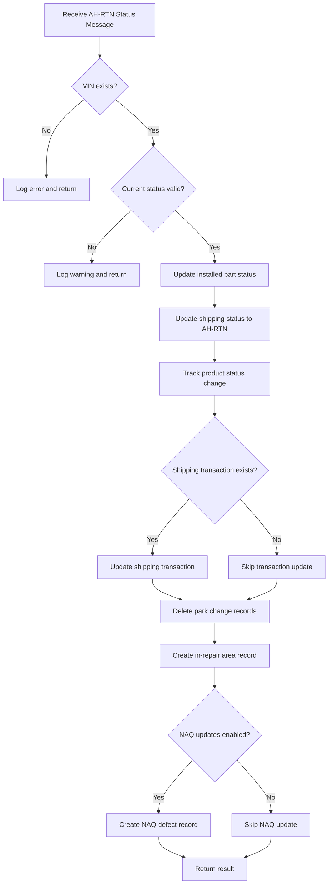

# FactoryReturnMessageHandler Documentation

## Purpose

The `FactoryReturnMessageHandler` is a specialized component in the AHM LC Sales Interface Service that processes "Factory Return" status messages (AH-RTN). When a vehicle needs to be returned to the factory from the AHM facility, this handler updates various systems to reflect this status change, marks installed parts for removal, and creates repair area records.

## How It Works

The FactoryReturnMessageHandler follows a step-by-step process to handle factory return status messages:

1. **Message Reception**: Receives a status message with the "AH-RTN" transaction code
2. **VIN Validation**: Verifies the Vehicle Identification Number (VIN) exists in the system
3. **Status Validation**: Checks if the current status allows for a factory return
4. **Part Status Update**: Marks installed parts for removal (backout)
5. **Status Update**: Changes the vehicle's status to "Factory Return"
6. **Transaction Update**: Updates shipping transaction records
7. **Repair Area Creation**: Creates a record in the repair area system
8. **Defect Recording**: Optionally creates a quality defect record

## Visual Workflow



## Data Flow

### Input
- **StatusMessage object** containing:
  - Transaction information (transaction code "AH-RTN", line ID, etc.)
  - Vehicle information (VIN, timestamp)
  
### Processing
1. **Lookup**: Find the GALC URL for the VIN and line ID
2. **Validation**: Check if shipping status exists and is in a valid state
3. **Updates**: Perform multiple updates to different systems
4. **Creation**: Create new records for repair tracking

### Output
- **List of error messages** (if any occurred during processing)
- **Database updates** across multiple systems:
  - Shipping status records
  - Installed part status
  - Shipping transaction records
  - Repair area records
  - Quality defect records (optional)

## Key Components

### Class Structure
```java
@Component("FactoryReturnMessageHandler")
public class FactoryReturnMessageHandler implements IStatusMessageHandler {
    // Logger
    private final Logger logger = LoggerFactory.getLogger(getClass());
    
    // Autowired services
    @Autowired
    private ShippingStatusService shippingStatusService;
    
    @Autowired
    private InstalledPartService installedPartService;
    
    // Additional services and constants...
    
    // Main handler method
    @Override
    public List<String> handle(StatusMessage statusMessage, StatusEnum status) {
        // Implementation...
    }
}
```

### Important Methods

#### `handle(StatusMessage statusMessage, StatusEnum status)`
- **Purpose**: The main method that processes factory return status messages
- **Parameters**:
  - `statusMessage`: Contains transaction and vehicle information
  - `status`: The status enum (AH-RTN)
- **Returns**: List of error messages (if any)
- **Key Operations**:
  1. Extract VIN from the status message
  2. Find the GALC URL for the VIN
  3. Validate the current shipping status
  4. Update installed part status to BLANK
  5. Update shipping status to AH-RTN
  6. Track the product status change
  7. Update shipping transaction send flag
  8. Delete park change records
  9. Create in-repair area record
  10. Optionally create NAQ defect record

## Interactions with Other Components

The FactoryReturnMessageHandler interacts with several other components in the system:

1. **StatusMessageHandlerFactory**
   - The factory invokes this handler when an "AH-RTN" status message is received
   - The handler returns any error messages to the factory

2. **Service Classes**
   - **ShippingStatusService**: Finds and updates shipping status records
   - **InstalledPartService**: Updates the status of installed parts
   - **ShippingTransactionService**: Updates shipping transaction records
   - **ParkChangeService**: Deletes park change records
   - **InRepairAreaService**: Creates repair area records
   - **NaqDefectAndParkingService**: Creates quality defect records

3. **PropertyUtil**
   - Retrieves configuration values like process points, repair area names, and defect names
   - Determines whether NAQ updates are enabled

## Database Interactions

While the handler doesn't directly interact with databases, it uses service classes that perform database operations through REST API calls to an external GALC system:

### Direct Service Calls

1. **ShippingStatusService**
   - `getGalcUrl(vin, lineId)`: Gets the GALC URL for a VIN
   - `findByProductId(galcUrl, vin)`: Finds shipping status by VIN
   - `saveShippingStatus(galcUrl, shippingStatus)`: Updates shipping status
   - `trackProduct(galcUrl, processPoint, vin)`: Tracks product status changes

2. **InstalledPartService**
   - `updateInstalledPartStatus(galcUrl, vin, partsList, status)`: Updates part status

3. **ShippingTransactionService**
   - `findByProductId(galcUrl, vin)`: Finds shipping transaction by VIN
   - `saveShippingTransaction(galcUrl, transaction)`: Updates shipping transaction

4. **ParkChangeService**
   - `deleteParkChange(galcUrl, vin)`: Deletes park change records

5. **InRepairAreaService**
   - `saveinRepairArea(galcUrl, inRepairArea)`: Creates repair area record

6. **NaqDefectAndParkingService**
   - `createNaqDefectAndParking(galcUrl, vin, defectName, processPoint, repairArea)`: Creates defect record

### Debugging Queries

When troubleshooting issues in production, these queries can be helpful:

1. **Check Factory Return Processing**:
   ```sql
   -- Check for factory return status updates
   SELECT * FROM shipping_status 
   WHERE status = -1 -- AH-RTN status
   AND update_timestamp > [start_date]
   ORDER BY update_timestamp DESC;
   
   -- Check for in-repair area records
   SELECT * FROM in_repair_area
   WHERE repair_area_name = 'VQ_FACTORY_RETURN'
   AND actual_timestamp > [start_date]
   ORDER BY actual_timestamp DESC;
   ```

2. **Verify Part Status Updates**:
   ```sql
   -- Check for parts marked for removal
   SELECT * FROM installed_part
   WHERE status = 'BLANK'
   AND update_timestamp > [start_date]
   ORDER BY update_timestamp DESC;
   ```

3. **Check for NAQ Defect Records**:
   ```sql
   -- Check for factory return defect records
   SELECT * FROM naq_defect
   WHERE defect_name = 'AH_RETURN'
   AND create_timestamp > [start_date]
   ORDER BY create_timestamp DESC;
   ```

## Debugging Steps for Production Issues

If you encounter issues with factory return processing in production, follow these steps:

1. **Verify Message Reception**:
   - Check if the status message was received from the YMS queue
   - Look for logs with "Received AH-RTN Status Message for VIN {vin}"

2. **Check VIN Validation**:
   - If you see "Unable to find the VIN record" or "ShippingStatus not found for VIN", the VIN may not exist in the system
   - Verify the VIN in the shipping_status table

3. **Verify Status Validation**:
   - If you see "Ignoring request. ShippingStatus is equal to AH-RTN", the vehicle is already marked as returned
   - If you see "Ignoring request. ShippingStatus is greater than AH-SHIP", the vehicle is in a later stage of processing
   - If you see "Ignoring request. ShippingStatus is equal to INIT", the vehicle is in the initial state

4. **Check Service Connectivity**:
   - Verify connectivity to the GALC system
   - Look for timeout or connection errors in the logs

5. **Verify Database Updates**:
   - Check if shipping status was updated to AH-RTN
   - Verify that installed parts were marked as BLANK
   - Check if in-repair area record was created
   - Verify NAQ defect record creation (if enabled)

6. **Review Configuration**:
   - Check if the correct process point is configured for AH-RTN
   - Verify repair area and defect names in the configuration

## Example Scenario

Let's walk through a real-world example of how the FactoryReturnMessageHandler processes a message:

1. A quality issue is discovered with a vehicle at the AHM facility
2. The decision is made to return the vehicle to the factory for repair
3. The YMS system generates an "AH-RTN" status message with the vehicle's VIN
4. The message is placed in the YMS queue
5. The ReceivingTransactionTask reads the message from the queue
6. The task passes the message to the StatusMessageHandlerFactory
7. The factory identifies it as an "AH-RTN" message and routes it to the FactoryReturnMessageHandler
8. The handler:
   - Verifies the VIN exists and is in a valid state
   - Updates installed parts to BLANK status (marking them for removal)
   - Changes the vehicle's status to AH-RTN
   - Updates the shipping transaction record
   - Creates a record in the repair area system
   - Creates a quality defect record
9. The vehicle is physically moved to the factory return area
10. Factory personnel address the quality issue

## Summary

The FactoryReturnMessageHandler is a specialized component that:

1. Processes "Factory Return" (AH-RTN) status messages
2. Updates multiple systems to reflect the factory return status
3. Marks installed parts for removal
4. Creates records for tracking repairs and quality issues

This handler plays a crucial role in the quality control process by facilitating the return of vehicles with issues back to the factory for proper repair, ensuring that only vehicles meeting quality standards proceed to dealers.