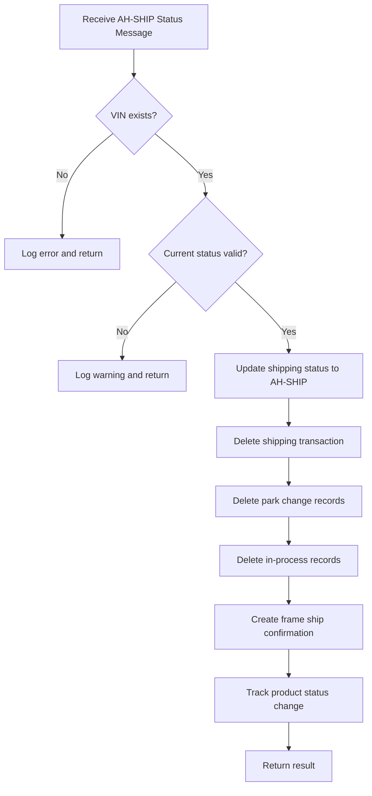

# ShipmentConfirmMessageHandler Documentation

## Purpose

The `ShipmentConfirmMessageHandler` is a specialized component in the AHM LC Sales Interface Service that processes "Shipment Confirmed" status messages (AH-SHIP). When a vehicle is ready to be shipped from the AHM facility, this handler updates various systems to reflect this status change, cleans up related records, and creates a frame ship confirmation record.

## How It Works

The ShipmentConfirmMessageHandler follows a step-by-step process to handle shipment confirmation messages:

1. **Message Reception**: Receives a status message with the "AH-SHIP" transaction code
2. **VIN Validation**: Verifies the Vehicle Identification Number (VIN) exists in the system
3. **Status Validation**: Checks if the current status allows for shipment confirmation
4. **Status Update**: Changes the vehicle's status to "AH-SHIP" (Shipment Confirmed)
5. **Record Cleanup**: Deletes shipping transaction, park change, and in-process records
6. **Frame Ship Confirmation**: Creates a frame ship confirmation record
7. **Product Tracking**: Tracks the product status change in the system

## Visual Workflow



## Data Flow

### Input

- StatusMessage object

   

  containing:

  - Transaction information (transaction code "AH-SHIP", line ID, etc.)
  - Vehicle information (VIN, timestamp)

### Processing

1. **Lookup**: Find the GALC URL for the VIN and line ID
2. **Validation**: Check if shipping status exists and is in a valid state
3. **Updates**: Update shipping status to AH-SHIP
4. **Cleanup**: Delete related records that are no longer needed
5. **Creation**: Create frame ship confirmation record
6. **Tracking**: Track the product status change

### Output

- **List of error messages** (if any occurred during processing)

- Database updates

   

  across multiple systems:

  - Shipping status records
  - Frame ship confirmation records
  - Deletion of shipping transaction, park change, and in-process records

## Key Components

### Class Structure

```java
@Component("ShipmentConfirmMessageHandler")
public class ShipmentConfirmMessageHandler implements IStatusMessageHandler {
    // Logger
    private final Logger logger = LoggerFactory.getLogger(getClass());
    
    // Autowired services
    @Autowired
    private ShippingStatusService shippingStatusService;
    
    @Autowired
    private PropertyUtil propertyUtil;
    
    @Autowired
    private ShippingTransactionService shippingTransactionService;
    
    @Autowired
    private ParkChangeService parkChangeService;
    
    @Autowired
    private InProcessProductService inProcessProductService;
    
    @Autowired
    private FrameShipConfirmationService frameShipConfirmationService;
    
    // Main handler method
    @Override
    public List<String> handle(StatusMessage statusMessage, StatusEnum status) {
        // Implementation...
    }
}
```

### Important Methods

#### `handle(StatusMessage statusMessage, StatusEnum status)`

- **Purpose**: The main method that processes shipment confirmation status messages

- Parameters

  :

  - `statusMessage`: Contains transaction and vehicle information
  - `status`: The status enum (AH-SHIP)

- **Returns**: List of error messages (if any)

- Key Operations

  :

  1. Extract VIN from the status message
  2. Find the GALC URL for the VIN
  3. Validate the current shipping status
  4. Update shipping status to AH-SHIP
  5. Delete shipping transaction records
  6. Delete park change records
  7. Delete in-process records
  8. Create frame ship confirmation record
  9. Track the product status change

## Interactions with Other Components

The ShipmentConfirmMessageHandler interacts with several other components in the system:

1. **StatusMessageHandlerFactory**
   - The factory invokes this handler when an "AH-SHIP" status message is received
   - The handler returns any error messages to the factory
2. **Service Classes**
   - **ShippingStatusService**: Finds and updates shipping status records
   - **ShippingTransactionService**: Deletes shipping transaction records
   - **ParkChangeService**: Deletes park change records
   - **InProcessProductService**: Deletes in-process records
   - **FrameShipConfirmationService**: Creates frame ship confirmation records
3. **PropertyUtil**
   - Retrieves configuration values like process points

## Database Interactions

While the handler doesn't directly interact with databases, it uses service classes that perform database operations through REST API calls to an external GALC system:

### Direct Service Calls

1. **ShippingStatusService**
   - `getGalcUrl(vin, lineId)`: Gets the GALC URL for a VIN
   - `findByProductId(galcUrl, vin)`: Finds shipping status by VIN
   - `saveShippingStatus(galcUrl, shippingStatus)`: Updates shipping status
   - `trackProduct(galcUrl, processPoint, vin)`: Tracks product status changes
2. **ShippingTransactionService**
   - `deleteShippingTransaction(galcUrl, vin)`: Deletes shipping transaction records
3. **ParkChangeService**
   - `deleteParkChange(galcUrl, vin)`: Deletes park change records
4. **InProcessProductService**
   - `deleteInProcess(galcUrl, vin)`: Deletes in-process records
5. **FrameShipConfirmationService**
   - `processFrameShipConfirmation(galcUrl, vin, processPoint, shipDate, shipTime, status)`: Creates frame ship confirmation record

### Debugging Queries

When troubleshooting issues in production, these queries can be helpful:

1. **Check Shipment Confirmation Processing**:

   ```sql
   -- Check for shipment confirmation status updates
   SELECT * FROM shipping_status 
   WHERE status = 4 -- AH-SHIP status
   AND update_timestamp > [start_date]
   ORDER BY update_timestamp DESC;
   
   -- Check for frame ship confirmation records
   SELECT * FROM frame_ship_confirmation
   WHERE record_type = '4' -- AH-SHIP status
   AND event_date > [start_date]
   ORDER BY event_date DESC, event_time DESC;
   ```

2. **Verify Record Cleanup**:

   ```sql
   -- Check if shipping transaction records were deleted
   SELECT * FROM shipping_transaction
   WHERE product_id = '[VIN]';
   
   -- Check if park change records were deleted
   SELECT * FROM park_change
   WHERE product_id = '[VIN]';
   
   -- Check if in-process records were deleted
   SELECT * FROM in_process_product
   WHERE product_id = '[VIN]';
   ```

3. **Check for Product Tracking**:

   ```sql
   -- Check for product tracking records
   SELECT * FROM product_tracking
   WHERE product_id = '[VIN]'
   AND process_point_id = '[process_point_id]'
   ORDER BY actual_timestamp DESC;
   ```

## Debugging Steps for Production Issues

If you encounter issues with shipment confirmation processing in production, follow these steps:

1. **Verify Message Reception**:
   - Check if the status message was received from the YMS queue
   - Look for logs with "Received AH-SHIP Status Message for VIN {vin}"
2. **Check VIN Validation**:
   - If you see "Unable to find the VIN record" or "ShippingStatus not found for VIN", the VIN may not exist in the system
   - Verify the VIN in the shipping_status table
3. **Verify Status Validation**:
   - If you see "Ignoring request. ShippingStatus is greater than AH-SHIP", the vehicle is already in a later stage of processing
   - If you see "Ignoring request. ShippingStatus is equal to INIT", the vehicle is in the initial state
4. **Check Service Connectivity**:
   - Verify connectivity to the GALC system
   - Look for timeout or connection errors in the logs
5. **Verify Database Updates**:
   - Check if shipping status was updated to AH-SHIP
   - Verify that shipping transaction, park change, and in-process records were deleted
   - Check if frame ship confirmation record was created
6. **Review Configuration**:
   - Check if the correct process point is configured for AH-SHIP

## Example Scenario

Let's walk through a real-world example of how the ShipmentConfirmMessageHandler processes a message:

1. A vehicle at the AHM facility has completed all necessary processing and is ready to be shipped
2. The YMS system generates an "AH-SHIP" status message with the vehicle's VIN
3. The message is placed in the YMS queue
4. The ReceivingTransactionTask reads the message from the queue
5. The task passes the message to the StatusMessageHandlerFactory
6. The factory identifies it as an "AH-SHIP" message and routes it to the ShipmentConfirmMessageHandler
7. The handler:
   - Verifies the VIN exists and is in a valid state
   - Updates the vehicle's status to AH-SHIP
   - Deletes shipping transaction, park change, and in-process records
   - Creates a frame ship confirmation record
   - Tracks the product status change
8. The vehicle is now marked as shipped in the system
9. The vehicle is physically loaded onto a transport vehicle for delivery

## Summary

The ShipmentConfirmMessageHandler is a specialized component that:

1. Processes "Shipment Confirmed" (AH-SHIP) status messages
2. Updates the system to reflect that a vehicle is ready for shipment
3. Cleans up related records that are no longer needed
4. Creates a frame ship confirmation record for tracking

This handler plays a crucial role in the vehicle shipping process by ensuring that all necessary system updates are made when a vehicle is confirmed for shipment, allowing for accurate tracking and reporting of vehicle status throughout the delivery process.