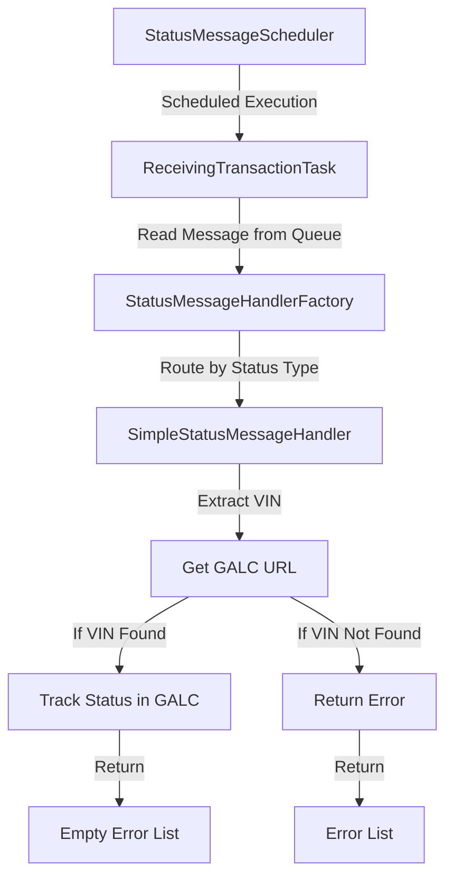
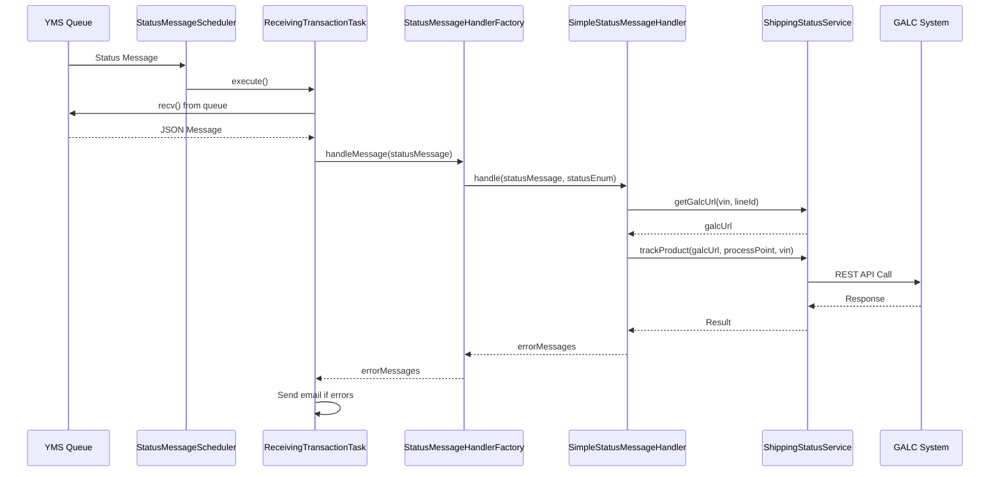

# SimpleStatusMessageHandler Documentation

## Purpose

The `SimpleStatusMessageHandler` is a specialized component in the AHM LC Sales Interface Service that handles various vehicle status updates received from the Yard Management System (YMS). It specifically processes simpler status types that don't require complex business logic, including:

- PPO-ON (Pre-Production Option On)
- PPO-OFF (Pre-Production Option Off)
- ON-TRN (Loaded to Train)
- SHIPPER (Shipper status)
- DLR-RCPT (Dealer Receipt)
- DLR-RTN (Dealer Return)

This handler is part of the status message processing pipeline and is responsible for tracking these status changes in the GALC (Global Automotive Logistics Control) system.

## How It Works

The `SimpleStatusMessageHandler` follows a straightforward process flow:

1. **Receives a status message** from the StatusMessageHandlerFactory
2. **Extracts the VIN** (Vehicle Identification Number) from the message
3. **Retrieves the GALC URL** for the specific vehicle
4. **Tracks the status change** by sending an update to the GALC system
5. **Returns any error messages** that occurred during processing

## Visual Workflow



## Data Flow



## Key Components

### Class Definition
```java
@Component("SimpleStatusMessageHandler")
public class SimpleStatusMessageHandler implements IStatusMessageHandler {
    // Implementation
}
```

The class is annotated with `@Component` and implements the `IStatusMessageHandler` interface, making it a Spring-managed bean that can be injected where needed.

### Dependencies
- **ShippingStatusService**: Used to interact with the GALC system
- **PropertyUtil**: Used to retrieve configuration properties
- **Logger**: Used for logging information and errors

### Main Method: handle()
```java
@Override
public List<String> handle(StatusMessage statusMessage, StatusEnum status) {
    List<String> errorMessages = new ArrayList<String>();
    
    StatusVehicle statusVehicle = (StatusVehicle) statusMessage.getVehicle();
    logger.info("Received "+status.getType()+" Status Message for VIN {}", statusVehicle.getVin());
    String galcUrl = shippingStatusService.getGalcUrl(statusVehicle.getVin(),
            statusMessage.getTransaction().getLine_id());
    if(StringUtils.isBlank(galcUrl)) {
        logger.info("Unable to find the VIN record - "+statusVehicle.getVin());
        errorMessages.add("Unable to find the VIN record - "+statusVehicle.getVin());
        return errorMessages;
    }
    logger.info("Tracking - "+status.getType()+" Status Message for VIN {}", statusVehicle.getVin());
    shippingStatusService.trackProduct(galcUrl, propertyUtil.getProcessPoint(status.getType()), statusVehicle.getVin());
    
    return errorMessages;
}
```

## Interactions with Other Components

The `SimpleStatusMessageHandler` interacts with several other components in the system:

1. **StatusMessageHandlerFactory**: Calls the handler based on the status type
2. **ShippingStatusService**: Used to:
   - Get the GALC URL for a specific VIN
   - Track the product status in the GALC system
3. **PropertyUtil**: Used to retrieve configuration properties, particularly process point IDs
4. **StatusEnum**: Provides the status type information

## Database Interactions

The `SimpleStatusMessageHandler` doesn't directly interact with any database. However, it indirectly interacts with external systems:

1. **GALC System**: Through the `ShippingStatusService`, it sends REST API calls to track vehicle status changes in the GALC system.

The actual database operations happen in the GALC system, which is external to this application.

### REST API Calls

The handler makes the following REST API calls through the `ShippingStatusService`:

1. **Finding VIN Record**:
   ```
   GET {galcUrl}/RestWeb/{dao}/findByKey
   ```

2. **Tracking Status Change**:
   ```
   POST {galcUrl}/RestWeb/TrackingService/track
   ```
   With payload containing:
   - Product Type
   - VIN
   - Process Point ID

## Debugging in Production

### Common Issues

1. **Missing VIN Records**: The most common issue is when a VIN cannot be found in the GALC system.
2. **GALC Connection Issues**: Problems connecting to the GALC system due to network or configuration issues.
3. **Invalid Process Point IDs**: If the process point ID for a status type is not properly configured.

### Debugging Queries

To debug issues in production, you can use the following queries:

1. **Check if a VIN exists in GALC**:
   ```sql
   -- This would be executed in the GALC database
   SELECT * FROM VEHICLE_MASTER WHERE VIN = 'YOUR_VIN_HERE';
   ```

2. **Check status tracking history**:
   ```sql
   -- This would be executed in the GALC database
   SELECT * FROM TRACKING_HISTORY 
   WHERE PRODUCT_ID = 'YOUR_VIN_HERE' 
   ORDER BY TRACKING_TIMESTAMP DESC;
   ```

3. **Check process point configuration**:
   ```sql
   -- This would be executed in the GALC database
   SELECT * FROM PROCESS_POINT 
   WHERE PROCESS_POINT_ID = 'YOUR_PROCESS_POINT_ID';
   ```

### Debugging Steps

If you encounter issues with the `SimpleStatusMessageHandler` in production:

1. **Check Application Logs**:
   - Look for log entries with "Received [STATUS_TYPE] Status Message for VIN"
   - Check for "Unable to find the VIN record" errors
   - Look for exceptions in the logs

2. **Verify Configuration**:
   - Ensure the process point IDs are correctly configured in the application properties
   - Check that the GALC URLs are correctly configured
   - Verify the connection timeouts are appropriate

3. **Test GALC Connectivity**:
   - Try a simple REST call to the GALC system to verify connectivity
   - Check network settings and firewall rules

4. **Verify Message Format**:
   - Ensure the incoming messages from YMS have the correct format
   - Check that the VIN is properly formatted

5. **Check Email Notifications**:
   - The system sends email notifications for errors
   - Check if any error emails have been sent

## Example Use Case

### Scenario: Vehicle Loaded onto Train

When a vehicle is loaded onto a train for shipping, the YMS sends an "ON-TRN" status message to the system. Here's how the process works:

1. **YMS sends a message** to the sales receiving queue:
   ```json
   {
     "TRANSACTION": {
       "TRANSACTION_CODE": "ON-TRN",
       "LINE_ID": "1",
       "TIMESTAMP": "2023-06-15T14:30:00"
     },
     "VEHICLE": {
       "VIN": "1HGCM82633A123456",
       "TIMESTAMP": "2023-06-15T14:30:00"
     }
   }
   ```

2. **StatusMessageScheduler** runs at its scheduled time and triggers the `ReceivingTransactionTask`

3. **ReceivingTransactionTask** reads the message from the queue and passes it to the `StatusMessageHandlerFactory`

4. **StatusMessageHandlerFactory** determines the status type is "ON-TRN" and routes it to the `SimpleStatusMessageHandler`

5. **SimpleStatusMessageHandler** processes the message:
   - Extracts the VIN "1HGCM82633A123456"
   - Gets the GALC URL for this VIN
   - Retrieves the process point ID for "ON-TRN" from properties
   - Calls `trackProduct()` to update the status in GALC
   - Returns an empty error list if successful

6. The vehicle's status is now updated in the GALC system, indicating it has been loaded onto a train.

This example demonstrates how the `SimpleStatusMessageHandler` processes a simple status update and ensures the vehicle's status is properly tracked in the logistics system.