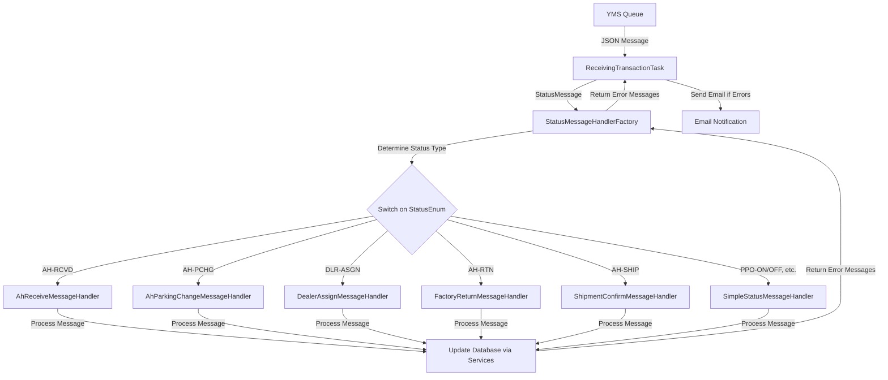

## Purpose

The `StatusMessageHandlerFactory` is a critical component in the AHM LC Sales Interface Service that routes incoming status messages to the appropriate handler based on the transaction code (status type). It acts as a central dispatcher that determines which specialized handler should process each type of status message received from the YMS (Yard Management System) Interface.

## How It Works

The StatusMessageHandlerFactory follows the Factory design pattern to dynamically select the appropriate handler for each type of status message. Here's a step-by-step explanation of how it operates:

1. **Message Reception**: The factory receives a `StatusMessage` object from the `ReceivingTransactionTask`.
2. **Status Identification**: It extracts the transaction code from the message and maps it to a corresponding `StatusEnum` value.
3. **Handler Selection**: Based on the identified status enum, it routes the message to the appropriate specialized handler.
4. **Error Handling**: It captures any exceptions during processing and returns error messages for reporting.

## Key Components

### Injected Handlers

The factory uses Spring's dependency injection to autowire various specialized handlers:

- **ahReceiveMessageHandler**: Processes AHM receiving status messages (AH-RCVD)
- **ahParkingChangeMessageHandler**: Handles parking change status messages (AH-PCHG)
- **dealerAssignMessageHandler**: Processes dealer assignment status messages (DLR-ASGN)
- **factoryReturnMessageHandler**: Handles factory return status messages (AH-RTN)
- **shipmentConfirmMessageHandler**: Processes shipment confirmation status messages (AH-SHIP)
- **simpleStatusMessageHandler**: Handles various simpler status messages (PPO-ON, PPO-OFF, ON-TRN, SHIPPER, DLR-RCPT, DLR-RTN)

### Main Method

- **handleMessage()**: The core method that takes a StatusMessage, identifies its type, and routes it to the appropriate handler. It returns a list of error messages if any occur during processing.

## Interactions

The StatusMessageHandlerFactory interacts with several components in the system:

1. **ReceivingTransactionTask**: This task calls the factory's `handleMessage()` method with status messages received from the YMS queue.
    
2. **Status Message Handlers**: The factory delegates processing to specialized handlers that implement the `IStatusMessageHandler` interface.
    
3. **StatusEnum**: Used to identify and categorize different types of status messages.
    
4. **Database (Indirect)**: While the factory itself doesn't interact directly with the database, the handlers it invokes perform database operations through service classes like `ShippingStatusService`.
    

## Visual Workflow



## Data Flow

1. **Input**: The factory receives a `StatusMessage` object containing:
    
    - Transaction information (destination, plant ID, transaction code, timestamp)
    - Vehicle information (VIN, model, etc.)
2. **Processing**:
    
    - The transaction code is mapped to a `StatusEnum` value
    - The appropriate handler is selected based on the enum
    - The handler processes the message and updates the database if needed
3. **Output**:
    
    - A list of error messages (if any occurred during processing)
    - Database updates (performed by the handlers)

## Database Interactions (Indirect)

While the StatusMessageHandlerFactory doesn't directly interact with databases, the handlers it invokes do perform database operations through service classes:

1. **ShippingStatusService**: Used by handlers to:
    
    - Find shipping status records by VIN (`findByProductId`)
    - Update shipping status records (`saveShippingStatus`)
    - Track product status changes (`trackProduct`)
2. **Database Queries** (executed by services):
    
    - The services use REST API calls to interact with an external GALC system
    - Queries include finding records by key, saving records, and tracking status changes

## Example Usage

Here's a real-world example of how the StatusMessageHandlerFactory processes a message:

1. A vehicle arrives at the AHM facility and is scanned
2. The YMS system generates an "AH-RCVD" status message
3. The message is placed in the YMS queue
4. The ReceivingTransactionTask reads the message from the queue
5. The task passes the message to the StatusMessageHandlerFactory
6. The factory identifies it as an "AH-RCVD" message and routes it to the AhReceiveMessageHandler
7. The handler updates the vehicle's status in the database and tracks the status change
8. Any error messages are returned to the task for email notification

## Debugging Queries

When troubleshooting issues in production, these queries can be helpful:

1. **Check Message Processing Status**:
    
    - Look for error logs with the pattern: "Error processing message from YMS"
    - Check email notifications for detailed error messages
2. **Verify Handler Selection**:
    
    - Look for logs with the pattern: "Unknown status message" to identify unrecognized status types
3. **Track Database Updates**:
    
    - Check logs with patterns like "Updated ShippingStatus for VIN" to confirm successful updates
    - Look for "Shipping Status not found for VIN" to identify missing records
4. **Monitor REST API Calls**:
    
    - Check for "Error while sending data to external system" logs to identify communication issues with the GALC system

## Code Breakdown

Let's break down the key parts of the StatusMessageHandlerFactory:

1. **Class Declaration and Dependencies**:
    
    ```java
    @Component
    public class StatusMessageHandlerFactory {
        // Logger for tracking operations
        private final Logger logger = LoggerFactory.getLogger(getClass());
        
        // Autowired handlers for different message types
        @Qualifier("AhParkingChangeMessageHandler")
        @Autowired
        private IStatusMessageHandler ahParkingChangeMessageHandler;
        
        // Additional handlers...
    }
    ```
    
2. **Message Handling Method**:
    
    ```java
    public List<String> handleMessage(StatusMessage statusMessage) {
        List<String> errorMessages = new ArrayList<String>();
        
        // Identify the status type from the transaction code
        StatusEnum statusEnum = StatusEnum.getStatusByType(statusMessage.getTransaction().getTransaction_code());
        if (Objects.isNull(statusEnum)) {
            logger.error("Invalid status received from YMS Interface");
            return errorMessages;
        }
        
        // Route to appropriate handler based on status type
        try {
            switch (statusEnum) {
                case AH_RCVD:
                    errorMessages = ahReceiveMessageHandler.handle(statusMessage, statusEnum);
                    break;
                // Additional cases...
                default:
                    logger.warn("Unknown status message {}", statusMessage.toString());
                    errorMessages.add("Unknown status message " + statusMessage.toString());
            }
        } catch (Exception e) {
            logger.error(e.getMessage());
            errorMessages.add("status message: " + statusMessage.toString() + " - " + e.getMessage());
        }
        
        return errorMessages;
    }
    ```
    

## Summary

The StatusMessageHandlerFactory is a crucial component in the AHM LC Sales Interface Service that:

1. Acts as a central router for all status messages received from the YMS Interface
2. Determines the appropriate handler for each message based on its status type
3. Delegates the actual processing to specialized handlers
4. Captures and reports any errors that occur during processing

This factory pattern allows the system to easily handle different types of status messages with specialized logic while maintaining a clean, organized codebase. It also provides a single point of entry for all status message processing, making it easier to monitor and debug the system.