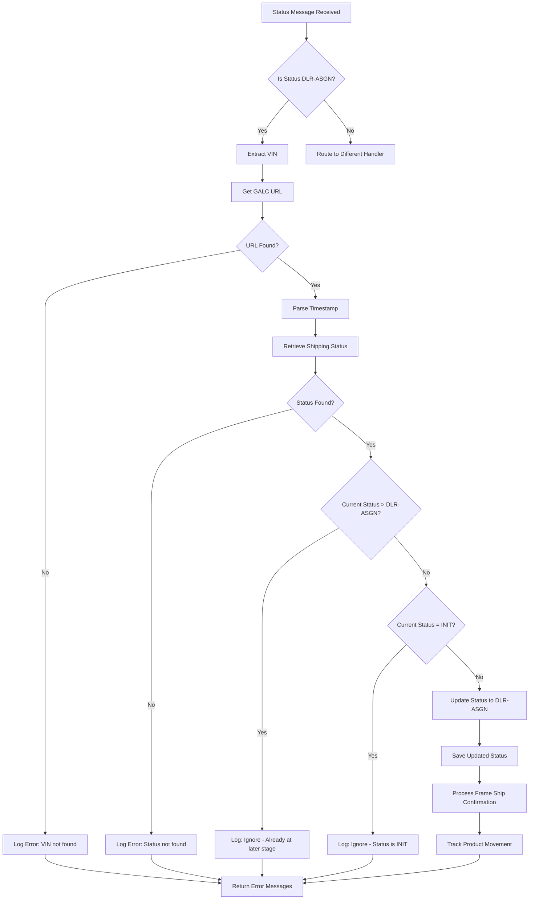
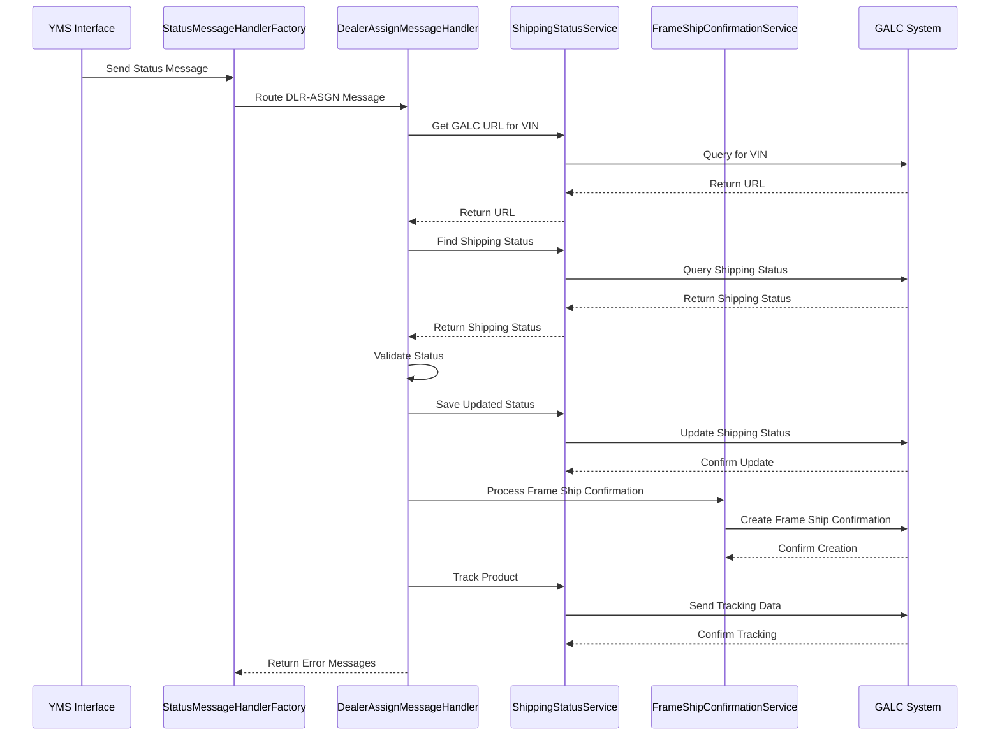

# DealerAssignMessageHandler Documentation

  

## Purpose

  

The `DealerAssignMessageHandler` is a specialized component in the AHM LC Sales Interface Service that processes "Dealer Assigned" (DLR-ASGN) status messages. This handler is responsible for updating the shipping status of a vehicle when it has been assigned to a dealer, which is a critical step in the vehicle delivery process. It marks the point where a vehicle is released from the Foreign Trade Zone (FTZ) and assigned to a specific dealer.

  

## How It Works

  

The `DealerAssignMessageHandler` follows a specific workflow to process dealer assignment messages:

  

1. Receives a status message with the "DLR-ASGN" status code

2. Extracts the Vehicle Identification Number (VIN) from the message

3. Retrieves the vehicle's current shipping status from the GALC system

4. Validates that the status update is appropriate (not already at a later stage)

5. Updates the shipping status to "DLR-ASGN" (Dealer Assigned)

6. Creates a frame ship confirmation record with dealer assignment details

7. Tracks the product movement through the system

  

## Key Components

  

### Class Definition

```java

@Component("DealerAssignMessageHandler")

public class DealerAssignMessageHandler implements IStatusMessageHandler {

    // Implementation details

}

```

  

### Dependencies

- **ShippingStatusService**: Manages the shipping status of vehicles

- **FrameShipConfirmationService**: Handles frame shipping confirmation records

- **PropertyUtil**: Provides access to configuration properties

  

### Main Method

- **handle(StatusMessage statusMessage, StatusEnum status)**: Processes the dealer assignment message and returns any error messages

  

## Interactions

  

The `DealerAssignMessageHandler` interacts with several components in the system:

  

1. **StatusMessageHandlerFactory**: Routes incoming status messages to the appropriate handler based on the status code

2. **GALC System**: External system that stores vehicle and shipping information

   - Communicates via REST API calls

   - Retrieves and updates shipping status records

   - Creates frame ship confirmation records

   - Tracks product movement

  

3. **Database Interactions**:

   - No direct database interactions (uses services that communicate with GALC)

   - Indirectly works with:

     - ShippingStatus table (via ShippingStatusService)

     - FrameShipConfirmation table (via FrameShipConfirmationService)

  

## Visual Workflow

  



  

## Data Flow

  



  

## Database Interactions

  

While the `DealerAssignMessageHandler` doesn't directly interact with databases, it uses services that communicate with the GALC system, which manages the following data:

  

### ShippingStatus Table

- **findByProductId**: Retrieves shipping status by VIN

- **saveShippingStatus**: Updates the shipping status

  

### FrameShipConfirmation Table

- **processFrameShipConfirmation**: Creates a new frame ship confirmation record

  

## Debugging Queries

  

To debug issues with the `DealerAssignMessageHandler` in production, you can use the following queries:

  

### 1. Check if a VIN exists in the system

```sql

SELECT * FROM SHIPPING_STATUS WHERE VIN = '[VIN_NUMBER]';

```

  

### 2. Check the current status of a vehicle

```sql

SELECT VIN, STATUS, LAST_UPDATED

FROM SHIPPING_STATUS

WHERE VIN = '[VIN_NUMBER]';

```

  

### 3. Check frame ship confirmation records for a VIN

```sql

SELECT * FROM FRAME_SHIP_CONFIRMATION

WHERE PRODUCT_ID = '[VIN_NUMBER]'

ORDER BY EVENT_DATE DESC, EVENT_TIME DESC;

```

  

### 4. Check status history for a VIN

```sql

SELECT * FROM PRODUCT_TRACKING

WHERE PRODUCT_ID = '[VIN_NUMBER]'

ORDER BY TRACKING_DATE DESC, TRACKING_TIME DESC;

```

  

### 5. Check for errors related to a VIN

```sql

SELECT * FROM ERROR_LOG

WHERE MESSAGE LIKE '%[VIN_NUMBER]%'

ORDER BY ERROR_DATE DESC, ERROR_TIME DESC;

```

  

## Debugging Steps for Production Issues

  

If you encounter issues with the Dealer Assignment process in production, follow these steps:

  

1. **Verify the message was received**

   - Check application logs for entries containing "Received DLR-ASGN Status Message for VIN [VIN_NUMBER]"

   - If not found, the message may not have been received or routed correctly

  

2. **Check if the GALC URL was found**

   - Look for log entries containing "Unable to find the VIN record"

   - If found, verify the VIN exists in the system and is associated with the correct line ID

  

3. **Verify the shipping status record exists**

   - Use the query to check if the shipping status record exists for the VIN

   - If not found, the vehicle may not have been properly initialized in the system

  

4. **Check the current status of the vehicle**

   - If the status is already greater than DLR-ASGN (status > 3), the system will ignore the message

   - If the status is INIT (status = 0), the system will also ignore the message

   - The vehicle should be at AH-RCVD (status = 2) to accept a DLR-ASGN message

  

5. **Verify frame ship confirmation was created**

   - Check if a frame ship confirmation record was created for the VIN with the process point ID for DLR-ASGN

   - If not found, check if the frame record exists and has an engine serial number assigned

  

6. **Check for tracking record**

   - Verify that a tracking record was created for the VIN with the DLR-ASGN process point ID

   - If not found, there may be an issue with the tracking service

  

7. **Review error messages**

   - Check the application logs and error log table for any error messages related to the VIN

   - Common errors include:

     - "Unable to find the VIN record"

     - "ShippingStatus not found for VIN"

     - "Ignoring request. ShippingStatus is greater than DLR-ASGN"

     - "Ignoring request. ShippingStatus is equal to INIT"

     - "NO Engine Assigned to VIN"

  

## Example Scenario

  

Let's walk through an example of how the `DealerAssignMessageHandler` processes a dealer assignment message:

  

### Input Message

```json

{

  "transaction": {

    "transaction_code": "DLR-ASGN",

    "line_id": "1"

  },

  "vehicle": {

    "vin": "1HGCY2F79RA058411",

    "timestamp": "2023-10-02T12:00:00"

  }

}

```

  

### Processing Steps

  

1. The message is received by the StatusMessageHandlerFactory

2. The factory identifies the status as "DLR-ASGN" and routes it to the DealerAssignMessageHandler

3. The handler extracts the VIN "1HGCY2F79RA058411" and line ID "1"

4. The handler gets the GALC URL for the VIN and line ID (e.g., "https://galc.honda.com")

5. The handler parses the timestamp to get the date "231002" and time "120000"

6. The handler retrieves the current shipping status for the VIN

7. The handler verifies that the current status is not greater than DLR-ASGN and not equal to INIT

8. The handler updates the shipping status to DLR-ASGN (status = 3)

9. The handler creates a frame ship confirmation record with:

   - Product ID: 1HGCY2F79RA058411

   - Process Point ID: AAH1DC1P00101 (for DLR-ASGN)

   - Event Date: 231002

   - Event Time: 120000

   - Record Type: 3 (for DLR-ASGN)

10. The handler tracks the product movement in the GALC system

11. The handler returns any error messages (hopefully none in this case)

  

This process ensures that the vehicle is properly marked as assigned to a dealer and ready for the next step in the delivery process.