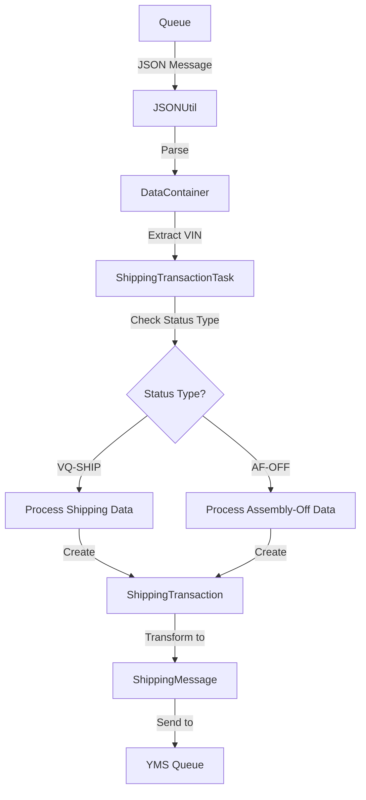
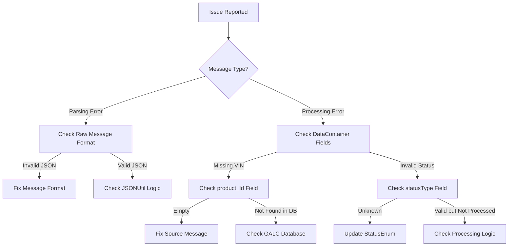

# DataContainer Documentation

## Purpose

The `DataContainer` class serves as a crucial intermediary in the Honda AHM LC Sales Interface Service. It acts as a parsing container for incoming messages from various queues, extracting and holding key information about vehicles, manufacturing processes, and status updates.

Think of it as a "translator" that takes raw message data and converts it into a structured format that the rest of the application can easily work with.

## How It Works

The DataContainer works like a bridge between external systems and the internal application:

1. **Message Reception**: When a message is received from a queue (like the LC Receiving Queue), it arrives as a JSON string
2. **Parsing**: The `JSONUtil.getDataContainerFromJSON()` method converts this JSON string into a DataContainer object
3. **Data Extraction**: The application can then easily access the structured data through getter methods
4. **Processing**: Based on the extracted data (especially the status type), the application determines what actions to take

This process allows the application to handle different types of messages in a consistent way, regardless of their source or format.

## Key Components

### Fields

The DataContainer class contains several important fields that hold critical information:

| Field | Description | Example Value |
|-------|-------------|---------------|
| `product_Id` | Vehicle Identification Number (VIN) | "5FNYG2H71PB036908" |
| `process_Point_Id` | ID of the process point in manufacturing | "AFOFF" |
| `plant_Id` | ID of the manufacturing plant | "AHM" |
| `line_Id` | ID of the production line | "L1" |
| `product_Spec_Code` | Specification code for the product | "CR6H9TKNW" |
| `kd_lot` | Knocked Down lot information | "KD12345" |
| `production_lot` | Production lot information | "PL67890" |
| `purchase_contract_number` | Contract number for purchase | "CN123456" |
| `print_location` | Location for printing | "MAIN" |
| `delimiter` | Delimiter used in the message | "," |
| `statusType` | Type of status update | "VQ-SHIP" |

### Methods

The class provides getter and setter methods for all fields, making it easy to access and modify the data. The most important methods include:

- **getProduct_Id()**: Returns the VIN of the vehicle
- **getProcess_Point_Id()**: Returns the process point ID
- **getStatusType()**: Returns the type of status update
- **toString()**: Returns a string representation of all fields for logging purposes

## Integration with Other Files

The DataContainer class integrates with several key components in the system:

### Direct Integrations

1. **JSONUtil.java**
   - Contains the `getDataContainerFromJSON()` method that parses JSON strings into DataContainer objects
   - This is the primary way DataContainer objects are created

2. **ShippingTransactionTask.java**
   - Uses DataContainer to process messages from the LC Receiving Queue
   - Extracts information like VIN, line ID, and status type to determine what actions to take
   - Uses the status type to decide whether to process shipping data or assembly-off data

### Indirect Integrations

1. **Message Models**
   - Works alongside other message models like `ShippingMessage` and `StatusMessage`
   - While DataContainer parses incoming messages, these other models format outgoing messages

2. **Service Layer**
   - Information from DataContainer is used by services like `FrameService` and `ShippingStatusService`
   - These services use the extracted data to retrieve or update information in the GALC database

## Data Flow



## Example Usage

Here's a real-world example of how DataContainer is used in the application:

```java
// 1. Receive a message from the queue
String message = queueManagerService.recv(propertyUtil.getLCReceivingQueueName());

// 2. Parse the message into a DataContainer
DataContainer dataContainer = JSONUtil.getDataContainerFromJSON(message);

// 3. Extract key information
String productId = dataContainer.getProduct_Id();
String lineId = dataContainer.getLine_Id();
String statusType = dataContainer.getStatusType();

// 4. Process based on status type
if (dataContainer.getStatusType().equals(StatusEnum.VQ_SHIP.getType())) {
    // Process shipping data
    map = populateShippingData(galcUrl, dataContainer, errorMessages);
} else {
    // Process assembly-off data
    map = populateAFOffData(galcUrl, dataContainer, errorMessages);
}

// 5. Create a ShippingTransaction with the data
ShippingTransaction shippingTransaction = new ShippingTransaction();
shippingTransaction.setVin(dataContainer.getProduct_Id());
// Set other fields...

// 6. Create a ShippingMessage to send to YMS
ShippingMessage shippingMessage = new ShippingMessage();
Transaction transaction = new Transaction();
transaction.setPlant_id(dataContainer.getPlant_Id());
transaction.setLine_id(dataContainer.getLine_Id());
// Set other fields...
```

## Database Interactions

The DataContainer class itself doesn't directly interact with databases. However, it plays a crucial role in processes that lead to database interactions:

### Indirect Database Interactions

1. **Data Retrieval**:
   - The VIN (product_Id) from DataContainer is used to retrieve vehicle information from the GALC database
   - Example: `Frame frame = frameService.getFrame(galcUrl, dataContainer.getProduct_Id());`

2. **Status Updates**:
   - The status type from DataContainer determines what status updates to make in the database
   - Example: `shippingStatusService.trackProduct(galcUrl, propertyUtil.getProcessPoint(dataContainer.getStatusType()), dataContainer.getProduct_Id());`

### Database Queries

While DataContainer doesn't execute queries directly, here are some example queries that might be triggered based on DataContainer information:

```sql
-- Retrieve frame information using product_Id
SELECT * FROM FRAME WHERE PRODUCT_ID = '[dataContainer.getProduct_Id()]';

-- Retrieve frame spec using product_Spec_Code
SELECT * FROM FRAME_SPEC WHERE PRODUCT_SPEC_CODE = '[dataContainer.getProduct_Spec_Code()]';

-- Update shipping status for a vehicle
UPDATE SHIPPING_STATUS 
SET STATUS = 1, 
    ACTUAL_TIMESTAMP = CURRENT_TIMESTAMP 
WHERE VIN = '[dataContainer.getProduct_Id()]';
```

## Debugging Production Issues

### Common Issues and Solutions

#### 1. Missing or Invalid VIN

**Symptoms:**
- Error messages in logs: "No ProductId in message" or "Cannot retrieve shipping information"
- Shipping messages not being created

**Debugging Steps:**
1. Check if the DataContainer has a valid product_Id:
```java
logger.info("DataContainer: " + dataContainer.toString());
if (StringUtils.isBlank(dataContainer.getProduct_Id())) {
    logger.error("Missing VIN in message");
}
```

2. Verify if the VIN exists in the GALC database:
```sql
-- Check if VIN exists
SELECT * FROM FRAME WHERE PRODUCT_ID = '[dataContainer.getProduct_Id()]';
```

**Resolution:**
- Ensure the incoming message contains a valid VIN
- Check the JSON parsing logic in JSONUtil.getDataContainerFromJSON()
- Verify the message format from the source system

#### 2. Invalid Status Type

**Symptoms:**
- Error messages in logs: "Unknown status type" or "Cannot process message"
- Status updates not being processed correctly

**Debugging Steps:**
1. Check the status type in the DataContainer:
```java
logger.info("Status Type: " + dataContainer.getStatusType());
StatusEnum statusEnum = StatusEnum.getStatusByType(dataContainer.getStatusType());
if (statusEnum == null) {
    logger.error("Unknown status type: " + dataContainer.getStatusType());
}
```

2. Verify if the status type is valid:
```sql
-- Check valid status types
SELECT * FROM STATUS_TYPES WHERE TYPE_CODE = '[dataContainer.getStatusType()]';
```

**Resolution:**
- Ensure the incoming message contains a valid status type
- Update the StatusEnum if new status types have been added
- Check the message format from the source system

#### 3. JSON Parsing Errors

**Symptoms:**
- Error messages in logs: "Error parsing JSON message"
- NullPointerException when accessing DataContainer fields

**Debugging Steps:**
1. Check the raw message format:
```java
logger.info("Raw message: " + message);
try {
    DataContainer dataContainer = JSONUtil.getDataContainerFromJSON(message);
    logger.info("Parsed successfully: " + dataContainer.toString());
} catch (Exception e) {
    logger.error("Error parsing message: " + e.getMessage());
}
```

2. Verify the message format in the queue:
```sql
-- Check message format in queue
SELECT MESSAGE_ID, MESSAGE_CONTENT 
FROM QUEUE_MESSAGES 
WHERE QUEUE_NAME = 'LC_RECEIVING_QUEUE' 
ORDER BY CREATE_TIMESTAMP DESC;
```

**Resolution:**
- Fix the JSON format in the source system
- Update the JSONUtil.getDataContainerFromJSON() method to handle different formats
- Add more robust error handling for JSON parsing

### Visual Debugging Flow



## Summary

The DataContainer class is a fundamental component in the Honda AHM LC Sales Interface Service that:

1. **Parses incoming messages** from queues into a structured format
2. **Extracts key information** like VIN, plant ID, and status type
3. **Facilitates decision-making** based on the message content
4. **Bridges external systems** with internal application logic

Understanding how DataContainer works is essential for troubleshooting issues in the message flow between GALC and YMS systems, as it serves as the entry point for all incoming messages that trigger shipping and status update processes.