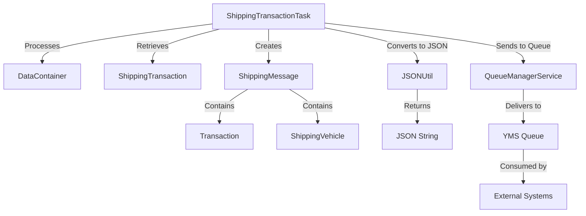
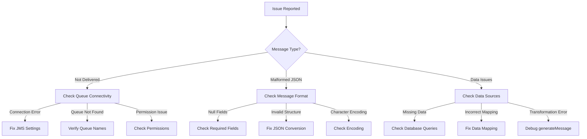

# ShippingMessage Documentation

## Purpose

The `ShippingMessage` class is a critical message model in the Honda AHM LC Sales Interface Service that serves as a standardized format for outgoing messages to the Yard Management System (YMS). It encapsulates all the necessary vehicle and transaction information required by downstream systems to process vehicle shipping events.

Think of ShippingMessage as an "envelope" that packages vehicle data in a consistent format that external systems can understand and process. It's the primary way the application communicates shipping-related information to other systems.

## How It Works

The ShippingMessage class works as a structured container for outgoing messages:

1. **Data Collection**: The system gathers vehicle and transaction data from various sources (database, incoming messages)
2. **Message Creation**: A new ShippingMessage object is created and populated with this data
3. **JSON Conversion**: The ShippingMessage is converted to a JSON string using the JSONUtil class
4. **Queue Transmission**: The JSON message is sent to the appropriate queue for consumption by other systems

This standardized approach ensures that all outgoing messages follow the same format, making them easier for receiving systems to parse and process.

## Key Components

The ShippingMessage class has a simple structure with two main components:

### Fields

| Field | Type | Description |
|-------|------|-------------|
| `transaction` | Transaction | Contains metadata about the transaction (plant ID, line ID, transaction code, etc.) |
| `vehicle` | Vehicle | Contains detailed information about the vehicle (VIN, model, color, engine number, etc.) |

### Methods

The class provides basic getter and setter methods for its fields:

- **getTransaction()**: Returns the Transaction object
- **setTransaction(Transaction)**: Sets the Transaction object
- **getVehicle()**: Returns the Vehicle object
- **setVehicle(Vehicle)**: Sets the Vehicle object
- **toString()**: Returns a string representation of the message for logging purposes

## Related Classes

The ShippingMessage class works with several related classes:

### Transaction Class

The Transaction class contains metadata about the shipping transaction:

- `destination_environment`: Target environment for the message
- `destination_site`: Target site for the message
- `plant_id`: ID of the manufacturing plant
- `line_id`: ID of the production line
- `transaction_code`: Code indicating the type of transaction (e.g., "VQ-SHIP")
- `description`: Human-readable description of the transaction
- `transaction_timestamp`: Timestamp when the transaction occurred

### Vehicle Class (Abstract)

The Vehicle class is an abstract base class that defines the common interface for vehicle information.

### ShippingVehicle Class

The ShippingVehicle class extends Vehicle and contains detailed information about the vehicle being shipped:

- `vin`: Vehicle Identification Number
- `model_id`: Model identifier
- `model_type`: Type of model
- `model_option`: Model options
- `color_code`: Color code
- `engine_number`: Engine serial number
- `key_number`: Key identifier
- `issue_date`: Date of issue
- `adc_process_code`: ADC process code
- `product_lot_number`: Production lot number
- `kd_lot_number`: Knocked Down lot number
- `price`: Vehicle price
- `assembly_off_date`: Date of assembly completion
- `print_loc`: Print location
- `ccc_number`: CCC registration number
- `parts_installed`: Parts installation information
- `purchase_contract_number`: Contract number
- `fif_codes`: List of FIF codes
- `timestamp`: Transaction timestamp

## Integration with Other Files

The ShippingMessage class integrates with several key components in the system:

### Direct Integrations

1. **JSONUtil.java**
   - Contains the `convertShippingMessageToJSON()` method that converts ShippingMessage objects to JSON strings
   - This is how ShippingMessage objects are prepared for transmission to queues

2. **ShippingTransactionTask.java**
   - Creates and populates ShippingMessage objects based on ShippingTransaction data
   - Uses the `generateMessage()` method to transform business data into the message format
   - Sends the JSON-converted message to the YMS queue

### Indirect Integrations

1. **QueueManagerService.java**
   - Receives the JSON-converted ShippingMessage and sends it to the appropriate queue
   - Handles the actual transmission of the message to external systems

2. **DataContainer.java**
   - Provides some of the data used to populate the ShippingMessage
   - While DataContainer parses incoming messages, ShippingMessage formats outgoing messages

## Data Flow



## Example Usage

Here's a real-world example of how ShippingMessage is used in the application:

```java
// 1. Create a new ShippingMessage
ShippingMessage shippingMessage = new ShippingMessage();

// 2. Create and populate a ShippingVehicle
ShippingVehicle shippingVehicle = new ShippingVehicle();
shippingVehicle.setVin("5FNYG2H71PB036908");
shippingVehicle.setModel_id("CR-V");
shippingVehicle.setColor_code("NH830M");
shippingVehicle.setEngine_number("K24Z12345");
// Set other vehicle properties...

// 3. Create and populate a Transaction
Transaction transaction = new Transaction();
transaction.setPlant_id("AHM");
transaction.setLine_id("L1");
transaction.setTransaction_code("VQ-SHIP");
transaction.setDescription("VQ SHIP");
transaction.setDestination_site("YMS");
transaction.setDestination_environment("PROD");
transaction.setTransaction_timestamp("20230615120000");

// 4. Set the vehicle and transaction in the message
shippingMessage.setVehicle(shippingVehicle);
shippingMessage.setTransaction(transaction);

// 5. Convert the message to JSON
String jsonMessage = JSONUtil.convertShippingMessageToJSON(shippingMessage);

// 6. Send the JSON message to the queue
queueManagerService.send(propertyUtil.getYMSQueueName(), jsonMessage);
```

## JSON Message Format

When converted to JSON, a ShippingMessage looks like this:

```json
{
  "transaction": {
    "DESTINATION_ENVIRONMENT": "PROD",
    "DESTINATION_SITE": "YMS",
    "PLANT_ID": "AHM",
    "LINE_ID": "L1",
    "TRANSACTION_CODE": "VQ-SHIP",
    "DESCRIPTION": "VQ SHIP",
    "TRANSACTION_TIMESTAMP": "20230615120000"
  },
  "vehicle": {
    "vin": "5FNYG2H71PB036908",
    "model_id": "CR-V",
    "model_type": "SUV",
    "model_option": "EXL",
    "color_code": "NH830M",
    "engine_number": "K24Z12345",
    "key_number": "H12345",
    "issue_date": "20230610",
    "adc_process_code": "ADC001",
    "product_lot_number": "PL20230615001",
    "kd_lot_number": "KD20230601002",
    "price": "32500.00",
    "assembly_off_date": "20230615",
    "print_loc": "MAIN",
    "ccc_number": "CCC12345",
    "parts_installed": "Y",
    "purchase_contract_number": "PC12345",
    "fif_codes": ["FIF001"],
    "timestamp": "20230615120000"
  }
}
```

## Database Interactions

The ShippingMessage class itself doesn't directly interact with databases. However, the data it contains is often retrieved from database tables:

### Indirect Database Interactions

1. **Data Retrieval**:
   - Vehicle information is retrieved from the GALC database via services like FrameService
   - Example: `Frame frame = frameService.getFrame(galcUrl, productId);`

2. **FIF Codes**:
   - For PMC (Plant Manufacturing Control) messages, FIF codes are retrieved from the database
   - Example: `String fifCode = shippingTransactionService.getFIFCodeBySpecCode(galcUrl, shippingTransaction.getVin());`

### Database Queries

While ShippingMessage doesn't execute queries directly, here are some example queries that might be used to retrieve data for ShippingMessage:

```sql
-- Retrieve frame information for a VIN
SELECT * FROM FRAME WHERE PRODUCT_ID = '5FNYG2H71PB036908';

-- Retrieve FIF codes for a specific spec code
SELECT FIF_CODE FROM SALES_ORDER_FIF_CODES 
WHERE SPEC_CODE = (SELECT PRODUCT_SPEC_CODE FROM FRAME WHERE PRODUCT_ID = '5FNYG2H71PB036908');

-- Retrieve shipping transaction information
SELECT * FROM SHIPPING_TRANSACTION WHERE VIN = '5FNYG2H71PB036908';
```

## Debugging Production Issues

### Common Issues and Solutions

#### 1. Message Not Being Delivered to YMS Queue

**Symptoms:**
- No message appears in the YMS queue
- No errors in logs but the expected action doesn't occur in downstream systems

**Debugging Steps:**
1. Check if the ShippingMessage was created successfully:
```java
logger.info("ShippingMessage created: " + shippingMessage.toString());
```

2. Check if the JSON conversion was successful:
```java
String jsonMessage = JSONUtil.convertShippingMessageToJSON(shippingMessage);
logger.info("JSON message: " + jsonMessage);
if (StringUtils.isBlank(jsonMessage)) {
    logger.error("Failed to convert ShippingMessage to JSON");
}
```

3. Check if the queue send operation was successful:
```java
String result = queueManagerService.send(propertyUtil.getYMSQueueName(), jsonMessage);
logger.info("Queue send result: " + result);
if (!result.equals("OK")) {
    logger.error("Failed to send message to queue");
}
```

4. Verify queue connectivity:
```sql
-- Check queue configuration
SELECT * FROM QUEUE_CONFIG WHERE QUEUE_NAME = 'YMS_QUEUE';
```

**Resolution:**
- Check JMS connection settings
- Verify queue names and permissions
- Ensure the message format is correct
- Check for network issues between the application and the message broker

#### 2. Malformed JSON Messages

**Symptoms:**
- Error messages in YMS system logs about invalid JSON
- Messages are sent but not processed by downstream systems

**Debugging Steps:**
1. Validate the JSON structure:
```java
try {
    String jsonMessage = JSONUtil.convertShippingMessageToJSON(shippingMessage);
    // Validate JSON structure
    new ObjectMapper().readTree(jsonMessage);
    logger.info("Valid JSON: " + jsonMessage);
} catch (Exception e) {
    logger.error("Invalid JSON: " + e.getMessage());
}
```

2. Check for null fields that might cause issues:
```java
if (shippingMessage.getVehicle() == null) {
    logger.error("Vehicle is null in ShippingMessage");
}
if (shippingMessage.getTransaction() == null) {
    logger.error("Transaction is null in ShippingMessage");
}
```

3. Check for specific required fields:
```java
ShippingVehicle vehicle = (ShippingVehicle) shippingMessage.getVehicle();
if (StringUtils.isBlank(vehicle.getVin())) {
    logger.error("VIN is missing in ShippingMessage");
}
```

**Resolution:**
- Ensure all required fields are populated
- Fix any JSON serialization issues in the JSONUtil class
- Add validation before sending messages

#### 3. Missing or Incorrect Vehicle Data

**Symptoms:**
- Messages are delivered but contain incomplete or incorrect vehicle information
- Downstream systems reject the messages due to data validation failures

**Debugging Steps:**
1. Check the source data in ShippingTransaction:
```java
logger.info("ShippingTransaction: " + shippingTransaction.toString());
```

2. Check the mapping from ShippingTransaction to ShippingVehicle:
```java
logger.info("ShippingTransaction VIN: " + shippingTransaction.getVin());
logger.info("ShippingVehicle VIN: " + ((ShippingVehicle)shippingMessage.getVehicle()).getVin());
```

3. Check database records for the vehicle:
```sql
-- Check if vehicle exists and has complete data
SELECT * FROM FRAME WHERE PRODUCT_ID = '[VIN]';
SELECT * FROM FRAME_SPEC WHERE PRODUCT_SPEC_CODE = (SELECT PRODUCT_SPEC_CODE FROM FRAME WHERE PRODUCT_ID = '[VIN]');
```

**Resolution:**
- Fix data mapping in the generateMessage method
- Ensure all required data is retrieved from the database
- Add data validation before creating the ShippingMessage

### Visual Debugging Flow



## Summary

The ShippingMessage class is a fundamental component in the Honda AHM LC Sales Interface Service that:

1. **Structures outgoing messages** in a standardized format for external systems
2. **Encapsulates vehicle and transaction data** in a single container
3. **Facilitates communication** between the Sales Interface Service and the Yard Management System
4. **Ensures consistency** in the message format for all shipping-related communications

Understanding how ShippingMessage works is essential for troubleshooting issues in the communication between the Sales Interface Service and downstream systems, as it serves as the primary format for all outgoing shipping messages.