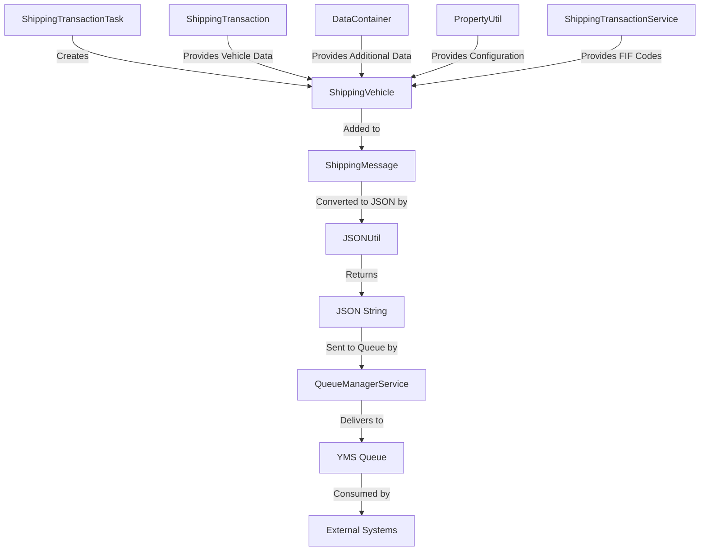
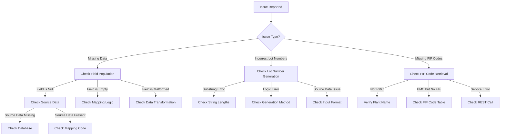

# ShippingVehicle Documentation

## Purpose

The `ShippingVehicle` class is a specialized message model in the Honda AHM LC Sales Interface Service that represents detailed vehicle information in outgoing shipping messages. It extends the abstract `Vehicle` class and contains comprehensive data about a vehicle that is being shipped, including its identification, specifications, manufacturing details, and shipping information.

Think of ShippingVehicle as a "digital twin" of a physical vehicle that captures all the relevant information needed by downstream systems to process and track the vehicle throughout the shipping process.

## How It Works

The ShippingVehicle class works as a data container that:

1. **Collects Vehicle Data**: Gathers detailed information about a vehicle from various sources
2. **Standardizes Format**: Organizes this information in a consistent structure
3. **Prepares for Transmission**: Makes the data ready for inclusion in outgoing messages
4. **Supports JSON Conversion**: Facilitates conversion to JSON format for transmission

This class is primarily used within the `ShippingMessage` class, which combines vehicle information with transaction metadata to create complete shipping messages.

## Key Components

### Fields

The ShippingVehicle class contains numerous fields that capture detailed vehicle information:

| Field | Description | Example Value | Source |
|-------|-------------|---------------|--------|
| `vin` | Vehicle Identification Number | "5FNYG2H71PB036908" | ShippingTransaction |
| `model_id` | Model identifier | "CR-V" | ShippingTransaction (salesModelCode) |
| `model_type` | Type of model | "SUV" | ShippingTransaction (salesModelTypeCode) |
| `model_option` | Model options | "EXL" | ShippingTransaction (salesModelOptionCode) |
| `color_code` | Color code | "NH830M" | ShippingTransaction (salesModelColorCode) |
| `engine_number` | Engine serial number | "K24Z12345" | ShippingTransaction |
| `key_number` | Key identifier | "H12345" | ShippingTransaction |
| `issue_date` | Date of issue | "20230610" | ShippingTransaction (cicIssuData) |
| `adc_process_code` | ADC process code | "ADC001" | PropertyUtil |
| `product_lot_number` | Production lot number | "L120230615001A" | Generated from ShippingTransaction/DataContainer |
| `kd_lot_number` | Knocked Down lot number | "L12306001A" | Generated from ShippingTransaction/DataContainer |
| `price` | Vehicle price | "32500.00" | ShippingTransaction |
| `assembly_off_date` | Date of assembly completion | "20230615" | ShippingTransaction |
| `print_loc` | Print location | "MAIN" | DataContainer |
| `ccc_number` | CCC registration number | "CCC12345" | ShippingTransaction |
| `parts_installed` | Parts installation information | "Y" | PropertyUtil |
| `purchase_contract_number` | Contract number | "PC12345" | DataContainer |
| `fif_codes` | List of FIF codes | ["FIF001"] | ShippingTransactionService |
| `timestamp` | Transaction timestamp | "20230615120000" | Generated from ShippingTransaction |

### Methods

The class provides standard getter and setter methods for all fields, plus:

- **toString()**: Overrides the abstract method from the Vehicle class to provide a string representation of all fields for logging purposes

## Class Hierarchy

ShippingVehicle is part of a class hierarchy for vehicle information:

```
Vehicle (abstract)
  ├── ShippingVehicle
  └── StatusVehicle
```

- **Vehicle**: Abstract base class that defines the common interface
- **ShippingVehicle**: Concrete implementation for outgoing shipping messages
- **StatusVehicle**: Another implementation used for status updates

## Integration with Other Files

The ShippingVehicle class integrates with several key components in the system:

### Direct Integrations

1. **ShippingTransactionTask.java**
   - Creates and populates ShippingVehicle objects in the `generateMessage()` method
   - Maps data from ShippingTransaction and DataContainer to ShippingVehicle fields
   - Adds the ShippingVehicle to a ShippingMessage for transmission

2. **ShippingMessage.java**
   - Contains a reference to a Vehicle object (which is typically a ShippingVehicle)
   - Used to package the ShippingVehicle with transaction information for transmission

### Indirect Integrations

1. **JSONUtil.java**
   - Converts ShippingMessage objects (containing ShippingVehicle) to JSON strings
   - The ShippingVehicle fields become properties in the JSON output

2. **ShippingTransactionService.java**
   - Provides FIF codes for PMC (Plant Manufacturing Control) vehicles
   - These codes are added to the ShippingVehicle's fif_codes list

3. **PropertyUtil.java**
   - Provides configuration values like adcProcessCode and partInstalled
   - These values are set in the ShippingVehicle

## Data Flow



## Data Transformation

The ShippingVehicle class is part of a data transformation process:

1. **Input Data**:
   - ShippingTransaction: Database entity with vehicle information
   - DataContainer: Parsed from incoming messages
   - Configuration: From PropertyUtil

2. **Transformation**:
   - Data is mapped from these sources to ShippingVehicle fields
   - Special fields like product_lot_number and kd_lot_number are generated
   - FIF codes are retrieved for PMC vehicles

3. **Output**:
   - ShippingVehicle is added to a ShippingMessage
   - The message is converted to JSON
   - The JSON is sent to the YMS queue

## Example Usage

Here's a real-world example of how ShippingVehicle is used in the application:

```java
// 1. Create a new ShippingVehicle
ShippingVehicle shippingVehicle = new ShippingVehicle();

// 2. Set basic vehicle information
shippingVehicle.setVin("5FNYG2H71PB036908");
shippingVehicle.setModel_id("CR-V");
shippingVehicle.setModel_type("SUV");
shippingVehicle.setModel_option("EXL");
shippingVehicle.setColor_code("NH830M");
shippingVehicle.setEngine_number("K24Z12345");
shippingVehicle.setKey_number("H12345");

// 3. Set manufacturing information
shippingVehicle.setAdc_process_code("ADC001");
shippingVehicle.setProduct_lot_number("L120230615001A");
shippingVehicle.setKd_lot_number("L12306001A");
shippingVehicle.setAssembly_off_date("20230615");

// 4. Set shipping information
shippingVehicle.setPrint_loc("MAIN");
shippingVehicle.setCcc_number("CCC12345");
shippingVehicle.setParts_installed("Y");
shippingVehicle.setPurchase_contract_number("PC12345");
shippingVehicle.setPrice("32500.00");
shippingVehicle.setTimestamp("20230615120000");

// 5. Set FIF codes (for PMC vehicles)
List<String> fifCodes = new ArrayList<>();
fifCodes.add("FIF001");
shippingVehicle.setFif_codes(fifCodes);

// 6. Add to ShippingMessage
ShippingMessage shippingMessage = new ShippingMessage();
shippingMessage.setVehicle(shippingVehicle);
// Set transaction information...

// 7. Convert to JSON and send
String jsonMessage = JSONUtil.convertShippingMessageToJSON(shippingMessage);
queueManagerService.send(propertyUtil.getYMSQueueName(), jsonMessage);
```

## JSON Representation

When converted to JSON as part of a ShippingMessage, a ShippingVehicle looks like this:

```json
{
  "transaction": {
    "DESTINATION_ENVIRONMENT": "PROD",
    "DESTINATION_SITE": "YMS",
    "PLANT_ID": "AHM",
    "LINE_ID": "L1",
    "TRANSACTION_CODE": "VQ-SHIP",
    "DESCRIPTION": "VQ SHIP",
    "TRANSACTION_TIMESTAMP": "20230615120000"
  },
  "vehicle": {
    "vin": "5FNYG2H71PB036908",
    "model_id": "CR-V",
    "model_type": "SUV",
    "model_option": "EXL",
    "color_code": "NH830M",
    "engine_number": "K24Z12345",
    "key_number": "H12345",
    "issue_date": "20230610",
    "adc_process_code": "ADC001",
    "product_lot_number": "L120230615001A",
    "kd_lot_number": "L12306001A",
    "price": "32500.00",
    "assembly_off_date": "20230615",
    "print_loc": "MAIN",
    "ccc_number": "CCC12345",
    "parts_installed": "Y",
    "purchase_contract_number": "PC12345",
    "fif_codes": ["FIF001"],
    "timestamp": "20230615120000"
  }
}
```

## Database Interactions

The ShippingVehicle class itself doesn't directly interact with databases. However, the data it contains is often retrieved from database tables:

### Indirect Database Interactions

1. **Vehicle Information**:
   - Basic vehicle information comes from the FRAME and FRAME_SPEC tables via the FrameService
   - This information is first loaded into a ShippingTransaction object

2. **FIF Codes**:
   - For PMC vehicles, FIF codes are retrieved from the SALES_ORDER_FIF_CODES table
   - This is done through the ShippingTransactionService.getFIFCodeBySpecCode() method

### Database Queries

While ShippingVehicle doesn't execute queries directly, here are some example queries that might be used to retrieve data for ShippingVehicle:

```sql
-- Retrieve frame information for a VIN
SELECT * FROM FRAME WHERE PRODUCT_ID = '5FNYG2H71PB036908';

-- Retrieve frame spec information
SELECT * FROM FRAME_SPEC WHERE PRODUCT_SPEC_CODE = 
  (SELECT PRODUCT_SPEC_CODE FROM FRAME WHERE PRODUCT_ID = '5FNYG2H71PB036908');

-- Retrieve FIF codes for a specific spec code (for PMC vehicles)
SELECT FIF_CODE FROM SALES_ORDER_FIF_CODES 
WHERE SPEC_CODE = 
  (SELECT PRODUCT_SPEC_CODE FROM FRAME WHERE PRODUCT_ID = '5FNYG2H71PB036908');

-- Retrieve shipping transaction information
SELECT * FROM SHIPPING_TRANSACTION WHERE VIN = '5FNYG2H71PB036908';
```

## Debugging Production Issues

### Common Issues and Solutions

#### 1. Missing or Incorrect Vehicle Data

**Symptoms:**
- Messages are delivered but contain incomplete or incorrect vehicle information
- Downstream systems reject the messages due to data validation failures
- Error logs show missing or null fields in ShippingVehicle

**Debugging Steps:**
1. Check if all required fields are populated in the ShippingVehicle:
```java
logger.info("ShippingVehicle: " + shippingVehicle.toString());
if (StringUtils.isBlank(shippingVehicle.getVin())) {
    logger.error("VIN is missing in ShippingVehicle");
}
if (StringUtils.isBlank(shippingVehicle.getModel_id())) {
    logger.error("Model ID is missing in ShippingVehicle");
}
// Check other critical fields...
```

2. Verify the source data in ShippingTransaction:
```java
logger.info("ShippingTransaction: " + shippingTransaction.toString());
logger.info("ShippingTransaction VIN: " + shippingTransaction.getVin());
logger.info("ShippingTransaction Model Code: " + shippingTransaction.getSalesModelCode());
```

3. Check the database records for the vehicle:
```sql
-- Check if vehicle exists and has complete data
SELECT * FROM FRAME WHERE PRODUCT_ID = '5FNYG2H71PB036908';
SELECT * FROM FRAME_SPEC WHERE PRODUCT_SPEC_CODE = 
  (SELECT PRODUCT_SPEC_CODE FROM FRAME WHERE PRODUCT_ID = '5FNYG2H71PB036908');
```

**Resolution:**
- Fix data mapping in the generateMessage method
- Ensure all required data is retrieved from the database
- Add data validation before creating the ShippingVehicle

#### 2. Incorrect Lot Number Generation

**Symptoms:**
- Downstream systems reject messages due to invalid lot numbers
- Error logs show format issues with product_lot_number or kd_lot_number

**Debugging Steps:**
1. Check the lot number generation logic:
```java
logger.info("DataContainer production_lot: " + dataContainer.getProduction_lot());
logger.info("Generated product_lot_number: " + getProdLotNumber(dataContainer, shippingTransaction));
logger.info("DataContainer kd_lot: " + dataContainer.getKd_lot());
logger.info("Generated kd_lot_number: " + getKdLotNumber(dataContainer, shippingTransaction));
```

2. Verify the source data for lot numbers:
```java
logger.info("ShippingTransaction lineNumber: " + shippingTransaction.getLineNumber());
logger.info("ShippingTransaction productionDate: " + shippingTransaction.getProductionDate());
logger.info("ShippingTransaction productionSequenceNumber: " + shippingTransaction.getProductionSequenceNumber());
logger.info("ShippingTransaction productionSuffix: " + shippingTransaction.getProductionSuffix());
```

3. Check for substring index errors:
```java
try {
    String prodLot = dataContainer.getProduction_lot();
    logger.info("Production lot length: " + prodLot.length());
    logger.info("Substring 10-16: " + prodLot.substring(10, 16));
    logger.info("Substring 16-19: " + prodLot.substring(16, 19));
    logger.info("Substring 19-20: " + prodLot.substring(19, 20));
} catch (IndexOutOfBoundsException e) {
    logger.error("Error parsing production_lot: " + e.getMessage());
}
```

**Resolution:**
- Fix the lot number generation logic
- Add error handling for malformed lot number data
- Validate lot number format before sending messages

#### 3. Missing FIF Codes for PMC Vehicles

**Symptoms:**
- Error logs show "Unable to get the FIF CODE to the VIN"
- PMC vehicles have empty fif_codes lists

**Debugging Steps:**
1. Check if the plant is PMC:
```java
logger.info("Plant name: " + propertyUtil.getPlantName());
logger.info("Is PMC: " + isPMC());
```

2. Check the FIF code retrieval:
```java
String fifCode = shippingTransactionService.getFIFCodeBySpecCode(galcUrl, shippingTransaction.getVin());
logger.info("FIF code for VIN " + shippingTransaction.getVin() + ": " + fifCode);
```

3. Check the database for FIF codes:
```sql
-- Check if FIF codes exist for the spec code
SELECT * FROM SALES_ORDER_FIF_CODES 
WHERE SPEC_CODE = 
  (SELECT PRODUCT_SPEC_CODE FROM FRAME WHERE PRODUCT_ID = '5FNYG2H71PB036908');
```

**Resolution:**
- Fix the FIF code retrieval logic
- Ensure the SALES_ORDER_FIF_CODES table is properly populated
- Add error handling for missing FIF codes

### Visual Debugging Flow



## Special Considerations

### Lot Number Generation

The ShippingVehicle class relies on two special methods to generate lot numbers:

1. **Product Lot Number**:
   - Generated from either ShippingTransaction fields or DataContainer
   - Format varies based on available data
   - Critical for tracking the vehicle in production systems

2. **KD Lot Number**:
   - Similar to Product Lot Number but for Knocked Down components
   - Format depends on available data
   - Important for parts tracking and inventory management

### FIF Codes for PMC Vehicles

For Plant Manufacturing Control (PMC) vehicles, FIF codes are retrieved and added to the ShippingVehicle:

- FIF codes are retrieved from the SALES_ORDER_FIF_CODES table
- They are added to the fif_codes list in the ShippingVehicle
- This is only done for vehicles from PMC plants
- FIF codes are important for manufacturing and quality control

## Summary

The ShippingVehicle class is a critical component in the Honda AHM LC Sales Interface Service that:

1. **Captures detailed vehicle information** for shipping messages
2. **Standardizes the format** of vehicle data for external systems
3. **Integrates data from multiple sources** (database, configuration, incoming messages)
4. **Supports special processing** for lot numbers and FIF codes
5. **Facilitates communication** with the Yard Management System

Understanding how ShippingVehicle works is essential for troubleshooting issues in the vehicle shipping process, as it contains all the vehicle-specific information that downstream systems need to process and track vehicles throughout the shipping workflow.