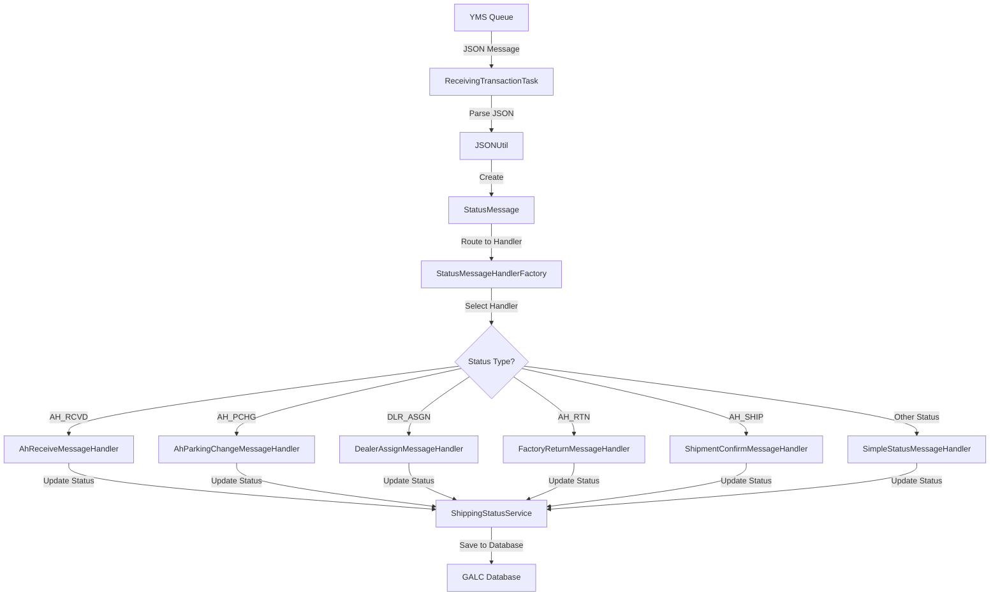
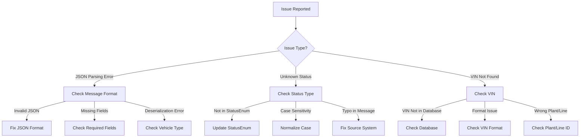

# StatusMessage Documentation

## Purpose

The `StatusMessage` class is a critical message model in the Honda AHM LC Sales Interface Service that serves as a standardized format for incoming status update messages from the Yard Management System (YMS). It encapsulates vehicle information and transaction metadata required to process various status updates throughout a vehicle's lifecycle.

Think of StatusMessage as a "notification envelope" that contains structured information about status changes for vehicles in the system. It enables the application to respond appropriately to different types of status updates from external systems.

## How It Works

The StatusMessage class works as a structured container for incoming status messages:

1. **Message Reception**: The system receives a JSON message from the YMS queue
2. **JSON Parsing**: The `JSONUtil.getStatusMessageFromJSON()` method converts this JSON string into a StatusMessage object
3. **Handler Selection**: Based on the transaction code in the message, an appropriate handler is selected
4. **Status Processing**: The selected handler processes the status update and updates the database accordingly

This standardized approach ensures that all incoming status messages are processed consistently, regardless of the specific status type.

## Key Components

### Fields

The StatusMessage class has a simple structure with two main components:

| Field | Type | Description | JSON Property |
|-------|------|-------------|--------------|
| `transaction` | Transaction | Contains metadata about the transaction (plant ID, line ID, transaction code, etc.) | "TRANSACTION" |
| `vehicle` | Vehicle | Contains information about the vehicle (typically a StatusVehicle) | "VEHICLE" |

### Methods

The class provides basic getter and setter methods for its fields, plus:

- **getTransaction()**: Returns the Transaction object
- **setTransaction(Transaction)**: Sets the Transaction object
- **getVehicle()**: Returns the Vehicle object
- **setVehicle(Vehicle)**: Sets the Vehicle object
- **createVehicle()**: Creates a new StatusVehicle instance
- **toString()**: Returns a string representation of the message for logging purposes

## Related Classes

The StatusMessage class works with several related classes:

### Transaction Class

The Transaction class contains metadata about the status transaction:

- `destination_environment`: Target environment for the message
- `destination_site`: Target site for the message
- `plant_id`: ID of the manufacturing plant
- `line_id`: ID of the production line
- `transaction_code`: Code indicating the type of status update (e.g., "AH-RCVD")
- `description`: Human-readable description of the status
- `transaction_timestamp`: Timestamp when the status update occurred

### Vehicle Class (Abstract)

The Vehicle class is an abstract base class that defines the common interface for vehicle information.

### StatusVehicle Class

The StatusVehicle class extends Vehicle and contains information specific to status updates:

- `flag`: Status flag
- `vin`: Vehicle Identification Number
- `ship_date`: Shipping date
- `parking_bay`: Parking bay location
- `parking_space`: Parking space location
- `control_number`: Control number
- `dealer_number`: Dealer number
- `ship_type`: Shipping type
- `timestamp`: Transaction timestamp

## Status Types and Handlers

The StatusMessage class is used to process various types of status updates, each with its own handler:

| Status Code | Status Name | Handler | Description |
|-------------|-------------|---------|-------------|
| AH_RCVD | AHM RECEIVING | AhReceiveMessageHandler | Vehicle received at AHM |
| AH_PCHG | PARK CHANGE | AhParkingChangeMessageHandler | Vehicle parking location changed |
| DLR_ASGN | DEALER ASSIGNED | DealerAssignMessageHandler | Vehicle assigned to a dealer |
| AH_RTN | FACTORY RETURN | FactoryReturnMessageHandler | Vehicle returned to factory |
| AH_SHIP | SHIPMENT CONFIRMED | ShipmentConfirmMessageHandler | Vehicle shipment confirmed |
| PPO_ON | PPO ON | SimpleStatusMessageHandler | PPO process started |
| PPO_OFF | PPO OFF | SimpleStatusMessageHandler | PPO process completed |
| ON_TRN | LOADED TO TRAIN | SimpleStatusMessageHandler | Vehicle loaded onto train |
| SHIPPER | SHIPPER | SimpleStatusMessageHandler | Vehicle with shipper |
| DLR_RCPT | DEALER RECEIPT | SimpleStatusMessageHandler | Vehicle received by dealer |
| DLR_RTN | DEALER RETURN | SimpleStatusMessageHandler | Vehicle returned by dealer |

## Integration with Other Files

The StatusMessage class integrates with several key components in the system:

### Direct Integrations

1. **JSONUtil.java**
   - Contains the `getStatusMessageFromJSON()` method that parses JSON strings into StatusMessage objects
   - Uses a custom JsonDeserializer to handle the Vehicle abstract class

2. **ReceivingTransactionTask.java**
   - Receives messages from the YMS queue
   - Uses JSONUtil to parse messages into StatusMessage objects
   - Passes the StatusMessage to the StatusMessageHandlerFactory for processing

3. **StatusMessageHandlerFactory.java**
   - Determines which handler to use based on the transaction code in the StatusMessage
   - Routes the StatusMessage to the appropriate handler for processing

### Indirect Integrations

1. **Status Message Handlers**
   - Various handler classes (e.g., AhReceiveMessageHandler, DealerAssignMessageHandler)
   - Each handler processes a specific type of status update
   - All handlers implement the IStatusMessageHandler interface

2. **ShippingStatusService.java**
   - Updates the shipping status in the database based on the StatusMessage
   - Tracks the product status throughout its lifecycle

## Data Flow



## Example Usage

Here's a real-world example of how StatusMessage is used in the application:

```java
// 1. Receive a message from the YMS queue
String message = queueManagerService.recv(propertyUtil.getSalesReceivingQueueName());

// 2. Parse the message into a StatusMessage
StatusMessage statusMessage = JSONUtil.getStatusMessageFromJSON(message.toLowerCase());
logger.info("Received YMS message: " + statusMessage.toString());

// 3. Process the message using the appropriate handler
List<String> errorMessages = statusMessageHandlerFactory.handleMessage(statusMessage);

// 4. Handle any errors
if (!errorMessages.isEmpty()) {
    emailSender.sendEmail(getClass().getName() + " : ", errorMessages);
}
```

## JSON Message Format

A typical StatusMessage in JSON format looks like this:

```json
{
  "TRANSACTION": {
    "DESTINATION_ENVIRONMENT": "PROD",
    "DESTINATION_SITE": "GALC",
    "PLANT_ID": "AHM",
    "LINE_ID": "L1",
    "TRANSACTION_CODE": "AH-RCVD",
    "DESCRIPTION": "AHM RECEIVING",
    "TRANSACTION_TIMESTAMP": "20230615120000"
  },
  "VEHICLE": {
    "FLAG": "N",
    "VIN": "5FNYG2H71PB036908",
    "SHIP_DATE": "20230615",
    "PARKING_BAY": "A",
    "PARKING_SPACE": "101",
    "CONTROL_NUMBER": "CN12345",
    "DEALER_NUMBER": "DLR001",
    "SHIP_TYPE": "RAIL",
    "TIMESTAMP": "20230615120000"
  }
}
```

## Database Interactions

The StatusMessage class itself doesn't directly interact with databases. However, it triggers database updates through the status handlers:

### Indirect Database Interactions

1. **Status Updates**:
   - The status handlers use the ShippingStatusService to update the shipping status in the database
   - Example: `shippingStatusService.trackProduct(galcUrl, propertyUtil.getProcessPoint(status.getType()), statusVehicle.getVin());`

2. **VIN Lookup**:
   - The handlers verify that the VIN exists in the database before processing the status update
   - Example: `String galcUrl = shippingStatusService.getGalcUrl(statusVehicle.getVin(), statusMessage.getTransaction().getLine_id());`

### Database Queries

While StatusMessage doesn't execute queries directly, here are some example queries that might be triggered during status processing:

```sql
-- Verify that the VIN exists in the database
SELECT * FROM FRAME WHERE PRODUCT_ID = '5FNYG2H71PB036908';

-- Retrieve the current shipping status for a VIN
SELECT * FROM SHIPPING_STATUS WHERE VIN = '5FNYG2H71PB036908';

-- Update the shipping status for a VIN
UPDATE SHIPPING_STATUS 
SET STATUS = 2, 
    ACTUAL_TIMESTAMP = CURRENT_TIMESTAMP,
    PARKING_BAY = 'A',
    PARKING_SPACE = '101'
WHERE VIN = '5FNYG2H71PB036908';

-- For dealer assignment, update the dealer information
UPDATE SHIPPING_STATUS 
SET DEALER_NUMBER = 'DLR001',
    STATUS = 3
WHERE VIN = '5FNYG2H71PB036908';
```

## Debugging Production Issues

### Common Issues and Solutions

#### 1. Invalid JSON Format

**Symptoms:**
- Error messages in logs about JSON parsing
- NullPointerExceptions when accessing StatusMessage fields
- Messages not being processed

**Debugging Steps:**
1. Check the raw message format:
```java
logger.info("Raw message from YMS: " + message);
try {
    StatusMessage statusMessage = JSONUtil.getStatusMessageFromJSON(message.toLowerCase());
    logger.info("Parsed successfully: " + statusMessage.toString());
} catch (Exception e) {
    logger.error("Error parsing message: " + e.getMessage());
}
```

2. Verify the JSON structure:
```java
try {
    // Validate JSON structure
    new com.google.gson.JsonParser().parse(message);
    logger.info("Valid JSON structure");
} catch (Exception e) {
    logger.error("Invalid JSON structure: " + e.getMessage());
}
```

3. Check for missing required fields:
```java
if (statusMessage.getTransaction() == null) {
    logger.error("Missing TRANSACTION in message");
}
if (statusMessage.getVehicle() == null) {
    logger.error("Missing VEHICLE in message");
}
```

**Resolution:**
- Fix the JSON format in the source system
- Update the JSONUtil.getStatusMessageFromJSON() method to handle different formats
- Add more robust error handling for JSON parsing

#### 2. Unknown Status Type

**Symptoms:**
- Error messages in logs: "Invalid status received from YMS Interface"
- Status updates not being processed

**Debugging Steps:**
1. Check the transaction code in the message:
```java
logger.info("Transaction code: " + statusMessage.getTransaction().getTransaction_code());
StatusEnum statusEnum = StatusEnum.getStatusByType(statusMessage.getTransaction().getTransaction_code());
if (statusEnum == null) {
    logger.error("Unknown status type: " + statusMessage.getTransaction().getTransaction_code());
}
```

2. Verify that the status type is defined in StatusEnum:
```java
for (StatusEnum status : StatusEnum.values()) {
    logger.info("Defined status: " + status.getType());
}
```

3. Check for case sensitivity issues:
```java
String transactionCode = statusMessage.getTransaction().getTransaction_code();
logger.info("Transaction code (uppercase): " + transactionCode.toUpperCase());
logger.info("Transaction code (lowercase): " + transactionCode.toLowerCase());
```

**Resolution:**
- Ensure the transaction code in the message matches one of the defined status types
- Update the StatusEnum if new status types have been added
- Check for case sensitivity issues in the status type comparison

#### 3. VIN Not Found

**Symptoms:**
- Error messages in logs: "Unable to find the VIN record"
- Status updates not being processed

**Debugging Steps:**
1. Check the VIN in the message:
```java
StatusVehicle statusVehicle = (StatusVehicle) statusMessage.getVehicle();
logger.info("VIN in message: " + statusVehicle.getVin());
```

2. Verify that the VIN exists in the database:
```sql
-- Check if VIN exists
SELECT * FROM FRAME WHERE PRODUCT_ID = '5FNYG2H71PB036908';
```

3. Check for data format issues:
```java
String vin = statusVehicle.getVin();
logger.info("VIN length: " + vin.length());
logger.info("VIN characters: " + vin.replaceAll("[A-Z0-9]", ""));
```

**Resolution:**
- Ensure the VIN in the message is valid and exists in the database
- Check for data format issues (e.g., extra spaces, special characters)
- Add more robust error handling for VIN lookup

### Visual Debugging Flow



## Status Processing Workflow

The StatusMessage processing follows a specific workflow:

1. **Message Reception**:
   - ReceivingTransactionTask receives a message from the YMS queue
   - The message is parsed into a StatusMessage object

2. **Status Determination**:
   - The transaction code is extracted from the StatusMessage
   - StatusEnum.getStatusByType() is used to determine the status type

3. **Handler Selection**:
   - StatusMessageHandlerFactory selects the appropriate handler based on the status type
   - For specialized statuses (AH_RCVD, AH_PCHG, etc.), specific handlers are used
   - For simpler statuses, SimpleStatusMessageHandler is used

4. **Status Processing**:
   - The selected handler processes the status update
   - This typically involves updating the shipping status in the database
   - Some handlers may perform additional actions (e.g., updating dealer information)

5. **Error Handling**:
   - Any errors during processing are collected and returned
   - If errors occur, an email notification is sent

## Summary

The StatusMessage class is a fundamental component in the Honda AHM LC Sales Interface Service that:

1. **Standardizes incoming status messages** from the Yard Management System
2. **Facilitates status update processing** through a handler-based approach
3. **Supports various status types** throughout the vehicle lifecycle
4. **Enables database updates** based on status changes
5. **Provides a consistent interface** for all status-related operations

Understanding how StatusMessage works is essential for troubleshooting issues in the status update process, as it serves as the primary format for all incoming status messages from external systems.