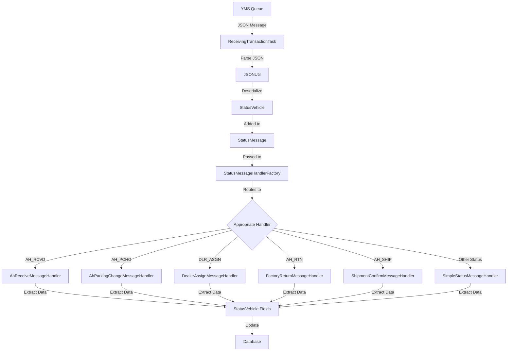
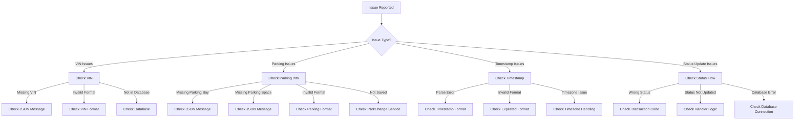

# StatusVehicle Documentation

## Purpose

The `StatusVehicle` class is a specialized message model in the Honda AHM LC Sales Interface Service that represents vehicle information in incoming status update messages from the Yard Management System (YMS). It extends the abstract `Vehicle` class and contains specific data about a vehicle's status, location, and shipping details that are needed to process various status updates throughout a vehicle's lifecycle.

Think of StatusVehicle as a "vehicle status snapshot" that captures the current state of a vehicle at a specific point in time. It provides all the necessary vehicle-specific information needed to update the vehicle's status in the system.

## How It Works

The StatusVehicle class works as a data container that:

1. **Receives Vehicle Status Data**: Captures vehicle status information from incoming JSON messages
2. **Standardizes Format**: Organizes this information in a consistent structure
3. **Provides Access Methods**: Offers getters and setters for all status fields
4. **Supports JSON Deserialization**: Uses Jackson annotations to map JSON properties to fields

This class is primarily used within the `StatusMessage` class, which combines vehicle information with transaction metadata to create complete status update messages.

## Key Components

### Fields

The StatusVehicle class contains several fields that capture vehicle status information:

| Field | JSON Property | Description | Example Value | Used By |
|-------|--------------|-------------|---------------|---------|
| `flag` | "FLAG" | Status flag | "N" | All handlers |
| `vin` | "VIN" | Vehicle Identification Number | "5FNYG2H71PB036908" | All handlers |
| `ship_date` | "SHIP_DATE" | Shipping date | "20230615" | ShipmentConfirmMessageHandler |
| `parking_bay` | "PARKING_BAY" | Parking bay location | "A" | AhParkingChangeMessageHandler |
| `parking_space` | "PARKING_SPACE" | Parking space location | "101" | AhParkingChangeMessageHandler |
| `control_number` | "CONTROL_NUMBER" | Control number | "CN12345" | AhParkingChangeMessageHandler |
| `dealer_number` | "DEALER_NUMBER" | Dealer number | "DLR001" | DealerAssignMessageHandler |
| `ship_type` | "SHIP_TYPE" | Shipping type | "RAIL" | ShipmentConfirmMessageHandler |
| `timestamp` | "TIMESTAMP" | Transaction timestamp | "20230615120000" | All handlers |

### Methods

The class provides standard getter and setter methods for all fields, plus:

- **getVin()**: Returns the VIN in uppercase format (note the conversion in the getter method)
- **toString()**: Overrides the abstract method from the Vehicle class to provide a string representation of all fields for logging purposes

### Special Features

1. **JSON Annotations**: Each field is annotated with `@JsonProperty` to map JSON properties to class fields
2. **VIN Normalization**: The `getVin()` method automatically converts the VIN to uppercase
3. **Commented Code**: The class contains commented-out code for an `odc_code` field that was likely used in the past or might be used in the future

## Class Hierarchy

StatusVehicle is part of a class hierarchy for vehicle information:

```
Vehicle (abstract)
  ├── StatusVehicle
  └── ShippingVehicle
```

- **Vehicle**: Abstract base class that defines the common interface
- **StatusVehicle**: Concrete implementation for incoming status messages
- **ShippingVehicle**: Another implementation used for outgoing shipping messages

## Integration with Other Files

The StatusVehicle class integrates with several key components in the system:

### Direct Integrations

1. **StatusMessage.java**
   - Contains a reference to a Vehicle object (which is typically a StatusVehicle)
   - The `createVehicle()` method creates a new StatusVehicle instance
   - Used to package the StatusVehicle with transaction information

2. **JSONUtil.java**
   - Uses a custom JsonDeserializer to deserialize JSON into StatusVehicle objects
   - The deserializer maps the abstract Vehicle type to the concrete StatusVehicle class

### Indirect Integrations

1. **Status Message Handlers**
   - Various handler classes (e.g., AhReceiveMessageHandler, AhParkingChangeMessageHandler)
   - Cast the Vehicle object from StatusMessage to StatusVehicle
   - Extract vehicle information to update the database

2. **ShippingStatusService.java**
   - Updates the shipping status in the database based on the StatusVehicle information
   - Uses the VIN from StatusVehicle to find and update records

3. **ParkChangeService.java**
   - Updates parking location information based on StatusVehicle data
   - Uses parking_bay and parking_space fields to track vehicle location

## Data Flow



## Field Usage by Handlers

Different status message handlers use different fields from the StatusVehicle class:

### AhReceiveMessageHandler
- Uses `vin` to identify the vehicle
- Updates the vehicle status to AH_RCVD

### AhParkingChangeMessageHandler
- Uses `vin` to identify the vehicle
- Uses `parking_bay` and `parking_space` to update parking location
- Uses `control_number` for tracking
- Uses `timestamp` to record when the parking change occurred

### DealerAssignMessageHandler
- Uses `vin` to identify the vehicle
- Uses `dealer_number` to assign the vehicle to a dealer
- Uses `timestamp` to record when the dealer assignment occurred

### ShipmentConfirmMessageHandler
- Uses `vin` to identify the vehicle
- Uses `ship_date` to record the shipping date
- Uses `ship_type` to record the shipping method
- Updates the vehicle status to AH_SHIP

### SimpleStatusMessageHandler
- Uses `vin` to identify the vehicle
- Updates the vehicle status based on the transaction code

## Example Usage

Here's a real-world example of how StatusVehicle is used in the application:

```java
// 1. Receive a JSON message from the YMS queue
String jsonMessage = queueManagerService.recv(propertyUtil.getSalesReceivingQueueName());

// 2. Parse the message into a StatusMessage containing a StatusVehicle
StatusMessage statusMessage = JSONUtil.getStatusMessageFromJSON(jsonMessage.toLowerCase());

// 3. Extract the StatusVehicle from the StatusMessage
StatusVehicle statusVehicle = (StatusVehicle) statusMessage.getVehicle();

// 4. Use the VIN to find the vehicle in the database
String galcUrl = shippingStatusService.getGalcUrl(statusVehicle.getVin(),
    statusMessage.getTransaction().getLine_id());

// 5. Process the status update based on the transaction code
if (statusMessage.getTransaction().getTransaction_code().equals("AH-PCHG")) {
    // Update parking location
    ParkChange parkChange = new ParkChange();
    parkChange.setVin(statusVehicle.getVin());
    parkChange.setParkingLocation(statusVehicle.getParking_bay());
    parkChange.setParkControlNumber(statusVehicle.getControl_number());
    // Set other fields...
    
    parkChangeService.saveParkChange(galcUrl, parkChange);
} else if (statusMessage.getTransaction().getTransaction_code().equals("DLR-ASGN")) {
    // Update dealer assignment
    ShippingStatus shippingStatus = shippingStatusService.findByProductId(galcUrl, statusVehicle.getVin());
    shippingStatus.setStatus(StatusEnum.DLR_ASGN.getStatus());
    shippingStatus.setDealerNumber(statusVehicle.getDealer_number());
    
    shippingStatusService.saveShippingStatus(galcUrl, shippingStatus);
}
```

## JSON Representation

When received in a JSON message, a StatusVehicle looks like this:

```json
{
  "VEHICLE": {
    "FLAG": "N",
    "VIN": "5FNYG2H71PB036908",
    "SHIP_DATE": "20230615",
    "PARKING_BAY": "A",
    "PARKING_SPACE": "101",
    "CONTROL_NUMBER": "CN12345",
    "DEALER_NUMBER": "DLR001",
    "SHIP_TYPE": "RAIL",
    "TIMESTAMP": "20230615120000"
  }
}
```

## Database Interactions

The StatusVehicle class itself doesn't directly interact with databases. However, the data it contains is used to update various database tables:

### Indirect Database Interactions

1. **Shipping Status Updates**:
   - The VIN is used to find the corresponding record in the SHIPPING_STATUS table
   - Status handlers update the status based on the transaction code
   - Example: `shippingStatusService.saveShippingStatus(galcUrl, shippingStatus);`

2. **Parking Location Updates**:
   - The parking_bay and parking_space fields are used to update the PARK_CHANGE table
   - Example: `parkChangeService.saveParkChange(galcUrl, parkChange);`

3. **Dealer Assignment**:
   - The dealer_number field is used to update the dealer assignment in the SHIPPING_STATUS table
   - Example: `shippingStatus.setDealerNumber(statusVehicle.getDealer_number());`

### Database Queries

While StatusVehicle doesn't execute queries directly, here are some example queries that might be triggered based on StatusVehicle data:

```sql
-- Find the vehicle record by VIN
SELECT * FROM FRAME WHERE PRODUCT_ID = '5FNYG2H71PB036908';

-- Retrieve the current shipping status for a VIN
SELECT * FROM SHIPPING_STATUS WHERE VIN = '5FNYG2H71PB036908';

-- Update the shipping status for a VIN
UPDATE SHIPPING_STATUS 
SET STATUS = 2
WHERE VIN = '5FNYG2H71PB036908';

-- Update parking location for a VIN
INSERT INTO PARK_CHANGE (VIN, PARKING_LOCATION, PARK_CONTROL_NUMBER, DATE, TIME, SEND_LOCATION, TRANSACTIONTYPE)
VALUES ('5FNYG2H71PB036908', 'A', 'CN12345', '230615', '120000', 'AHM', 'PC');

-- Update dealer assignment for a VIN
UPDATE SHIPPING_STATUS 
SET DEALER_NUMBER = 'DLR001',
    STATUS = 3
WHERE VIN = '5FNYG2H71PB036908';
```

## Debugging Production Issues

### Common Issues and Solutions

#### 1. Missing or Invalid VIN

**Symptoms:**
- Error messages in logs: "Unable to find the VIN record"
- Status updates not being processed
- NullPointerExceptions when accessing VIN-related data

**Debugging Steps:**
1. Check if the VIN is present and valid in the StatusVehicle:
```java
logger.info("StatusVehicle: " + statusVehicle.toString());
if (StringUtils.isBlank(statusVehicle.getVin())) {
    logger.error("VIN is missing in StatusVehicle");
}
logger.info("VIN length: " + statusVehicle.getVin().length());
logger.info("VIN format: " + statusVehicle.getVin().matches("[A-Z0-9]{17}"));
```

2. Verify that the VIN exists in the database:
```sql
-- Check if VIN exists in FRAME table
SELECT COUNT(*) FROM FRAME WHERE PRODUCT_ID = '5FNYG2H71PB036908';
```

3. Check for case sensitivity issues:
```java
logger.info("VIN as received: " + statusVehicle.getVin());
logger.info("VIN uppercase: " + statusVehicle.getVin().toUpperCase());
logger.info("VIN lowercase: " + statusVehicle.getVin().toLowerCase());
```

**Resolution:**
- Ensure the VIN in the incoming message is valid and exists in the database
- Check for data format issues (e.g., incorrect length, invalid characters)
- Verify that the getVin() method is correctly converting the VIN to uppercase

#### 2. Missing or Invalid Parking Information

**Symptoms:**
- Parking location updates not being processed
- Error messages in logs about parking information
- Vehicles not showing up in the correct parking location

**Debugging Steps:**
1. Check if parking information is present in the StatusVehicle:
```java
logger.info("Parking Bay: " + statusVehicle.getParking_bay());
logger.info("Parking Space: " + statusVehicle.getParking_space());
if (StringUtils.isBlank(statusVehicle.getParking_bay())) {
    logger.error("Parking Bay is missing in StatusVehicle");
}
if (StringUtils.isBlank(statusVehicle.getParking_space())) {
    logger.error("Parking Space is missing in StatusVehicle");
}
```

2. Verify the format of parking information:
```java
logger.info("Parking Bay format valid: " + statusVehicle.getParking_bay().matches("[A-Z0-9]+"));
logger.info("Parking Space format valid: " + statusVehicle.getParking_space().matches("[0-9]+"));
```

3. Check if the parking change is being saved correctly:
```sql
-- Check if parking change record exists
SELECT * FROM PARK_CHANGE 
WHERE VIN = '5FNYG2H71PB036908' 
ORDER BY DATE DESC, TIME DESC
LIMIT 1;
```

**Resolution:**
- Ensure parking information is included in the incoming message
- Check for data format issues in parking bay and space
- Verify that the ParkChange object is being created and saved correctly

#### 3. Timestamp Parsing Errors

**Symptoms:**
- Error messages in logs: "Unable to parse timestamp"
- Date-related operations failing
- Status updates not being processed correctly

**Debugging Steps:**
1. Check the timestamp format in the StatusVehicle:
```java
logger.info("Timestamp: " + statusVehicle.getTimestamp());
logger.info("Timestamp length: " + statusVehicle.getTimestamp().length());
```

2. Try different parsing approaches:
```java
try {
    SimpleDateFormat format1 = new SimpleDateFormat("yyyyMMddHHmmss");
    Date date1 = format1.parse(statusVehicle.getTimestamp());
    logger.info("Parsed with format1: " + date1);
} catch (ParseException e) {
    logger.error("Failed to parse with format1: " + e.getMessage());
}

try {
    SimpleDateFormat format2 = new SimpleDateFormat("yyyy-MM-dd'T'HH:mm:ss");
    Date date2 = format2.parse(statusVehicle.getTimestamp());
    logger.info("Parsed with format2: " + date2);
} catch (ParseException e) {
    logger.error("Failed to parse with format2: " + e.getMessage());
}
```

3. Check for timezone issues:
```java
logger.info("System timezone: " + TimeZone.getDefault().getID());
```

**Resolution:**
- Ensure the timestamp in the incoming message follows the expected format
- Update the parsing logic to handle different timestamp formats
- Add more robust error handling for timestamp parsing

### Visual Debugging Flow



## Field-Specific Debugging

### VIN Field

The VIN field is the most critical field in StatusVehicle as it uniquely identifies the vehicle. Here are specific debugging steps for VIN-related issues:

```java
// Check VIN format and validity
String vin = statusVehicle.getVin();
logger.info("VIN: " + vin);
logger.info("VIN length: " + vin.length() + " (should be 17)");
logger.info("VIN format valid: " + vin.matches("[A-Z0-9]{17}"));

// Check if VIN exists in database
String galcUrl = shippingStatusService.getGalcUrl(vin, lineId);
if (StringUtils.isBlank(galcUrl)) {
    logger.error("VIN not found in database: " + vin);
} else {
    logger.info("VIN found in database: " + vin);
}
```

### Parking Fields

The parking_bay and parking_space fields are used to track the vehicle's location. Here are specific debugging steps for parking-related issues:

```java
// Check parking information
String parkingBay = statusVehicle.getParking_bay();
String parkingSpace = statusVehicle.getParking_space();
logger.info("Parking Bay: " + parkingBay);
logger.info("Parking Space: " + parkingSpace);

// Validate parking information
if (StringUtils.isBlank(parkingBay)) {
    logger.error("Parking Bay is missing");
}
if (StringUtils.isBlank(parkingSpace)) {
    logger.error("Parking Space is missing");
}

// Check if parking change is saved correctly
ParkChange parkChange = new ParkChange();
parkChange.setVin(statusVehicle.getVin());
parkChange.setParkingLocation(parkingBay);
parkChange.setParkControlNumber(statusVehicle.getControl_number());
// Set other fields...

ParkChange savedParkChange = parkChangeService.saveParkChange(galcUrl, parkChange);
if (savedParkChange == null) {
    logger.error("Failed to save parking change");
} else {
    logger.info("Parking change saved successfully");
}
```

### Timestamp Field

The timestamp field is used to record when the status update occurred. Here are specific debugging steps for timestamp-related issues:

```java
// Check timestamp format
String timestamp = statusVehicle.getTimestamp();
logger.info("Timestamp: " + timestamp);

// Try different parsing approaches
try {
    SimpleDateFormat format = new SimpleDateFormat("yyyy-MM-dd'T'HH:mm:ss");
    Date date = format.parse(timestamp);
    logger.info("Parsed timestamp: " + date);
    
    // Format for database
    String formattedDate = new SimpleDateFormat("yyMMdd").format(date);
    String formattedTime = new SimpleDateFormat("HHmmss").format(date);
    logger.info("Formatted date: " + formattedDate);
    logger.info("Formatted time: " + formattedTime);
} catch (ParseException e) {
    logger.error("Failed to parse timestamp: " + e.getMessage());
}
```

## Summary

The StatusVehicle class is a critical component in the Honda AHM LC Sales Interface Service that:

1. **Captures vehicle status information** from incoming messages
2. **Standardizes the format** of vehicle data for internal processing
3. **Provides specific fields** for different types of status updates
4. **Supports JSON deserialization** through annotations
5. **Facilitates database updates** by providing vehicle data to handlers

Understanding how StatusVehicle works is essential for troubleshooting issues in the status update process, as it contains all the vehicle-specific information needed to process status updates throughout a vehicle's lifecycle.