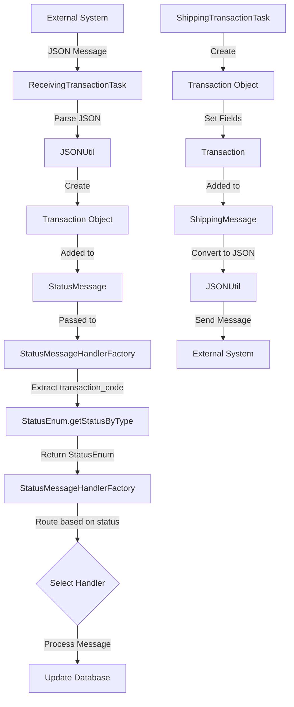
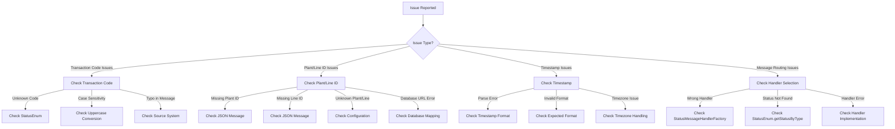

# Transaction Documentation

## Purpose

The `Transaction` class is a key message model in the Honda AHM LC Sales Interface Service that represents transaction metadata in both incoming and outgoing messages. It contains essential information about the source, destination, and type of transaction being processed, which is crucial for routing messages to the appropriate handlers and updating vehicle statuses correctly.

Think of Transaction as an "envelope header" that provides context for each vehicle status update. It answers important questions like: Where did this message come from? Where is it going? What type of status update is it? When did it happen?

## How It Works

The Transaction class works as a standardized container for transaction metadata:

1. **Captures Transaction Metadata**: Stores information about the transaction source, destination, and type
2. **Standardizes Format**: Organizes this information in a consistent structure
3. **Provides Access Methods**: Offers getters and setters for all transaction fields
4. **Supports JSON Deserialization**: Uses Jackson annotations to map JSON properties to fields
5. **Normalizes Data**: Automatically converts certain fields to uppercase for consistency

This class is used in both incoming status messages (StatusMessage) and outgoing shipping messages (ShippingMessage) to provide context for the vehicle information being processed.

## Key Components

### Fields

The Transaction class contains several fields that capture transaction metadata:

| Field | JSON Property | Description | Example Value | Purpose |
|-------|--------------|-------------|---------------|---------|
| `destination_environment` | "DESTINATION_ENVIRONMENT" | Target environment | "PROD" | Identifies whether the message is for production or test |
| `destination_site` | "DESTINATION_SITE" | Target site | "GALC" | Identifies the target system for the message |
| `plant_id` | "PLANT_ID" | Manufacturing plant ID | "AHM" | Identifies the plant where the vehicle was manufactured |
| `line_id` | "LINE_ID" | Production line ID | "L1" | Identifies the production line within the plant |
| `transaction_code` | "TRANSACTION_CODE" | Status update type | "AH-RCVD" | Identifies the type of status update |
| `description` | "DESCRIPTION" | Human-readable description | "AHM RECEIVING" | Provides a readable description of the status |
| `transaction_timestamp` | "TRANSACTION_TIMESTAMP" | Transaction time | "20230615120000" | Records when the transaction occurred |

### Methods

The class provides standard getter and setter methods for all fields, with some special features:

- **Uppercase Conversion**: Several getter methods automatically convert values to uppercase:
  - `getDestination_environment()`
  - `getDestination_site()`
  - `getPlant_id()`
  - `getTransaction_code()`
  - `getDescription()`

- **toString()**: Provides a string representation of all fields for logging purposes

### Special Features

1. **JSON Annotations**: Each field is annotated with `@JsonProperty` to map JSON properties to class fields
2. **Data Normalization**: Automatic conversion to uppercase ensures consistent data handling
3. **Standardized Format**: Consistent structure for both incoming and outgoing messages

## Integration with Other Files

The Transaction class integrates with several key components in the system:

### Direct Integrations

1. **StatusMessage.java**
   - Contains a Transaction object that provides metadata for incoming status updates
   - Used to determine which handler should process the message

2. **ShippingMessage.java**
   - Contains a Transaction object that provides metadata for outgoing shipping messages
   - Used to format messages sent to external systems

3. **StatusMessageHandlerFactory.java**
   - Uses the transaction_code field to determine which handler to use
   - Routes messages to the appropriate handler based on the transaction type

### Indirect Integrations

1. **Status Message Handlers**
   - Various handler classes (e.g., AhReceiveMessageHandler, AhParkingChangeMessageHandler)
   - Use the line_id and plant_id fields to identify the correct database
   - Process messages based on the transaction_code

2. **ShippingTransactionTask.java**
   - Creates Transaction objects for outgoing messages
   - Sets transaction metadata based on configuration and status type

3. **StatusEnum.java**
   - Maps transaction_code values to status types
   - Provides status information based on transaction codes

## Data Flow



## Transaction Codes and Status Types

The transaction_code field is the most critical field in the Transaction class, as it determines how the message will be processed. Here are the main transaction codes used in the system:

| Transaction Code | Status Name | Status Value | Handler | Description |
|------------------|-------------|--------------|---------|-------------|
| "INIT" | INIT | 0 | SimpleStatusMessageHandler | Initial status |
| "VQ-SHIP" | VQ_SHIP | 1 | SimpleStatusMessageHandler | Vehicle ready to ship from factory |
| "AH-RCVD" | AH_RCVD | 2 | AhReceiveMessageHandler | Vehicle received at AHM |
| "DLR-ASGN" | DLR_ASGN | 3 | DealerAssignMessageHandler | Vehicle assigned to dealer |
| "AH-SHIP" | AH_SHIP | 4 | ShipmentConfirmMessageHandler | Shipment confirmed |
| "AH-RTN" | AH_RTN | -1 | FactoryReturnMessageHandler | Vehicle returned to factory |
| "AH-PCHG" | AH_PCHG | 5 | AhParkingChangeMessageHandler | Parking location changed |
| "PPO-ON" | PPO_ON | 6 | SimpleStatusMessageHandler | PPO process started |
| "PPO-OFF" | PPO_OFF | 7 | SimpleStatusMessageHandler | PPO process completed |
| "SHIPPER" | SHIPPER | 8 | SimpleStatusMessageHandler | Vehicle with shipper |
| "ON-TRN" | ON_TRN | 9 | SimpleStatusMessageHandler | Vehicle loaded onto train |
| "DLR-RCPT" | DLR_RCPT | 10 | SimpleStatusMessageHandler | Vehicle received by dealer |
| "DLR-RTN" | DLR_RTN | -2 | SimpleStatusMessageHandler | Vehicle returned by dealer |
| "AF-OFF" | AF_OFF | -3 | SimpleStatusMessageHandler | Assembly line completed |

## Example Usage

### Incoming Message Processing

Here's a real-world example of how Transaction is used in processing incoming messages:

```java
// 1. Receive a JSON message from the YMS queue
String jsonMessage = queueManagerService.recv(propertyUtil.getSalesReceivingQueueName());

// 2. Parse the message into a StatusMessage containing a Transaction
StatusMessage statusMessage = JSONUtil.getStatusMessageFromJSON(jsonMessage.toLowerCase());

// 3. Extract the transaction code and determine the status type
String transactionCode = statusMessage.getTransaction().getTransaction_code();
StatusEnum statusEnum = StatusEnum.getStatusByType(transactionCode);

// 4. Route the message to the appropriate handler
switch (statusEnum) {
    case AH_RCVD:
        errorMessages = ahReceiveMessageHandler.handle(statusMessage, statusEnum);
        break;
    case AH_PCHG:
        errorMessages = ahParkingChangeMessageHandler.handle(statusMessage, statusEnum);
        break;
    // Other cases...
}
```

### Outgoing Message Creation

Here's how Transaction is used when creating outgoing messages:

```java
// 1. Create a new Transaction object
Transaction transaction = new Transaction();

// 2. Set the transaction metadata
transaction.setLine_id(dataContainer.getLine_Id());
transaction.setPlant_id(dataContainer.getPlant_Id());
transaction.setTransaction_code(status.getType());
transaction.setDestination_site(propertyUtil.getDestinationSite());
transaction.setDestination_environment(propertyUtil.getDestinationEnv());
transaction.setDescription(status.getName());
transaction.setTransaction_timestamp(getTransactionTimeStamp(shippingTransaction));

// 3. Add the Transaction to a ShippingMessage
shippingMessage.setTransaction(transaction);
shippingMessage.setVehicle(shippingVehicle);

// 4. Convert the ShippingMessage to JSON and send it
String jsonMessage = JSONUtil.getJSONFromShippingMessage(shippingMessage);
queueManagerService.send(propertyUtil.getSalesShippingQueueName(), jsonMessage);
```

## JSON Representation

In a JSON message, a Transaction looks like this:

```json
{
  "TRANSACTION": {
    "DESTINATION_ENVIRONMENT": "PROD",
    "DESTINATION_SITE": "GALC",
    "PLANT_ID": "AHM",
    "LINE_ID": "L1",
    "TRANSACTION_CODE": "AH-RCVD",
    "DESCRIPTION": "AHM RECEIVING",
    "TRANSACTION_TIMESTAMP": "20230615120000"
  }
}
```

## Database Interactions

The Transaction class itself doesn't directly interact with databases. However, its fields are used to determine which database to use and how to update records:

### Indirect Database Interactions

1. **Database Selection**:
   - The plant_id and line_id fields are used to determine which database to connect to
   - Example: `String galcUrl = shippingStatusService.getGalcUrl(statusVehicle.getVin(), statusMessage.getTransaction().getLine_id());`

2. **Status Updates**:
   - The transaction_code field determines which status to set in the database
   - Example: `shippingStatus.setStatus(StatusEnum.AH_RCVD.getStatus());`

3. **Timestamp Recording**:
   - The transaction_timestamp field may be used to record when the status update occurred
   - Example: `parkChange.setDate(new SimpleDateFormat("yyMMdd").format(getParsedTimestamp(statusVehicle.getTimestamp())));`

### Database Queries

While Transaction doesn't execute queries directly, here are some example queries that might be influenced by Transaction data:

```sql
-- Select the appropriate database based on plant_id and line_id
-- (This is typically handled by the application logic)

-- Update the shipping status based on transaction_code
UPDATE SHIPPING_STATUS 
SET STATUS = 2  -- Status value derived from transaction_code
WHERE VIN = '5FNYG2H71PB036908';

-- Record a status update with timestamp information
INSERT INTO STATUS_HISTORY (VIN, STATUS, TIMESTAMP, PLANT_ID, LINE_ID)
VALUES ('5FNYG2H71PB036908', 2, '20230615120000', 'AHM', 'L1');
```

## Debugging Production Issues

### Common Issues and Solutions

#### 1. Invalid Transaction Code

**Symptoms:**
- Error messages in logs: "Invalid status received from YMS Interface"
- Status updates not being processed
- Messages being ignored

**Debugging Steps:**
1. Check the transaction code in the message:
```java
logger.info("Transaction code: " + statusMessage.getTransaction().getTransaction_code());
StatusEnum statusEnum = StatusEnum.getStatusByType(statusMessage.getTransaction().getTransaction_code());
if (statusEnum == null) {
    logger.error("Unknown transaction code: " + statusMessage.getTransaction().getTransaction_code());
}
```

2. Verify that the transaction code is defined in StatusEnum:
```java
for (StatusEnum status : StatusEnum.values()) {
    logger.info("Defined transaction code: " + status.getType());
}
```

3. Check for case sensitivity issues:
```java
String transactionCode = statusMessage.getTransaction().getTransaction_code();
logger.info("Transaction code (as received): " + transactionCode);
logger.info("Transaction code (uppercase): " + transactionCode.toUpperCase());
```

**Resolution:**
- Ensure the transaction code in the message matches one of the defined types in StatusEnum
- Check for case sensitivity issues (the getter automatically converts to uppercase)
- Update StatusEnum if new transaction codes have been added

#### 2. Missing or Invalid Plant/Line ID

**Symptoms:**
- Error messages in logs: "Unable to find the database URL"
- Status updates not being processed
- Database connection errors

**Debugging Steps:**
1. Check the plant_id and line_id in the message:
```java
logger.info("Plant ID: " + statusMessage.getTransaction().getPlant_id());
logger.info("Line ID: " + statusMessage.getTransaction().getLine_id());
```

2. Verify that the database URL can be determined:
```java
String galcUrl = shippingStatusService.getGalcUrl(statusVehicle.getVin(), statusMessage.getTransaction().getLine_id());
if (StringUtils.isBlank(galcUrl)) {
    logger.error("Unable to determine database URL for plant " + statusMessage.getTransaction().getPlant_id() + 
                 " and line " + statusMessage.getTransaction().getLine_id());
}
```

3. Check the configuration for the plant/line combination:
```java
// Check application properties or database configuration
```

**Resolution:**
- Ensure the plant_id and line_id in the message are valid
- Verify that the database configuration includes the plant/line combination
- Update the configuration if new plants or lines have been added

#### 3. Timestamp Parsing Errors

**Symptoms:**
- Error messages in logs about timestamp parsing
- Date-related operations failing
- Status updates not being processed correctly

**Debugging Steps:**
1. Check the transaction_timestamp format:
```java
logger.info("Transaction timestamp: " + statusMessage.getTransaction().getTransaction_timestamp());
```

2. Try parsing the timestamp with different formats:
```java
try {
    SimpleDateFormat format1 = new SimpleDateFormat("yyyyMMddHHmmss");
    Date date1 = format1.parse(statusMessage.getTransaction().getTransaction_timestamp());
    logger.info("Parsed with format1: " + date1);
} catch (ParseException e) {
    logger.error("Failed to parse with format1: " + e.getMessage());
}

try {
    SimpleDateFormat format2 = new SimpleDateFormat("yyyy-MM-dd'T'HH:mm:ss");
    Date date2 = format2.parse(statusMessage.getTransaction().getTransaction_timestamp());
    logger.info("Parsed with format2: " + date2);
} catch (ParseException e) {
    logger.error("Failed to parse with format2: " + e.getMessage());
}
```

**Resolution:**
- Ensure the transaction_timestamp in the message follows the expected format
- Update the parsing logic to handle different timestamp formats
- Add more robust error handling for timestamp parsing

### Visual Debugging Flow



## Field-Specific Debugging

### Transaction Code Field

The transaction_code field is the most critical field in Transaction as it determines how the message will be processed. Here are specific debugging steps for transaction code issues:

```java
// Check transaction code format and validity
String transactionCode = statusMessage.getTransaction().getTransaction_code();
logger.info("Transaction code: " + transactionCode);

// Check if the transaction code is recognized
StatusEnum statusEnum = StatusEnum.getStatusByType(transactionCode);
if (statusEnum == null) {
    logger.error("Unknown transaction code: " + transactionCode);
    
    // Check all defined transaction codes
    logger.info("Defined transaction codes:");
    for (StatusEnum status : StatusEnum.values()) {
        logger.info("  - " + status.getType());
    }
    
    // Check for close matches (typos)
    for (StatusEnum status : StatusEnum.values()) {
        if (status.getType().equalsIgnoreCase(transactionCode) || 
            status.getType().replace("-", "_").equalsIgnoreCase(transactionCode.replace("-", "_"))) {
            logger.info("Possible match: " + status.getType());
        }
    }
}
```

### Plant ID and Line ID Fields

The plant_id and line_id fields are used to determine which database to connect to. Here are specific debugging steps for plant/line issues:

```java
// Check plant_id and line_id
String plantId = statusMessage.getTransaction().getPlant_id();
String lineId = statusMessage.getTransaction().getLine_id();
logger.info("Plant ID: " + plantId);
logger.info("Line ID: " + lineId);

// Check if the database URL can be determined
String galcUrl = shippingStatusService.getGalcUrl(statusVehicle.getVin(), lineId);
if (StringUtils.isBlank(galcUrl)) {
    logger.error("Unable to determine database URL for plant " + plantId + " and line " + lineId);
    
    // Check configuration
    logger.info("Checking configuration for plant " + plantId + " and line " + lineId);
    // (This would depend on how the configuration is stored)
}
```

### Timestamp Field

The transaction_timestamp field is used to record when the transaction occurred. Here are specific debugging steps for timestamp issues:

```java
// Check timestamp format
String timestamp = statusMessage.getTransaction().getTransaction_timestamp();
logger.info("Transaction timestamp: " + timestamp);
logger.info("Timestamp length: " + timestamp.length());

// Try different parsing approaches
try {
    SimpleDateFormat format = new SimpleDateFormat("yyyyMMddHHmmss");
    Date date = format.parse(timestamp);
    logger.info("Parsed timestamp: " + date);
    
    // Format for database
    String formattedDate = new SimpleDateFormat("yyMMdd").format(date);
    String formattedTime = new SimpleDateFormat("HHmmss").format(date);
    logger.info("Formatted date: " + formattedDate);
    logger.info("Formatted time: " + formattedTime);
} catch (ParseException e) {
    logger.error("Failed to parse timestamp: " + e.getMessage());
}
```

## Summary

The Transaction class is a fundamental component in the Honda AHM LC Sales Interface Service that:

1. **Provides essential metadata** for both incoming and outgoing messages
2. **Determines message routing** through the transaction_code field
3. **Identifies the source and destination** of messages
4. **Records when transactions occur** through the timestamp field
5. **Ensures data consistency** by normalizing fields to uppercase

Understanding how Transaction works is crucial for troubleshooting issues in the message processing flow, as it contains all the metadata needed to route and process messages correctly throughout the system.