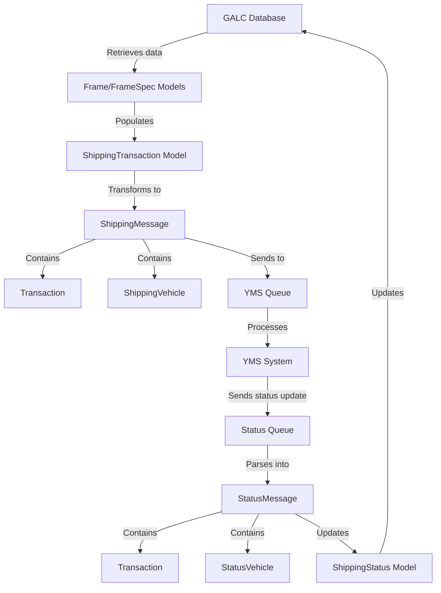
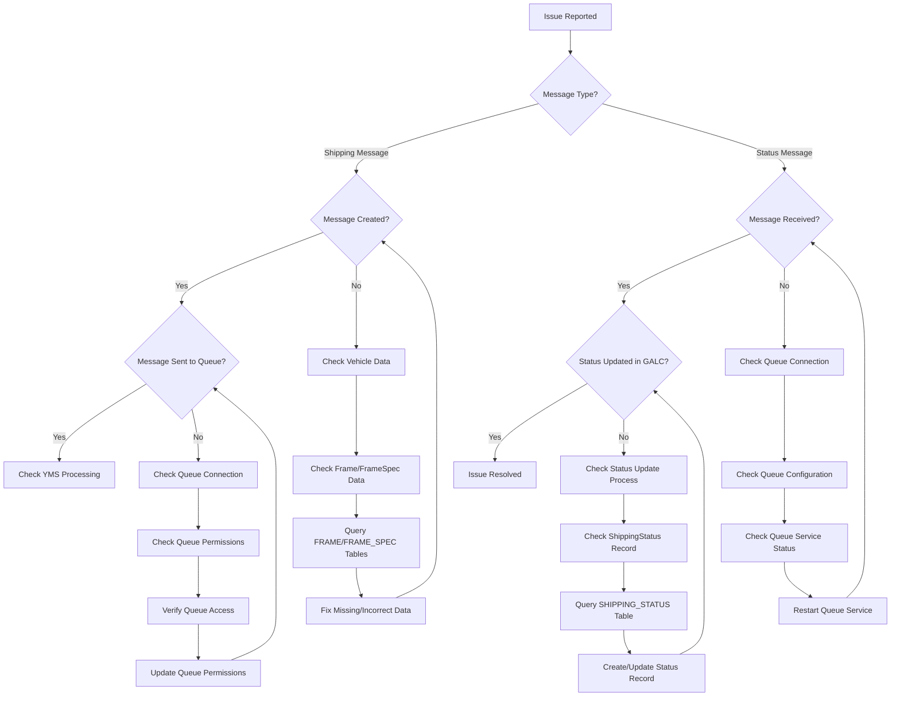

# Data Models Documentation

## Purpose

The data models in the Honda AHM LC Sales Interface Service form the backbone of the application's data structure. They serve multiple critical purposes:

1. **Data Representation**: They provide structured representations of vehicle information, specifications, and status
2. **Message Formatting**: They define the format for messages exchanged between GALC and YMS systems
3. **Data Transfer**: They facilitate the transformation of data between different systems and formats
4. **Status Tracking**: They enable tracking of vehicle status throughout the manufacturing and shipping processes

This documentation focuses on the key message models and status models that are essential for the data flow between systems.

## How They Work

The data models in this application function as both data containers and message formatters:

1. **Internal Data Models**: Models like `Frame`, `FrameSpec`, and `ShippingTransaction` represent internal data structures used within the application
2. **Message Models**: Models like `ShippingMessage`, `StatusMessage`, and their related classes define the format for messages exchanged with external systems
3. **Container Models**: Models like `DataContainer` serve as intermediaries that parse and hold data from incoming messages

These models work together to create a seamless flow of data between the GALC manufacturing system and the YMS shipping system.

## Key Components

### Message Models

#### DataContainer

The `DataContainer` class serves as a parsing container for incoming messages. It extracts and holds key information from messages received from queues.

**Key Fields**:
- **product_Id**: Vehicle Identification Number (VIN)
- **process_Point_Id**: ID of the process point in the manufacturing process
- **plant_Id**: ID of the manufacturing plant
- **line_Id**: ID of the production line
- **kd_lot**: KD (Knocked Down) lot information
- **production_lot**: Production lot information
- **statusType**: Type of status update

#### ShippingMessage

The `ShippingMessage` class represents a message sent from GALC to YMS with vehicle shipping information.

**Key Components**:
- **transaction**: Transaction information (destination, plant, line, etc.)
- **vehicle**: Vehicle information (VIN, model, color, etc.)

#### ShippingVehicle

The `ShippingVehicle` class extends the abstract `Vehicle` class and contains detailed vehicle information for shipping.

**Key Fields**:
- **vin**: Vehicle Identification Number
- **model_id**: Model ID
- **model_type**: Model type
- **color_code**: Color code
- **engine_number**: Engine serial number
- **key_number**: Key number
- **assembly_off_date**: Date when the vehicle completed assembly
- **product_lot_number**: Production lot number
- **kd_lot_number**: KD lot number
- **fif_codes**: FIF (Feature Installation Form) codes

#### StatusMessage

The `StatusMessage` class represents a message sent from YMS to GALC with vehicle status updates.

**Key Components**:
- **transaction**: Transaction information
- **vehicle**: Vehicle status information

#### StatusVehicle

The `StatusVehicle` class extends the abstract `Vehicle` class and contains detailed vehicle status information.

**Key Fields**:
- **vin**: Vehicle Identification Number
- **flag**: Status flag
- **ship_date**: Date when the vehicle was shipped
- **parking_bay**: Parking bay location
- **parking_space**: Parking space location
- **control_number**: Control number
- **dealer_number**: Dealer number
- **ship_type**: Shipping type

#### Transaction

The `Transaction` class represents transaction information for both shipping and status messages.

**Key Fields**:
- **destination_environment**: Destination environment (e.g., PROD, TEST)
- **destination_site**: Destination site
- **plant_id**: Plant ID
- **line_id**: Line ID
- **transaction_code**: Transaction code
- **description**: Transaction description
- **transaction_timestamp**: Timestamp of the transaction

### Status Models

#### ShippingStatus

The `ShippingStatus` class represents the shipping status of a vehicle in the GALC system.

**Key Fields**:
- **vin**: Vehicle Identification Number
- **status**: Status code (0 = not sent, 1 = sent to YMS)
- **actualTimestamp**: Timestamp of the status update
- **invoiced**: Invoiced flag
- **onTimeShipping**: On-time shipping flag
- **dealerNo**: Dealer number

## Data Flow



## Integration with Other Files

The message and status models integrate with several components in the system:

### Service Layer

- **ShippingTransactionService.java**: Uses `ShippingTransaction` model to interact with the GALC database
- **ShippingStatusService.java**: Uses `ShippingStatus` model to track shipping status
- **QueueManagerService.java**: Sends and receives messages using the message models

### Task Layer

- **ShippingTransactionTask.java**: Creates `ShippingMessage` objects and sends them to YMS
- **StatusMessageTask.java**: Processes `StatusMessage` objects received from YMS

### Scheduler Layer

- **ShippingMessageScheduler.java**: Triggers the process of sending shipping messages
- **StatusMessageScheduler.java**: Triggers the process of reading status messages

### Utility Layer

- **JSONUtil.java**: Converts message models to/from JSON format

## Example Workflows

### 1. Shipping Message Flow

When a vehicle needs to be shipped, the system follows this workflow:

1. The `ShippingMessageScheduler` triggers the `ShippingTransactionTask`
2. The task retrieves vehicle information from the GALC database using `Frame` and `FrameSpec` models
3. The task creates a `ShippingTransaction` record with the vehicle information
4. The task transforms the `ShippingTransaction` into a `ShippingMessage` with `Transaction` and `ShippingVehicle` components
5. The message is converted to JSON and sent to the YMS queue
6. The `ShippingStatus` record is updated to indicate the message was sent

```java
// Example code showing how message models are used in shipping flow
// 1. Create ShippingMessage
ShippingMessage shippingMessage = new ShippingMessage();

// 2. Create and populate Transaction
Transaction transaction = new Transaction();
transaction.setPlant_id(dataContainer.getPlant_Id());
transaction.setLine_id(dataContainer.getLine_Id());
transaction.setTransaction_code(status.getType());
transaction.setDestination_site(propertyUtil.getDestinationSite());
transaction.setDestination_environment(propertyUtil.getDestinationEnv());
transaction.setDescription(status.getName());
transaction.setTransaction_timestamp(getTransactionTimeStamp(shippingTransaction));

// 3. Create and populate ShippingVehicle
ShippingVehicle shippingVehicle = new ShippingVehicle();
shippingVehicle.setVin(shippingTransaction.getVin());
shippingVehicle.setModel_id(shippingTransaction.getSalesModelCode());
shippingVehicle.setModel_type(shippingTransaction.getSalesModelTypeCode());
shippingVehicle.setColor_code(shippingTransaction.getSalesModelColorCode());
shippingVehicle.setEngine_number(shippingTransaction.getEngineNumber());
shippingVehicle.setAssembly_off_date(shippingTransaction.getAfOffDate());

// 4. Set components in ShippingMessage
shippingMessage.setTransaction(transaction);
shippingMessage.setVehicle(shippingVehicle);

// 5. Convert to JSON and send to queue
String jsonMessage = JSONUtil.convertShippingMessageToJSON(shippingMessage);
queueManagerService.send(propertyUtil.getSalesShippingQueueName(), jsonMessage);

// 6. Update shipping status
shippingTransaction.setSendFlag('Y');
shippingTransactionService.saveShippingTransaction(galcUrl, shippingTransaction);

ShippingStatus shippingStatus = shippingStatusService.findByProductId(galcUrl, shippingTransaction.getVin());
shippingStatus.setStatus(1);
shippingStatusService.saveShippingStatus(galcUrl, shippingStatus);
```

### 2. Status Message Flow

When a status update is received from YMS, the system follows this workflow:

1. The `StatusMessageScheduler` triggers the `StatusMessageTask`
2. The task reads messages from the status queue
3. The messages are parsed into `StatusMessage` objects with `Transaction` and `StatusVehicle` components
4. The task processes the status update and updates the `ShippingStatus` record in GALC

```java
// Example code showing how message models are used in status flow
// 1. Read message from queue
String message = queueManagerService.receive(propertyUtil.getSalesStatusQueueName());

// 2. Parse message into StatusMessage
StatusMessage statusMessage = JSONUtil.parseStatusMessage(message);

// 3. Extract vehicle information
StatusVehicle statusVehicle = (StatusVehicle) statusMessage.getVehicle();
String vin = statusVehicle.getVin();
String dealerNumber = statusVehicle.getDealer_number();
String shipDate = statusVehicle.getShip_date();

// 4. Update shipping status
ShippingStatus shippingStatus = shippingStatusService.findByProductId(galcUrl, vin);
shippingStatus.setDealerNo(dealerNumber);
shippingStatus.setActualTimestamp(shipDate);
shippingStatus.setStatus(2); // Shipped
shippingStatusService.saveShippingStatus(galcUrl, shippingStatus);
```

## Database Interactions

The message models themselves don't directly interact with databases. However, they are used in processes that lead to database interactions:

### Indirect Database Interactions

1. **ShippingMessage Creation**:
   - Data is retrieved from GALC database into `Frame` and `FrameSpec` models
   - This data is used to create a `ShippingTransaction` model
   - The `ShippingTransaction` data is transformed into a `ShippingMessage`
   - After sending the message, the `ShippingStatus` is updated in the GALC database

2. **StatusMessage Processing**:
   - A `StatusMessage` is received from YMS
   - The data is extracted and used to update the `ShippingStatus` in the GALC database

### Database Queries

The actual database interactions are handled through REST API calls to the GALC system. The `BaseGalcService` constructs these calls using the following pattern:

```
[GALC_URL]/RestWeb/[DAO]/[METHOD]
```

For example, to update a shipping status:
```
[GALC_URL]/RestWeb/ShippingStatusDao/save
```

## Debugging Production Issues

### Common Issues and Solutions

#### 1. Message Format Errors

**Symptoms:**
- Error messages in logs: "Error converting message to json"
- Messages not being sent to or received from queues

**Debugging Steps:**
1. Check the logs for specific error messages about JSON conversion
2. Examine the raw message format:

```sql
-- Check message format in queue
SELECT MESSAGE_ID, MESSAGE_CONTENT 
FROM QUEUE_MESSAGES 
WHERE QUEUE_NAME = 'LC_SHIPPING_QUEUE' 
ORDER BY CREATE_TIMESTAMP DESC;
```

3. Verify if all required fields are present in the message

**Resolution:**
- Fix the message format in the source system
- Update the message model classes if the format has changed
- Add validation to ensure all required fields are present

#### 2. Missing or Incorrect Vehicle Data

**Symptoms:**
- Error messages in logs: "No ProductId in message" or "Cannot retrieve shipping information"
- Shipping messages not being created

**Debugging Steps:**
1. Check if the VIN exists in the GALC database:

```sql
-- Check if VIN exists
SELECT * FROM FRAME WHERE PRODUCT_ID = 'XXXXX';
```

2. Verify if the shipping transaction record exists:

```sql
-- Check shipping transaction
SELECT * FROM SHIPPING_TRANSACTION WHERE VIN = 'XXXXX';
```

3. Check if the shipping status record exists:

```sql
-- Check shipping status
SELECT * FROM SHIPPING_STATUS WHERE VIN = 'XXXXX';
```

**Resolution:**
- Create missing records in the GALC database
- Correct incorrect data in the existing records
- Ensure that all required data is populated before sending messages

#### 3. Status Update Failures

**Symptoms:**
- Status updates from YMS not being processed
- Shipping status not being updated in GALC

**Debugging Steps:**
1. Check if status messages are being received:

```sql
-- Check status messages
SELECT MESSAGE_ID, MESSAGE_CONTENT 
FROM QUEUE_MESSAGES 
WHERE QUEUE_NAME = 'LC_STATUS_QUEUE' 
ORDER BY CREATE_TIMESTAMP DESC;
```

2. Verify if the shipping status record exists for the VIN:

```sql
-- Check shipping status
SELECT * FROM SHIPPING_STATUS WHERE VIN = 'XXXXX';
```

3. Check for errors in the status message format

**Resolution:**
- Fix message format issues
- Create missing shipping status records
- Manually update status if necessary

### Visual Debugging Flow



## SQL Queries for Debugging

### Message Queue Queries

```sql
-- Check shipping messages in queue
SELECT 
    MESSAGE_ID,
    QUEUE_NAME,
    STATUS,
    CREATE_TIMESTAMP,
    LEFT(MESSAGE_CONTENT, 100) AS MESSAGE_PREVIEW
FROM 
    QUEUE_MESSAGES
WHERE 
    QUEUE_NAME = 'LC_SHIPPING_QUEUE'
ORDER BY 
    CREATE_TIMESTAMP DESC;

-- Check status messages in queue
SELECT 
    MESSAGE_ID,
    QUEUE_NAME,
    STATUS,
    CREATE_TIMESTAMP,
    LEFT(MESSAGE_CONTENT, 100) AS MESSAGE_PREVIEW
FROM 
    QUEUE_MESSAGES
WHERE 
    QUEUE_NAME = 'LC_STATUS_QUEUE'
ORDER BY 
    CREATE_TIMESTAMP DESC;
```

### Shipping Status Queries

```sql
-- Check shipping status for a specific VIN
SELECT 
    VIN,
    STATUS,
    ACTUAL_TIMESTAMP,
    INVOICED,
    ON_TIME_SHIPPING,
    DEALER_NO,
    CREATE_TIMESTAMP,
    UPDATE_TIMESTAMP
FROM 
    SHIPPING_STATUS
WHERE 
    VIN = 'XXXXX';

-- Find vehicles with specific status
SELECT 
    VIN,
    STATUS,
    ACTUAL_TIMESTAMP,
    DEALER_NO
FROM 
    SHIPPING_STATUS
WHERE 
    STATUS = 0; -- 0 = Not sent, 1 = Sent to YMS, 2 = Shipped
```

### Vehicle Data Queries

```sql
-- Check vehicle data for shipping
SELECT 
    f.PRODUCT_ID AS VIN,
    f.PRODUCT_SPEC_CODE,
    f.ENGINE_SERIAL_NO,
    f.ACTUAL_OFF_DATE,
    fs.SALES_MODEL_CODE,
    fs.SALES_MODEL_TYPE_CODE,
    fs.SALES_EXT_COLOR_CODE,
    ss.STATUS AS SHIPPING_STATUS
FROM 
    FRAME f
JOIN 
    FRAME_SPEC fs ON f.PRODUCT_SPEC_CODE = fs.PRODUCT_SPEC_CODE
LEFT JOIN 
    SHIPPING_STATUS ss ON f.PRODUCT_ID = ss.VIN
WHERE 
    f.PRODUCT_ID = 'XXXXX';
```

### Message Processing Queries

```sql
-- Check message processing history
SELECT 
    TASK_NAME,
    EXECUTION_TIME,
    STATUS,
    ERROR_MESSAGE
FROM 
    TASK_EXECUTION_LOG
WHERE 
    TASK_NAME IN ('ShippingTransactionTask', 'StatusMessageTask')
ORDER BY 
    EXECUTION_TIME DESC;
```

## Summary

The message and status models in the Honda AHM LC Sales Interface Service play a critical role in facilitating data exchange between the GALC manufacturing system and the YMS shipping system. They provide structured formats for messages, enable data transformation, and support the tracking of vehicle status throughout the manufacturing and shipping processes.

The key models include:
- **DataContainer**: Parses incoming messages
- **ShippingMessage/ShippingVehicle**: Formats outgoing shipping information
- **StatusMessage/StatusVehicle**: Processes incoming status updates
- **Transaction**: Provides transaction information for both shipping and status messages
- **ShippingStatus**: Tracks the shipping status of vehicles in GALC

These models work together in a complex data flow that ensures accurate and timely exchange of vehicle information between systems, supporting the overall vehicle manufacturing and shipping process.