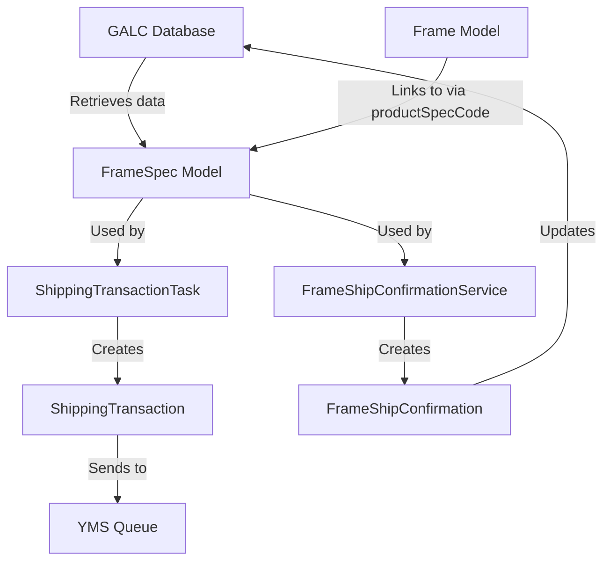
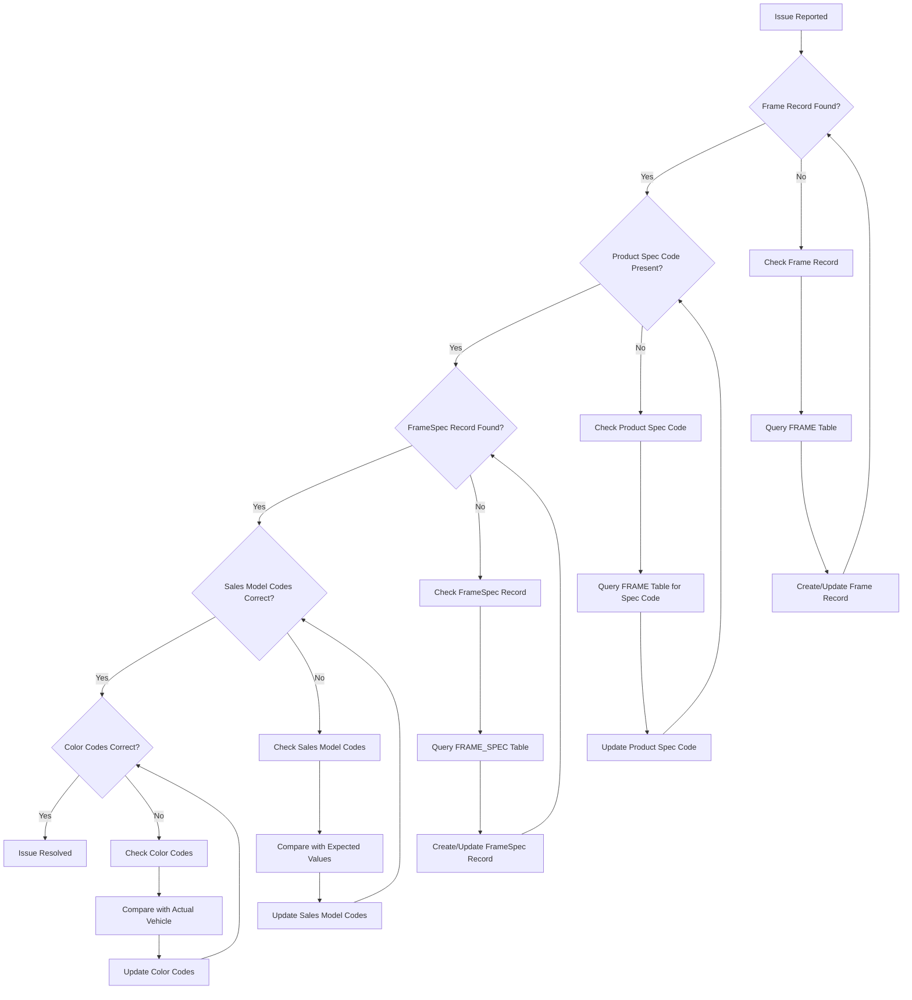

# FrameSpec.java Documentation

## Purpose

The `FrameSpec` class is a critical model in the Honda AHM LC Sales Interface Service that represents the detailed specifications of a vehicle frame in the manufacturing process. It serves as a comprehensive data container for vehicle specifications retrieved from the GALC (Global Assembly Line Control) system. This model captures essential information about a vehicle's model, color, sales codes, and other specifications, making it a vital component for properly identifying and categorizing vehicles throughout the manufacturing and shipping processes.

## How It Works

The `FrameSpec` model functions as a detailed specification repository for vehicles in the manufacturing system:

1. **Specification Storage**: It stores comprehensive vehicle specification information from the GALC database
2. **Model Identification**: It provides model codes, type codes, and year codes for vehicle identification
3. **Sales Information**: It includes sales model codes and color codes used for sales and shipping purposes
4. **Component Details**: It contains information about engine specifications and other vehicle components

The model extends the `ProductSpec` class, which in turn extends the `AuditEntry` class, creating a hierarchical structure that provides a complete picture of a vehicle's specifications and attributes.

## Key Components

### Class Hierarchy

```
AuditEntry
   ↑
ProductSpec
   ↑
FrameSpec
```

### Core Identification

- **productSpecCode**: The unique specification code that identifies this set of specifications
- **salesModelCode**: The sales model code used for sales and shipping
- **salesModelTypeCode**: The type code for the sales model
- **commonSalesModelCode**: Common sales model code for related models
- **commonSalesModelTypeCode**: Common sales model type code for related models

### Color Information

- **extColorCode**: External color code
- **intColorCode**: Interior color code
- **extColorDescription**: Description of the external color
- **intColorDescription**: Description of the interior color
- **salesExtColorCode**: External color code used for sales
- **salesIntColorCode**: Interior color code used for sales

### Model Information

- **modelDescription**: Full description of the model
- **shortModelDescription**: Shortened description of the model
- **seriesCode**: Code for the vehicle series
- **seriesDescription**: Description of the vehicle series
- **gradeCode**: Grade code for the vehicle
- **prototypeCode**: Code indicating if the vehicle is a prototype

### Component Information

- **engineMto**: Engine MTO (Made To Order) code
- **altEngineMto**: Alternative engine MTO code
- **enginePlantCode**: Code for the plant where the engine was manufactured
- **bodyAndTransTypeCode**: Body and transmission type code
- **bodyAndTransTypeDesc**: Description of the body and transmission type

### Manufacturing Information

- **plantCodeGpcs**: Plant code in the GPCS (Global Parts and Components System)
- **frameNoPrefix**: Prefix for the frame number
- **boundaryMarkRequired**: Indicates if boundary marking is required

### Inherited from ProductSpec Class

- **modelYearCode**: Model year code
- **modelCode**: Model code
- **modelTypeCode**: Model type code
- **modelOptionCode**: Model option code

### Inherited from AuditEntry Class

- **createTimestamp**: When the record was created
- **updateTimestamp**: When the record was last updated

## Data Flow



## Database Interactions

The `FrameSpec` model interacts with the GALC database through the `FrameSpecService`, which extends `BaseGalcService`. This service provides methods for retrieving frame specification information.

### Read Operations

- **getFrameSpec(String galcUrl, String productSpecCode)**: Retrieves frame specifications by product specification code

### Database Queries

The actual database interactions are handled through REST API calls to the GALC system. The `BaseGalcService` constructs these calls using the following pattern:

```
[GALC_URL]/RestWeb/[DAO]/[METHOD]
```

For example, to find frame specifications by product spec code:
```
[GALC_URL]/RestWeb/FrameSpecDao/findByKey
```

The `GalcDataType.FRAME_SPEC` enum value maps to "FrameSpecDao" and "com.honda.galc.dao.product.FrameSpecDao", which are used to construct the REST API calls.

## Integration with Other Files

The `FrameSpec` model is used by several components in the system:

### Service Layer

- **FrameSpecService.java**: Provides methods to retrieve frame specification information from the GALC database
- **FrameShipConfirmationService.java**: Uses frame specifications to create shipping confirmations with proper model and color information

### Task Layer

- **ShippingTransactionTask.java**: Uses the model to populate shipping transaction data
  - Retrieves frame specifications using the productSpecCode from the Frame model
  - Uses frame specification data to populate sales model codes and color codes in shipping transactions

### Related Models

- **Frame.java**: Contains the productSpecCode that links to the FrameSpec
- **ShippingTransaction.java**: Contains shipping information that is partially populated from frame specification data
- **FrameShipConfirmation.java**: Contains shipping confirmation information created from frame specification data

## Example Workflows

### 1. Shipping Transaction Processing

When a vehicle needs to be shipped, the system follows this workflow:

1. A message is received indicating a vehicle is ready for shipping
2. The `ShippingTransactionTask` extracts the product ID (VIN) from the message
3. The task retrieves the corresponding `Frame` record from the GALC database
4. If the frame is found, it retrieves the `FrameSpec` using the frame's productSpecCode
5. The task creates a `ShippingTransaction` record using data from both the frame and frame spec
6. The shipping transaction is processed and sent to the YMS (Yard Management System)

```java
// Example code showing how FrameSpec is used in shipping transaction processing
Frame frame = frameService.getFrame(galcUrl, productId);
if (frame != null) {
    // Get the frame specifications using the product spec code
    FrameSpec frameSpec = frameSpecService.getFrameSpec(galcUrl, frame.getProductSpecCode());
    
    if (frameSpec != null) {
        // Populate shipping transaction with frame specification data
        shippingTransaction.setVin(frame.getProductId());
        shippingTransaction.setSalesModelCode(frameSpec.getSalesModelCode());
        shippingTransaction.setSalesModelTypeCode(frameSpec.getSalesModelTypeCode());
        shippingTransaction.setSalesModelColorCode(frameSpec.getSalesExtColorCode());
        
        // Process the shipping transaction
        // ...
    } else {
        // Handle missing frame specifications
        String msg = String.format(
            "Error: Shipping Transaction VIN:%s has missing FrameSpec and it will not be processed.",
            frame.getProductId());
        logger.error(msg);
    }
}
```

### 2. Frame Ship Confirmation Processing

When a shipping confirmation needs to be processed:

1. The `FrameShipConfirmationService` retrieves the `Frame` record using the product ID
2. It checks if the frame has an engine serial number
3. It retrieves the `FrameSpec` using the frame's productSpecCode
4. It creates a `FrameShipConfirmation` record using data from both the frame and frame spec
5. The confirmation is saved to the GALC database

```java
// Example code showing how FrameSpec is used in ship confirmation processing
Frame frame = frameService.getFrame(galcUrl, productId);
if (frame != null && StringUtils.isNotBlank(frame.getEngineSerialNo())) {
    // Get the frame specifications using the product spec code
    FrameSpec frameSpec = frameSpecService.getFrameSpec(galcUrl, frame.getProductSpecCode());
    
    // Create ship confirmation with frame and frame spec data
    FrameShipConfirmationId id = new FrameShipConfirmationId();
    id.setEngineId(frame.getEngineSerialNo());
    id.setProductId(frame.getProductId());
    
    FrameShipConfirmation confirmation = new FrameShipConfirmation();
    confirmation.setId(id);
    confirmation.setFrameModel(frameSpec.getModelYearCode() + frameSpec.getModelCode());
    confirmation.setFrameType(frameSpec.getModelTypeCode());
    confirmation.setFrameOption(frameSpec.getModelOptionCode());
    confirmation.setExtColor(frameSpec.getExtColorCode());
    confirmation.setIntColor(frameSpec.getIntColorCode());
    
    // Save the confirmation
    frameShipConfirmationService.save(galcUrl, confirmation, GalcDataType.FRAME_SHIP_CONFIRM);
}
```

## Debugging Production Issues

### Common Issues and Solutions

#### 1. Missing Frame Specifications

**Symptoms:**
- Error messages in logs: "Error: Shipping Transaction VIN:XXX has missing FrameSpec and it will not be processed"
- Emails sent with error notifications
- Shipping transactions not being processed

**Debugging Steps:**
1. Check the logs for specific error messages about missing frame specifications
2. Verify if the product spec code in the frame record is correct:

```sql
-- Check product spec code in frame
SELECT PRODUCT_ID, PRODUCT_SPEC_CODE FROM FRAME WHERE PRODUCT_ID = 'XXXXX';
```

3. Query the GALC database to verify if the frame specification record exists:

```sql
-- Check if frame spec exists in GALC
SELECT * FROM FRAME_SPEC WHERE PRODUCT_SPEC_CODE = 'YYYYY';
```

**Resolution:**
- If the product spec code in the frame is incorrect, update it to the correct value
- If the frame specification doesn't exist in GALC, work with the GALC team to create the record

#### 2. Incorrect Sales Model Codes

**Symptoms:**
- Vehicles being shipped with incorrect model information
- Discrepancies between vehicle specifications and shipping documents

**Debugging Steps:**
1. Check if the sales model codes in the frame specification are correct:

```sql
-- Check sales model codes
SELECT 
    PRODUCT_SPEC_CODE, 
    SALES_MODEL_CODE, 
    SALES_MODEL_TYPE_CODE, 
    SALES_EXT_COLOR_CODE 
FROM 
    FRAME_SPEC 
WHERE 
    PRODUCT_SPEC_CODE = 'YYYYY';
```

2. Verify if the model codes match the expected values for the vehicle type

**Resolution:**
- Update the sales model codes in the frame specification record
- Ensure that new frame specifications are created with the correct sales model codes

#### 3. Color Code Discrepancies

**Symptoms:**
- Vehicles being shipped with incorrect color information
- Discrepancies between actual vehicle color and shipping documents

**Debugging Steps:**
1. Check if the color codes in the frame specification are correct:

```sql
-- Check color codes
SELECT 
    PRODUCT_SPEC_CODE, 
    EXT_COLOR_CODE, 
    EXT_COLOR_DESCRIPTION, 
    SALES_EXT_COLOR_CODE 
FROM 
    FRAME_SPEC 
WHERE 
    PRODUCT_SPEC_CODE = 'YYYYY';
```

2. Verify if the color codes match the actual vehicle color

**Resolution:**
- Update the color codes in the frame specification record
- Ensure that new frame specifications are created with the correct color codes

### Visual Debugging Flow



## SQL Queries for Debugging

### Basic Frame Specification Information

```sql
-- Get basic frame specification information
SELECT 
    fs.PRODUCT_SPEC_CODE,
    fs.MODEL_YEAR_CODE,
    fs.MODEL_CODE,
    fs.MODEL_TYPE_CODE,
    fs.MODEL_OPTION_CODE,
    fs.SALES_MODEL_CODE,
    fs.SALES_MODEL_TYPE_CODE,
    fs.EXT_COLOR_CODE,
    fs.INT_COLOR_CODE,
    fs.SALES_EXT_COLOR_CODE,
    fs.SALES_INT_COLOR_CODE
FROM 
    FRAME_SPEC fs
WHERE 
    fs.PRODUCT_SPEC_CODE = 'YYYYY';
```

### Frame and Frame Specification Relationship

```sql
-- Get frames and their specifications
SELECT 
    f.PRODUCT_ID,
    f.PRODUCT_SPEC_CODE,
    fs.SALES_MODEL_CODE,
    fs.SALES_MODEL_TYPE_CODE,
    fs.SALES_EXT_COLOR_CODE,
    fs.MODEL_YEAR_CODE,
    fs.MODEL_CODE,
    fs.MODEL_TYPE_CODE
FROM 
    FRAME f
JOIN 
    FRAME_SPEC fs ON f.PRODUCT_SPEC_CODE = fs.PRODUCT_SPEC_CODE
WHERE 
    f.PRODUCT_ID = 'XXXXX';
```

### Missing Frame Specifications

```sql
-- Find frames with missing specifications
SELECT 
    f.PRODUCT_ID,
    f.PRODUCT_SPEC_CODE
FROM 
    FRAME f
LEFT JOIN 
    FRAME_SPEC fs ON f.PRODUCT_SPEC_CODE = fs.PRODUCT_SPEC_CODE
WHERE 
    fs.PRODUCT_SPEC_CODE IS NULL;
```

### Color Code Verification

```sql
-- Verify color codes
SELECT 
    f.PRODUCT_ID,
    fs.EXT_COLOR_CODE,
    fs.EXT_COLOR_DESCRIPTION,
    fs.SALES_EXT_COLOR_CODE
FROM 
    FRAME f
JOIN 
    FRAME_SPEC fs ON f.PRODUCT_SPEC_CODE = fs.PRODUCT_SPEC_CODE
WHERE 
    f.PRODUCT_ID = 'XXXXX';
```

## Summary

The `FrameSpec` model is a critical component in the Honda AHM LC Sales Interface Service that represents the detailed specifications of a vehicle in the manufacturing process. It contains comprehensive vehicle specification data including model codes, color codes, and sales information. The model works with various services and tasks to ensure that vehicle specifications are accurately represented in shipping transactions and confirmations, playing a vital role in the overall vehicle manufacturing and shipping process.

The model's hierarchical structure, extending from `ProductSpec` and `AuditEntry`, provides a complete picture of a vehicle's specifications and attributes. Its integration with other components like `Frame`, `ShippingTransaction`, and `FrameShipConfirmation` enables the system to process vehicle information efficiently throughout the manufacturing and shipping lifecycle.