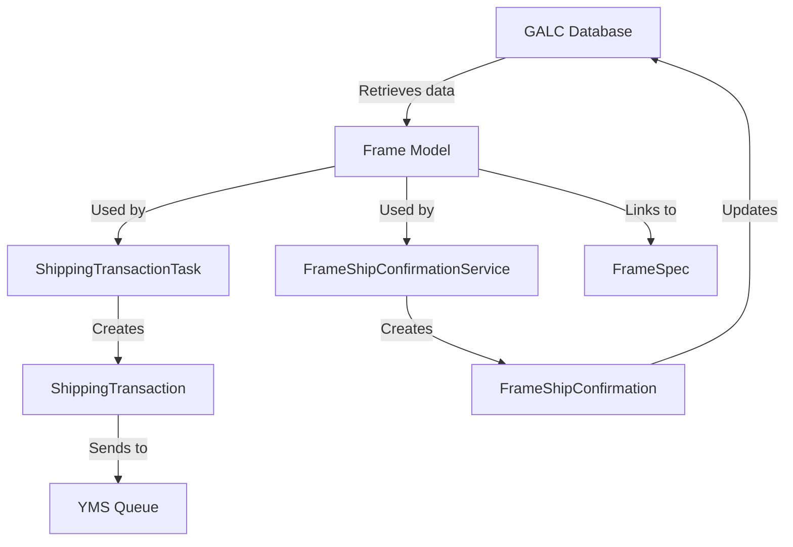
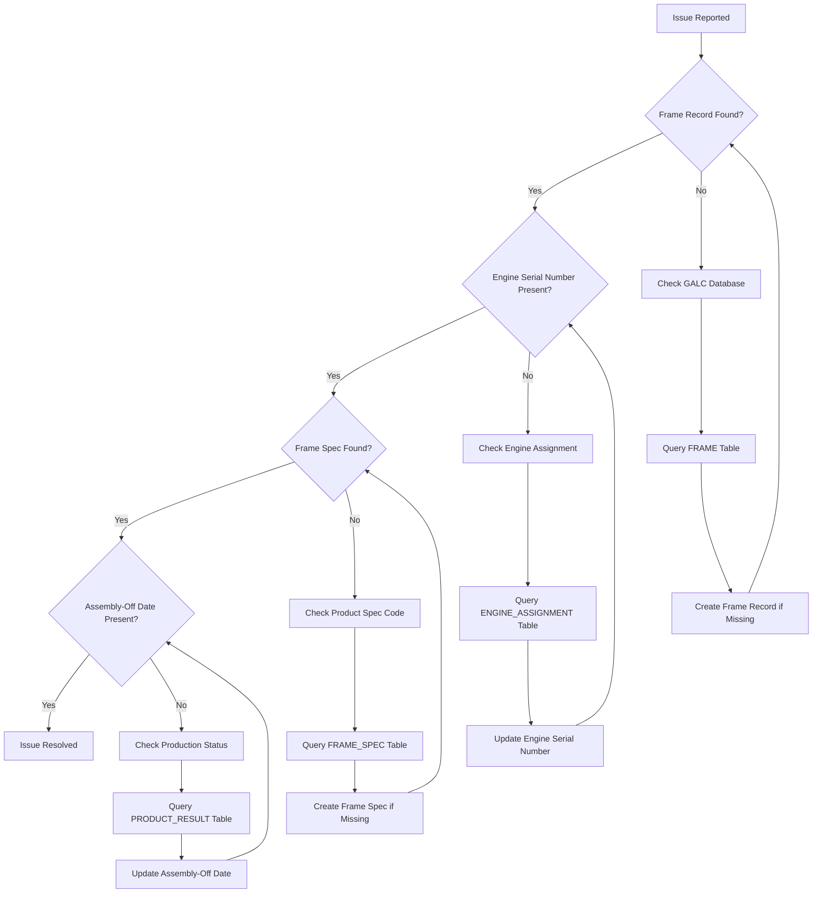

# Frame.java Documentation

## Purpose

The `Frame` class is a fundamental model in the Honda AHM LC Sales Interface Service that represents a vehicle frame in the manufacturing process. It serves as a data container for essential vehicle information retrieved from the GALC (Global Assembly Line Control) system. This model captures critical vehicle identification details, component information, and production status, making it a cornerstone for tracking vehicles throughout the manufacturing and shipping processes.

## How It Works

The `Frame` model functions as a representation of a physical vehicle in the manufacturing system:

1. **Data Representation**: It stores comprehensive vehicle information from the GALC database
2. **Vehicle Identification**: It provides unique identifiers (productId/VIN) and component serial numbers
3. **Production Tracking**: It includes information about the vehicle's production status and specifications

The model extends the `Product` class, which in turn extends the `AuditEntry` class, creating a hierarchical structure that provides a complete picture of a vehicle's attributes and history.

## Key Components

### Class Hierarchy

```
AuditEntry
   ↑
Product
   ↑
Frame
```

### Core Vehicle Identification

- **productId**: Vehicle Identification Number (VIN) - the unique identifier for each vehicle
- **shortVin**: A shortened version of the VIN
- **engineSerialNo**: The engine serial number
- **keyNo**: The key serial number for the vehicle

### Component Information

- **engineStatus**: Status code for the engine
- **missionSerialNo**: Transmission/mission serial number
- **actualMissionType**: The type of transmission/mission installed

### Production Information

- **afOnSequenceNumber**: Assembly frame on sequence number
- **straightShipPercentage**: Percentage value related to shipping
- **purchaseContractNumber**: Contract number for the vehicle purchase

### Inherited from Product Class

- **productSpecCode**: Product specification code that links to detailed specifications
- **lastPassingProcessPointId**: ID of the last process point the vehicle passed through
- **trackingStatus**: Current tracking status of the vehicle
- **productionLot**: Production lot information
- **planOffDate**: Planned assembly-off date
- **kdLotNumber**: KD (Knocked Down) lot number
- **productionDate**: Date when the vehicle was produced
- **productStartDate**: Date when production started
- **actualOffDate**: Actual assembly-off date
- **autoHoldStatus**: Status code for automatic hold

### Inherited from AuditEntry Class

- **createTimestamp**: When the record was created
- **updateTimestamp**: When the record was last updated

## Data Flow



## Database Interactions

The `Frame` model interacts with the GALC database through the `FrameService`, which extends `BaseGalcService`. This service provides methods for retrieving frame information.

### Read Operations

- **getFrame(String galcUrl, String productId)**: Retrieves a frame by product ID (VIN)

### Database Queries

The actual database interactions are handled through REST API calls to the GALC system. The `BaseGalcService` constructs these calls using the following pattern:

```
[GALC_URL]/RestWeb/[DAO]/[METHOD]
```

For example, to find a frame by VIN:
```
[GALC_URL]/RestWeb/FrameDao/findByKey
```

The `GalcDataType.FRAME` enum value maps to "FrameDao" and "com.honda.galc.dao.product.FrameDao", which are used to construct the REST API calls.

## Integration with Other Files

The `Frame` model is used by several components in the system:

### Service Layer

- **FrameService.java**: Provides methods to retrieve frame information from the GALC database
- **FrameSpecService.java**: Works alongside FrameService to retrieve detailed specifications for a frame
- **FrameShipConfirmationService.java**: Uses frame information to create shipping confirmations

### Task Layer

- **ShippingTransactionTask.java**: Uses the model to populate shipping transaction data
  - Retrieves frame information using the productId
  - Uses frame data to populate shipping transaction records
  - Checks for required fields like engine serial number

### Related Models

- **FrameSpec.java**: Contains detailed specifications for a frame
- **ShippingTransaction.java**: Contains shipping information that is partially populated from frame data
- **FrameShipConfirmation.java**: Contains shipping confirmation information created from frame data

## Example Workflows

### 1. Shipping Transaction Processing

When a vehicle needs to be shipped, the system follows this workflow:

1. A message is received indicating a vehicle is ready for shipping
2. The `ShippingTransactionTask` extracts the product ID (VIN) from the message
3. The task retrieves the corresponding `Frame` record from the GALC database
4. If the frame is found, it retrieves the `FrameSpec` using the frame's productSpecCode
5. The task creates a `ShippingTransaction` record using data from both the frame and frame spec
6. The shipping transaction is processed and sent to the YMS (Yard Management System)

```java
// Example code showing how Frame is used in shipping transaction processing
Frame frame = frameService.getFrame(galcUrl, productId);
if (frame != null) {
    FrameSpec frameSpec = frameSpecService.getFrameSpec(galcUrl, frame.getProductSpecCode());
    
    // Populate shipping transaction with frame data
    shippingTransaction.setVin(frame.getProductId());
    shippingTransaction.setSalesModelCode(frameSpec.getSalesModelCode());
    shippingTransaction.setSalesModelTypeCode(frameSpec.getSalesModelTypeCode());
    shippingTransaction.setSalesModelColorCode(frameSpec.getSalesExtColorCode());
    
    // Get assembly-off date from frame if available
    String afOffDate = frame.getActualOffDate();
    if (StringUtils.isEmpty(afOffDate)) {
        // Retrieve from another source if not available in frame
        afOffDate = shippingTransactionService.getMaxActualTs(galcUrl, frame.getProductId(), processPointId);
    }
    shippingTransaction.setAfOffDate(afOffDate);
}
```

### 2. Frame Ship Confirmation Processing

When a shipping confirmation needs to be processed:

1. The `FrameShipConfirmationService` retrieves the `Frame` record using the product ID
2. It checks if the frame has an engine serial number
3. It retrieves the `FrameSpec` using the frame's productSpecCode
4. It creates a `FrameShipConfirmation` record using data from both the frame and frame spec
5. The confirmation is saved to the GALC database

```java
// Example code showing how Frame is used in ship confirmation processing
Frame frame = frameService.getFrame(galcUrl, productId);
if (frame != null && StringUtils.isNotBlank(frame.getEngineSerialNo())) {
    FrameSpec frameSpec = frameSpecService.getFrameSpec(galcUrl, frame.getProductSpecCode());
    
    // Create ship confirmation with frame data
    FrameShipConfirmationId id = new FrameShipConfirmationId();
    id.setEngineId(frame.getEngineSerialNo());
    id.setProductId(frame.getProductId());
    
    FrameShipConfirmation confirmation = new FrameShipConfirmation();
    confirmation.setId(id);
    confirmation.setFrameModel(frameSpec.getModelYearCode() + frameSpec.getModelCode());
    confirmation.setFrameType(frameSpec.getModelTypeCode());
    
    // Save the confirmation
    frameShipConfirmationService.save(galcUrl, confirmation, GalcDataType.FRAME_SHIP_CONFIRM);
}
```

## Debugging Production Issues

### Common Issues and Solutions

#### 1. Missing Frame Data

**Symptoms:**
- Error messages in logs: "Error: No Shipping Transaction VIN:XXX found"
- Emails sent with error notifications
- Shipping transactions not being processed

**Debugging Steps:**
1. Check the logs for specific error messages about missing frame records
2. Query the GALC database to verify if the frame record exists:

```sql
-- Check if frame exists in GALC
SELECT * FROM FRAME WHERE PRODUCT_ID = 'XXXXX';

-- Check for related product information
SELECT * FROM PRODUCT WHERE PRODUCT_ID = 'XXXXX';
```

3. Verify if the VIN format is correct and matches the expected pattern

**Resolution:**
- If the frame doesn't exist in GALC, work with the GALC team to create the record
- If the VIN format is incorrect, correct it in the source system

#### 2. Missing Engine Serial Number

**Symptoms:**
- Error messages in logs: "NO Engine Assigned to VIN - XXX"
- Ship confirmations not being processed

**Debugging Steps:**
1. Check if the engine serial number is missing:

```sql
-- Check engine serial number
SELECT PRODUCT_ID, ENGINE_SERIAL_NO FROM FRAME WHERE PRODUCT_ID = 'XXXXX';
```

2. Verify if the engine has been assigned to the vehicle in the manufacturing process

**Resolution:**
- Wait until the engine is assigned to the vehicle
- If the engine has been physically assigned but not recorded, update the database record

#### 3. Missing Frame Specifications

**Symptoms:**
- Error messages in logs: "Error: Shipping Transaction VIN:XXX has missing FrameSpec and it will not be processed"
- Shipping transactions not being processed

**Debugging Steps:**
1. Check if the product spec code is correct:

```sql
-- Check product spec code
SELECT PRODUCT_ID, PRODUCT_SPEC_CODE FROM FRAME WHERE PRODUCT_ID = 'XXXXX';
```

2. Verify if the frame spec exists for the product spec code:

```sql
-- Check frame spec
SELECT * FROM FRAME_SPEC WHERE PRODUCT_SPEC_CODE = 'YYYYY';
```

**Resolution:**
- If the product spec code is incorrect, update it
- If the frame spec doesn't exist, create it

### Visual Debugging Flow



## SQL Queries for Debugging

### Basic Frame Information

```sql
-- Get basic frame information
SELECT 
    f.PRODUCT_ID, 
    f.ENGINE_SERIAL_NO, 
    f.KEY_NO, 
    f.SHORT_VIN,
    p.PRODUCT_SPEC_CODE,
    p.LAST_PASSING_PROCESS_POINT_ID,
    p.TRACKING_STATUS,
    p.ACTUAL_OFF_DATE
FROM 
    FRAME f
JOIN 
    PRODUCT p ON f.PRODUCT_ID = p.PRODUCT_ID
WHERE 
    f.PRODUCT_ID = 'XXXXX';
```

### Frame Specifications

```sql
-- Get frame specifications
SELECT 
    fs.PRODUCT_SPEC_CODE,
    fs.SALES_MODEL_CODE,
    fs.SALES_MODEL_TYPE_CODE,
    fs.SALES_EXT_COLOR_CODE,
    fs.MODEL_YEAR_CODE,
    fs.MODEL_CODE,
    fs.MODEL_TYPE_CODE,
    fs.MODEL_OPTION_CODE
FROM 
    FRAME_SPEC fs
JOIN 
    FRAME f ON fs.PRODUCT_SPEC_CODE = f.PRODUCT_SPEC_CODE
WHERE 
    f.PRODUCT_ID = 'XXXXX';
```

### Production Status

```sql
-- Get production status information
SELECT 
    pr.PRODUCT_ID,
    pr.PROCESS_POINT_ID,
    pr.ACTUAL_TS,
    pr.PLAN_TS,
    pr.STATUS
FROM 
    PRODUCT_RESULT pr
WHERE 
    pr.PRODUCT_ID = 'XXXXX'
ORDER BY 
    pr.ACTUAL_TS DESC;
```

### Shipping Transactions

```sql
-- Get shipping transactions for a frame
SELECT 
    st.VIN,
    st.SEND_FLAG,
    st.ENGINE_NUMBER,
    st.KEY_NUMBER,
    st.AF_OFF_DATE,
    st.SALES_MODEL_CODE,
    st.SALES_MODEL_TYPE_CODE,
    st.SALES_MODEL_COLOR_CODE
FROM 
    SHIPPING_TRANSACTION st
WHERE 
    st.VIN = 'XXXXX';
```

## Summary

The `Frame` model is a critical component in the Honda AHM LC Sales Interface Service that represents a vehicle in the manufacturing process. It contains comprehensive vehicle data including identification details, component information, and production status. The model works with various services and tasks to facilitate the tracking and shipping of vehicles, playing a vital role in the overall vehicle manufacturing and shipping process.

The model's hierarchical structure, extending from `Product` and `AuditEntry`, provides a complete picture of a vehicle's attributes and history. Its integration with other components like `FrameSpec`, `ShippingTransaction`, and `FrameShipConfirmation` enables the system to process vehicle information efficiently throughout the manufacturing and shipping lifecycle.