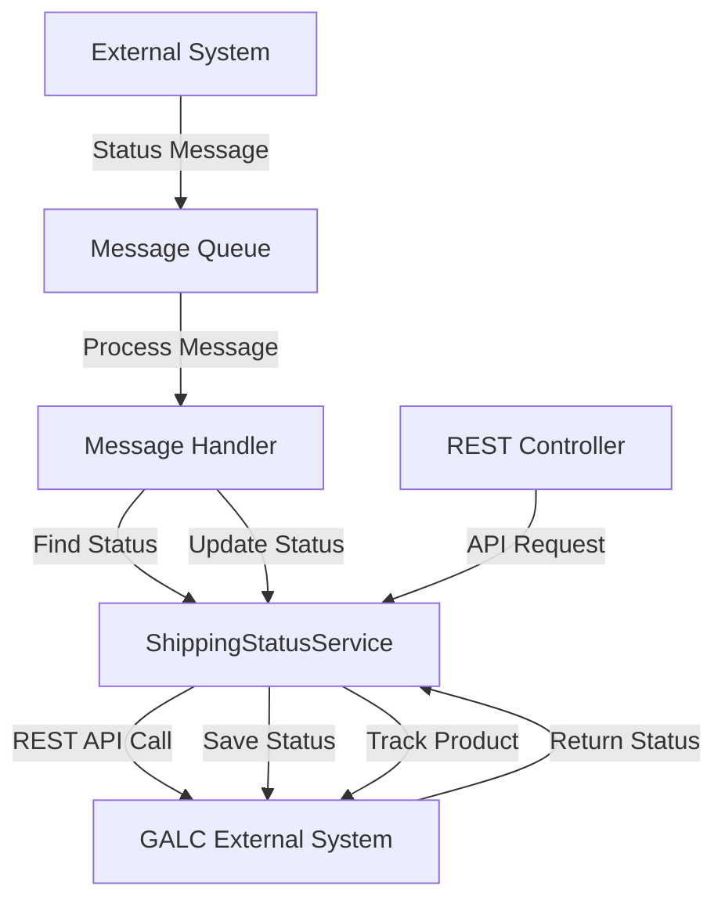
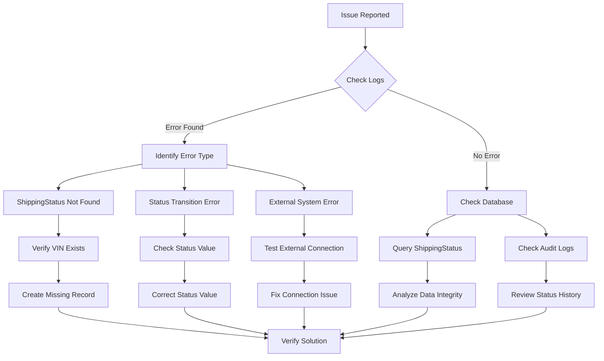

# ShippingStatus.java Documentation

## Purpose

The `ShippingStatus` class is a model that represents the shipping status of a vehicle in the Honda AHM LC Sales Interface Service. It tracks the current status of a vehicle throughout its shipping lifecycle, from initial creation through various stages like factory shipping, dealer assignment, and final delivery.

## How It Works

The `ShippingStatus` class extends the `AuditEntry` class, which provides timestamp tracking for creation and updates. It stores essential information about a vehicle's shipping status, including:

1. **VIN (Vehicle Identification Number)**: Uniquely identifies each vehicle
2. **Status**: An integer value representing the current shipping status (mapped to the `StatusEnum`)
3. **Actual Timestamp**: Records when the status was last updated
4. **Invoiced**: Indicates whether the vehicle has been invoiced
5. **On-Time Shipping**: Tracks whether the vehicle was shipped on time
6. **Dealer Number**: Identifies the dealer to which the vehicle is assigned

The class provides standard getter and setter methods for all properties, along with `toString()` and `toJsonString()` methods for data representation.

## Key Components

### Fields

- `vin`: String - The Vehicle Identification Number
- `status`: Integer - Current shipping status code (corresponds to StatusEnum values)
- `actualTimestamp`: String - Timestamp of the last status update
- `invoiced`: String - Indicates if the vehicle has been invoiced
- `onTimeShipping`: Integer - Flag indicating if shipping was on time
- `dealerNo`: String - Dealer identification number

### Methods

- Standard getters and setters for all fields
- `toString()`: Returns a string representation of the object
- `toJsonString()`: Returns a JSON-formatted string representation for API responses

## Interactions

The `ShippingStatus` model interacts with several components in the system:

1. **ShippingStatusService**: Provides CRUD operations for ShippingStatus objects
2. **Message Handlers**: Various handlers update the shipping status based on messages received:
   - `ShipmentConfirmMessageHandler`: Updates status when shipment is confirmed
   - `AhReceiveMessageHandler`: Updates status when vehicle is received
   - `DealerAssignMessageHandler`: Updates status when vehicle is assigned to a dealer
   - `FactoryReturnMessageHandler`: Updates status when vehicle is returned to factory
3. **REST Controller**: The `LCSalesInterfaceController` exposes endpoints that use ShippingStatus for tracking and updating vehicle status

## Database Interactions

The `ShippingStatus` model doesn't directly interact with a database. Instead, it uses the `BaseGalcService` through the `ShippingStatusService` to communicate with an external system (GALC) via REST API calls:

- **Find Operation**: `findByProductId` retrieves a ShippingStatus record by VIN
- **Save Operation**: `saveShippingStatus` creates or updates a ShippingStatus record
- **Tracking Operation**: `trackProduct` records tracking information for a vehicle

The external system uses the following mapping (from GalcDataType enum):

Copy

Paste

```
SHIPPING_STATUS("SHIPPING_STATUS", "ShippingStatusDao", "com.honda.galc.entity.conf.ShippingStatus")
```

## Visual Workflow



## Data Flow

1. A status message is received from an external system (e.g., factory, shipping company)
2. The appropriate message handler processes the message based on its type (e.g., ShipmentConfirm, DealerAssign)
3. The handler retrieves the current ShippingStatus for the vehicle using the ShippingStatusService
4. The status is updated based on the message content
5. The updated ShippingStatus is saved back to the external system
6. Tracking information is recorded for audit purposes

## Status Lifecycle

The `StatusEnum` defines the possible states for a vehicle:

Copy

Paste

```
INIT(0) → VQ_SHIP(1) → AH_RCVD(2) → DLR_ASGN(3) → AH_SHIP(4) → SHIPPER(8) → ON_TRN(9) → DLR_RCPT(10)
```

Alternative paths include:

- `AH_RTN(-1)`: Factory return
- `DLR_RTN(-2)`: Dealer return
- `AF_OFF(-3)`: Assembly off
- `AH_PCHG(5)`: Park change
- `PPO_ON(6)` → `PPO_OFF(7)`: PPO (Post-Production Option) processing

## Example

Here's an example of how the ShippingStatus is used in the application:

```java
// Retrieve a ShippingStatus by VIN
String galcUrl = shippingStatusService.getGalcUrl("1HGCY2F83RA046588", "1");
ShippingStatus shippingStatus = shippingStatusService.findByProductId(galcUrl, "1HGCY2F83RA046588");

// Display current status
System.out.println("Current status: " + StatusEnum.getShippingStatusByStatus(shippingStatus.getStatus()).getName());

// Update status to AH_SHIP (Shipment Confirmed)
shippingStatus.setStatus(StatusEnum.AH_SHIP.getStatus());
shippingStatusService.saveShippingStatus(galcUrl, shippingStatus);

// Track the status change
shippingStatusService.trackProduct(galcUrl, propertyUtil.getProcessPoint("AH-SHIP"), "1HGCY2F83RA046588");
```

## Debugging Production Issues

### Common Issues and Solutions

1. **Missing or Invalid ShippingStatus**

   - **Symptom**: `ShippingStatus not found for VIN` error in logs

   - **Debugging:**

     ```sql
     -- Query to check if ShippingStatus exists for a VIN
     SELECT * FROM SHIPPING_STATUS WHERE VIN = '1HGCY2F83RA046588';
     ```

   - **Solution**: If missing, create a new ShippingStatus record with the correct VIN

2. **Status Transition Issues**

   - **Symptom**: Status not updating or skipping expected states

   - **Debugging:**

     ```sql
     -- Query to check current status
     SELECT VIN, STATUS FROM SHIPPING_STATUS WHERE VIN = '1HGCY2F83RA046588';
     
     -- Query to check status history
     SELECT * FROM AUDIT_LOG WHERE ENTITY_TYPE = 'SHIPPING_STATUS' AND ENTITY_ID = '1HGCY2F83RA046588' 
     ORDER BY CREATE_TIMESTAMP DESC;
     ```

   - **Solution**: Verify the status flow in the code and ensure the correct status values are being set

3. **Timestamp Format Issues**

   - **Symptom**: Date parsing errors in logs
   - **Debugging**: Check the format of timestamps in the database and incoming messages
   - **Solution**: Ensure consistent date format usage across the application

### Debugging Steps

1. **Check Application Logs**

   - Look for error messages related to ShippingStatus
   - Check for exceptions in the ShippingStatusService or message handlers

2. **Verify External System Connectivity**

   - Test the connection to the GALC system
   - Verify that the GALC URL is correctly configured

3. **Inspect Message Queue**

   - Check if messages are being properly received and processed
   - Look for stuck or failed messages

4. **Database Queries**

   ```sql
   -- Check all records for a specific VIN
   SELECT * FROM SHIPPING_STATUS WHERE VIN = '[VIN_NUMBER]';
   
   -- Check records with specific status
   SELECT * FROM SHIPPING_STATUS WHERE STATUS = 4; -- AH_SHIP status
   
   -- Check recently updated records
   SELECT * FROM SHIPPING_STATUS ORDER BY UPDATE_TIMESTAMP DESC LIMIT 10;
   
   -- Check records with potential issues (e.g., missing dealer number when status is DLR_ASGN)
   SELECT * FROM SHIPPING_STATUS WHERE STATUS = 3 AND (DEALER_NO IS NULL OR DEALER_NO = '');
   ```

5. **Verify Status Transitions**

   - Check that status values are correctly set according to the StatusEnum
   - Ensure that business rules for status transitions are being followed

## Visual Debugging Flow




This documentation provides a comprehensive overview of the ShippingStatus.java file, its purpose, interactions, and debugging strategies. The model plays a crucial role in tracking vehicle shipping status throughout the Honda AHM LC Sales Interface Service.