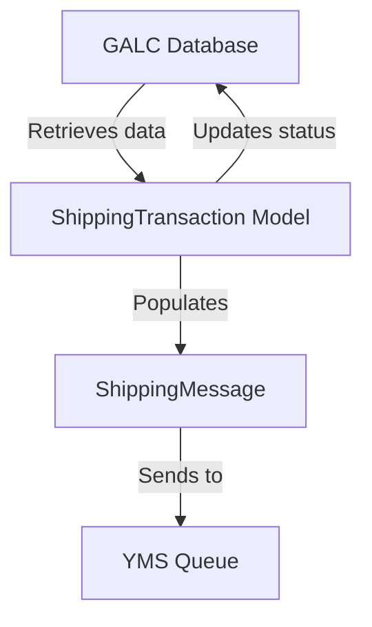
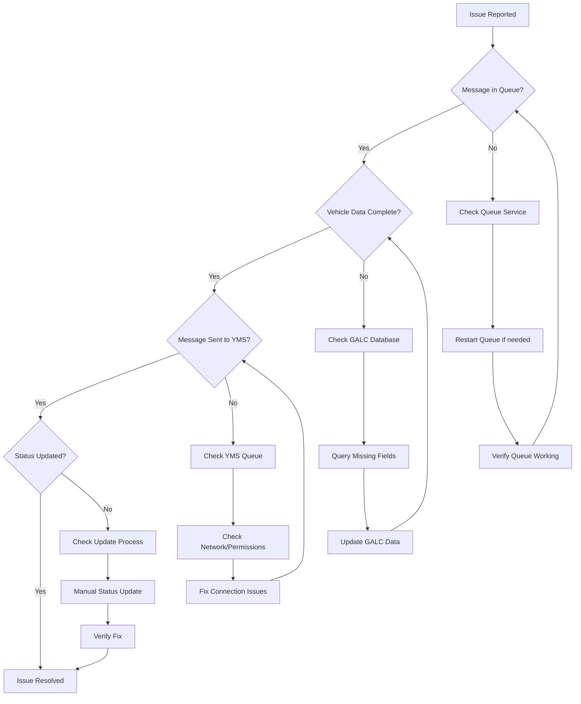

# ShippingTransaction.java Documentation

## Purpose

The `ShippingTransaction` class is a core model in the Honda AHM LC Sales Interface Service that represents vehicle shipping information. It serves as a data container for vehicle details that need to be transferred from the GALC (Global Assembly Line Control) system to the YMS (Yard Management System). This model captures all essential information about a vehicle that is ready for shipping, including identification details, specifications, and status flags.

## How It Works

The `ShippingTransaction` model functions as a bridge between different systems in the vehicle manufacturing and shipping process:

1. **Data Storage**: It stores vehicle information retrieved from the GALC database
2. **Data Transfer**: It provides the structure for information that needs to be sent to the YMS
3. **Status Tracking**: It includes flags that track whether a vehicle has been processed for shipping

The model extends the `AuditEntry` class, which provides timestamp fields for tracking when records are created and updated.

## Key Components

### Core Vehicle Identification

- **vin**: Vehicle Identification Number - the unique identifier for each vehicle
- **engineNumber**: The engine serial number
- **keyNumber**: The key serial number for the vehicle
- **cccRegNbr**: CCC registration number

### Vehicle Specifications

- **salesModelCode**: The sales model code of the vehicle
- **salesModelTypeCode**: The type code for the sales model
- **salesModelOptionCode**: Optional features code
- **salesModelColorCode**: The color code for the vehicle

### Production Information

- **productionDate**: The date when the vehicle was produced
- **productionSequenceNumber**: Sequence number in the production line
- **productionSuffix**: Additional production identifier
- **afOffDate**: Assembly-off date (when the vehicle completed assembly)

### Shipping Details

- **sendFlag**: Flag indicating whether the vehicle information has been sent to YMS ('Y' if sent)
- **dateString**: Date of the shipping transaction
- **time**: Time of the shipping transaction
- **sendLocation**: Location where the vehicle is being shipped from
- **tranType**: Transaction type code

### KD (Knocked Down) Information

- **kdLotLineNumber**: KD lot line number
- **kdLotDate**: KD lot date
- **kdLotSequenceNumber**: KD lot sequence number
- **kdLotSuffix**: KD lot suffix

### Additional Information

- **priceString**: Price information for the vehicle
- **vechicleUnitId**: Vehicle unit ID
- **vechicleCommonUnitId**: Common unit ID for the vehicle
- **printedFlag**: Flag indicating if documents have been printed
- **cicIssuData**: CIC issue data
- **adcProcessCode**: ADC process code
- **lineNumber**: Production line number

## Data Flow



## Database Interactions

The `ShippingTransaction` model interacts with the GALC database through the `ShippingTransactionService`, which extends `BaseGalcService`. This service provides methods for CRUD operations on shipping transaction records.

### Read Operations

- **findByProductId()**: Retrieves a shipping transaction by product ID (VIN)
- **get50ATransactionVin()**: Retrieves shipping transactions with specific status

### Write Operations

- **saveShippingTransaction()**: Updates or creates a shipping transaction record
- **deleteShippingTransaction()**: Deletes a shipping transaction record

### Database Queries

The actual database interactions are handled through REST API calls to the GALC system. The `BaseGalcService` constructs these calls using the following pattern:

```
[GALC_URL]/RestWeb/[DAO]/[METHOD]
```

For example, to find a shipping transaction by VIN:
```
[GALC_URL]/RestWeb/ShippingTransactionDao/findByKey
```

## Integration with Other Files

The `ShippingTransaction` model is used by several components in the system:

### Service Layer

- **ShippingTransactionService.java**: Provides methods to interact with the GALC database for shipping transaction operations
- **ShippingStatusService.java**: Works alongside ShippingTransactionService to manage shipping status records

### Task Layer

- **ShippingTransactionTask.java**: Uses the model to process outbound shipping messages
  - Retrieves shipping transactions from GALC
  - Populates additional data
  - Generates shipping messages
  - Updates transaction status

### Message Models

- **ShippingMessage.java**: Contains shipping transaction data formatted for YMS
- **ShippingVehicle.java**: Part of the shipping message that contains vehicle details
- **DataContainer.java**: Used to parse incoming messages that trigger shipping processes

## Example Workflow

Let's walk through a typical workflow involving the `ShippingTransaction` model:

1. A vehicle reaches the shipping stage in the manufacturing process
2. The GALC system records this event and sends a message to the LC Sales Interface Service queue
3. The `ShippingTransactionTask` reads this message and extracts the product ID (VIN)
4. The task retrieves the corresponding `ShippingTransaction` record from the GALC database
5. Additional data like engine number, key number, and assembly-off date are populated
6. The task creates a `ShippingMessage` using data from the `ShippingTransaction`
7. The message is sent to the YMS queue
8. The `ShippingTransaction` record is updated with `sendFlag = 'Y'`
9. The shipping status is updated from 0 to 1 (indicating it was sent to YMS)

```java
// Example code showing how ShippingTransaction is used
ShippingTransaction transaction = shippingTransactionService.findByProductId(galcUrl, productId);
if (transaction != null) {
    // Populate additional data if needed
    if (StringUtils.isEmpty(transaction.getAfOffDate())) {
        String afOffDate = shippingTransactionService.getMaxActualTs(galcUrl, transaction.getVin(), processPt);
        transaction.setAfOffDate(afOffDate);
    }
    
    // Generate shipping message
    ShippingMessage message = generateMessage(galcUrl, transaction, dataContainer);
    
    // Send message to YMS
    queueManagerService.send(salesShippingQueueName, JSONUtil.convertShippingMessageToJSON(message));
    
    // Update transaction status
    transaction.setSendFlag('Y');
    shippingTransactionService.saveShippingTransaction(galcUrl, transaction);
}
```

## Debugging Production Issues

### Common Issues and Solutions

#### 1. Missing Vehicle Data

**Symptoms:**
- Error messages in logs: "Error: Shipping Transaction VIN:XXX has missing [field] and it will not be processed"
- Emails sent with error notifications

**Debugging Steps:**
1. Check the logs for specific error messages about missing fields
2. Query the GALC database to verify if the vehicle record exists and has all required fields:

```sql
-- Check if vehicle exists in GALC
SELECT * FROM SHIPPING_TRANSACTION WHERE VIN = 'XXXXX';

-- Check for missing required fields
SELECT VIN, ENGINE_NUMBER, KEY_NUMBER, PRICE_STRING 
FROM SHIPPING_TRANSACTION 
WHERE VIN = 'XXXXX';
```

3. Verify if the vehicle has passed through the assembly-off point:

```sql
-- Check assembly-off date
SELECT PRODUCT_ID, MAX(ACTUAL_TS) 
FROM PRODUCT_RESULT 
WHERE PRODUCT_ID = 'XXXXX' AND PROCESS_POINT_ID = 'AF_OFF_POINT';
```

**Resolution:**
- If data is missing in GALC, work with the GALC team to correct the data
- If the vehicle hasn't passed assembly-off, wait until it completes that process point

#### 2. Message Queue Issues

**Symptoms:**
- No messages being processed
- Error messages about queue connections

**Debugging Steps:**
1. Check if the queue service is running:

```sql
-- Check queue status in monitoring table
SELECT * FROM QUEUE_MONITOR WHERE QUEUE_NAME = 'LC_RECEIVING_QUEUE';
```

2. Verify queue connection parameters in application properties
3. Check for messages stuck in the queue:

```sql
-- Count messages in queue
SELECT COUNT(*) FROM QUEUE_MESSAGES WHERE QUEUE_NAME = 'LC_RECEIVING_QUEUE' AND STATUS = 'PENDING';
```

**Resolution:**
- Restart queue services if needed
- Clear stuck messages if necessary
- Update connection parameters if they've changed

#### 3. Status Update Failures

**Symptoms:**
- Messages sent to YMS but status not updated in GALC
- Duplicate messages being sent for the same vehicle

**Debugging Steps:**
1. Check if the shipping transaction was updated correctly:

```sql
-- Check send flag status
SELECT VIN, SEND_FLAG FROM SHIPPING_TRANSACTION WHERE VIN = 'XXXXX';
```

2. Check if the shipping status was updated:

```sql
-- Check shipping status
SELECT PRODUCT_ID, STATUS FROM SHIPPING_STATUS WHERE PRODUCT_ID = 'XXXXX';
```

3. Look for transaction errors in the logs

**Resolution:**
- Manually update the status if needed:

```sql
-- Update send flag
UPDATE SHIPPING_TRANSACTION SET SEND_FLAG = 'Y' WHERE VIN = 'XXXXX';

-- Update shipping status
UPDATE SHIPPING_STATUS SET STATUS = 1 WHERE PRODUCT_ID = 'XXXXX';
```

### Visual Debugging Flow



## Summary

The `ShippingTransaction` model is a critical component in the Honda AHM LC Sales Interface Service that facilitates the transfer of vehicle shipping information from the GALC system to the YMS. It contains comprehensive vehicle data including identification, specifications, and shipping details. The model works with various services and tasks to ensure that vehicle information is accurately processed and transferred between systems, playing a vital role in the overall vehicle shipping process.