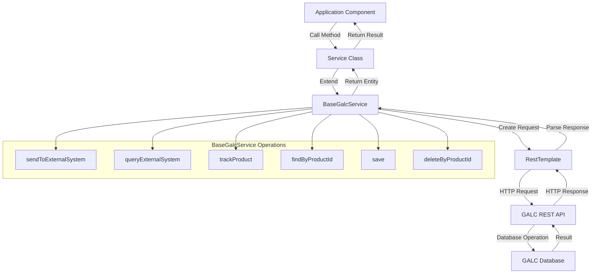
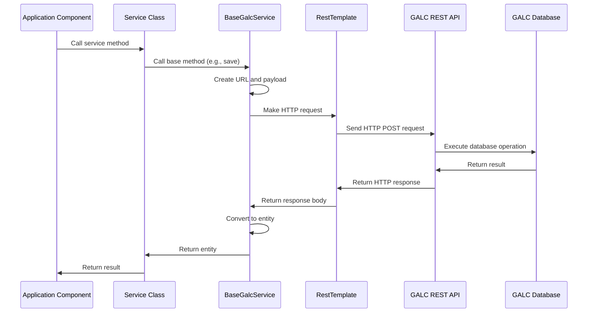

# BaseGalcService Documentation

## Purpose

The `BaseGalcService` is a foundational abstract class in the AHM LC Sales Interface system that provides a standardized way to communicate with the external GALC (Global Assembly Line Control) system. It serves as a base class for all service components that need to interact with the GALC database, offering common functionality for data retrieval, creation, updating, and deletion operations.

Think of `BaseGalcService` as a bridge between the AHM LC Sales Interface application and the GALC system, handling all the complexities of remote communication and data transformation.

## How It Works

The `BaseGalcService` uses Spring's `RestTemplate` to make HTTP requests to the GALC system's REST API endpoints. It handles the creation of properly formatted payloads, manages connection settings, and provides error handling for all communications with the external system.

### Step-by-Step Operation

1. **Initialization**: When the application starts, Spring creates instances of services that extend `BaseGalcService`.

2. **Type Resolution**: During initialization, the service determines the entity type it will be working with using Java's generics system.

3. **Communication Setup**: When a service method is called, `BaseGalcService` prepares the REST communication by:
   - Creating the appropriate URL for the GALC endpoint
   - Setting up connection timeouts
   - Formatting the request payload

4. **Data Exchange**: The service sends the request to the GALC system and receives the response.

5. **Response Processing**: The response is converted back into the appropriate entity type and returned to the caller.

6. **Error Handling**: Any exceptions during the process are caught, logged, and handled appropriately.

## Key Components

### Generic Type Parameters

- **E extends AuditEntry**: The entity type that the service will work with (e.g., ShippingTransaction, ShippingStatus)
- **K**: The type of the primary key for the entity (typically String for VIN-based entities)

### Methods

1. **sendToExternalSystem(String url, GalcDataType galcDataType, E entity, String method)**
   - Sends an entity to the GALC system for processing
   - Used for creating or updating records
   - Returns the processed entity from the GALC system

2. **queryExternalSystem(String url, GalcDataType galcDataType, String objPackage, Object id, String method)**
   - Queries the GALC system for data
   - Used for retrieving records or executing operations that don't require a full entity
   - Returns the result as the appropriate entity type

3. **trackProduct(String galcUrl, String processPointId, String productId)**
   - Tracks a product (vehicle) at a specific process point in the GALC system
   - Used to update the vehicle's status in the production tracking system

4. **findByProductId(String galcUrl, String productId, GalcDataType galcDataType)**
   - Finds an entity by its product ID (typically a VIN)
   - A convenience method that uses queryExternalSystem internally

5. **save(String galcUrl, E entity, GalcDataType galcDataType)**
   - Saves an entity to the GALC system
   - A convenience method that uses sendToExternalSystem internally

6. **deleteByProductId(String galcUrl, String productId, GalcDataType galcDataType)**
   - Deletes an entity by its product ID
   - A convenience method that uses queryExternalSystem internally

7. **getGalcUrl(String productId, String lineId)**
   - Determines the appropriate GALC URL to use based on the product ID and line ID
   - Handles cases where multiple GALC systems might be available

### Helper Methods

1. **getRestTemplate()**
   - Creates a configured RestTemplate for HTTP communication
   - Sets appropriate timeouts based on application properties

2. **getClientHttpRequestFactory()**
   - Configures the HTTP client with timeout settings
   - Ensures requests don't hang indefinitely

3. **createPayload(String galcPackage, Object entity)**
   - Creates a properly formatted payload for the GALC system
   - Wraps the entity in the appropriate package name

4. **getExternalSystemUrl(String url, String daoString, String method)**
   - Builds the complete URL for a GALC API endpoint
   - Combines the base URL, REST path, DAO name, and method name

## Interactions with Other Components

The `BaseGalcService` is a core component that interacts with many other parts of the system:

1. **Service Classes**
   - All service classes that need to communicate with GALC extend BaseGalcService
   - Examples include:
     - ShippingTransactionService
     - ShippingStatusService
     - FrameService
     - FrameSpecService
     - InProcessProductService
     - ParkChangeService

2. **PropertyUtil**
   - Used to retrieve configuration properties like:
     - Connection timeouts
     - GALC URLs
     - Product type

3. **GalcDataType Enum**
   - Provides metadata about different types of data in the GALC system
   - Includes information like:
     - Data type name
     - DAO (Data Access Object) name
     - Java package name for the entity

4. **AuditEntry Class**
   - Base class for all entities managed by BaseGalcService
   - Provides common fields like createTimestamp and updateTimestamp

5. **Message Handlers**
   - Indirectly use BaseGalcService through the specific service classes
   - Examples include:
     - ShipmentConfirmMessageHandler
     - FactoryReturnMessageHandler

6. **Task Classes**
   - Use services that extend BaseGalcService to perform scheduled operations
   - Examples include:
     - ShippingTransactionTask
     - ReceivingTransactionTask

## Database Interactions

While `BaseGalcService` doesn't directly interact with a database, it facilitates communication with the GALC system, which in turn interacts with its own database. The service acts as a client to the GALC REST API, which handles the actual database operations.

### REST API Endpoints

The service constructs REST API endpoints in the format:
```
{galcUrl}/RestWeb/{daoName}/{methodName}
```

For example:
- `http://galc-server/RestWeb/ShippingTransactionDao/findByKey`
- `http://galc-server/RestWeb/ShippingStatusDao/save`
- `http://galc-server/RestWeb/TrackingService/track`

### Common Operations

1. **Find by Key**
   - REST Endpoint: `{galcUrl}/RestWeb/{daoName}/findByKey`
   - Equivalent SQL: `SELECT * FROM {table} WHERE product_id = ?`

2. **Save**
   - REST Endpoint: `{galcUrl}/RestWeb/{daoName}/save`
   - Equivalent SQL: `INSERT INTO {table} (...) VALUES (...)` or `UPDATE {table} SET ... WHERE product_id = ?`

3. **Remove by Key**
   - REST Endpoint: `{galcUrl}/RestWeb/{daoName}/removeByKey`
   - Equivalent SQL: `DELETE FROM {table} WHERE product_id = ?`

4. **Track**
   - REST Endpoint: `{galcUrl}/RestWeb/TrackingService/track`
   - This is a specialized operation that updates tracking information in the GALC system

### Data Format

The service uses JSON for data exchange with the GALC system. Payloads are structured as:

```json
{
  "com.honda.galc.entity.{entityType}": {
    "field1": "value1",
    "field2": "value2",
    ...
  }
}
```

For simpler operations like findByKey, the payload might be:

```json
{
  "java.lang.String": "VIN12345678901234"
}
```

## Visual Workflow



## Data Flow



## Example Use Case

Let's walk through a typical use case to understand how the `BaseGalcService` works in practice:

### Updating a Vehicle's Shipping Status

1. A message is received indicating that a vehicle has been shipped.
2. The `ShipmentConfirmMessageHandler` processes this message.
3. The handler needs to update the vehicle's shipping status in the GALC system.
4. It calls the `ShippingStatusService.saveShippingStatus()` method.
5. The `ShippingStatusService` extends `BaseGalcService` and uses its `save()` method.
6. The `BaseGalcService.save()` method:
   - Constructs the appropriate URL for the GALC REST API
   - Creates a payload with the shipping status entity
   - Uses RestTemplate to send an HTTP POST request to the GALC system
   - Receives the response and converts it back to a ShippingStatus entity
   - Returns the updated entity to the ShippingStatusService
7. The ShippingStatusService returns the result to the handler.
8. The handler continues processing the message.

### Code Example

```java
// In ShipmentConfirmMessageHandler
public List<String> handle(StatusMessage statusMessage, StatusEnum status) {
    List<String> errorMessages = new ArrayList<String>();
    
    StatusVehicle statusVehicle = (StatusVehicle) statusMessage.getVehicle();
    String galcUrl = shippingStatusService.getGalcUrl(statusVehicle.getVin(),
            statusMessage.getTransaction().getLine_id());
    
    // Get the current shipping status
    ShippingStatus shippingStatus = shippingStatusService.findByProductId(galcUrl, statusVehicle.getVin());
    
    // Update the status
    shippingStatus.setStatus(StatusEnum.AH_SHIP.getStatus());
    
    // Save the updated status
    // This uses BaseGalcService.save() internally
    shippingStatusService.saveShippingStatus(galcUrl, shippingStatus);
    
    // Continue processing...
    return errorMessages;
}

// In ShippingStatusService
public ShippingStatus saveShippingStatus(String galcUrl, ShippingStatus entity) {
    try {
        getLogger().info("Save ShippingStatus record -" + entity.toString());
        // This calls BaseGalcService.save()
        return save(galcUrl, entity, GalcDataType.SHIPPING_STATUS);
    } catch (Exception e) {
        getLogger().error(e.getMessage());
    }
    return null;
}

// In BaseGalcService
protected E save(String galcUrl, E entity, GalcDataType galcDataType) {
    try {
        // This calls sendToExternalSystem which makes the actual REST API call
        return sendToExternalSystem(galcUrl, galcDataType, entity, "save");
    } catch (Exception e) {
        getLogger().error(e.getMessage());
    }
    return null;
}
```

## Debugging Production Issues

### Common Issues and Solutions

1. **Connection Timeouts**
   - **Symptom**: Logs show "Connection timed out" errors
   - **Debugging Query**: Check the connection settings in the application properties
     ```
     lc.rest.connect.timeout=10000
     lc.rest.read.timeout=10000
     ```
   - **Solution**: Increase timeout values or check network connectivity to GALC system

2. **Invalid GALC URL**
   - **Symptom**: Logs show "Error while sending data to external system" with a 404 error
   - **Debugging Steps**:
     1. Check the GALC URL in the application properties
     2. Verify the URL is accessible from the application server
     3. Test the URL directly using a tool like curl or Postman
   - **Solution**: Correct the GALC URL in the application properties

3. **Missing or Invalid Data**
   - **Symptom**: Logs show "Error while sending data to external system" with a 400 error
   - **Debugging Steps**:
     1. Check the entity data being sent to the GALC system
     2. Verify all required fields are populated
     3. Check for format issues in date fields or other formatted data
   - **Solution**: Fix the data issues in the entity before sending it to GALC

4. **GALC System Unavailable**
   - **Symptom**: Logs show connection refused errors
   - **Debugging Steps**:
     1. Check if the GALC system is running
     2. Verify network connectivity to the GALC system
     3. Check for firewall issues
   - **Solution**: Restart the GALC system or resolve network issues

### Debugging Steps

1. **Identify the Issue**
   - Review error logs for specific error messages
   - Check which operations are failing
   - Determine if the issue is with a specific entity type or all entities

2. **Check Configuration**
   - Verify GALC URLs in application properties
   - Check timeout settings
   - Verify other configuration properties used by the service

3. **Test Connectivity**
   - Use a tool like curl or Postman to test direct access to GALC REST endpoints
   - Check network connectivity between the application server and GALC server
   - Verify firewall rules allow the necessary communication

4. **Inspect Payloads**
   - Add debug logging to capture the exact payloads being sent to GALC
   - Verify the payloads are correctly formatted
   - Test the payloads directly against the GALC REST API

5. **Check GALC System**
   - Review GALC system logs for errors
   - Verify the GALC system is running correctly
   - Check for database issues in the GALC system

### Debugging Queries

While `BaseGalcService` doesn't execute SQL queries directly, here are some equivalent queries that could be used to debug issues in the GALC database:

1. **Check if a Product Exists**
   ```sql
   SELECT * FROM PRODUCT 
   WHERE PRODUCT_ID = 'VIN12345678901234';
   ```

2. **Check Shipping Status**
   ```sql
   SELECT * FROM SHIPPING_STATUS 
   WHERE PRODUCT_ID = 'VIN12345678901234';
   ```

3. **Check Shipping Transaction**
   ```sql
   SELECT * FROM SHIPPING_TRANSACTION 
   WHERE VIN = 'VIN12345678901234';
   ```

4. **Check Process Point Configuration**
   ```sql
   SELECT * FROM PROCESS_POINT 
   WHERE PROCESS_POINT_ID = 'PROCESS_POINT_ID';
   ```

5. **Check Tracking Information**
   ```sql
   SELECT * FROM PRODUCT_TRACKING 
   WHERE PRODUCT_ID = 'VIN12345678901234' 
   AND PROCESS_POINT_ID = 'PROCESS_POINT_ID';
   ```

### Logging for Debugging

To enhance debugging capabilities, you can add additional logging to the `BaseGalcService` methods:

```java
public E sendToExternalSystem(String url, GalcDataType galcDataType, E entity, String method) {
    try {
        String fullUrl = getExternalSystemUrl(url, galcDataType.getDao(), method);
        Object payload = createPayload(galcDataType.getGalcPackage(), entity);
        
        getLogger().debug("Sending request to URL: {}", fullUrl);
        getLogger().debug("Request payload: {}", payload);
        
        E result = getRestTemplate().postForObject(fullUrl, payload, entityClass);
        
        getLogger().debug("Response received: {}", result);
        return result;
    } catch (Exception e) {
        getLogger().error("Error while sending data to external system: {}, {} , {}", url, galcDataType.getDao(),
                e.getMessage());
        getLogger().debug("Exception details:", e);
    }
    return null;
}
```

## Conclusion

The `BaseGalcService` is a foundational component in the AHM LC Sales Interface system, providing a standardized way for the application to communicate with the external GALC system. It abstracts away the complexities of REST API communication, allowing service classes to focus on their specific business logic rather than the details of remote communication.

By understanding how this service works and interacts with other components, you can effectively troubleshoot issues, implement new features, and maintain the system's overall functionality. The service's generic design allows it to be used with any entity type that extends `AuditEntry`, making it a versatile tool for all GALC-related operations in the application.