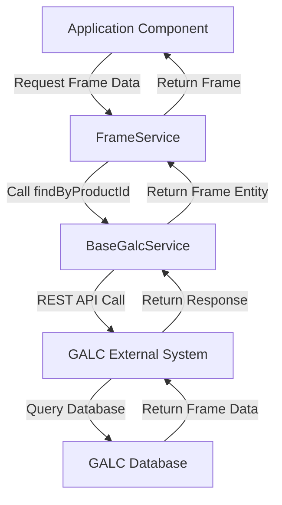
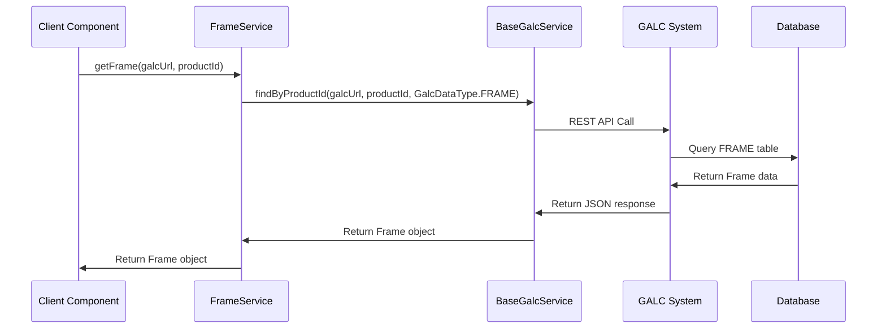

# FrameService Documentation

## Purpose

The `FrameService` is a specialized service component in the AHM LC Sales Interface system that manages frame data for vehicles. A frame in this context represents the core vehicle information including the VIN (Vehicle Identification Number), engine serial number, and other essential vehicle attributes. This service provides a clean, simple interface for retrieving frame information from the GALC (Global Assembly Line Control) system.

Think of the `FrameService` as the "vehicle information provider" that allows other components to access essential details about a vehicle's identity and specifications.

## How It Works

The `FrameService` extends the `BaseGalcService` class, inheriting its functionality for communicating with the GALC external system. It specializes in handling `Frame` entities, which contain vehicle identification and specification data.

### Step-by-Step Operation

1. **Initialization**: When the application starts, Spring creates an instance of `FrameService` and injects necessary dependencies.

2. **Service Request**: When another component needs frame information for a specific vehicle, it calls the `getFrame()` method with the GALC URL and product ID (VIN).

3. **Data Retrieval**: The service uses the inherited `findByProductId()` method from `BaseGalcService` to communicate with the GALC system and retrieve the frame data.

4. **Response Handling**: The service returns the `Frame` object to the calling component, which can then access the vehicle's information.

## Key Components

### Methods

1. **getFrame(String galcUrl, final String productId)**
   - Retrieves frame information for a specific vehicle by its product ID (VIN)
   - Returns a `Frame` object containing the vehicle's details
   - Uses the `findByProductId()` method inherited from `BaseGalcService`

### Frame Entity Structure

The `Frame` class extends the `Product` class and includes the following key attributes:

1. **productId**: The vehicle identification number (VIN)
2. **engineSerialNo**: The serial number of the vehicle's engine
3. **keyNo**: The key number associated with the vehicle
4. **shortVin**: A shortened version of the VIN
5. **missionSerialNo**: The serial number of the vehicle's transmission
6. **actualMissionType**: The type of transmission
7. **purchaseContractNumber**: The contract number for the vehicle purchase

Additionally, it inherits these important fields from the `Product` class:

1. **productSpecCode**: The specification code for the product
2. **lastPassingProcessPointId**: The ID of the last process point the vehicle passed through
3. **trackingStatus**: The current tracking status of the vehicle
4. **productionLot**: The production lot information
5. **kdLotNumber**: The knockdown lot number
6. **actualOffDate**: The date when the vehicle completed production

## Interactions with Other Components

The `FrameService` is used by several other components in the system:

1. **FrameShipConfirmationService**
   - Uses `FrameService` to retrieve frame information when processing shipping confirmations
   - Combines frame data with specification data to create shipping confirmation records

2. **ShippingTransactionTask**
   - Uses `FrameService` to get vehicle information when populating shipping transaction data
   - Relies on frame data to access the product specification code and other vehicle details

## Database Interactions

The `FrameService` doesn't directly interact with a database but uses the GALC REST API through `BaseGalcService` to retrieve frame data. The main table accessed through these API calls is:

**FRAME**
- Primary table for storing vehicle frame information
- Contains fields like product ID (VIN), engine serial number, key number, etc.

### Sample Queries

While the service doesn't execute SQL queries directly, here is the equivalent query that would be executed by the GALC system:

**Find Frame by Product ID**
```sql
SELECT * FROM FRAME 
WHERE PRODUCT_ID = '[productId]';
```

## Visual Workflow



## Data Flow



## Example Use Cases

Let's explore two common use cases to understand how the `FrameService` works in practice:

### 1. Processing a Shipping Confirmation

When a vehicle is being shipped, the system needs to create a shipping confirmation record:

1. The `FrameShipConfirmationService` receives a request to process a shipping confirmation for a vehicle.
2. It calls `frameService.getFrame(galcUrl, productId)` to retrieve the vehicle's frame information.
3. If the frame is found and has an engine serial number, it proceeds with creating the confirmation.
4. It uses the frame's product specification code to retrieve additional specification details.
5. It combines the frame and specification data to create a `FrameShipConfirmation` record.
6. The confirmation record is saved to the GALC system.

```java
// Example from FrameShipConfirmationService
public List<String> processFrameShipConfirmation(String galcUrl, final String productId, 
        final String processPointId, final String messageDate, final String messageTime, 
        StatusEnum status) {
    List<String> errorMessages = new ArrayList<String>();
    try {
        // Get the frame information using FrameService
        Frame frame = frameService.getFrame(galcUrl, productId);
        if (frame == null) {
            logger.info("Unable to find the VIN record - " + productId);
            return errorMessages;
        }
        if (StringUtils.isBlank(frame.getEngineSerialNo())) {
            logger.info("NO Engine Assigned to VIN  - " + productId);
            return errorMessages;
        }
        
        // Get specification information
        FrameSpec frameSpec = frameSpecService.getFrameSpec(galcUrl, frame.getProductSpecCode());
        
        // Create and save the confirmation record
        // ...
    } catch (Exception e) {
        logger.error(e.getMessage());
        errorMessages.add(e.getMessage());
    }
    return errorMessages;
}
```

### 2. Populating Shipping Transaction Data

When preparing shipping transaction data, the system needs vehicle information:

1. The `ShippingTransactionTask` needs to populate shipping transaction data for a vehicle.
2. It calls `frameService.getFrame(galcUrl, productId)` to retrieve the vehicle's frame information.
3. If the frame is found, it uses the product specification code to get additional specification details.
4. It uses the frame and specification data to populate the shipping transaction record.
5. The transaction data is then processed and sent to the appropriate destination.

```java
// Example from ShippingTransactionTask
private Map<ShippingTransaction, List<String>> populateAFOffData(String galcUrl, 
        DataContainer dataContainer, List<String> errorMessages) {
    String productId = dataContainer.getProduct_Id();
    
    Map<ShippingTransaction, List<String>> map = new HashMap<ShippingTransaction, List<String>>();
    ShippingTransaction shippingTransaction = new ShippingTransaction();
    
    // Get the frame information using FrameService
    Frame frame = frameService.getFrame(galcUrl, productId);
    if (frame == null) {
        String msg = String.format("Error : No Shipping Transaction VIN:%s found.", 
                dataContainer.getProduct_Id());
        logger.error(msg);
        errorMessages.add(msg);
        map.put(shippingTransaction, errorMessages);
        return map;
    }
    
    // Get specification information
    FrameSpec frameSpec = frameSpecService.getFrameSpec(galcUrl, frame.getProductSpecCode());
    
    // Populate shipping transaction data
    // ...
    
    return map;
}
```

## Debugging Production Issues

### Common Issues and Solutions

1. **Missing Frame Data**
   - **Symptom**: Logs show "Unable to find the VIN record" errors
   - **Debugging Query**:
     ```sql
     SELECT * FROM FRAME 
     WHERE PRODUCT_ID = '[problematic_vin]';
     ```
   - **Solution**: Verify that the vehicle exists in the FRAME table and that the VIN is correct

2. **Missing Engine Serial Number**
   - **Symptom**: Logs show "NO Engine Assigned to VIN" errors
   - **Debugging Query**:
     ```sql
     SELECT PRODUCT_ID, ENGINE_SERIAL_NO 
     FROM FRAME 
     WHERE PRODUCT_ID = '[problematic_vin]';
     ```
   - **Solution**: Check if the engine has been assigned to the vehicle in the production system

3. **Communication Errors with GALC**
   - **Symptom**: REST API call failures, timeout errors
   - **Debugging Steps**:
     1. Check network connectivity to GALC system
     2. Verify GALC service is running
     3. Check logs for specific error messages
   - **Solution**: Resolve network issues or restart GALC service if needed

4. **Invalid Product Specification Code**
   - **Symptom**: Errors when trying to retrieve frame specification data
   - **Debugging Query**:
     ```sql
     SELECT PRODUCT_ID, PRODUCT_SPEC_CODE 
     FROM FRAME 
     WHERE PRODUCT_ID = '[problematic_vin]';
     
     SELECT * FROM FRAME_SPEC 
     WHERE PRODUCT_SPEC_CODE = '[problematic_spec_code]';
     ```
   - **Solution**: Verify that the product specification code exists and is correctly associated with the vehicle

### Debugging Steps

1. **Identify the Issue**
   - Review error logs for specific error messages
   - Determine which vehicles are affected by the issue
   - Identify at which point in the process the issue occurs

2. **Check Frame Data**
   - Verify that the frame record exists for the affected vehicle
   - Check if all required fields are populated
   - Ensure the product specification code is valid

3. **Test GALC Connectivity**
   - Verify that the application can connect to the GALC system
   - Check if other GALC-related operations are working
   - Test the specific REST endpoint for retrieving frame data

4. **Analyze Related Data**
   - Check if related data (like frame specifications) is available
   - Verify that the relationships between data entities are correct
   - Ensure that all required data is present in the GALC system

5. **Implement a Solution**
   - Fix data issues directly in the database if needed
   - Update configuration if necessary
   - Deploy code fixes if the issue is in the application logic

### Debugging Queries

1. **Check Frame Existence**
   ```sql
   SELECT COUNT(*) 
   FROM FRAME 
   WHERE PRODUCT_ID = '[vin]';
   ```

2. **Check Frame Details**
   ```sql
   SELECT PRODUCT_ID, ENGINE_SERIAL_NO, PRODUCT_SPEC_CODE, 
          KEY_NO, SHORT_VIN, ACTUAL_OFF_DATE 
   FROM FRAME 
   WHERE PRODUCT_ID = '[vin]';
   ```

3. **Check Frame Specification**
   ```sql
   SELECT * FROM FRAME_SPEC 
   WHERE PRODUCT_SPEC_CODE = (
       SELECT PRODUCT_SPEC_CODE 
       FROM FRAME 
       WHERE PRODUCT_ID = '[vin]'
   );
   ```

4. **Check Production Status**
   ```sql
   SELECT PRODUCT_ID, TRACKING_STATUS, LAST_PASSING_PROCESS_POINT_ID 
   FROM FRAME 
   WHERE PRODUCT_ID = '[vin]';
   ```

5. **Check Related Shipping Data**
   ```sql
   SELECT * FROM SHIPPING_STATUS 
   WHERE PRODUCT_ID = '[vin]';
   
   SELECT * FROM SHIPPING_TRANSACTION 
   WHERE VIN = '[vin]';
   ```

## Conclusion

The `FrameService` is a simple yet critical component in the AHM LC Sales Interface system, providing access to essential vehicle information. Despite its small size, it plays a vital role in many processes, including shipping confirmations and transaction processing.

By understanding how this service works and interacts with other components, you can effectively troubleshoot issues, implement new features, and maintain the system's overall functionality. The service's straightforward design makes it easy to use and extend, while its integration with `BaseGalcService` ensures consistent communication with the GALC system.