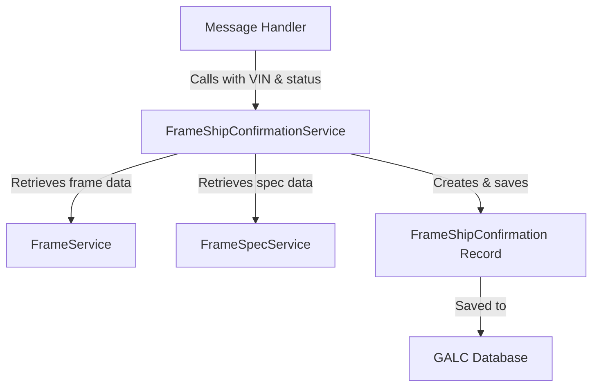
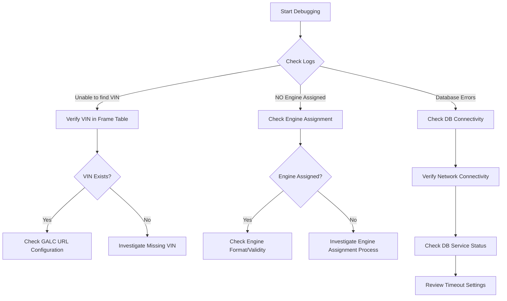

# FrameShipConfirmationService Documentation

## 1. Purpose

The `FrameShipConfirmationService` is a critical component in the Honda AHM LC Sales Interface service that manages frame shipping confirmation records. This service is responsible for creating and maintaining records that track when a vehicle frame has been shipped or assigned to a dealer, capturing essential details about the vehicle and the shipping event.

## 2. How It Works

The service extends `BaseGalcService` which provides core functionality for interacting with external systems, particularly the GALC (Global Automotive Logistics Control) system. The main function of this service is to process frame shipping confirmations when vehicles reach specific status points in their lifecycle, such as dealer assignment or shipment confirmation.

### Key Workflow

1. The service receives a request to process a shipping confirmation for a vehicle
2. It retrieves the vehicle frame information using the VIN (Vehicle Identification Number)
3. It validates that the engine is assigned to the vehicle
4. It retrieves the frame specifications for the vehicle
5. It creates a new frame shipping confirmation record with vehicle and event details
6. It saves the record to the external GALC system

## 3. Key Components

### Main Method: processFrameShipConfirmation

```java
public List<String> processFrameShipConfirmation(String galcUrl, final String productId, 
        final String processPointId, final String messageDate, final String messageTime, 
        StatusEnum status)
```

**Parameters:**

- `galcUrl`: The URL of the GALC system to connect to
- `productId`: The VIN of the vehicle
- `processPointId`: The ID of the process point (e.g., dealer assignment, shipment confirmation)
- `messageDate`: The date of the event in format "yyMMdd"
- `messageTime`: The time of the event in format "hhmmss"
- `status`: The status enum representing the current state of the vehicle

**Returns:**

- A list of error messages if any occurred during processing

## 4. Interactions with Other Components

The `FrameShipConfirmationService` interacts with several other components in the system:

### Services

- **FrameService**: Used to retrieve frame information by VIN
- **FrameSpecService**: Used to retrieve frame specifications by product spec code

### Message Handlers

- **ShipmentConfirmMessageHandler**: Uses this service to process shipment confirmations
- **DealerAssignMessageHandler**: Uses this service to process dealer assignments

### Database Interactions

- Interacts with the `FrameShipConfirmation` table in the GALC database through the `FrameShipConfirmationDao`
- The table stores shipping confirmation records with details about the vehicle and shipping event

## 5. Data Flow



## 6. Database Structure

The service primarily interacts with the `FrameShipConfirmation` table which has the following structure:

| Field | Description | |-------|-------------| | processPointId | Process point identifier (part of composite key) | | engineId | Engine serial number (part of composite key) | | productId | Vehicle identification number (VIN) (part of composite key) | | eventDate | Date of the shipping event (format: yyMMdd) | | eventTime | Time of the shipping event (format: hhmmss) | | frameModel | Combined model year and model code | | frameType | Model type code | | extColor | External color code | | intColor | Internal color code | | frameOption | Model option code | | sentFlag | Flag indicating if record has been sent ("I" = Initial) | | recordType | Status code of the record |

## 7. Example Use Case

### Scenario: Vehicle Shipment Confirmation

When a vehicle is confirmed for shipment from the factory to a dealer:

1. The `ShipmentConfirmMessageHandler` receives a status message with status "AH-SHIP"

2. The handler validates the current status of the vehicle

3. The handler updates the shipping status to "AH-SHIP" (status code 4)

4. The handler calls

    

   ```
   frameShipConfirmationService.processFrameShipConfirmation()
   ```

    

   with:

   - VIN of the vehicle
   - Process point ID for "AH-SHIP"
   - Current date and time
   - Status enum AH_SHIP

5. The

    

   ```
   FrameShipConfirmationService
   ```

   :

   - Retrieves the frame information for the VIN
   - Validates that an engine is assigned
   - Gets the frame specifications
   - Creates a new `FrameShipConfirmation` record with all vehicle details
   - Sets the record type to "4" (AH_SHIP status)
   - Saves the record to the GALC database

6. The handler then tracks the product movement in the system

## 8. Debugging Production Issues

### Common Issues and Solutions

#### 1. Missing Frame Information

**Symptoms:**

- Log entries showing "Unable to find the VIN record"
- No frame shipping confirmation records created

**Debugging Steps:**

1. Verify the VIN exists in the system
2. Check if the GALC URL is correctly configured
3. Verify connectivity to the GALC system

**SQL Query for Verification:**

```sql
-- Check if VIN exists in Frame table
SELECT * FROM Frame WHERE productId = '[VIN]';

-- Check existing FrameShipConfirmation records
SELECT * FROM FrameShipConfirmation WHERE productId = '[VIN]';
```

#### 2. Missing Engine Assignment

**Symptoms:**

- Log entries showing "NO Engine Assigned to VIN"
- Process terminates early without creating records

**Debugging Steps:**

1. Verify engine assignment in the Frame table
2. Check the engine assignment process for errors

**SQL Query for Verification:**

```sql
-- Check engine assignment
SELECT productId, engineSerialNo FROM Frame WHERE productId = '[VIN]';
```

#### 3. Database Connection Issues

**Symptoms:**

- Exception messages in logs related to database connectivity
- Error messages returned from the service

**Debugging Steps:**

1. Verify GALC URL configuration in properties
2. Check network connectivity to the database
3. Verify database service is running
4. Check for timeout settings in the application

**SQL Query for Verification:**

```sql
-- Test basic connectivity
SELECT 1 FROM DUAL;
```

### Visual Debugging Flow



## 9. Production Support Queries

### Query 1: Check Frame Ship Confirmation Records for a VIN

```sql
SELECT fsc.productId, fsc.engineId, fsc.processPointId, 
       fsc.eventDate, fsc.eventTime, fsc.recordType, fsc.sentFlag,
       fsc.frameModel, fsc.frameType, fsc.frameOption
FROM FrameShipConfirmation fsc
WHERE fsc.productId = '[VIN]'
ORDER BY fsc.eventDate DESC, fsc.eventTime DESC;
```

### Query 2: Check Status Progression for a VIN

```sql
SELECT ss.productId, ss.status, se.type, se.name, 
       ss.lastUpdateDate, ss.lastUpdateTime
FROM ShippingStatus ss
JOIN (
    SELECT status, type, name 
    FROM (
        SELECT 0 as status, 'INIT' as type, 'INIT' as name FROM DUAL
        UNION SELECT 1, 'VQ-SHIP', 'VQ SHIP' FROM DUAL
        UNION SELECT 2, 'AH-RCVD', 'AHM RECEIVING' FROM DUAL
        UNION SELECT 3, 'DLR-ASGN', 'DEALER ASSIGNED (FTZ REL)' FROM DUAL
        UNION SELECT 4, 'AH-SHIP', 'SHIPMENT CONFIRMED (FTZ CFRM)' FROM DUAL
        UNION SELECT -1, 'AH-RTN', 'FACTORY RETURN' FROM DUAL
        UNION SELECT 5, 'AH-PCHG', 'PARK CHANGE' FROM DUAL
        UNION SELECT 6, 'PPO-ON', 'PPO ON' FROM DUAL
        UNION SELECT 7, 'PPO-OFF', 'PPO OFF' FROM DUAL
        UNION SELECT 8, 'SHIPPER', 'SHIPPER' FROM DUAL
        UNION SELECT 9, 'ON-TRN', 'LOADED TO TRAIN' FROM DUAL
        UNION SELECT 10, 'DLR-RCPT', 'DEALER RECEIPT' FROM DUAL
        UNION SELECT -2, 'DLR-RTN', 'DEALER RETURN' FROM DUAL
        UNION SELECT -3, 'AF-OFF', 'ASSEMBLY OFF' FROM DUAL
    ) status_values
) se ON ss.status = se.status
WHERE ss.productId = '[VIN]';
```

### Query 3: Check for Missing Engine Assignments

```sql
SELECT f.productId, f.engineSerialNo, fs.modelYearCode, 
       fs.modelCode, fs.modelTypeCode
FROM Frame f
LEFT JOIN FrameSpec fs ON f.productSpecCode = fs.productSpecCode
WHERE f.engineSerialNo IS NULL OR TRIM(f.engineSerialNo) = '';
```

### Query 4: Check Process Points Configuration

```sql
SELECT pp.processPointId, pp.processPointName, pp.processPointDesc
FROM ProcessPoint pp
WHERE pp.processPointId IN (
    SELECT DISTINCT fsc.processPointId 
    FROM FrameShipConfirmation fsc
);
```

## 10. Complete End-to-End Example

### Scenario: Tracking a Vehicle Through Shipment Process

1. **Initial State**: Vehicle with VIN "1HGCM82633A123456" is manufactured and ready for shipment
2. **Dealer Assignment**:
   - System receives a DLR-ASGN status message for the VIN
   - `DealerAssignMessageHandler` processes the message
   - Current date: 2023-06-15, time: 14:30:00
   - Handler calls `frameShipConfirmationService.processFrameShipConfirmation()`
   - Service creates a record with:
     - VIN: 1HGCM82633A123456
     - Process Point: PP-DLR-ASGN
     - Event Date: 230615
     - Event Time: 023000
     - Record Type: 3 (DLR_ASGN status)
     - Frame details from FrameSpec
3. **Shipment Confirmation**:
   - Two days later, system receives an AH-SHIP status message
   - `ShipmentConfirmMessageHandler` processes the message
   - Current date: 2023-06-17, time: 09:15:00
   - Handler calls `frameShipConfirmationService.processFrameShipConfirmation()`
   - Service creates another record with:
     - VIN: 1HGCM82633A123456
     - Process Point: PP-AH-SHIP
     - Event Date: 230617
     - Event Time: 091500
     - Record Type: 4 (AH_SHIP status)
     - Same frame details
4. **Database Records**:
   - Two records now exist in FrameShipConfirmation table for this VIN
   - ShippingStatus table shows status 4 (AH-SHIP)
   - Vehicle is now tracked as shipped from the factory

This documentation provides a comprehensive understanding of the `FrameShipConfirmationService` component, its purpose, functionality, and how to troubleshoot issues that may arise in production.