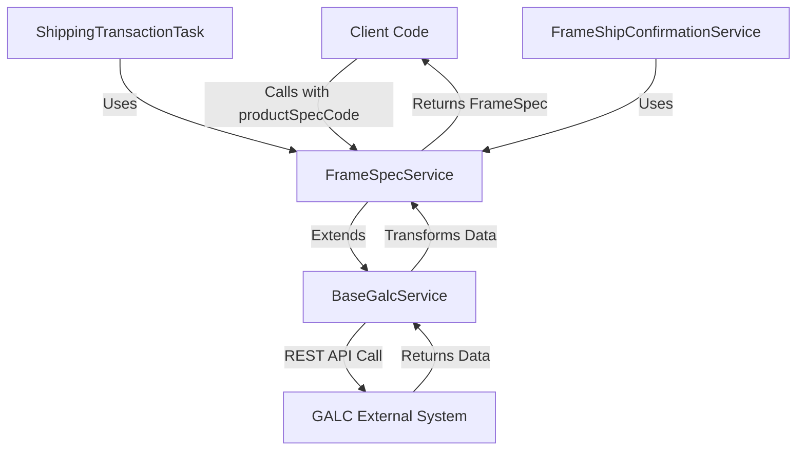
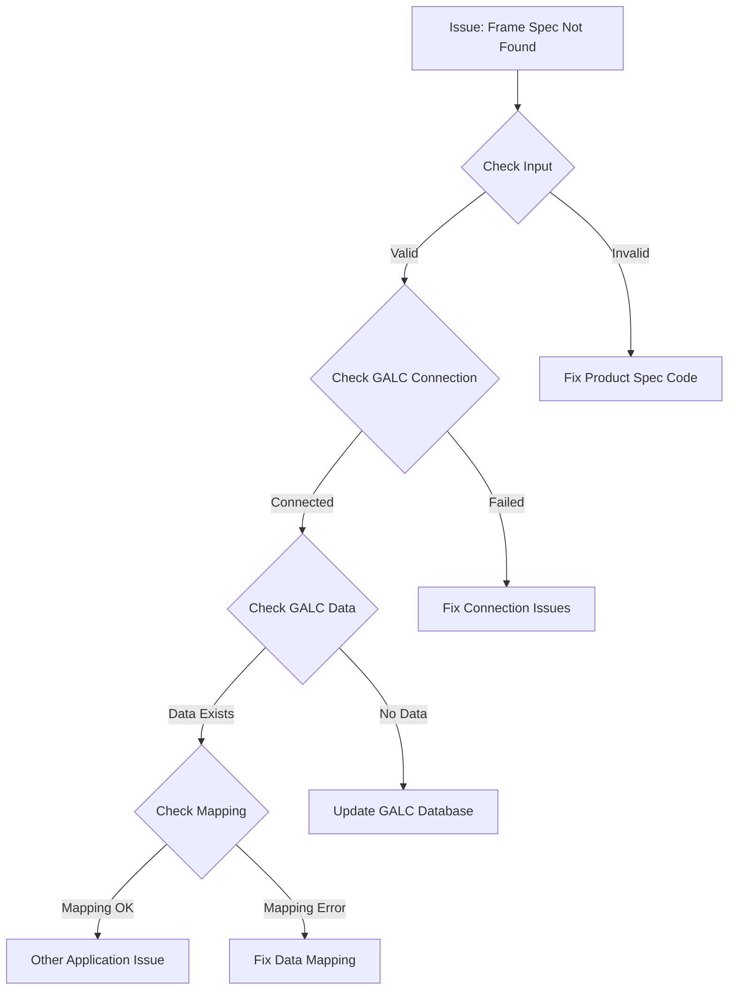

# FrameSpecService Documentation

## Purpose

The `FrameSpecService` is a specialized service component in the Honda AHM LC Sales Interface application that retrieves frame specification data from an external GALC (Global Assembly Line Control) system. It provides access to detailed specifications of vehicle frames based on their product specification codes.

## How It Works

The `FrameSpecService` extends the `BaseGalcService` abstract class, which provides common functionality for interacting with the GALC external system. The service follows these steps to retrieve frame specifications:

1. It receives a request for frame specifications with a product specification code
2. It connects to the GALC external system using REST API calls
3. It queries the GALC system for the frame specification data
4. It returns the frame specification data as a `FrameSpec` object

## Key Components

### Class Definition

```java
@Service("frameSpecService")
public class FrameSpecService extends BaseGalcService<FrameSpec, String> {
    private final Logger logger = LoggerFactory.getLogger(getClass());

    @Override
    protected Logger getLogger() {
        return logger;
    }

    public FrameSpec getFrameSpec(String galcUrl, final String productSpecCode) {
        return findByProductId(galcUrl, productSpecCode, GalcDataType.FRAME_SPEC);
    }
}
```

### Main Method

- **getFrameSpec(String galcUrl, final String productSpecCode)**: This method retrieves frame specifications from the GALC system by calling the inherited `findByProductId` method with the appropriate parameters.

### Inherited Functionality

From `BaseGalcService`, it inherits:

- REST API communication capabilities
- Error handling and logging
- Connection timeout management
- Data transformation between Java objects and external system formats

## Data Model

The `FrameSpec` class represents the frame specification data and contains numerous properties related to vehicle specifications:

- **Product Information**: productSpecCode, modelYearCode, modelCode, modelTypeCode
- **Color Information**: extColorCode, intColorCode, extColorDescription, intColorDescription
- **Manufacturing Details**: plantCodeGpcs, enginePlantCode, engineMto
- **Sales Information**: salesModelCode, salesModelTypeCode, salesExtColorCode, salesIntColorCode
- **Vehicle Identification**: frameNoPrefix, seriesCode, gradeCode
- **Vehicle Characteristics**: bodyAndTransTypeCode, bodyAndTransTypeDesc, modelDescription

## Interactions

The `FrameSpecService` interacts with:

1. **External GALC System**: Communicates via REST API to retrieve frame specification data
2. **ShippingTransactionTask**: Uses the service to get frame specifications when processing shipping transactions
3. **FrameShipConfirmationService**: Uses the service to get frame specifications when processing frame shipping confirmations

## Visual Workflow



## Data Flow

1. A client service (like ShippingTransactionTask or FrameShipConfirmationService) calls `frameSpecService.getFrameSpec(galcUrl, productSpecCode)`
2. The service uses the inherited `findByProductId` method from BaseGalcService
3. BaseGalcService constructs a REST API call to the GALC external system
4. The GALC system processes the request and returns frame specification data
5. BaseGalcService transforms the response into a FrameSpec object
6. FrameSpecService returns the FrameSpec object to the client service

## Database Interactions

The `FrameSpecService` does not directly interact with a database. Instead, it communicates with the external GALC system, which likely has its own database. The service uses REST API calls to retrieve data from this external system.

### Indirect Database Interaction

While there's no direct database access in the code, the service indirectly accesses data stored in the GALC system's database through the REST API. The specific database tables and schema are encapsulated within the GALC system.

## Debugging Queries

For debugging issues with the `FrameSpecService`, you can use the following queries against the GALC system's database (assuming you have access):

### 1. Check if a product specification code exists:

```sql
SELECT * FROM frame_spec_table 
WHERE product_spec_code = '[product_spec_code_value]';
```

### 2. Verify frame specification details:

```sql
SELECT fs.product_spec_code, fs.ext_color_code, fs.int_color_code, 
       fs.model_year_code, fs.model_code, fs.model_type_code
FROM frame_spec_table fs
WHERE fs.product_spec_code = '[product_spec_code_value]';
```

### 3. Check for recent updates to frame specifications:

```sql
SELECT fs.product_spec_code, fs.update_timestamp
FROM frame_spec_table fs
WHERE fs.update_timestamp > '[date_time_value]'
ORDER BY fs.update_timestamp DESC;
```

## Debugging Steps for Production Issues

If you encounter issues with the `FrameSpecService` in production, follow these steps:

### 1. Verify GALC Connectivity

```java
// Check if the GALC system is accessible
try {
    RestTemplate restTemplate = new RestTemplate();
    ResponseEntity<String> response = restTemplate.getForEntity(galcUrl + "/RestWeb/ping", String.class);
    System.out.println("GALC System Status: " + response.getStatusCode());
} catch (Exception e) {
    System.err.println("GALC System Connection Error: " + e.getMessage());
}
```

### 2. Check Product Specification Code

Verify that the product specification code being used is valid and exists in the GALC system.

### 3. Examine Logs

Look for error messages in the application logs related to:

- Connection timeouts
- REST API failures
- Data transformation errors

### 4. Test Direct API Call

Use a tool like Postman to make a direct REST API call to the GALC system to verify if it returns the expected data.

### 5. Check Timeout Settings

Verify that the connection and read timeout settings in the application properties are appropriate for the network conditions.

## Example Usage

Here's an example of how the `FrameSpecService` is used in the application:

```java
// In FrameShipConfirmationService.java
@Autowired
private FrameSpecService frameSpecService;

public void processShipment(String galcUrl, String productId) {
    // First get the frame information
    Frame frame = frameService.getFrame(galcUrl, productId);
    
    if (frame != null) {
        // Then get the frame specifications using the product spec code
        FrameSpec frameSpec = frameSpecService.getFrameSpec(galcUrl, frame.getProductSpecCode());
        
        if (frameSpec != null) {
            // Use the frame specifications for further processing
            String modelCode = frameSpec.getModelCode();
            String colorCode = frameSpec.getExtColorCode();
            
            // Process the shipment with these details
            // ...
        } else {
            // Handle missing frame specifications
            logger.error("Frame specifications not found for product spec code: " + frame.getProductSpecCode());
        }
    }
}
```

## Troubleshooting Visual Flow



## Conclusion

The `FrameSpecService` plays a crucial role in retrieving vehicle frame specifications from the external GALC system. It provides a clean interface for other components to access this data without needing to know the details of the external system's API. The service is used primarily by the ShippingTransactionTask and FrameShipConfirmationService to get frame specifications when processing shipping-related operations.