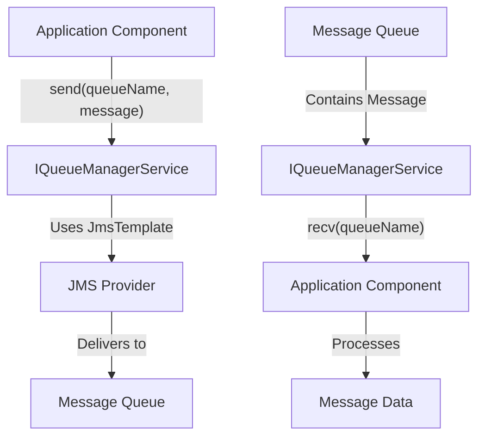
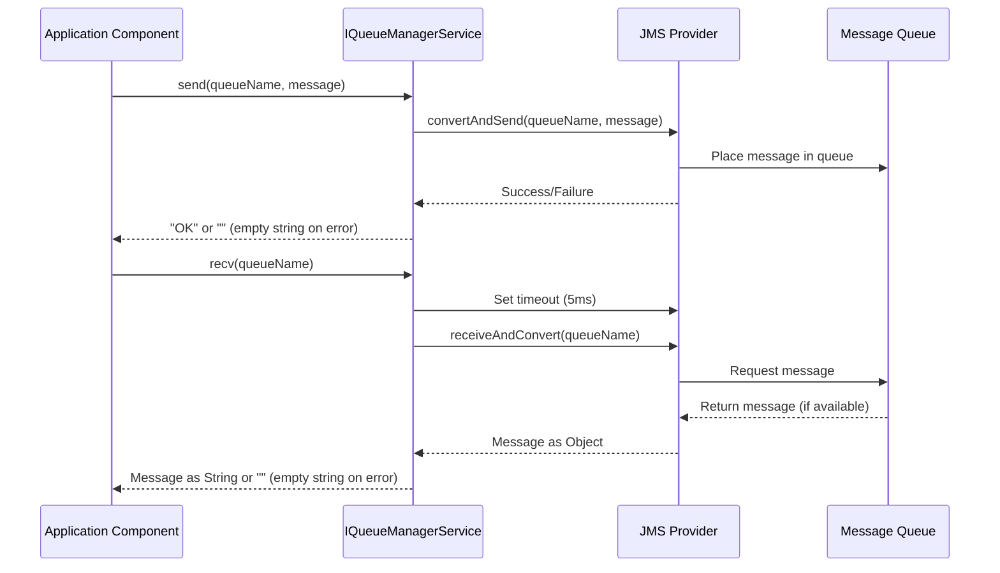

# IQueueManagerService Documentation

## Purpose

The `IQueueManagerService` is a core interface in the AHM LC Sales Interface Service that provides a simple, standardized way to interact with message queues. It serves as an abstraction layer for queue operations, allowing the application to send messages to and receive messages from JMS (Java Message Service) queues without directly dealing with the underlying messaging infrastructure.

This interface is essential for the application's communication with external systems like the Yard Management System (YMS) and the Global Automotive Logistics Control (GALC) system, enabling the exchange of vehicle status updates, shipping information, and other critical data.

## How It Works

The `IQueueManagerService` follows a straightforward approach to queue operations:

1. **Sending Messages**: The service takes a destination queue name and a message (typically in JSON format), then sends the message to the specified queue.

2. **Receiving Messages**: The service reads messages from a specified source queue, converting them from the queue format to a string that can be processed by the application.

3. **Error Handling**: The implementation handles various messaging exceptions, ensuring that the application can gracefully recover from communication issues.

## Visual Workflow



## Data Flow



## Key Components

### Interface Definition

```java
public interface IQueueManagerService {
    
    public String send(String destinationQueueName, String message);
    
    public String recv(String sourceQueueName);
}
```

The interface is simple but powerful, defining just two methods:

1. **send()**: Sends a message to a specified queue
   - Parameters:
     - `destinationQueueName`: The name of the queue to send the message to
     - `message`: The message content (typically a JSON string)
   - Returns: "OK" on success or an empty string on failure

2. **recv()**: Receives a message from a specified queue
   - Parameters:
     - `sourceQueueName`: The name of the queue to read from
   - Returns: The message as a string or an empty string if no message is available or an error occurs

### Implementation: QueueManagerService

The interface is implemented by the `QueueManagerService` class, which uses Spring's `JmsTemplate` to interact with the messaging system:

```java
@Service(value = "queueManagerService")
public class QueueManagerService implements IQueueManagerService {
    
    @Autowired
    private JmsTemplate jmsTemplate;
    
    // Implementation of send() and recv() methods
}
```

Key aspects of the implementation:
- Uses Spring's dependency injection to get a configured `JmsTemplate`
- Sets a short timeout (5ms) for receive operations to avoid blocking
- Includes comprehensive error handling for JMS exceptions
- Logs all operations for monitoring and debugging

## Interactions with Other Components

The `IQueueManagerService` is a central service used by multiple components in the system:

1. **ReceivingTransactionTask**: Uses the service to read status messages from the YMS queue and process them
   ```java
   String message = queueManagerService.recv(propertyUtil.getSalesReceivingQueueName());
   ```

2. **ShippingTransactionTask**: Uses the service to:
   - Read shipping messages from the GALC queue
   - Send processed shipping information to the YMS queue
   ```java
   String message = queueManagerService.recv(propertyUtil.getLCReceivingQueueName());
   // Later in the code:
   String result = queueManagerService.send(propertyUtil.getSalesShippingQueueName(), outPutMessage);
   ```

3. **LCSalesInterfaceController**: Uses the service in REST endpoints for testing and manual operations
   ```java
   queueManagerService.send(queueName, getJsonString());
   queueManagerService.recv(queueName);
   ```

4. **StatusMessageScheduler**: Indirectly uses the service through the `ReceivingTransactionTask` to process scheduled message reading

## Database Interactions

The `IQueueManagerService` itself does not directly interact with any database. It is purely focused on message queue operations. However, it plays a crucial role in the flow of data that eventually leads to database operations:

1. Messages received through the `recv()` method often contain data that is later processed and stored in databases
2. Data retrieved from databases is often formatted into messages and sent to other systems using the `send()` method

The actual database operations happen in other service classes like `ShippingStatusService` and `ShippingTransactionService`.

## Debugging in Production

### Common Issues

1. **Queue Connection Issues**: Problems connecting to the JMS broker due to network, credentials, or configuration issues
2. **Message Format Issues**: Malformed JSON or incorrect message structure
3. **Queue Timeouts**: Messages not being received in time or queue operations taking too long
4. **Queue Full**: Queue reaching capacity limits, preventing new messages from being sent

### Debugging Queries

To debug issues with the queue service in production, you can use the following queries:

1. **Check Queue Status** (using JMS provider tools, e.g., for IBM MQ):
   ```sql
   DISPLAY QUEUE(QUEUE_NAME) STATUS
   ```

2. **Check Queue Depth** (number of messages in queue):
   ```sql
   DISPLAY QUEUE(QUEUE_NAME) CURDEPTH
   ```

3. **Check Queue Configuration**:
   ```sql
   DISPLAY QUEUE(QUEUE_NAME) ALL
   ```

4. **Check Application Logs** for JMS-related errors:
   ```bash
   grep "JmsException" /path/to/application.log
   ```

### Debugging Steps

If you encounter issues with the `IQueueManagerService` in production:

1. **Check Application Logs**:
   - Look for JMS exceptions or errors
   - Check for successful send/receive operations
   - Look for timeout messages

2. **Verify Queue Configuration**:
   - Ensure queue names are correctly configured in application properties
   - Check that the JMS connection properties are correct
   - Verify that the queues exist on the JMS broker

3. **Test Queue Connectivity**:
   - Use the application's test endpoints to send and receive test messages
   - Use JMS provider tools to check if queues are accessible

4. **Check Message Format**:
   - Verify that messages being sent have the correct format
   - Check that the application can properly parse received messages

5. **Monitor Queue Performance**:
   - Check queue depths to ensure queues aren't filling up
   - Monitor message processing times
   - Look for patterns in message flow that might indicate bottlenecks

## Example Use Case

### Scenario: Processing a Vehicle Status Update

When a vehicle's status changes in the Yard Management System (YMS), the following process occurs:

1. **YMS sends a status message** to the sales receiving queue:
   ```json
   {
     "TRANSACTION": {
       "TRANSACTION_CODE": "ON-TRN",
       "LINE_ID": "1",
       "TIMESTAMP": "2023-06-15T14:30:00"
     },
     "VEHICLE": {
       "VIN": "1HGCM82633A123456",
       "TIMESTAMP": "2023-06-15T14:30:00"
     }
   }
   ```

2. **StatusMessageScheduler** triggers the `ReceivingTransactionTask` at its scheduled time

3. **ReceivingTransactionTask** uses `IQueueManagerService` to read the message:
   ```java
   String message = queueManagerService.recv(propertyUtil.getSalesReceivingQueueName());
   ```

4. The task processes the message and updates the vehicle status in the GALC system

5. If there are any errors, they are collected and sent via email

This example demonstrates how the `IQueueManagerService` serves as the entry point for status messages, enabling the application to process vehicle status updates from external systems.

### Scenario: Sending Shipping Information to YMS

When a vehicle is ready to be shipped:

1. **GALC system** sends a notification to the LC receiving queue

2. **ShippingTransactionTask** uses `IQueueManagerService` to read the message:
   ```java
   String message = queueManagerService.recv(propertyUtil.getLCReceivingQueueName());
   ```

3. The task processes the shipping information and prepares a message for YMS

4. **ShippingTransactionTask** uses `IQueueManagerService` to send the message to YMS:
   ```java
   String result = queueManagerService.send(propertyUtil.getSalesShippingQueueName(), outPutMessage);
   ```

5. If successful, the task updates the status in GALC; if not, it logs an error and sends an email notification

This example shows how the `IQueueManagerService` facilitates bidirectional communication between systems, both receiving notifications from GALC and sending information to YMS.