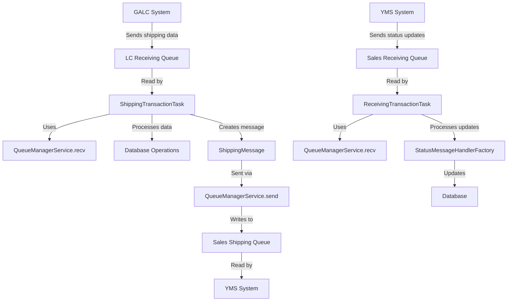
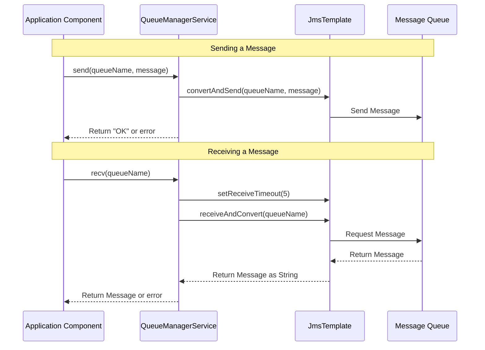

# QueueManagerService Documentation

## Purpose

The `QueueManagerService` is a core service in the AHM LC Sales Interface application that handles all message queue operations. It serves as a simple abstraction layer for interacting with JMS (Java Message Service) queues, allowing the application to send messages to and receive messages from IBM MQ queues without directly dealing with the underlying messaging infrastructure.

## How It Works

The `QueueManagerService` follows a straightforward approach to queue operations:

1. **Sending Messages**: It takes a queue name and a message (as a string), then uses Spring's `JmsTemplate` to convert and send the message to the specified queue.

2. **Receiving Messages**: It reads messages from a specified queue, with a short timeout, and returns the message content as a string.

3. **Error Handling**: It captures and logs any JMS-related exceptions that might occur during queue operations, preventing them from bubbling up to the calling code.

## Key Components

### Class Structure

```java
@Service(value = "queueManagerService")
public class QueueManagerService implements IQueueManagerService {
    
    @Autowired
    private JmsTemplate jmsTemplate;
    
    public String send(String destinationQueueName, String message) {...}
    
    public String recv(String sourceQueueName) {...}
}
```

### Important Methods

1. **`send(String destinationQueueName, String message)`**
   - **Purpose**: Sends a text message to a specified queue
   - **Parameters**:
     - `destinationQueueName`: The name of the queue to send the message to
     - `message`: The message content as a string
   - **Returns**: "OK" if successful, empty string if failed
   - **Error Handling**: Catches and logs both JMS-specific and general exceptions

2. **`recv(String sourceQueueName)`**
   - **Purpose**: Reads a message from a specified queue
   - **Parameters**:
     - `sourceQueueName`: The name of the queue to read from
   - **Returns**: The message content as a string, or empty string if no message or error
   - **Timeout**: Sets a 5ms timeout to avoid blocking indefinitely
   - **Error Handling**: Catches and logs both JMS-specific and general exceptions

## Interactions

The `QueueManagerService` is a central service used by multiple components in the system:

### 1. ShippingTransactionTask

The `ShippingTransactionTask` uses `QueueManagerService` to:
- **Read messages** from the GALC queue (Line 68): `queueManagerService.recv(propertyUtil.getLCReceivingQueueName())`
- **Send messages** to the YMS queue (Line 100-101): `queueManagerService.send(propertyUtil.getSalesShippingQueueName(), outPutMessage)`

### 2. ReceivingTransactionTask

The `ReceivingTransactionTask` uses `QueueManagerService` to:
- **Read messages** from the YMS queue (Line 42): `queueManagerService.recv(propertyUtil.getSalesReceivingQueueName())`

### 3. LCSalesInterfaceController

The controller provides REST endpoints that directly use `QueueManagerService` for:
- **Sending test messages** (Line 52): `queueManagerService.send(queueName, getJsonString())`
- **Receiving messages** (Line 63): `queueManagerService.recv(queueName)`

## Data Flow



## Database Interactions

The `QueueManagerService` itself does not directly interact with any database. It is purely focused on message queue operations. However, it plays a crucial role in the flow of data that eventually leads to database operations:

1. When `ShippingTransactionTask` reads a message using `QueueManagerService`, it processes that data and updates:
   - `ShippingTransaction` table (via `shippingTransactionService.saveShippingTransaction`)
   - `ShippingStatus` table (via `shippingStatusService.saveShippingStatus`)

2. When `ReceivingTransactionTask` reads a message using `QueueManagerService`, it passes the message to `StatusMessageHandlerFactory` which processes the message and updates various database tables depending on the message type.

## Debugging Queries

If you need to debug issues with the queue operations in production, here are some useful SQL queries:

### 1. Check for Failed Message Sends

```sql
SELECT * FROM application_logs 
WHERE logger_name LIKE '%QueueManagerService%' 
AND log_level = 'ERROR' 
AND message LIKE '%JmsException%'
ORDER BY timestamp DESC;
```

### 2. Track Message Flow for a Specific VIN

```sql
SELECT * FROM shipping_transaction 
WHERE vin = '[VIN_NUMBER]';

SELECT * FROM shipping_status 
WHERE product_id = '[VIN_NUMBER]';

SELECT * FROM application_logs 
WHERE message LIKE '%[VIN_NUMBER]%' 
ORDER BY timestamp DESC;
```

### 3. Check Queue Connection Issues

```sql
SELECT * FROM application_logs 
WHERE logger_name LIKE '%QueueManagerService%' 
AND message LIKE '%connection%' 
ORDER BY timestamp DESC;
```

## Debugging Steps for Production Issues

If you encounter issues with the `QueueManagerService` in production:

1. **Check Queue Connectivity**
   - Verify IBM MQ is running and accessible
   - Check network connectivity between the application server and MQ server
   - Verify queue manager is running

2. **Check Queue Depths**
   - Ensure queues are not full (which would prevent new messages from being added)
   - Check if messages are being consumed properly

3. **Check Application Logs**
   - Look for JMS exceptions in the logs
   - Check for timeout errors which might indicate connectivity issues
   - Look for message format errors

4. **Test Queue Operations Manually**
   - Use the REST endpoints provided by `LCSalesInterfaceController`:
     - `/salesInterface/send` to test sending a message
     - `/salesInterface/recv` to test receiving a message

5. **Check Message Format**
   - Verify the JSON structure of messages being sent matches what the receiving system expects
   - Look for malformed JSON errors in the logs

## Visual Workflow



## Example Use Case

### Example 1: Processing a Status Message from YMS

1. **YMS System** sends a status update message to the `sales.receiving.queue.name` queue
2. **StatusMessageScheduler** triggers the `ReceivingTransactionTask`
3. **ReceivingTransactionTask** uses `QueueManagerService` to read the message:
   ```java
   String message = queueManagerService.recv(propertyUtil.getSalesReceivingQueueName());
   ```
4. The message is parsed into a `StatusMessage` object and processed by the `StatusMessageHandlerFactory`

This example demonstrates how the `QueueManagerService` serves as the entry point for status messages, enabling the application to process vehicle status updates from external systems.

### Example 2: Sending a Shipping Message to YMS

1. **GALC System** sends a notification to the `lc.receiving.queue.name` queue
2. **ShippingMessageScheduler** triggers the `ShippingTransactionTask`
3. **ShippingTransactionTask** uses `QueueManagerService` to read the message:
   ```java
   String message = queueManagerService.recv(propertyUtil.getLCReceivingQueueName());
   ```
4. The task processes the data and creates a `ShippingMessage` object
5. **ShippingTransactionTask** uses `QueueManagerService` to send the message to YMS:
   ```java
   String result = queueManagerService.send(propertyUtil.getSalesShippingQueueName(), outPutMessage);
   ```

This example shows how the `QueueManagerService` facilitates bidirectional communication between systems, both receiving notifications from GALC and sending information to YMS.

## Troubleshooting Common Issues

1. **Empty Messages**
   - **Symptom**: `QueueManagerService.recv()` returns an empty string
   - **Possible Causes**:
     - Queue is empty
     - Timeout is too short (currently set to 5ms)
     - Connection issues with MQ server
   - **Solution**: Check queue depth, increase timeout if needed, verify MQ connectivity

2. **Failed Message Sends**
   - **Symptom**: `QueueManagerService.send()` returns an empty string
   - **Possible Causes**:
     - Queue is full
     - Queue doesn't exist
     - Permission issues
     - Connection problems
   - **Solution**: Check queue configuration, verify permissions, check network connectivity

3. **JMS Exceptions**
   - **Symptom**: Error logs show JMS exceptions
   - **Possible Causes**:
     - MQ server is down
     - Network issues
     - Configuration problems
   - **Solution**: Check MQ server status, verify network connectivity, review configuration