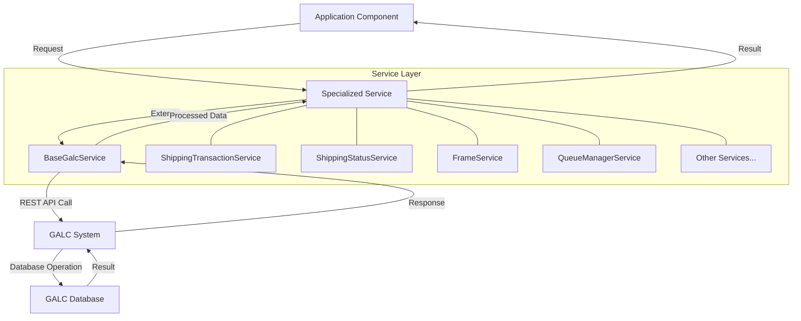
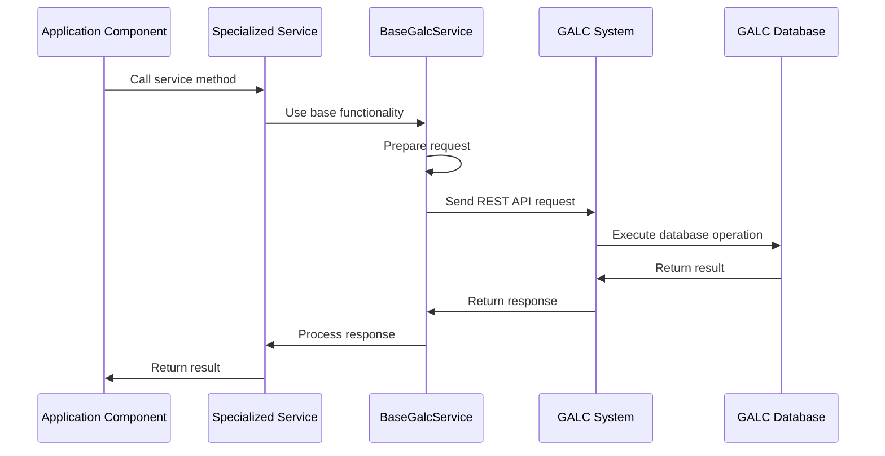
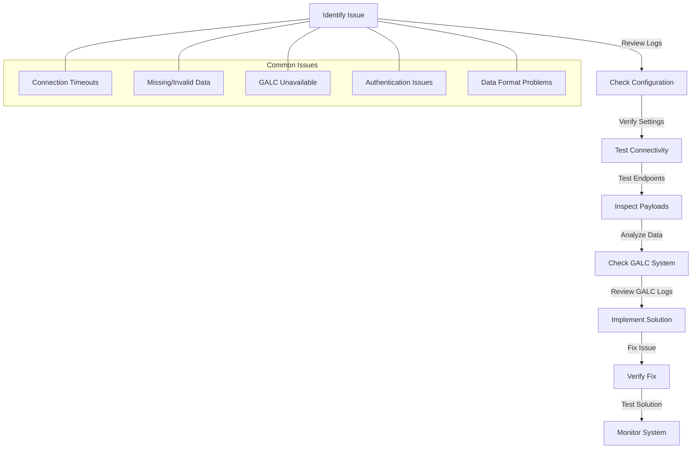

# Service Layer Documentation

## Purpose

The Service Layer in the AHM LC Sales Interface system is a collection of specialized services that act as a bridge between the application and external systems, primarily the GALC (Global Assembly Line Control) system. These services handle all communication with external databases and systems, providing a clean and consistent interface for the rest of the application to use.

Think of the Service Layer as the "middleman" that speaks different languages - it understands both what the application needs and how to communicate with external systems to fulfill those needs.

## How It Works

The Service Layer is built on a foundation class called `BaseGalcService`, which provides common functionality for all specialized services. Each specialized service extends this base class and adds specific business logic related to its domain.

### Step-by-Step Operation

1. **Request Initiation**: A component in the application (like a Task, Handler, or Controller) needs data from or wants to update data in the GALC system.

2. **Service Call**: The component calls a method on the appropriate specialized service.

3. **Data Preparation**: The service prepares the data for communication with the GALC system, formatting it according to GALC's requirements.

4. **External Communication**: The service uses REST API calls to send the data to or request data from the GALC system.

5. **Response Processing**: The service receives the response from GALC, processes it, and returns the results to the calling component.

6. **Error Handling**: If any issues occur during the process, the service handles them appropriately, logging errors and returning meaningful responses.

## Key Components

### BaseGalcService

The foundation of the Service Layer is the `BaseGalcService` abstract class, which provides:

- Generic REST communication with the GALC system
- Common CRUD (Create, Read, Update, Delete) operations
- Error handling and logging
- Connection management

### Specialized Services

The Service Layer includes several specialized services, each focused on a specific domain:

1. **ShippingTransactionService**
   - Manages shipping transaction data
   - Retrieves and updates information about vehicles in the shipping process

2. **ShippingStatusService**
   - Tracks the status of vehicles throughout the shipping process
   - Updates status information in the GALC system

3. **FrameService**
   - Manages vehicle frame data
   - Retrieves information about vehicle frames from the GALC system

4. **FrameSpecService**
   - Handles vehicle specifications
   - Retrieves detailed specification information for vehicles

5. **FrameShipConfirmationService**
   - Manages shipping confirmation data for vehicle frames
   - Updates confirmation information in the GALC system

6. **QueueManagerService**
   - Manages message queues for communication with external systems
   - Sends and receives messages through IBM MQ

7. **Other specialized services**
   - Handle various other aspects of the system's functionality

## Visual Workflow



## Data Flow



## Interactions with Other Components

The Service Layer interacts with several other components in the system:

### 1. Task Layer
- **ShippingTransactionTask** uses services to retrieve and process shipping data
- **ReceivingTransactionTask** uses services to process status updates

### 2. Handler Layer
- Message handlers use services to process different types of messages
- Examples include:
  - **ShipmentConfirmMessageHandler**
  - **FactoryReturnMessageHandler**
  - **DealerAssignMessageHandler**

### 3. Scheduler Layer
- Schedulers use services to perform periodic operations
- **ShippingMessageScheduler** uses services to process shipping messages
- **StatusMessageScheduler** uses services to process status updates

### 4. Controller Layer
- **LCSalesInterfaceController** exposes service functionality through REST endpoints

## Database Interactions

While the Service Layer doesn't directly interact with databases, it facilitates communication with the GALC system, which manages its own database. The main tables accessed through the GALC API include:

### 1. SHIPPING_TRANSACTION
- Stores information about vehicles in the shipping process
- Fields include VIN, send flag, date, time, and vehicle details

### 2. SHIPPING_STATUS
- Tracks the status of vehicles throughout the shipping process
- Fields include product ID, status, and timestamps

### 3. FRAME
- Contains information about vehicle frames
- Fields include product ID, frame number, and specifications

### 4. INSTALLED_PART
- Tracks parts installed on vehicles
- Fields include product ID, part name, and serial number

### 5. PRODUCT_RESULT
- Records results of various processes applied to products
- Fields include product ID, process point ID, and timestamps

## Example Use Case

Let's walk through a typical use case to understand how the Service Layer works in practice:

### Vehicle Shipping Process

1. A vehicle completes production and is ready for shipping.
2. The `ShippingMessageScheduler` triggers the `ShippingTransactionTask`.
3. The task calls `ShippingTransactionService.get50ATransactionVin()` to find vehicles ready for shipping.
4. For each vehicle, the task creates a shipping message.
5. The task uses `QueueManagerService` to send the message to the YMS (Yard Management System) queue.
6. The task then calls `ShippingTransactionService.saveShippingTransaction()` to update the vehicle's status.
7. The task also calls `ShippingStatusService.saveShippingStatus()` to update the shipping status.

```java
// Example code showing how services are used
String galcUrl = shippingStatusService.getGalcUrl(productId, lineId);

// Get vehicles ready for shipping
List<ShippingTransaction> transactions = shippingTransactionService.get50ATransactionVin(
    galcUrl, 
    0,  // status = 0 (ready for shipping)
    processPointId, 
    'N',  // sendFlag = 'N' (not yet sent)
    cccPartName
);

for (ShippingTransaction transaction : transactions) {
    // Create shipping message
    ShippingMessage message = createShippingMessage(transaction);
    
    // Send message to YMS queue
    queueManagerService.sendMessage(message, ymsQueueName);
    
    // Update transaction status
    transaction.setSendFlag('Y');  // Mark as sent
    shippingTransactionService.saveShippingTransaction(galcUrl, transaction);
    
    // Update shipping status
    ShippingStatus status = shippingStatusService.findByProductId(galcUrl, transaction.getVin());
    status.setStatus(StatusEnum.VQ_SHIP.getStatus());
    shippingStatusService.saveShippingStatus(galcUrl, status);
}
```

## Debugging Production Issues

### Common Issues and Solutions

1. **Connection Timeouts**
   - **Symptom**: Logs show "Connection timed out" errors
   - **Debugging Steps**:
     1. Check the connection settings in application.properties
     2. Verify network connectivity to the GALC system
     3. Check if the GALC system is responding to other requests
   - **Solution**: Increase timeout values or fix network connectivity issues

2. **Missing or Invalid Data**
   - **Symptom**: Null pointer exceptions or data validation errors
   - **Debugging Steps**:
     1. Check the data being sent to or received from GALC
     2. Verify all required fields are populated
     3. Check for format issues in date fields or other formatted data
   - **Solution**: Fix data issues or add validation before sending to GALC

3. **GALC System Unavailable**
   - **Symptom**: Connection refused errors
   - **Debugging Steps**:
     1. Check if the GALC system is running
     2. Verify network connectivity to the GALC system
     3. Check for firewall issues
   - **Solution**: Restart the GALC system or resolve network issues

### Debugging Queries

While the Service Layer doesn't execute SQL queries directly, here are some equivalent queries that could be used to debug issues in the GALC database:

1. **Check Shipping Transaction**
   ```sql
   SELECT * FROM SHIPPING_TRANSACTION 
   WHERE VIN = 'VIN12345678901234';
   ```

2. **Check Shipping Status**
   ```sql
   SELECT * FROM SHIPPING_STATUS 
   WHERE PRODUCT_ID = 'VIN12345678901234';
   ```

3. **Check Vehicle Frame**
   ```sql
   SELECT * FROM FRAME 
   WHERE PRODUCT_ID = 'VIN12345678901234';
   ```

4. **Check Installed Parts**
   ```sql
   SELECT * FROM INSTALLED_PART 
   WHERE PRODUCT_ID = 'VIN12345678901234' 
   AND PART_NAME = 'ENGINE';
   ```

5. **Check Process Results**
   ```sql
   SELECT * FROM PRODUCT_RESULT 
   WHERE PRODUCT_ID = 'VIN12345678901234' 
   ORDER BY ACTUAL_TS DESC;
   ```

### Debugging Steps

1. **Identify the Issue**
   - Review error logs for specific error messages
   - Check which operations are failing
   - Determine if the issue is with a specific service or all services

2. **Check Configuration**
   - Verify GALC URLs in application properties
   - Check timeout settings
   - Verify other configuration properties used by the services

3. **Test Connectivity**
   - Use a tool like curl or Postman to test direct access to GALC REST endpoints
   - Check network connectivity between the application server and GALC server
   - Verify firewall rules allow the necessary communication

4. **Inspect Payloads**
   - Add debug logging to capture the exact payloads being sent to GALC
   - Verify the payloads are correctly formatted
   - Test the payloads directly against the GALC REST API

5. **Check GALC System**
   - Review GALC system logs for errors
   - Verify the GALC system is running correctly
   - Check for database issues in the GALC system

## Visual Flow for Debugging



## Conclusion

The Service Layer is a critical component of the AHM LC Sales Interface system, providing a clean and consistent interface for communicating with external systems, particularly the GALC system. By understanding how this layer works and how to debug common issues, you can effectively maintain and support the application in production.

Remember that the Service Layer:
- Acts as a bridge between the application and external systems
- Provides specialized services for different domains
- Handles all communication with the GALC system
- Manages error handling and data transformation

With this knowledge, you can confidently work with the Service Layer to support the AHM LC Sales Interface system and resolve any issues that may arise.