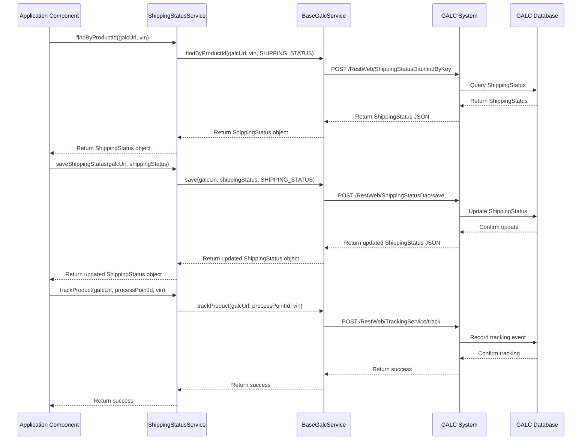
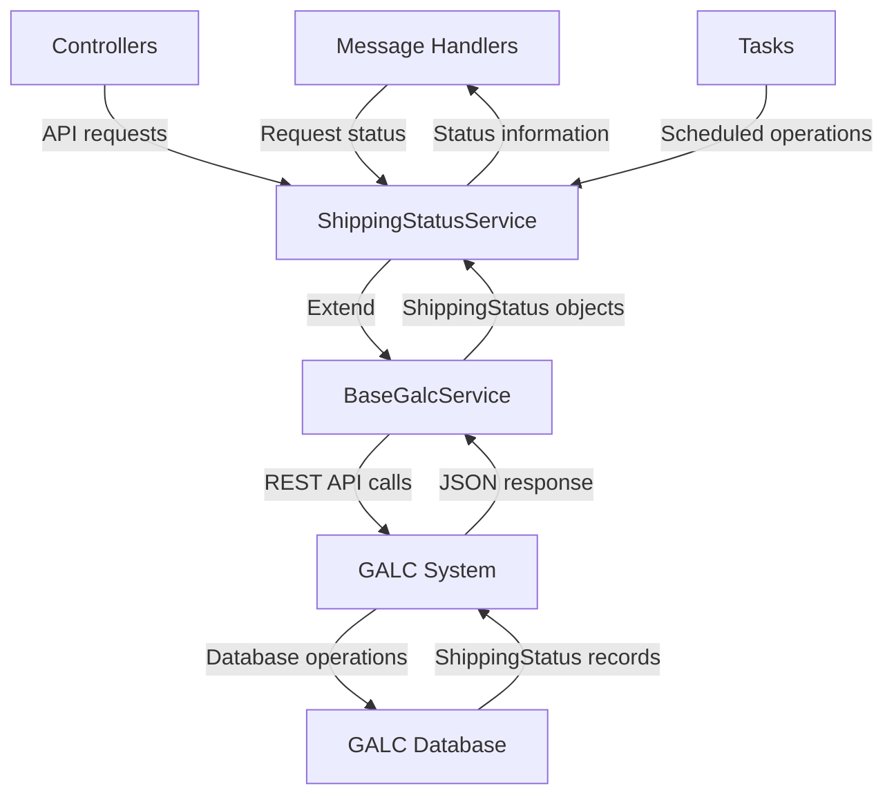

# ShippingStatusService Documentation

## Purpose

The `ShippingStatusService` is a critical component in the AHM LC Sales Interface Service that manages vehicle shipping status information. It serves as a bridge between the application and the GALC (Global Automotive Logistics Control) system, allowing the application to track, query, and update the shipping status of vehicles throughout their journey from factory to dealer.

## How It Works

The `ShippingStatusService` extends the `BaseGalcService` class, inheriting functionality for communicating with the GALC external system. It provides specialized methods for finding and saving shipping status records based on product IDs (typically VIN numbers).

### Workflow

1. **Finding Shipping Status**: When a component needs to check a vehicle's shipping status, it calls the `findByProductId` method with the GALC URL and product ID (VIN).
2. **Updating Shipping Status**: When a vehicle's status changes (e.g., shipped, received), the service updates the record using the `saveShippingStatus` method.
3. **Tracking Status Changes**: The service can track status changes in the GALC system using methods inherited from `BaseGalcService`.

## Key Components

### Class Definition
```java
@Service(value = "shippingStatusService")
public class ShippingStatusService extends BaseGalcService<ShippingStatus, String> {
    // Implementation
}
```

### Important Methods

1. **findByProductId**
   - **Purpose**: Retrieves a vehicle's shipping status from the GALC system
   - **Parameters**: 
     - `galcUrl`: The URL of the GALC system
     - `productId`: The vehicle's identifier (VIN)
   - **Returns**: A `ShippingStatus` object containing the vehicle's current status

2. **saveShippingStatus**
   - **Purpose**: Updates a vehicle's shipping status in the GALC system
   - **Parameters**:
     - `galcUrl`: The URL of the GALC system
     - `entity`: The `ShippingStatus` object with updated information
   - **Returns**: The updated `ShippingStatus` object

### Inherited Methods (from BaseGalcService)

1. **trackProduct**
   - **Purpose**: Records a tracking event for a vehicle at a specific process point
   - **Usage**: Called when a vehicle reaches a new stage in its journey

2. **getGalcUrl**
   - **Purpose**: Determines the correct GALC system URL to use for a specific vehicle
   - **Usage**: Used before making any API calls to ensure the correct system is targeted

## Interactions

The `ShippingStatusService` interacts with several components in the system:

### Internal Components

1. **Message Handlers**:
   - `AhReceiveMessageHandler`: Uses the service to update vehicle status when received at American Honda
   - `ShipmentConfirmMessageHandler`: Uses the service to confirm shipment of vehicles
   - `FactoryReturnMessageHandler`: Uses the service when vehicles are returned to the factory
   - `DealerAssignMessageHandler`: Uses the service when vehicles are assigned to dealers

2. **Controllers**:
   - `LCSalesInterfaceController`: Uses the service to provide shipping status information via API endpoints

3. **Tasks**:
   - `ShippingTransactionTask`: Uses the service as part of scheduled tasks related to shipping

### External Systems

1. **GALC System**:
   - The service communicates with the GALC system via REST API calls
   - It sends and receives data in JSON format
   - Communication happens through the `BaseGalcService` methods

## Data Model

The service works with the `ShippingStatus` model, which contains:

- `vin`: Vehicle Identification Number
- `status`: Current status code (integer)
- `actualTimestamp`: Timestamp of the status change
- `invoiced`: Invoice status
- `onTimeShipping`: Flag indicating if shipping is on time
- `dealerNo`: Dealer number the vehicle is assigned to
- `createTimestamp`: Record creation time (inherited from `AuditEntry`)
- `updateTimestamp`: Record last update time (inherited from `AuditEntry`)

## Database Interactions

The service doesn't directly interact with a database. Instead, it communicates with the GALC system's REST API, which handles the database operations. The GALC system uses the `ShippingStatusDao` to perform CRUD operations on shipping status records.

### REST API Endpoints Used

1. **Find by Product ID**: 
   - Endpoint: `{galcUrl}/RestWeb/ShippingStatusDao/findByKey`
   - Method: POST
   - Payload: Product ID (VIN)

2. **Save Shipping Status**:
   - Endpoint: `{galcUrl}/RestWeb/ShippingStatusDao/save`
   - Method: POST
   - Payload: ShippingStatus object

3. **Track Product**:
   - Endpoint: `{galcUrl}/RestWeb/TrackingService/track`
   - Method: POST
   - Payload: Product type, Product ID, Process Point ID

## Example Use Case

Let's walk through a typical scenario of a vehicle being received at American Honda:

1. A message is received indicating a vehicle (VIN: 1HGCM82633A123456) has arrived at American Honda
2. The `AhReceiveMessageHandler` processes this message:
   ```java
   // Get the appropriate GALC URL for this VIN
   String galcUrl = shippingStatusService.getGalcUrl(vin, lineId);
   
   // Retrieve the current shipping status
   ShippingStatus status = shippingStatusService.findByProductId(galcUrl, vin);
   
   // Update the status to "AH_RCVD" (American Honda Received)
   status.setStatus(StatusEnum.AH_RCVD.getStatus());
   
   // Save the updated status
   shippingStatusService.saveShippingStatus(galcUrl, status);
   
   // Track this status change in the GALC system
   shippingStatusService.trackProduct(galcUrl, processPointId, vin);
   ```

3. The GALC system now shows the vehicle as received at American Honda
4. Downstream systems can query this updated status

## Debugging Production Issues

### Common Issues and Solutions

1. **Vehicle Status Not Found**
   - **Symptom**: `findByProductId` returns null
   - **Possible Causes**:
     - Incorrect VIN
     - Vehicle not in GALC system
     - Connection issues to GALC
   - **Debugging Steps**:
     1. Check logs for error messages
     2. Verify VIN format is correct
     3. Confirm GALC URL is accessible
     4. Check if vehicle exists in GALC system

2. **Status Update Failure**
   - **Symptom**: `saveShippingStatus` returns null
   - **Possible Causes**:
     - Connection timeout
     - Invalid status value
     - Permission issues
   - **Debugging Steps**:
     1. Check timeout settings in `PropertyUtil`
     2. Verify status value is valid
     3. Check GALC system logs for errors

3. **Tracking Failure**
   - **Symptom**: Tracking call fails or vehicle doesn't appear at process point
   - **Debugging Steps**:
     1. Verify process point ID is correct
     2. Check if tracking service is available
     3. Review GALC system logs

### Useful SQL Queries for Debugging

Since the service interacts with the GALC system's database indirectly, these queries would be run on the GALC database:

1. **Find Vehicle by VIN**:
   ```sql
   SELECT * FROM SHIPPING_STATUS WHERE VIN = '1HGCM82633A123456';
   ```

2. **Check Status History**:
   ```sql
   SELECT ss.VIN, ss.STATUS, ss.ACTUAL_TIMESTAMP, ss.UPDATE_TIMESTAMP
   FROM SHIPPING_STATUS ss
   WHERE ss.VIN = '1HGCM82633A123456'
   ORDER BY ss.UPDATE_TIMESTAMP DESC;
   ```

3. **Find Vehicles with Specific Status**:
   ```sql
   SELECT ss.VIN, ss.DEALER_NO, ss.ACTUAL_TIMESTAMP
   FROM SHIPPING_STATUS ss
   WHERE ss.STATUS = 30 -- Status code for AH_RCVD
   ORDER BY ss.ACTUAL_TIMESTAMP DESC;
   ```

4. **Check for Stuck Vehicles**:
   ```sql
   SELECT ss.VIN, ss.STATUS, ss.ACTUAL_TIMESTAMP, 
          DATEDIFF(day, ss.ACTUAL_TIMESTAMP, GETDATE()) as DAYS_IN_STATUS
   FROM SHIPPING_STATUS ss
   WHERE ss.STATUS = 20 -- Status code for VQ_SHIP
   AND DATEDIFF(day, ss.ACTUAL_TIMESTAMP, GETDATE()) > 3 -- Stuck for more than 3 days
   ORDER BY DAYS_IN_STATUS DESC;
   ```

### Visual Workflow



## Data Flow



## Debugging Steps for Production Issues

1. **Check Application Logs**
   - Look for error messages related to ShippingStatusService
   - Check for timeout or connection errors
   - Note any exceptions thrown during API calls

2. **Verify Configuration**
   - Check GALC URLs in configuration
   - Verify timeout settings are appropriate
   - Confirm process point IDs are correct

3. **Test GALC Connectivity**
   - Try a simple findByProductId call with a known VIN
   - Check if the GALC system is responding
   - Verify network connectivity between the application and GALC

4. **Examine Message Flow**
   - Check if messages are being received correctly
   - Verify message format and content
   - Ensure handlers are processing messages as expected

5. **Database Validation**
   - Run diagnostic queries on the GALC database
   - Check for data integrity issues
   - Verify status values are consistent

6. **End-to-End Testing**
   - Trace a specific VIN through the entire process
   - Verify each status change is recorded correctly
   - Check if tracking events are being recorded

7. **Performance Analysis**
   - Monitor response times for API calls
   - Check for timeout patterns
   - Analyze system load during peak periods