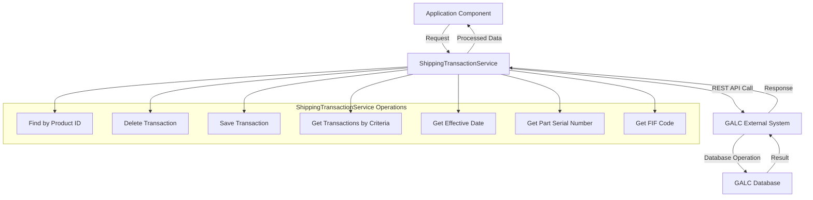
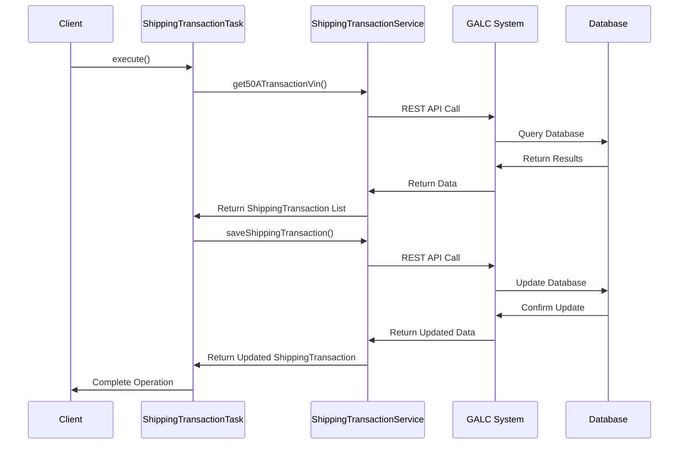

# ShippingTransactionService Documentation

## Purpose

The `ShippingTransactionService` is a core service component in the AHM LC Sales Interface system that manages shipping transaction data. It handles the creation, retrieval, updating, and deletion of shipping transaction records, which represent vehicles in the shipping process. This service acts as a bridge between the application and the GALC (Global Assembly Line Control) database system, facilitating data exchange for vehicle shipping operations.

## How It Works

The `ShippingTransactionService` extends the `BaseGalcService` class, which provides common functionality for interacting with the GALC external system. The service uses REST API calls to communicate with the GALC database and perform various operations on shipping transaction records.

### Step-by-Step Operation

1. **Initialization**: When the application starts, Spring creates an instance of `ShippingTransactionService` and injects necessary dependencies.

2. **Data Retrieval**: The service retrieves shipping transaction data from the GALC database based on various criteria such as product ID, status, and process point.

3. **Data Manipulation**: It processes the retrieved data, performs necessary transformations, and prepares it for use by other components.

4. **Data Persistence**: The service saves updated shipping transaction records back to the GALC database.

5. **Integration**: It integrates with other services to provide comprehensive shipping transaction management.

## Key Components

### Methods

1. **findByProductId(String galcUrl, String productId)**
   - Retrieves a shipping transaction record by product ID (VIN)
   - Returns a `ShippingTransaction` object or null if not found

2. **deleteShippingTransaction(String galcUrl, String productId)**
   - Deletes a shipping transaction record by product ID
   - Used when a vehicle's shipping status changes

3. **saveShippingTransaction(String galcUrl, ShippingTransaction entity)**
   - Saves or updates a shipping transaction record
   - Returns the saved `ShippingTransaction` object

4. **get50ATransactionVin(String galcUrl, Integer status, String processPointId, Character sendFlag, String cccPartName)**
   - Retrieves a list of shipping transactions based on multiple criteria
   - Used to find vehicles ready for shipping

5. **getEffectiveDate(String galcUrl, String processPointId)**
   - Gets the effective production date for a process point
   - Returns the date as an Integer in YYYYMMDD format

6. **getTimestampNow()**
   - Returns the current timestamp as a formatted string
   - Used for logging and record-keeping

7. **getMaxActualTs(String galcUrl, String productId, String afOffProcessPt)**
   - Retrieves the maximum actual timestamp for a product at a specific process point
   - Used to determine when a vehicle completed a particular process

8. **getPartSerialNumber(String galcUrl, String productId, String partName)**
   - Retrieves the serial number of a specific part installed on a vehicle
   - Used for tracking key components

9. **getFIFCodeBySpecCode(String galcUrl, String productSpeccode)**
   - Retrieves the FIF (Factory Information Form) code for a product specification
   - Used for PMC (Plant Manufacturing Control) operations

## Interactions with Other Components

The `ShippingTransactionService` interacts with several other components in the system:

1. **ShippingTransactionTask**
   - Uses the service to retrieve and update shipping transaction records
   - Processes shipping messages and sends them to external systems

2. **ShipmentConfirmMessageHandler**
   - Uses the service to delete shipping transaction records when shipment is confirmed
   - Updates shipping status based on confirmation messages

3. **FactoryReturnMessageHandler**
   - Uses the service to update shipping transaction records for factory returns
   - Manages the return process workflow

4. **LCSalesInterfaceController**
   - Exposes shipping transaction operations through REST endpoints
   - Allows external systems to interact with shipping transaction data

## Database Interactions

### Direct Database Operations

The service doesn't directly interact with the database but uses REST API calls to the GALC system, which handles the actual database operations. The main tables accessed through these API calls are:

1. **SHIPPING_TRANSACTION**
   - Primary table for storing shipping transaction records
   - Contains fields like VIN, send flag, date, time, and vehicle details

2. **PRODUCT_RESULT**
   - Used to retrieve timestamps for specific process points
   - Accessed through the `getMaxActualTs` method

3. **INSTALLED_PART**
   - Used to retrieve part serial numbers
   - Accessed through the `getPartSerialNumber` method

4. **FIF_CODE (SalesOrderFif)**
   - Used to retrieve FIF codes for product specifications
   - Accessed through the `getFIFCodeBySpecCode` method

5. **PROCESS_POINT**
   - Used to retrieve process point information
   - Accessed through the `getEffectiveDate` method

6. **DEPT_SCHEDULE (DailyDepartmentSchedule)**
   - Used to retrieve production schedule information
   - Accessed through the `getEffectiveDate` method

### Sample Queries

While the service doesn't execute SQL queries directly, here are the equivalent queries that would be executed by the GALC system:

1. **Find Shipping Transaction by Product ID**
   ```sql
   SELECT * FROM SHIPPING_TRANSACTION 
   WHERE PRODUCT_ID = '[productId]';
   ```

2. **Delete Shipping Transaction**
   ```sql
   DELETE FROM SHIPPING_TRANSACTION 
   WHERE PRODUCT_ID = '[productId]';
   ```

3. **Save Shipping Transaction**
   ```sql
   INSERT INTO SHIPPING_TRANSACTION 
   (VIN, SEND_FLAG, DATE_STRING, TIME, SEND_LOCATION, ...) 
   VALUES ('[vin]', '[sendFlag]', '[dateString]', '[time]', '[sendLocation]', ...);
   ```
   
   Or for updates:
   
   ```sql
   UPDATE SHIPPING_TRANSACTION 
   SET SEND_FLAG = '[sendFlag]', 
       DATE_STRING = '[dateString]', 
       TIME = '[time]', 
       ... 
   WHERE VIN = '[vin]';
   ```

4. **Get Shipping Transactions by Status**
   ```sql
   SELECT * FROM SHIPPING_TRANSACTION 
   WHERE STATUS = [status] 
   AND EFFECTIVE_DATE = [effectiveDate] 
   AND SEND_FLAG = '[sendFlag]' 
   AND CCC_PART_NAME = '[cccPartName]';
   ```

5. **Get Maximum Actual Timestamp**
   ```sql
   SELECT MAX(ACTUAL_TS) FROM PRODUCT_RESULT 
   WHERE PRODUCT_ID = '[productId]' 
   AND PROCESS_POINT_ID = '[processPointId]';
   ```

## Visual Workflow



## Data Flow



## Example Use Case

Let's walk through a typical use case to understand how the `ShippingTransactionService` works in practice:

### Vehicle Shipping Process

1. A vehicle completes production and is ready for shipping.
2. The `ShippingTransactionTask` is triggered to process the vehicle.
3. The task calls `shippingTransactionService.get50ATransactionVin()` to retrieve shipping transactions that are ready to be processed.
4. For each transaction, the task generates a shipping message.
5. The message is sent to the Sales Shipping Queue.
6. If successful, the task calls `shippingTransactionService.saveShippingTransaction()` to update the transaction's send flag to 'Y'.
7. The shipping status is also updated to indicate that the vehicle has been shipped.

### Code Example

```java
// Example of how ShippingTransactionService is used in ShippingTransactionTask
String galcUrl = shippingStatusService.getGalcUrl(productId, lineId);
List<ShippingTransaction> vins = shippingTransactionService.get50ATransactionVin(
    galcUrl, 
    0,  // status = 0 (ready for shipping)
    processPointId, 
    'Y',  // sendFlag = 'Y'
    cccPartName
);

for (ShippingTransaction transaction : vins) {
    // Process transaction
    // ...
    
    // Update transaction after processing
    transaction.setSendFlag('Y');
    shippingTransactionService.saveShippingTransaction(galcUrl, transaction);
    
    // Update shipping status
    ShippingStatus status = shippingStatusService.findByProductId(galcUrl, transaction.getVin());
    status.setStatus(1);  // 1 = shipped
    shippingStatusService.saveShippingStatus(galcUrl, status);
}
```

## Debugging Production Issues

### Common Issues and Solutions

1. **Missing or Invalid Data**
   - **Symptom**: Null pointer exceptions or missing data errors in logs
   - **Debugging Query**:
     ```sql
     SELECT * FROM SHIPPING_TRANSACTION 
     WHERE VIN = '[problematic_vin]';
     ```
   - **Solution**: Check if all required fields are populated in the shipping transaction record

2. **Communication Errors with GALC**
   - **Symptom**: REST API call failures, timeout errors
   - **Debugging Steps**:
     1. Check network connectivity to GALC system
     2. Verify GALC service is running
     3. Check logs for specific error messages
   - **Solution**: Resolve network issues or restart GALC service if needed

3. **Inconsistent Status**
   - **Symptom**: Vehicles stuck in processing or showing incorrect status
   - **Debugging Query**:
     ```sql
     SELECT t.VIN, t.SEND_FLAG, s.STATUS 
     FROM SHIPPING_TRANSACTION t
     JOIN SHIPPING_STATUS s ON t.VIN = s.PRODUCT_ID
     WHERE t.SEND_FLAG = 'Y' AND s.STATUS = 0;
     ```
   - **Solution**: Manually update status or reprocess affected vehicles

4. **Missing FIF Codes**
   - **Symptom**: Error logs showing "Unable to get the FIF CODE"
   - **Debugging Query**:
     ```sql
     SELECT * FROM SALES_ORDER_FIF 
     WHERE PRODUCT_SPEC_CODE = (
         SELECT PRODUCT_SPEC_CODE 
         FROM FRAME 
         WHERE PRODUCT_ID = '[problematic_vin]'
     );
     ```
   - **Solution**: Add missing FIF code entries or update product specifications

### Debugging Steps

1. **Identify the Issue**
   - Review error logs for specific error messages
   - Check which vehicles are affected by the issue
   - Determine at which step in the process the issue occurs

2. **Gather Information**
   - Retrieve the affected shipping transaction records
   - Check related records in other tables (shipping status, frame, etc.)
   - Review recent changes to the system or data

3. **Analyze the Root Cause**
   - Compare working and non-working cases
   - Check for data inconsistencies
   - Verify system configuration

4. **Implement a Solution**
   - Fix data issues directly in the database if needed
   - Update configuration if necessary
   - Deploy code fixes if the issue is in the application logic

5. **Verify the Fix**
   - Test with the previously affected vehicles
   - Monitor logs for recurrence of the issue
   - Implement additional validation if needed

### Debugging Queries

1. **Check Shipping Transaction Status**
   ```sql
   SELECT VIN, SEND_FLAG, DATE_STRING, TIME 
   FROM SHIPPING_TRANSACTION 
   WHERE VIN = '[vin]';
   ```

2. **Find Transactions Ready for Processing**
   ```sql
   SELECT VIN, SEND_FLAG, DATE_STRING, TIME 
   FROM SHIPPING_TRANSACTION 
   WHERE STATUS = 0 
   AND SEND_FLAG = 'N' 
   AND DATE_STRING >= '[today_date]';
   ```

3. **Check Process Point Information**
   ```sql
   SELECT * FROM PROCESS_POINT 
   WHERE PROCESS_POINT_ID = '[processPointId]';
   ```

4. **Check Department Schedule**
   ```sql
   SELECT * FROM DAILY_DEPARTMENT_SCHEDULE 
   WHERE DIVISION_ID = (
       SELECT DIVISION_ID 
       FROM PROCESS_POINT 
       WHERE PROCESS_POINT_ID = '[processPointId]'
   ) 
   AND PRODUCTION_DATE = '[production_date]';
   ```

5. **Check Part Installation**
   ```sql
   SELECT * FROM INSTALLED_PART 
   WHERE PRODUCT_ID = '[vin]' 
   AND PART_NAME = '[partName]';
   ```

## Conclusion

The `ShippingTransactionService` is a critical component in the AHM LC Sales Interface system, managing the flow of shipping transaction data between the application and the GALC database. It provides a comprehensive set of methods for retrieving, updating, and deleting shipping transaction records, enabling the system to track and process vehicle shipments efficiently.

By understanding how this service works and interacts with other components, you can effectively troubleshoot issues, implement new features, and maintain the system's overall functionality.