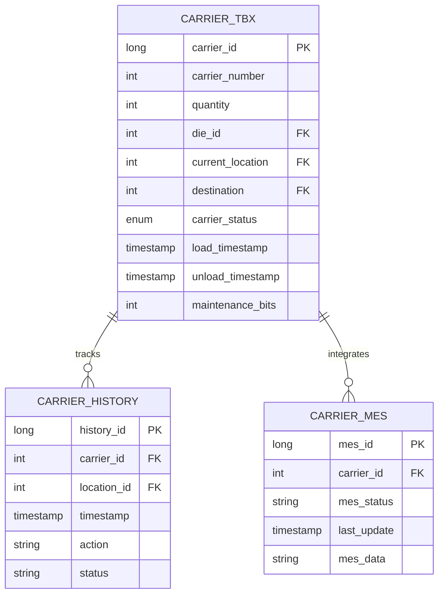
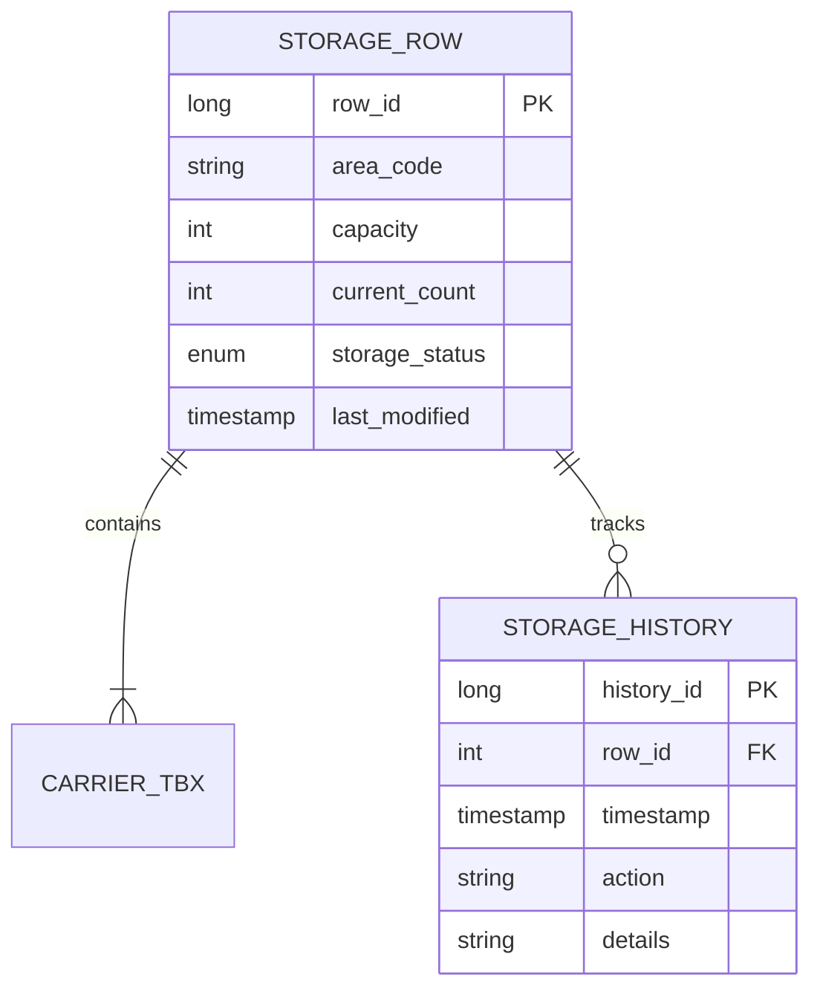
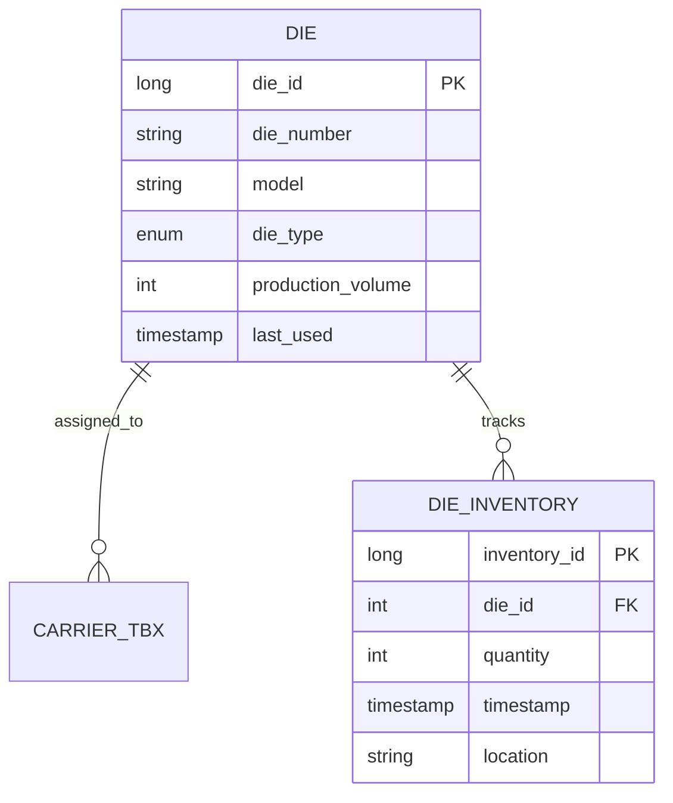
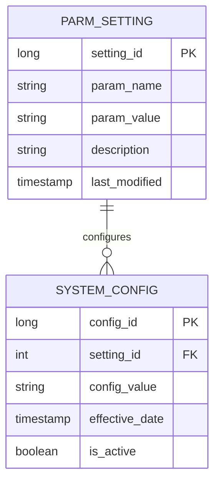
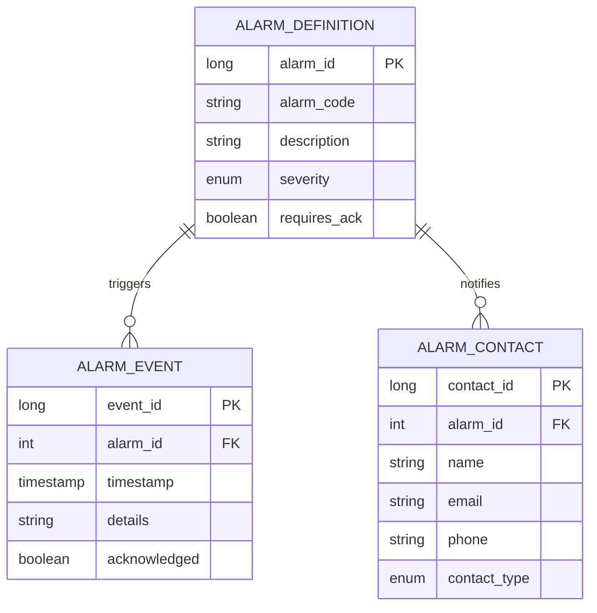

# AHM Stamp Storage System Database ERD

## Database Overview

The AHM Stamp Storage System uses a relational database to manage carrier tracking, storage operations, and system state. Below is a detailed Entity-Relationship Diagram (ERD) showing the relationships between major system components.

## Core Tables

### 1. Carrier Management

### 2. Storage Management

### 3. Die Management

### 4. System Configuration

### 5. Alarm Management

## Table Relationships

### Primary Relationships

1. **Carrier to Storage**
   - Each carrier is assigned to one storage row
   - Storage rows can contain multiple carriers
   - Historical tracking maintained for both

2. **Die to Carrier**
   - Dies can be assigned to multiple carriers
   - Each carrier has one die assignment at a time
   - Inventory tracking for both entities

3. **Alarm System**
   - Definitions link to multiple events
   - Contact assignments for notifications
   - Event tracking and acknowledgment

## Data Types

### Common Fields

1. **Identifiers**
   - Primary Keys: BIGINT/LONG
   - Foreign Keys: INTEGER
   - Business Keys: VARCHAR(50)

2. **Timestamps**
   - Created: TIMESTAMP
   - Modified: TIMESTAMP
   - Effective: TIMESTAMP

3. **Status Fields**
   - Enums stored as VARCHAR(20)
   - Flags as BOOLEAN
   - Counts as INTEGER

## Indexing Strategy

### Primary Indexes

1. **Carrier Tracking**
   - Carrier Number (Unique)
   - Location ID
   - Status + Timestamp

2. **Storage Management**
   - Area Code + Row Number
   - Status + Capacity
   - Last Modified

3. **Die Management**
   - Die Number (Unique)
   - Model + Type
   - Production Volume

## Audit Trail

### History Tables

1. **Carrier History**
   - Tracks all carrier movements
   - Status changes
   - Location updates

2. **Storage History**
   - Capacity changes
   - Status updates
   - Configuration changes

3. **Alarm History**
   - Event occurrences
   - Acknowledgments
   - Resolution details

## Performance Considerations

### Optimization Strategies

1. **Partitioning**
   - History tables partitioned by date
   - Active vs. Archive separation
   - Performance-based segmentation

2. **Indexing**
   - Covering indexes for common queries
   - Filtered indexes for status-based queries
   - Maintenance windows for reindexing

3. **Archival**
   - Regular archival of historical data
   - Maintenance of active dataset size
   - Performance optimization through data lifecycle management
