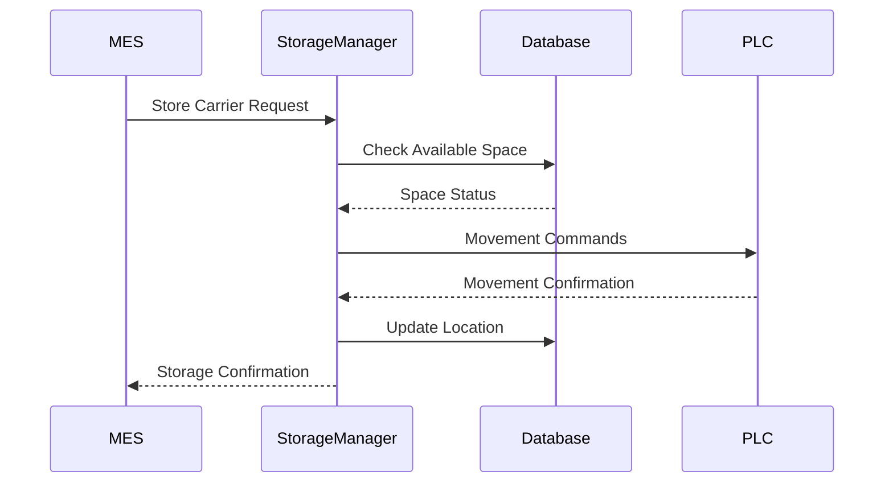
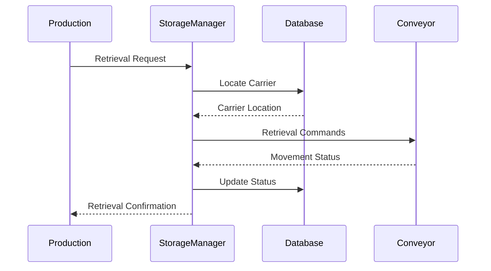
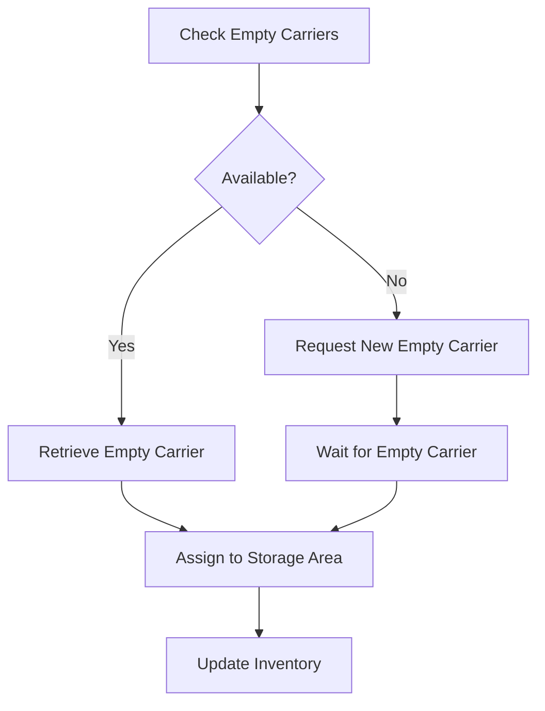
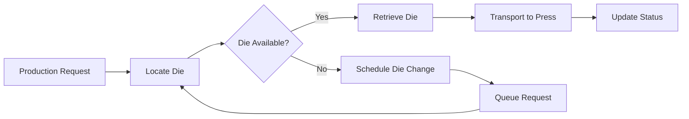
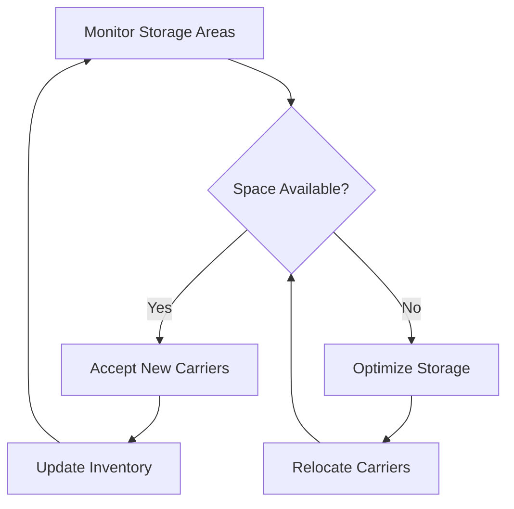
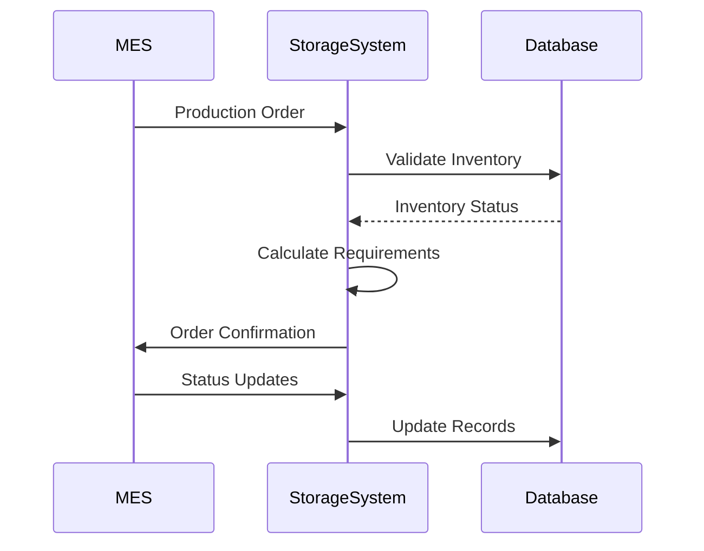
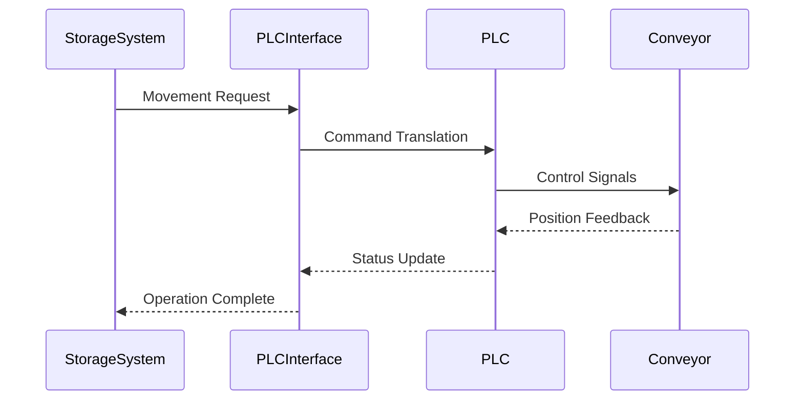
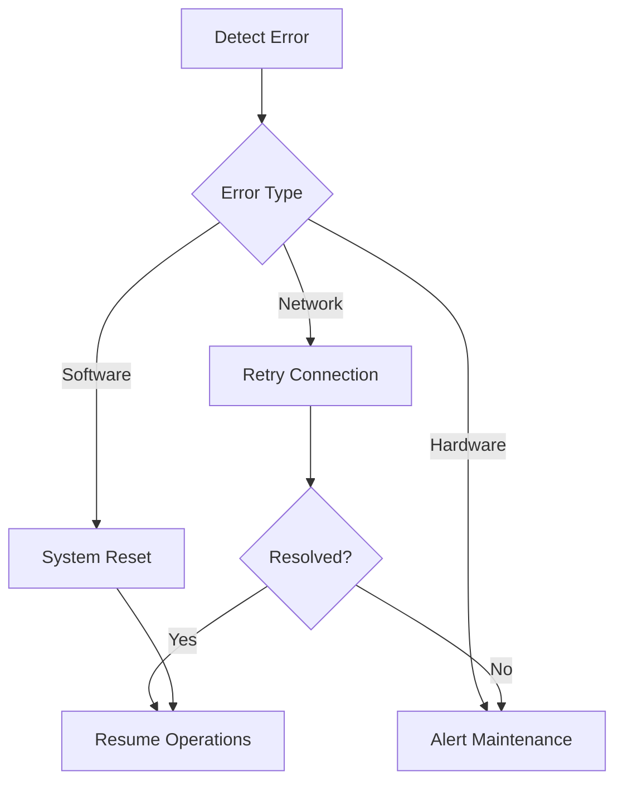
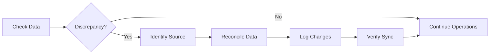
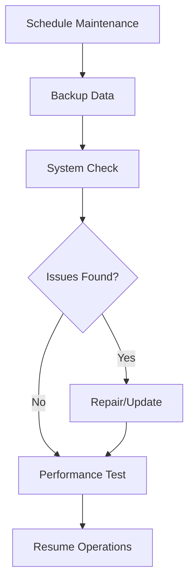

# AHM Stamp Storage System Process Flows

## Core Business Processes

### 1. Carrier Storage Process



### 2. Carrier Retrieval Process



### 3. Empty Carrier Management



## System Workflows

### 1. Die Change Process



### 2. Storage Area Management



## Integration Flows

### 1. MES Integration



### 2. PLC Communication



## Error Handling Flows

### 1. Communication Error Recovery



### 2. Data Synchronization



## Maintenance Workflows

### 1. System Maintenance



### 2. Emergency Response

```mermaid
flowchart TD
    A[Detect Emergency] --> B{Severity Level}
    B -->|High| C[Immediate Shutdown]
    B -->|Medium| D[Controlled Stop]
    B -->|Low| E[Monitor]
    C --> F[Emergency Response]
    D --> G[Assess Impact]
    E --> H[Plan Resolution]
    F --> I[Recovery Process]
    G --> I
    H --> I
