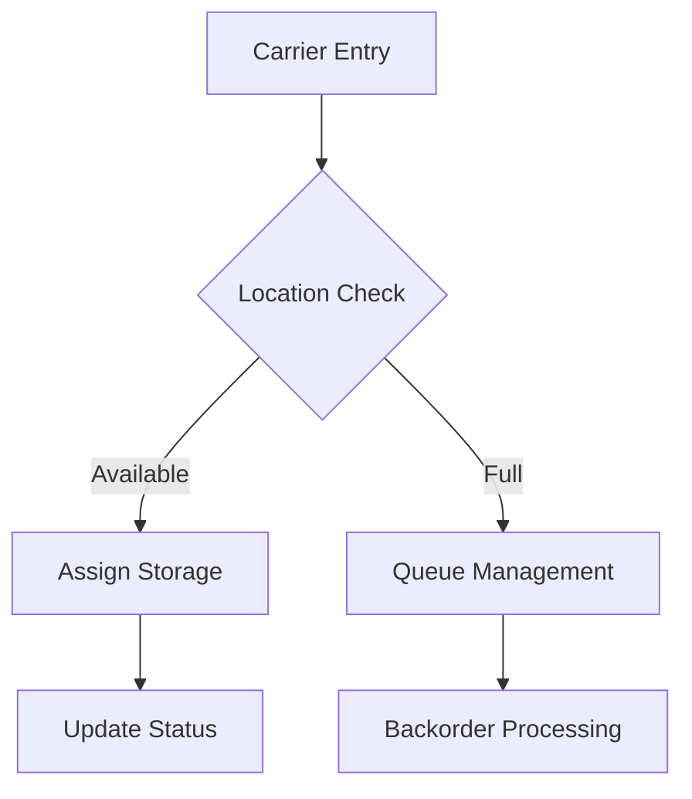
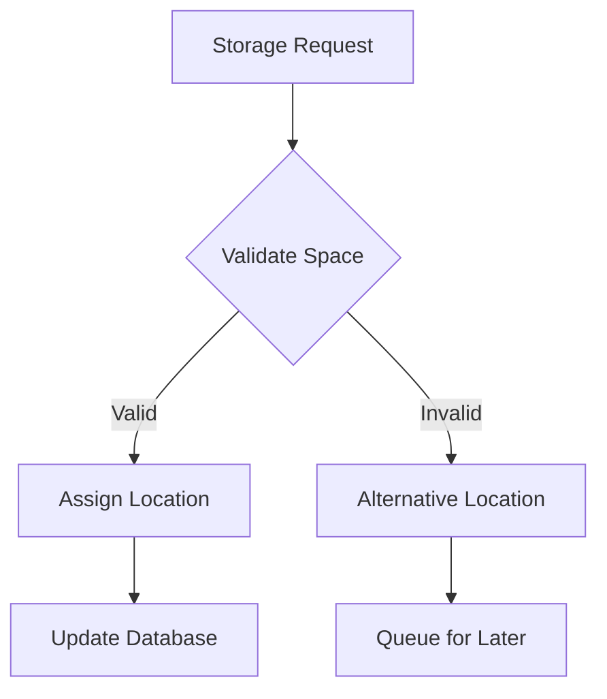

# AHM Stamp Storage System Technical Documentation

## System Overview

The AHM Stamp Storage System is an enterprise-level application designed to manage and control the automated storage and retrieval of stamping dies and carriers in Honda's manufacturing facilities. The system integrates with Manufacturing Execution Systems (MES), PLCs, and conveyor systems to orchestrate the movement and tracking of stamping materials.

## Core Components

### 1. Domain Layer (StampStorageDomain)

#### Key Entities:
- **Carrier**: Represents physical carriers that transport stamping dies
  - Tracks carrier number, quantity, location, status
  - Manages maintenance bits for carrier health monitoring
  - Integrates with die assignments and press operations

- **StorageRow**: Manages physical storage locations
  - Handles carrier positioning and lane management
  - Maintains storage area designations

- **Die**: Represents stamping dies
  - Contains die specifications and production parameters
  - Links to carrier assignments

### 2. Storage Management (StampStorageManager)

#### Core Interfaces:
- **Storage**: Primary interface for storage operations
  - Handles carrier storage and retrieval
  - Manages storage state calculations
  - Coordinates empty carrier management

#### Key Features:
- Dynamic destination calculation
- Storage state management
- Empty carrier retrieval logic
- Back-order processing

### 3. Database Structure

#### Primary Tables:
- **CARRIER_TBX**: Main carrier tracking table
  - Carrier identification
  - Current status and location
  - Maintenance information

- **StampingStatus**: Tracks carrier movement
  - Current and requested destinations
  - Timestamp tracking
  - Movement history

- **CarrierInfo**: Detailed carrier information
  - Die assignments
  - Quantity tracking
  - Model information

## System Architecture

### 1. Multi-Layer Architecture
- Presentation Layer (Web Interface)
- Service Layer (Business Logic)
- Domain Layer (Entity Management)
- Data Access Layer (Database Integration)

### 2. Integration Points
- MES Integration for production data
- PLC Communication for conveyor control
- Real-time status monitoring
- Event-driven architecture for state changes

## Core Processes

### 1. Carrier Management

### 2. Storage Operations

## Technical Specifications

### 1. Database Design
- SQL Server database
- Normalized schema design
- Audit trail capabilities
- Performance-optimized queries

### 2. Integration Protocols
- JSON-based messaging
- TCP/IP for PLC communication
- REST APIs for external systems
- Event-driven architecture

## Error Handling

### 1. Exception Management
- Custom exception types for domain-specific errors
- Comprehensive logging system
- Error recovery procedures
- Transaction management

### 2. System Monitoring
- Real-time status monitoring
- Performance metrics tracking
- Error rate monitoring
- System health checks

## Security Features

### 1. Access Control
- Role-based access control
- Secure authentication
- Audit logging
- Session management

### 2. Data Protection
- Encrypted communications
- Secure data storage
- Access logging
- Data integrity checks

## Performance Considerations

### 1. Optimization Strategies
- Query optimization
- Connection pooling
- Caching mechanisms
- Asynchronous processing

### 2. Scalability Features
- Horizontal scaling capability
- Load balancing support
- Distributed processing
- Resource management

## Maintenance Procedures

### 1. Regular Maintenance
- Database maintenance schedules
- System health checks
- Performance monitoring
- Backup procedures

### 2. Emergency Procedures
- System recovery processes
- Data recovery procedures
- Failover mechanisms
- Emergency contacts

## Best Practices

### 1. Development Standards
- Code organization
- Naming conventions
- Documentation requirements
- Testing procedures

### 2. Operational Guidelines
- Monitoring procedures
- Maintenance schedules
- Backup procedures
- Emergency responses

## System Requirements

### 1. Hardware Requirements
- Server specifications
- Network requirements
- Storage requirements
- Backup infrastructure

### 2. Software Requirements
- Operating system
- Database system
- Application server
- Supporting libraries

## Deployment Guide

### 1. Installation Steps
- System preparation
- Database setup
- Application deployment
- Configuration steps

### 2. Configuration
- Environment settings
- Database connections
- Integration parameters
- Security settings

## Troubleshooting Guide

### 1. Common Issues
- Connection problems
- Performance issues
- Data synchronization
- Integration failures

### 2. Resolution Steps
- Diagnostic procedures
- Recovery steps
- Escalation procedures
- Prevention measures
