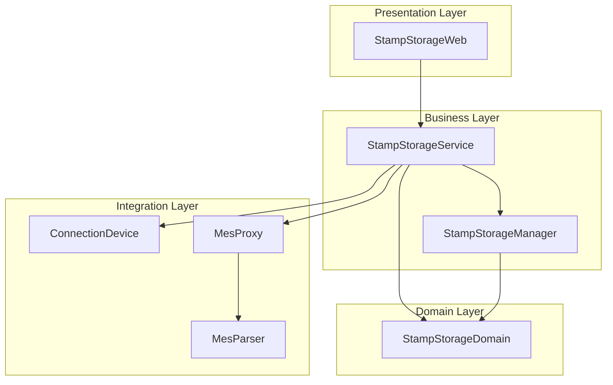
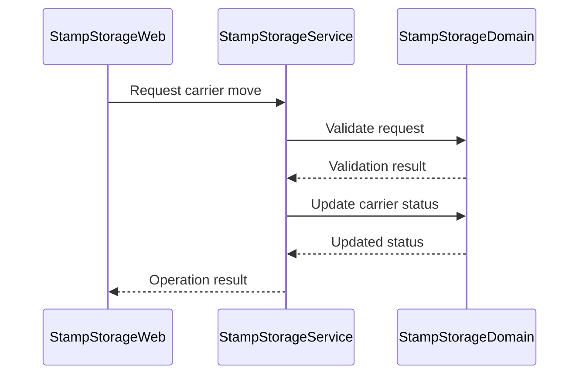
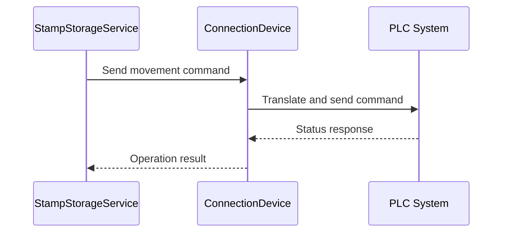
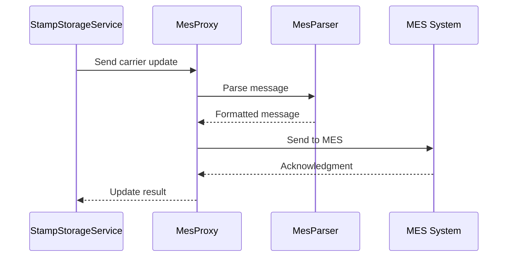

# System Components Documentation

## Component Architecture Overview

The AHM Stamp Storage System is built using a modular architecture that separates concerns across multiple specialized components. Each component has specific responsibilities and interfaces with other components through well-defined APIs.



## Component Details

### 1. StampStorageWeb

#### Purpose
Web-based user interface for system interaction and monitoring.

#### Key Features
- User authentication and authorization
- Real-time system status display
- Configuration management interface
- Reporting and analytics
- Alarm monitoring and management

#### Technical Details
```java
// Example Controller Structure
@Controller
@RequestMapping("/storage")
public class StorageController {
    @Autowired
    private StorageService storageService;
    
    @GetMapping("/status")
    public ModelAndView getStorageStatus() {
        // Implementation
    }
    
    @PostMapping("/carrier/{id}/move")
    public ResponseEntity<CarrierStatus> moveCarrier(@PathVariable String id) {
        // Implementation
    }
}
```

### 2. StampStorageService

#### Purpose
Core business logic implementation and service orchestration.

#### Key Features
- Storage operation management
- Order processing
- Inventory control
- System state management
- Event handling

#### Technical Details
```java
@Service
public class StorageServiceImpl implements StorageService {
    @Autowired
    private CarrierRepository carrierRepository;
    
    @Autowired
    private StorageManager storageManager;
    
    @Transactional
    public CarrierStatus processCarrierMovement(String carrierId) {
        // Implementation
    }
}
```

### 3. StampStorageDomain

#### Purpose
Domain model and business rules implementation.

#### Key Components
- Entity definitions
- Business rules
- Validation logic
- Data access objects

#### Key Models
```java
@Entity
public class Carrier {
    @Id
    private String carrierId;
    private CarrierStatus status;
    private Location currentLocation;
    private Location destination;
    // Additional properties and methods
}

@Entity
public class StorageRow {
    @Id
    private Long rowId;
    private String area;
    private Integer capacity;
    private RowStatus status;
    // Additional properties and methods
}
```

### 4. ConnectionDevice

#### Purpose
Handles communication with PLCs and other hardware devices.

#### Features
- Protocol implementation
- Connection management
- Message handling
- Error recovery

#### Implementation
```java
public class ConnectionDevice {
    private final DeviceConfig config;
    private final MessageProcessor processor;
    
    public void sendMessage(DeviceMessage message) {
        // Implementation
    }
    
    public void handleResponse(DeviceResponse response) {
        // Implementation
    }
}
```

### 5. MesProxy

#### Purpose
Manages communication with Manufacturing Execution System (MES).

#### Features
- Message translation
- Protocol adaptation
- Data synchronization
- Error handling

#### Implementation
```java
public class MesProxy {
    private final MesConfig config;
    private final MessageParser parser;
    
    public void sendToMes(MesMessage message) {
        // Implementation
    }
    
    public void processResponse(MesResponse response) {
        // Implementation
    }
}
```

## Component Interactions

### 1. Web to Service Layer


### 2. Service to Device Layer


### 3. MES Integration Flow


## Error Handling

### 1. Device Communication
```java
public class DeviceErrorHandler {
    public void handleConnectionError(ConnectionException e) {
        // Implementation
    }
    
    public void handleProtocolError(ProtocolException e) {
        // Implementation
    }
}
```

### 2. MES Communication
```java
public class MesErrorHandler {
    public void handleMessageError(MessageException e) {
        // Implementation
    }
    
    public void handleTimeoutError(TimeoutException e) {
        // Implementation
    }
}
```

## Configuration Management

### 1. Application Properties
```properties
# Web Configuration
server.port=8080
server.servlet.context-path=/stampstorage

# Database Configuration
spring.datasource.url=jdbc:db2://localhost:50000/STORAGE
spring.datasource.username=db2admin

# Device Configuration
device.connection.timeout=5000
device.retry.attempts=3

# MES Configuration
mes.server.url=http://mes-server/api
mes.connection.timeout=10000
```

### 2. Spring Configuration
```java
@Configuration
public class ApplicationConfig {
    @Bean
    public StorageManager storageManager() {
        // Implementation
    }
    
    @Bean
    public ConnectionDevice connectionDevice() {
        // Implementation
    }
}
```

## Monitoring and Metrics

### 1. Performance Monitoring
```java
@Aspect
@Component
public class PerformanceMonitor {
    @Around("execution(* com.honda.storage..*.*(..))")
    public Object monitorPerformance(ProceedingJoinPoint jp) {
        // Implementation
    }
}
```

### 2. Health Checks
```java
@Component
public class SystemHealthCheck {
    public HealthStatus checkDatabaseConnection() {
        // Implementation
    }
    
    public HealthStatus checkDeviceConnections() {
        // Implementation
    }
}
```

## Deployment Structure

### 1. Component Packaging
```
stampstorage.ear
├── stampstorageWeb.war
├── stampstorageService.jar
├── stampstorageManager.jar
├── stampstorageDevice.jar
└── META-INF/
    └── application.xml
```

### 2. Resource Requirements
- JVM Memory: 4GB minimum
- Disk Space: 100GB minimum
- Network: 1Gbps dedicated
- CPU: 4 cores minimum

## Security Implementation

### 1. Authentication
```java
@Configuration
@EnableWebSecurity
public class SecurityConfig extends WebSecurityConfigurerAdapter {
    @Override
    protected void configure(HttpSecurity http) {
        // Implementation
    }
}
```

### 2. Authorization
```java
@PreAuthorize("hasRole('ADMIN')")
public class AdminOperations {
    public void performAdminTask() {
        // Implementation
    }
}
