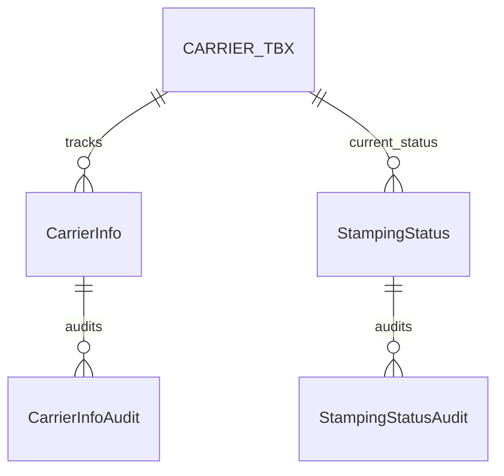

# Database Documentation

## Overview

The Stamp Storage System uses a relational database to maintain carrier information, storage state, and system operations. This document details the database structure, relationships, and key components.

## Table Structure

### Core Tables

#### 1. CARRIER_TBX
Primary table for carrier information.

```sql
CREATE TABLE CARRIER_TBX (
    Carrier_ID NUMERIC(18,0) IDENTITY(1,1) PRIMARY KEY,
    Carrier_Number INTEGER NOT NULL,
    QUANTITY INTEGER NOT NULL,
    Carrier_STATUS VARCHAR(50) NOT NULL,
    PRESS_INFO VARCHAR(50) NOT NULL,
    LOAD_TIMESTAMP DATETIME,
    UNLOAD_TIMESTAMP DATETIME,
    PRODUCTION_RUN_TIMESTAMP DATETIME,
    PRODUCTION_RUN_NO INTEGER,
    version INTEGER
)
```

#### 2. StampingStatus
Tracks carrier movement and routing.

```sql
CREATE TABLE StampingStatus (
    StampingStatus_ID NUMERIC(18,0) IDENTITY(1,1) PRIMARY KEY,
    CarrierNumber NUMERIC(18,0) NOT NULL,
    CurrentDestination VARCHAR(10),
    RequestedDestination VARCHAR(10),
    InTimestamp DATETIME,
    OutTimestamp DATETIME
)
```

#### 3. CarrierInfo
Historical carrier information.

```sql
CREATE TABLE CarrierInfo (
    CarrierInfo_ID NUMERIC(18,0) IDENTITY(1,1) PRIMARY KEY,
    CarrierNumber NUMERIC(18,0) NOT NULL,
    DieNumber NUMERIC(18,0),
    Quantity INT,
    Model NCHAR(10),
    Type NCHAR(10),
    InTimestamp DATETIME,
    OutTimestamp DATETIME
)
```

### Audit Tables

#### 1. CarrierInfoAudit
```sql
CREATE TABLE CarrierInfoAudit (
    CarrierInfoAudit_ID NUMERIC(18,0) PRIMARY KEY,
    CarrierNumber NUMERIC(18,0) NOT NULL,
    DieNumber NUMERIC(18,0) NOT NULL,
    Quantity INT,
    Model VARCHAR(10),
    Type VARCHAR(10),
    InTimestamp DATETIME,
    OutTimestamp DATETIME
)
```

#### 2. StampingStatusAudit
```sql
CREATE TABLE StampingStatusAudit (
    StampingStatusAudit_ID NUMERIC(18,0) IDENTITY(1,1) PRIMARY KEY,
    CarrierNumber VARCHAR(50) NOT NULL,
    CurrentDestination VARCHAR(50),
    RequestedDestination VARCHAR(50),
    InTimestamp DATETIME,
    OutTimestamp DATETIME
)
```

## Relationships



## Stored Procedures

### 1. Carrier Management

#### sp_UpdateCarrierStatus
Updates carrier status and creates audit record.
```sql
CREATE PROCEDURE sp_UpdateCarrierStatus
    @CarrierNumber NUMERIC(18,0),
    @NewStatus VARCHAR(50),
    @Timestamp DATETIME
AS
BEGIN
    -- Update carrier status
    UPDATE CARRIER_TBX
    SET Carrier_STATUS = @NewStatus,
        LOAD_TIMESTAMP = @Timestamp
    WHERE Carrier_Number = @CarrierNumber
    
    -- Create audit record
    INSERT INTO CarrierInfoAudit (...)
    SELECT ... FROM CarrierInfo
    WHERE CarrierNumber = @CarrierNumber
END
```

### 2. Storage Management

#### sp_AssignStorageLocation
Assigns optimal storage location based on carrier properties.
```sql
CREATE PROCEDURE sp_AssignStorageLocation
    @CarrierNumber NUMERIC(18,0)
AS
BEGIN
    -- Logic to determine optimal storage location
    -- Update carrier destination
    -- Create movement record
END
```

## Triggers

### 1. tr_CarrierInfo_Audit
Maintains audit trail for carrier information changes.
```sql
CREATE TRIGGER tr_CarrierInfo_Audit
ON CarrierInfo
AFTER UPDATE, INSERT
AS
BEGIN
    INSERT INTO CarrierInfoAudit
    SELECT * FROM inserted
END
```

### 2. tr_StampingStatus_Audit
Tracks changes in carrier status and location.
```sql
CREATE TRIGGER tr_StampingStatus_Audit
ON StampingStatus
AFTER UPDATE, INSERT
AS
BEGIN
    INSERT INTO StampingStatusAudit
    SELECT * FROM inserted
END
```

## Indexes

### Primary Indexes
1. PK_CARRIER_TBX (CARRIER_TBX.Carrier_ID)
2. PK_StampingStatus (StampingStatus.StampingStatus_ID)
3. PK_CarrierInfo (CarrierInfo.CarrierInfo_ID)

### Secondary Indexes
1. IX_CARRIER_TBX_Number (CARRIER_TBX.Carrier_Number)
2. IX_StampingStatus_CarrierNumber (StampingStatus.CarrierNumber)
3. IX_CarrierInfo_DieNumber (CarrierInfo.DieNumber)

## Maintenance Procedures

### 1. Data Archival
- Automated archival of completed carrier records
- Historical data retention policies
- Performance optimization

### 2. Index Maintenance
- Regular index rebuilding
- Statistics updates
- Performance monitoring

### 3. Backup Strategy
- Full daily backups
- Transaction log backups every 15 minutes
- Point-in-time recovery capability

## Performance Considerations

### 1. Query Optimization
- Indexed views for common queries
- Optimized stored procedures
- Proper index usage

### 2. Concurrency
- Appropriate isolation levels
- Deadlock prevention
- Connection pooling

### 3. Monitoring
- Performance counters
- Query statistics
- Resource utilization

## Security

### 1. Access Control
- Role-based permissions
- Minimal privilege principle
- Audit logging

### 2. Data Protection
- Encryption at rest
- Secure connections
- Sensitive data handling
