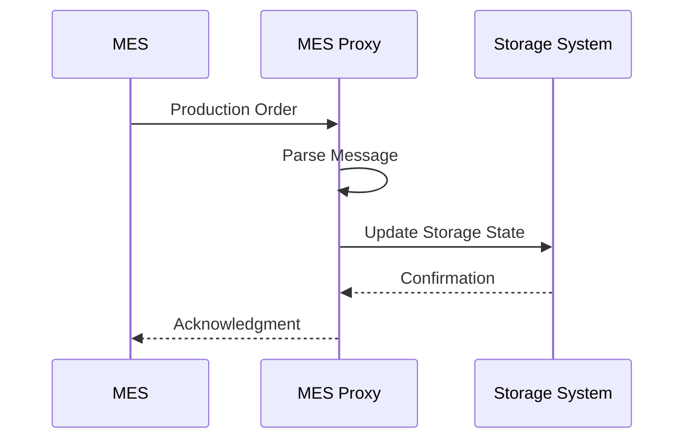
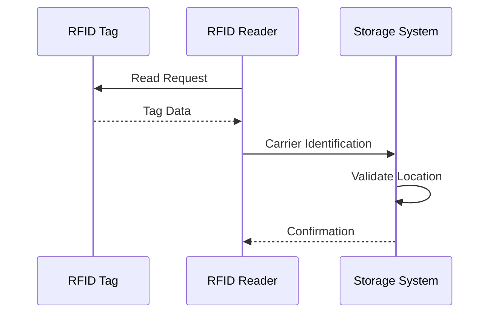

# Integration Guide

## Overview

The Stamp Storage System integrates with multiple external systems to coordinate carrier movement and manage storage operations. This document details the integration points, protocols, and configuration requirements.

## MES Integration

### Overview
The Manufacturing Execution System (MES) integration handles production orders, carrier tracking, and inventory management.

### Communication Protocol


### Message Formats

#### 1. Production Order
```json
{
    "messageType": "PRODUCTION_ORDER",
    "orderId": "PO123456",
    "details": {
        "dieNumber": "D789",
        "quantity": 100,
        "model": "CIVIC",
        "press": "P1"
    }
}
```

#### 2. Carrier Status Update
```json
{
    "messageType": "CARRIER_STATUS",
    "carrierNumber": "C456",
    "status": "IN_STORAGE",
    "location": "A12",
    "timestamp": "2025-03-30T15:30:00Z"
}
```

### Configuration
```properties
# MES Connection Settings
mes.server.host=mes-prod.honda.com
mes.server.port=8080
mes.protocol=TCP/IP
mes.timeout=30000
mes.retry.count=3
```

## PLC Integration

### Overview
PLC integration manages physical carrier movement and conveyor system control.

### Communication Protocol
- Protocol: FINS (Factory Interface Network Service)
- Transport: TCP/IP
- Mode: Client/Server

### Memory Areas

#### 1. Carrier Control
```
DM Area 1000-1099: Carrier Status
    1000: Carrier Present
    1001: Carrier Number
    1002: Carrier Type
    1003: Quantity
    1004-1005: Current Location
    1006-1007: Destination
```

#### 2. Conveyor Control
```
DM Area 2000-2099: Conveyor Status
    2000: Operation Mode
    2001: Speed Setting
    2002: Direction
    2003: Emergency Stop
```

### Error Handling
```java
try {
    plcDevice.writeMemory(area, address, data);
} catch (CommunicationsException e) {
    // Implement retry logic
    // Log failure
    // Notify operators
}
```

## RFID Integration

### Overview
RFID system tracks carrier locations and validates movements.

### Device Configuration
```xml
<rfid-config>
    <reader>
        <id>RFID-001</id>
        <location>ENTRY_GATE</location>
        <protocol>EtherNet/IP</protocol>
        <ip>192.168.1.100</ip>
        <port>44818</port>
    </reader>
</rfid-config>
```

### Tag Format
```
[Carrier ID (8 bytes)][Type (2 bytes)][Checksum (2 bytes)]
```

### Reading Process


## Database Integration

### Connection Configuration
```properties
# Database Settings
db.url=jdbc:sqlserver://db-server:1433;databaseName=StampStorage
db.username=app_user
db.password=${DB_PASSWORD}
db.pool.size=10
db.timeout=30
```

### Transaction Management
```java
@Transactional
public void updateCarrierLocation(Carrier carrier) {
    // Update carrier record
    // Create movement history
    // Update storage state
}
```

## Error Handling

### 1. Communication Failures
```java
public class CommunicationRetryHandler {
    private static final int MAX_RETRIES = 3;
    private static final int RETRY_DELAY = 1000; // milliseconds

    public void handleCommunicationError(Exception e) {
        int retryCount = 0;
        while (retryCount < MAX_RETRIES) {
            try {
                // Retry operation
                return;
            } catch (Exception retryException) {
                retryCount++;
                Thread.sleep(RETRY_DELAY);
            }
        }
        // Escalate error
    }
}
```

### 2. Data Validation
```java
public class MessageValidator {
    public void validateMessage(Message message) {
        // Check message format
        // Validate data types
        // Verify required fields
        // Check business rules
    }
}
```

## Monitoring

### 1. Health Checks
```java
@Component
public class IntegrationHealthCheck {
    @Scheduled(fixedRate = 60000)
    public void checkConnections() {
        // Verify MES connection
        // Check PLC communication
        // Validate RFID readers
        // Test database connection
    }
}
```

### 2. Performance Metrics
```java
public class MetricsCollector {
    public void recordMetrics() {
        // Message throughput
        // Response times
        // Error rates
        // System resource usage
    }
}
```

## Security

### 1. Authentication
```properties
# Security Settings
security.protocol=TLS
security.cert.path=/etc/certs/system.cert
security.key.path=/etc/certs/system.key
security.trusted.hosts=mes-prod.honda.com,plc-*.honda.com
```

### 2. Authorization
```java
@Secured("ROLE_INTEGRATION")
public class IntegrationService {
    @PreAuthorize("hasPermission('MES_WRITE')")
    public void processMesMessage(Message message) {
        // Process message
    }
}
```

## Deployment

### 1. Prerequisites
- Network access to MES
- PLC communication drivers
- RFID reader software
- Database client libraries

### 2. Configuration Steps
1. Configure network settings
2. Install security certificates
3. Set up connection pools
4. Configure monitoring
5. Enable error reporting

### 3. Validation
```bash
# Verify MES Connection
curl -X POST https://mes-prod.honda.com/api/health

# Test PLC Communication
plc-test --host plc1.honda.com --port 9600

# Check RFID Readers
rfid-scan --device RFID-001 --mode test
