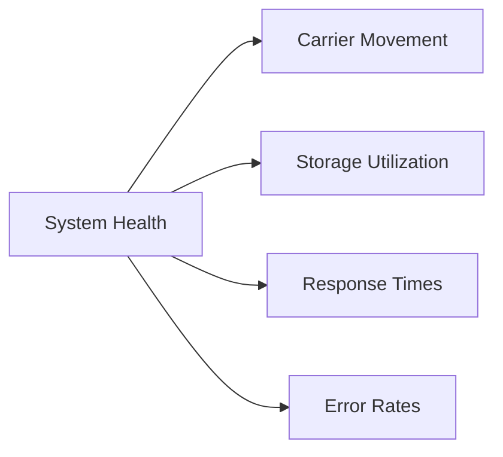
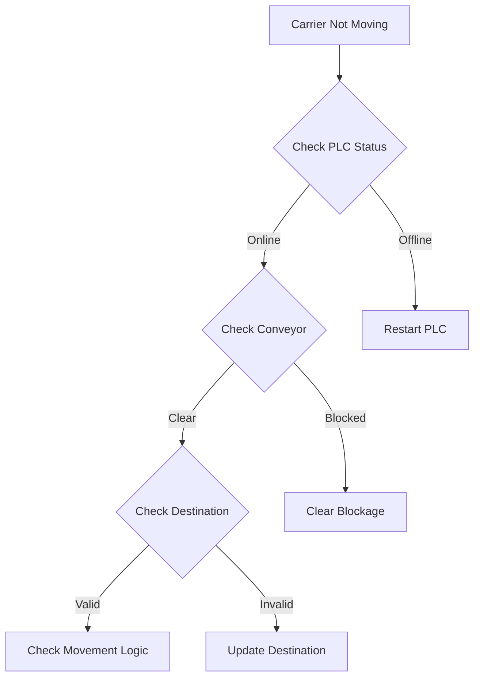

# Operations Guide

## System Overview

The Stamp Storage System requires regular monitoring and maintenance to ensure optimal performance. This guide provides detailed procedures for system operations, maintenance, and troubleshooting.

## System Monitoring

### 1. Key Performance Indicators

Monitor these KPIs daily:



#### Metrics to Track
- Carrier movement rate
- Storage area utilization
- System response times
- Error frequency
- Communication latency
- Database performance

### 2. System Logs

#### Log Locations
```
/var/log/stampstorage/
├── application.log     # Main application logs
├── mes-interface.log   # MES communication logs
├── plc-interface.log   # PLC communication logs
├── errors.log         # Error logs
└── audit.log         # Audit trail
```

#### Log Monitoring
```bash
# Check for errors in real-time
tail -f /var/log/stampstorage/errors.log

# Monitor MES communication
grep "MES" /var/log/stampstorage/mes-interface.log

# Track carrier movements
grep "CARRIER_MOVE" /var/log/stampstorage/application.log
```

### 3. Alerts and Notifications

Configure alerts for:
- System errors
- Communication failures
- Storage capacity thresholds
- Performance degradation
- Security events

## Maintenance Procedures

### 1. Daily Tasks

- [ ] Review system logs
- [ ] Check error reports
- [ ] Monitor storage utilization
- [ ] Verify MES connectivity
- [ ] Check PLC communication
- [ ] Review carrier movement statistics

### 2. Weekly Tasks

- [ ] Analyze performance trends
- [ ] Review security logs
- [ ] Check database backups
- [ ] Update documentation
- [ ] Review system configurations

### 3. Monthly Tasks

- [ ] System performance audit
- [ ] Security assessment
- [ ] Capacity planning review
- [ ] Backup verification
- [ ] Configuration review

## Troubleshooting

### 1. Common Issues

#### Carrier Movement Issues


#### Communication Failures

1. MES Connection Lost
```bash
# Check MES connectivity
ping mes-prod.honda.com

# Verify service status
systemctl status mes-proxy

# Check logs
tail -f /var/log/stampstorage/mes-interface.log
```

2. PLC Communication Issues
```bash
# Verify PLC network
ping plc-controller

# Check connection status
netstat -an | grep 9600

# Review communication logs
tail -f /var/log/stampstorage/plc-interface.log
```

### 2. Error Recovery Procedures

#### Database Issues
```sql
-- Check database connectivity
SELECT 1 FROM CARRIER_TBX;

-- Verify table status
DBCC CHECKDB (StampStorage);

-- Check for blocking
sp_who2;
```

#### Storage State Recovery
```java
// Reset storage state
StorageManager.resetStorageState();

// Verify carrier positions
StorageManager.validateCarrierLocations();

// Rebuild movement queue
StorageManager.rebuildMovementQueue();
```

## Emergency Procedures

### 1. System Shutdown

```bash
# Graceful shutdown
systemctl stop stampstorage

# Emergency stop
systemctl stop stampstorage-emergency

# Verify shutdown
systemctl status stampstorage
```

### 2. Data Recovery

```bash
# Backup current state
pg_dump stampstorage > backup.sql

# Restore from backup
psql stampstorage < backup.sql

# Verify restoration
SELECT COUNT(*) FROM CARRIER_TBX;
```

## Performance Optimization

### 1. Database Optimization

```sql
-- Update statistics
UPDATE STATISTICS CARRIER_TBX;
UPDATE STATISTICS StampingStatus;

-- Rebuild indexes
ALTER INDEX ALL ON CARRIER_TBX REBUILD;
ALTER INDEX ALL ON StampingStatus REBUILD;
```

### 2. Application Tuning

```properties
# Application Settings
thread.pool.size=20
queue.capacity=1000
connection.timeout=30000
retry.attempts=3
```

## Security Procedures

### 1. Access Control

- Regular password rotation
- Role-based access review
- Security log analysis
- Certificate management

### 2. Audit Procedures

```sql
-- Review user actions
SELECT * FROM AuditLog
WHERE timestamp > DATEADD(day, -1, GETDATE())
ORDER BY timestamp DESC;

-- Check security events
SELECT * FROM SecurityEvents
WHERE severity = 'HIGH'
AND timestamp > DATEADD(hour, -24, GETDATE());
```

## Backup and Recovery

### 1. Backup Schedule

| Type | Frequency | Retention |
|------|-----------|-----------|
| Full | Daily | 30 days |
| Differential | 6 hours | 7 days |
| Transaction Log | 15 minutes | 24 hours |

### 2. Recovery Procedures

```bash
# Full system backup
backup-system.sh --type full

# Restore from backup
restore-system.sh --backup 2025-03-30

# Verify restoration
verify-system.sh --check all
```

## System Updates

### 1. Update Procedure

1. Notify stakeholders
2. Create backup
3. Stop services
4. Apply updates
5. Run tests
6. Restart services
7. Verify operation

### 2. Rollback Procedure

```bash
# Rollback to previous version
rollback.sh --version 2.1.0

# Verify rollback
verify-version.sh
```

## Contact Information

### Emergency Contacts

| Role | Contact | Phone |
|------|---------|-------|
| System Admin | admin@honda.com | x5555 |
| Database Admin | dba@honda.com | x5556 |
| Network Admin | network@honda.com | x5557 |
| Security Team | security@honda.com | x5558 |
